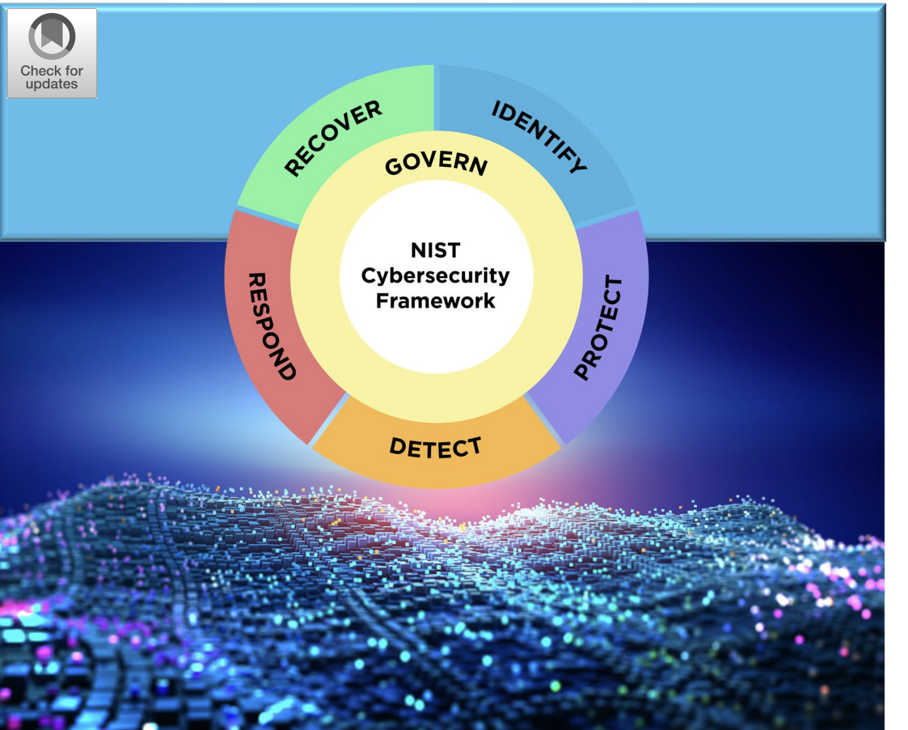
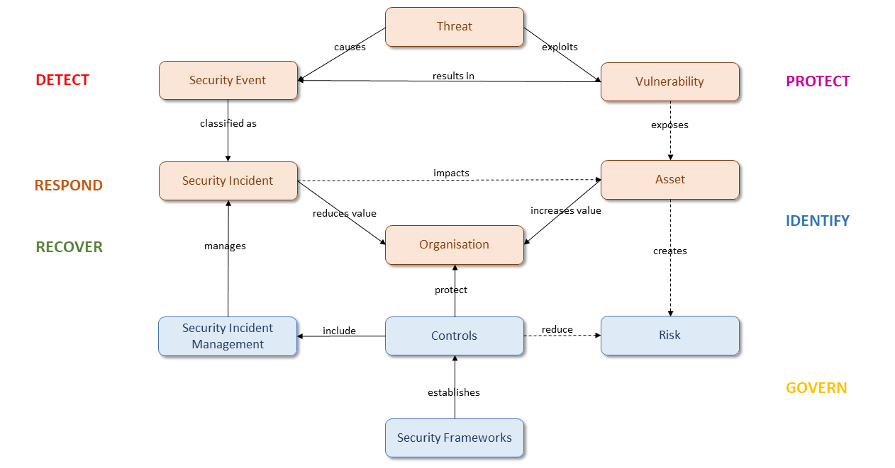
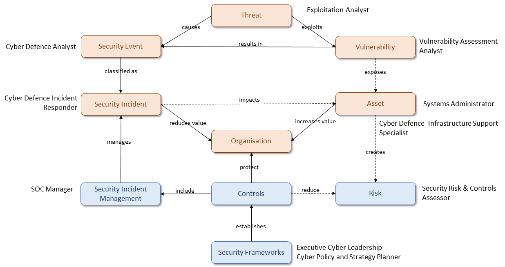

# 3. Introduction To Cybersecurity

Các Đơn vị học tập trong Mô-đun học tập này:

- The Practice of Cybersecurity

- Threats and Threat Actors

- The CIA Triad

- Security Principles, Controls, and Strategies

- Cybersecurity Laws, Regulations, Standards, and Frameworks

- Career Opportunities in Cybersecurity

Mô-đun này được thiết kế để cung cấp hiểu biết vững chắc về các nguyên tắc cơ bản của an ninh mạng.

Hoàn thành Mô-đun này sẽ giúp xây dựng nền tảng kiến ​​thức hữu ích để tiến tới các Mô-đun thực hành, kỹ thuật hơn.

Phân tích chuyên sâu về từng khái niệm nằm ngoài phạm vi của Mô-đun này. Để tìm hiểu thêm về các khái niệm được giới thiệu ở đây, nên tiến tới nội dung cấp độ 100 trong Thư viện học tập OffSec.

Trong suốt Mô-đun này sẽ xem xét một số ví dụ gần đây về các cuộc tấn công mạng và phân tích tác động cũng như các bước phòng ngừa hoặc giảm thiểu tiềm năng. Cũng sẽ cung cấp nhiều liên kết đến các bài viết, tài liệu tham khảo và tài nguyên để khám phá trong tương lai. Vui lòng xem lại các liên kết này để biết thêm bối cảnh và sự rõ ràng.

## 3.1. The Practice of Cybersecurity

Đơn vị học tập này bao gồm các Mục tiêu học tập sau:

- Nhận ra những thách thức riêng đối với an ninh thông tin

- Hiểu cách an ninh "tấn công" và "phòng thủ" phản ánh lẫn nhau

- Bắt đầu xây dựng mô hình tinh thần về tư duy hữu ích áp dụng cho an ninh thông tin

### 3.1.1. Challenges in Cybersecurity

An ninh mạng đã nổi lên như một ngành độc đáo và không phải là một lĩnh vực phụ hay lĩnh vực ngách của kỹ thuật phần mềm hay quản trị hệ thống. Có một số đặc điểm riêng biệt của an ninh mạng giúp phân biệt nó với các lĩnh vực kỹ thuật khác. Đầu tiên, an ninh liên quan đến các tác nhân độc hại và thông minh (tức là đối thủ).

Vấn đề đối phó với đối thủ thông minh đòi hỏi một cách tiếp cận, kỷ luật và tư duy khác so với việc đối mặt với một vấn đề tự nhiên hoặc ngẫu nhiên. Cho dù đang mô phỏng một cuộc tấn công hay phòng thủ chống lại một cuộc tấn công, sẽ cần xem xét quan điểm và hành động tiềm ẩn của đối thủ và cố gắng dự đoán những gì họ có thể làm. Vì đối thủ là con người có khả năng tự chủ, họ có thể lý luận, dự đoán, phán đoán, phân tích, suy đoán và cân nhắc. Họ cũng có thể cảm thấy những cảm xúc như hạnh phúc, buồn bã, tham lam, sợ hãi, chiến thắng và tội lỗi. Cả kẻ tấn công và người phòng thủ đều có thể tận dụng cảm xúc của đối thủ là con người. Ví dụ, kẻ tấn công có thể dựa vào sự xấu hổ khi họ bắt giữ một hệ thống máy tính làm con tin và đe dọa sẽ công bố dữ liệu của hệ thống đó. Trong khi đó, người phòng thủ có thể tận dụng nỗi sợ hãi để ngăn cản kẻ tấn công xâm nhập vào mạng của họ. Thực tế này có nghĩa là con người là một thành phần quan trọng của an ninh mạng.

Một khía cạnh quan trọng khác của bảo mật là nó thường liên quan đến việc lý luận trong điều kiện không chắc chắn. Mặc dù có nhiều kỹ năng suy luận, nhưng không có nghĩa là toàn năng về mặt tinh thần. Không thể xác định mọi thứ theo sau một sự thật nhất định và không thể biết hoặc nhớ vô số sự kiện.

### 3.1.2. A Word on Mindsets

Bảo mật không chỉ là hiểu biết về công nghệ và code mà còn là hiểu biết về tâm trí. Có xu hướng nghĩ về tư duy như một tập hợp các niềm tin hình thành nên quan điểm cá nhân về một điều gì đó.

Hai ví dụ tương phản về tư duy nổi tiếng là tư duy cố định và tư duy phát triển.

Một cá nhân có tư duy cố định tin rằng kỹ năng/tài năng/khả năng học hỏi là như vậy và không có lợi ích gì khi cố gắng cải thiện.

Mặt khác, tư duy phát triển khuyến khích niềm tin rằng khả năng tinh thần là linh hoạt và dễ thích nghi và rằng một người có thể phát triển khả năng học hỏi theo thời gian.

Nghiên cứu cho thấy rằng, ví dụ, một tư duy mà tin rằng bản thân có khả năng phục hồi sau một sai lầm khiến làm điều đó tốt hơn đáng kể. Đây chỉ là một khía cạnh của tư duy phát triển, nhưng lại là một khía cạnh quan trọng. Điều này là do bảo mật đòi hỏi phải mắc lỗi và học hỏi, đồng thời liên tục học và đánh giá lại.

Một tư duy cực kỳ có giá trị khác là tư duy bảo mật được đặt ra một cách khéo léo. Được đề xuất bởi nhà nghiên cứu bảo mật Bruce Schneier. Tư duy này khuyến khích việc liên tục đặt câu hỏi về cách một người có thể tấn công (hoặc phòng thủ) một hệ thống. Nếu có thể bắt đầu tự động đặt câu hỏi này khi gặp phải một ý tưởng, máy móc, hệ thống, mạng hoặc đối tượng mới lạ, có thể bắt đầu nhận thấy một loạt các mô hình lặp lại.

Tại OffSec, khuyến khích áp dụng tư duy Cố gắng hơn. Để hiểu rõ hơn về tư duy này, hãy nhanh chóng xem xét hai quan điểm tiềm năng trong khoảnh khắc "thất bại".

1. Nếu cuộc tấn công hoặc phòng thủ thất bại, điều đó thể hiện sự thật về các kỹ năng/quy trình/cấu hình/cách tiếp cận hiện tại cũng như sự thật về hệ thống.

2. Nếu cuộc tấn công hoặc phòng thủ thất bại, điều này cho phép học được điều gì đó mới, thay đổi cách tiếp cận và làm điều gì đó khác đi.

Hai quan điểm này giúp cung cấp sức mạnh tinh thần để mắc lỗi và học hỏi, điều này rất cần thiết trong bất kỳ lĩnh vực an ninh mạng nào. Có thể tìm hiểu thêm thông tin về cách học và tư duy Cố gắng hơn trong Mô-đun "Chiến lược học tập hiệu quả" thuộc Lộ trình học tập nhập môn này.

### 3.1.3. On Emulating the Minds of our Opponents

Thật đáng để dừng lại để xem xét sự chú ý đặc biệt sẽ dành cho khía cạnh tấn công của bảo mật, ngay cả trong nhiều khóa học và Mô-đun phòng thủ. Có thể tự hỏi tại sao một chuyên gia an ninh mạng có mối quan tâm và mục tiêu chính là bảo vệ mạng lưới, tổ chức hoặc chính phủ cũng phải học khía cạnh tấn công.

Hãy lấy ví dụ về một vị vua thời trung cổ đang xây dựng một lâu đài. Nếu vị vua biết rằng kẻ thù của mình có máy bắn đá có khả năng ném những tảng đá lớn, họ có thể thiết kế lâu đài của mình có những bức tường dày hơn. Tương tự như vậy, nếu kẻ thù của họ được trang bị thang, vị vua có thể cung cấp cho quân lính của mình các công cụ để đẩy thang ra khỏi tường.

Vị vua này càng biết nhiều về kẻ tấn công tiềm năng của mình và họ càng có thể suy nghĩ như một kẻ tấn công, thì họ càng có thể xây dựng được hàng phòng thủ tốt hơn. Vị vua có thể tham gia vào các loại hoạt động hoặc kiểm toán "tấn công" để hiểu được những lỗ hổng trong hàng phòng thủ của chính họ. Ví dụ, họ có thể tiến hành "trò chơi chiến tranh" trong đó họ chỉ đạo binh lính của mình chiến đấu giả với nhau, giúp họ hiểu đầy đủ về khả năng và tiềm năng hủy diệt của một kẻ tấn công thực sự.

Trong an ninh mạng, các doanh nghiệp có thể thuê một cá nhân hoặc một công ty để thực hiện thử nghiệm thâm nhập, còn được gọi là pentest. Người thử nghiệm thâm nhập đóng vai trò là kẻ tấn công để hiểu rõ hơn về các lỗ hổng và điểm yếu của hệ thống.

Tận dụng các kỹ năng và tư duy của kẻ tấn công cho phép trả lời tốt hơn các câu hỏi như:

- "Kẻ tấn công có thể truy cập bằng cách nào?"

- "Chúng có thể làm gì với quyền truy cập đó?" - "Kết quả tồi tệ nhất có thể xảy ra sau một cuộc tấn công là gì?"

Mặc dù việc học các kỹ năng hack (tất nhiên) là điều cần thiết đối với những người thử nghiệm thâm nhập đầy tham vọng, những người bảo vệ, quản trị viên hệ thống và nhà phát triển cũng sẽ được hưởng lợi rất nhiều từ ít nhất là một nền giáo dục sơ lược về các kỹ thuật và công nghệ tấn công.

Ngược lại, theo kinh nghiệm, nhiều người thử nghiệm thâm nhập và tin tặc ứng dụng web giỏi nhất là những người đã có nhiều kinh nghiệm trong việc bảo vệ mạng, xây dựng ứng dụng web hoặc quản trị hệ thống.

## 3.2. Threats and Threat Actors

Đơn vị học tập này bao gồm các Mục tiêu học tập sau:

- Hiểu cách kẻ tấn công và người bảo vệ học hỏi lẫn nhau

- Hiểu sự khác biệt giữa risks, threats, vulnerabilities và exploits

- Liệt kê và mô tả các loại tác nhân đe dọa khác nhau

- Nhận biết một số cuộc tấn công an ninh mạng gần đây

- Tìm hiểu cách các cuộc tấn công và mối đe dọa độc hại có thể tác động đến một tổ chức và cá nhân

Thuật ngữ an ninh mạng được sử dụng phổ biến từ nguồn gốc quân sự. Để rõ ràng sẽ sử dụng an ninh mạng để mô tả việc bảo vệ quyền truy cập và thông tin cụ thể trên Internet hoặc các mạng kỹ thuật số khác. Mặc dù được đưa vào bối cảnh rộng hơn của an ninh mạng, an ninh thông tin cũng xem xét việc bảo vệ các tài sản lưu trữ thông tin vật lý, chẳng hạn như máy chủ vật lý hoặc kho lưu trữ.

Khi khám phá các mối đe dọa và tác nhân đe dọa khác nhau trong suốt Mô-đun này, chủ yếu xem xét khả năng trực tuyến. Do đó, thường sử dụng thuật ngữ an ninh mạng ở đây, nhưng sẽ không quá quan tâm đến việc sử dụng an ninh thông tin như một từ đồng nghĩa.

### 3.2.1. The Evolution of Attack and Defense

An ninh mạng có thể đặc biệt hấp dẫn vì liên quan đến nhiều tác nhân cố gắng đạt được kết quả loại trừ lẫn nhau. Trong ví dụ cơ bản nhất, bên bảo vệ muốn kiểm soát quyền truy cập vào tài sản mà họ sở hữu và bên tấn công muốn giành quyền kiểm soát cùng một tài sản. Điều này thật thú vị vì cả hai vai trò, bên bảo vệ và bên tấn công, đều tồn tại dựa trên sự kiên trì liên tục của bên kia. Đặc biệt, mỗi bên sẽ trở nên thành thạo và tinh vi hơn nhờ những nỗ lực (hoặc nỗ lực tưởng tượng) của bên kia.

Mối quan hệ động giữa bên tấn công và bên bảo vệ giúp giải thích cơ bản lý do tại sao an ninh mạng trở nên phức tạp hơn theo cấp số nhân theo thời gian. Để hiểu rõ hơn về động lực này, hãy giới thiệu hai nhân vật hư cấu Alice và Bob. Sẽ thường xuyên sử dụng họ trong Thư viện học tập OffSec và tài liệu về mật mã trong nhiều bối cảnh khác nhau để chứng minh các ví dụ và thí nghiệm tư duy.

Đối với câu chuyện cụ thể này, hãy tưởng tượng rằng Bob có một tài sản mà anh ta muốn bảo vệ: một cây chuối tuyệt vời! Bob muốn đảm bảo rằng chỉ mình anh ta mới có thể hái chuối của nó. Trong khi đó, kẻ tấn công Alice chỉ muốn đánh cắp chuối của Bob.

Đầu tiên, Bob không chú ý đặc biệt đến tính bảo mật của cây. Alice có thể dễ dàng đi đến gần và ăn trộm một quả chuối. Tuy nhiên, khi Alice ngày càng giỏi ăn trộm hơn, Bob cũng sẽ giỏi hơn trong việc bảo vệ cây của mình.

Khi Bob lần đầu nhận ra sự phản bội của Alice, anh ta biết rằng việc đứng canh gác sẽ ngăn Alice cố gắng ăn trộm chuối. Nhưng Alice đưa ra giả thuyết rằng Bob phải ngủ vào một lúc nào đó. Cô ấy chú ý đến thời điểm Bob đi ngủ, sau đó lặng lẽ lẻn đến cây để ăn trộm.

Sau đó, Bob tìm ra cách xây một bức tường đá cao xung quanh cây. Alice phải vật lộn để phá vỡ nó hoặc trèo qua nó. Cuối cùng, cô ấy học cách đào dưới bức tường.

Tiếp theo, Bob huấn luyện một con chó bảo vệ để bảo vệ cây. Alice biết rằng cô ấy có thể xoa dịu con chó bằng đồ ăn.

Bob tham gia khóa học an ninh phần cứng và lắp đặt camera và báo động để cảnh báo anh ta bất cứ khi nào Alice ở gần. Alice học cách vô hiệu hóa camera và báo động.

Chu kỳ này có thể tiếp tục gần như vô thời hạn. Thật kỳ lạ, cả kẻ tấn công và người phòng thủ đều phụ thuộc vào nhau để nâng cao kỹ năng của họ và hiểu rõ hơn về nghề của mình.

Có thể đưa phép loại suy này đi xa hơn để bao gồm các khía cạnh tuân thủ và quản lý rủi ro của an ninh. Vào một thời điểm nào đó, Bob chấp nhận rủi ro rằng Alice có thể ăn trộm chuối và quyết định mua bảo hiểm. Nhưng bảo hiểm chuối của anh ta sẽ không chi trả cho chuối bị đánh cắp trừ khi anh ta tuân thủ các yêu cầu của họ về giảm thiểu rủi ro, bao gồm việc có một bức tường vững chắc và một con chó bảo vệ.

### 3.2.2. Risks, Threats, Vulnerabilities, and Exploits

Giống như nhiều lĩnh vực kỹ thuật khác, an ninh mạng dựa vào một lượng lớn thuật ngữ chuyên ngành, từ viết tắt và chữ viết tắt. Trong suốt Thư viện học tập OffSec, sẽ cố gắng giới thiệu các thuật ngữ và từ vựng khi xuất hiện một cách tự nhiên. Tuy nhiên, trước khi tìm hiểu về các lý thuyết và nguyên tắc an ninh mạng khác nhau, điều quan trọng là phải định nghĩa một số thuật ngữ để có thể theo dõi những gì đang học. Hãy bắt đầu bằng cách xem xét sơ qua một số khái niệm cơ bản về an ninh mạng: risks, threats, vulnerabilities, và exploits.

Thuật ngữ cơ bản nhất trong bốn thuật ngữ này là risk vì nó áp dụng cho nhiều lĩnh vực bên ngoài an ninh mạng và công nghệ thông tin. Một cách đơn giản để định nghĩa risk là xem xét hai trục: khả năng xảy ra sự kiện tiêu cực và tác động đến thứ mà được coi trọng nếu sự kiện đó xảy ra. Định nghĩa này cho phép khái niệm hóa risk thông qua bốn góc phần tư:

1. Sự kiện có xác suất thấp, tác động thấp

2. Sự kiện có xác suất thấp, tác động cao

3. Sự kiện có xác suất cao, tác động thấp

4. Sự kiện có xác suất cao, tác động cao

Là những chuyên gia an ninh mạng, nên luôn cân nhắc risk bằng cách xem xét các câu hỏi:

- Khả năng xảy ra một cuộc tấn công cụ thể là bao nhiêu?

- Kết quả tồi tệ nhất có thể xảy ra nếu cuộc tấn công xảy ra là gì?

Khi có thể quy một risk cụ thể cho một nguyên nhân cụ thể là đang mô tả một threat. Trong an ninh mạng, threat là thứ gây ra risk cho tài sản được quan tâm bảo vệ. Không phải tất cả các threat đều là con người; nếu mạng phụ thuộc vào lưới điện địa phương, một cơn giông sét dữ dội có thể là threat đối với hoạt động đang diễn ra của hệ thống.

Tuy nhiên, trong nhiều trường hợp, tập trung vào các threat của con người, bao gồm các chương trình độc hại do con người tạo ra. Một cá nhân hoặc một nhóm người hiện thân cho threat được gọi là threat actor, một thuật ngữ biểu thị cho tác nhân, động lực và trí thông minh. Sẽ tìm hiểu thêm về các loại threat actor khác nhau trong phần tiếp theo.

Để một threat trở thành risk thực sự, mục tiêu bị đe dọa phải dễ bị tổn thương theo một cách nào đó. Vulnerability là một lỗ hổng cho phép threat gây hại. Không phải tất cả các lỗi đều là vulnerability. Để lấy một ví dụ không liên quan đến bảo mật, hãy tưởng tượng một cây cầu. Một cây cầu có thể có một số lỗi thẩm mỹ; có thể một số viên gạch lát bị trầy xước hoặc không hoàn toàn thẳng. Tuy nhiên, những lỗi này không phải là vulnerability vì chúng không gây ra bất kỳ risk nào cho cây cầu. Ngoài ra, nếu cầu có lỗi về mặt cấu trúc trong quá trình xây dựng, nó có thể dễ bị tổn thương trước các threat cụ thể như quá tải hoặc quá nhiều gió.

Hãy cùng xem xét một ví dụ. Vào tháng 12 năm 2021, một vulnerability đã được phát hiện trong thư viện Apache Log4J, một thư viện ghi nhật ký phổ biến dựa trên Java. Vulnerability này có thể dẫn đến việc thực thi mã tùy ý bằng cách tận dụng tính năng của bộ công cụ Java JNDI, theo mặc định, cho phép các yêu cầu tải xuống để làm phong phú thêm quá trình ghi nhật ký. Nếu một tệp Java hợp lệ được tải xuống, chương trình này sẽ được máy chủ thực thi. Điều này có nghĩa là nếu dữ liệu đầu vào do người dùng cung cấp (chẳng hạn như tên người dùng hoặc tiêu đề HTTP) không được khử trùng đúng cách trước khi ghi nhật ký, thì có thể khiến máy chủ tải xuống tệp Java độc hại cho phép người dùng từ xa, không được ủy quyền thực thi các lệnh trên máy chủ.

Do thư viện Log4j rất phổ biến, vulnerability này đã được xếp hạng cao nhất có thể theo Hệ thống chấm điểm lỗ hổng chung (CVSS) được sử dụng để chấm điểm các vulnerability: 10.0 Critical. Xếp hạng này dẫn đến hậu quả điên cuồng bao gồm các nhà cung cấp, công ty và cá nhân tranh giành để xác định và vá các hệ thống dễ bị tấn công cũng như tìm kiếm dấu hiệu xâm phạm. Các lỗ hổng Log4J bổ sung đã được phát hiện ngay sau đó, làm trầm trọng thêm vấn đề.

Vulnerability này có thể được ngăn chặn bằng cách đảm bảo dữ liệu do người dùng cung cấp được khử trùng đúng cách. Vấn đề có thể được giảm thiểu bằng cách đảm bảo các tính năng có khả năng gây nguy hiểm (như cho phép yêu cầu web và thực thi mã) bị tắt theo mặc định.

Trong các chương trình máy tính, vulnerability xảy ra khi ai đó tương tác với chương trình có thể đạt được các mục tiêu cụ thể mà lập trình viên không mong muốn. Khi các mục tiêu này cung cấp cho người dùng quyền truy cập hoặc đặc quyền mà họ không được phép có và khi chúng được theo đuổi một cách cố ý và ác ý, hành động của người dùng trở thành một khai thác.

Từ exploit trong an ninh mạng có thể được sử dụng như một danh từ và như một động từ. Là một danh từ, exploitc là một thủ tục để lạm dụng một lỗ hổng cụ thể. Là một động từ, exploit vulnerability là thực hiện thủ tục lạm dụng vulnerability đó một cách đáng tin cậy.

Hãy kết thúc phần này bằng cách khám phá các bề mặt và vectơ tấn công. Một bề mặt tấn công mô tả tất cả các điểm tiếp xúc trên hệ thống hoặc mạng có thể dễ bị khai thác. Một vectơ tấn công là một sự kết hợp giữa vulnerability và exploit cụ thể có thể thúc đẩy mục tiêu của threat actor. Bên phòng thủ cố gắng giảm thiểu bề mặt tấn công càng nhiều càng tốt, trong khi bên tấn công cố gắng thăm dò một bề mặt tấn công nhất định để xác định các vectơ tấn công đầy hứa hẹn.

### 3.2.3. Threat Actor Classifications

Phần trước đã giới thiệu về các threat và threat actor. Các chuyên gia an ninh mạng chủ yếu quan tâm đến các threat actor vì thông thường, hầu hết các threat mà hệ thống, mạng và doanh nghiệp dễ bị tổn thương đều là con người. Một số thuộc tính chính của tội phạm mạng so với tội phạm thực tế bao gồm tính ẩn danh tương đối, khả năng thực hiện các cuộc tấn công từ xa và (thường là) không có nguy hiểm về mặt vật lý và chi phí tiền tệ.

Có rất nhiều threat actor. Những người và nhóm khác nhau có nhiều cấp độ tinh vi về mặt kỹ thuật, các nguồn lực, động cơ cá nhân khác nhau và nhiều hệ thống pháp lý và đạo đức hướng dẫn hành vi. Mặc dù không thể liệt kê mọi loại tác nhân đe dọa, nhưng có một số phân loại cấp cao cần ghi nhớ:

- Individual Malicious Actors: Ở mức độ hời hợt nhất, bất kỳ ai cố gắng làm điều gì đó mà không được phép làm đều nằm trong danh mục này. Trong an ninh mạng, các threat actor có thể khám phá các chiến thuật kỹ thuật số mà các nhà phát triển không mong muốn, chẳng hạn như xác thực các dịch vụ bị hạn chế, đánh cắp thông tin đăng nhập và làm hỏng trang web.

Trường hợp của Paige Thompson là một ví dụ về cách một kẻ tấn công cá nhân có thể gây ra thiệt hại và mất mát cực lớn. Vào tháng 7 năm 2019, Thompson đã bị bắt vì khai thác một bộ định tuyến có đặc quyền cao không cần thiết để tải xuống thông tin cá nhân của 100 triệu người từ Capital One. Cuộc tấn công này dẫn đến mất thông tin cá nhân bao gồm SSN, số tài khoản, địa chỉ, số điện thoại, địa chỉ email, v.v.

Cuộc tấn công này một phần được kích hoạt bởi Tường lửa ứng dụng web (WAF) được cấu hình sai có quá nhiều quyền cho phép nó liệt kê và đọc tệp. Cuộc tấn công có thể được ngăn chặn bằng cách áp dụng nguyên tắc đặc quyền tối thiểu và xác minh cấu hình chính xác của WAF. Vì kẻ tấn công đã đăng về hành động của họ trên phương tiện truyền thông xã hội, nên một biện pháp giảm thiểu khác có thể là theo dõi phương tiện truyền thông xã hội.

- Malicious Groups: Khi các cá nhân liên kết với nhau để thành lập nhóm, họ thường trở nên mạnh hơn các thành viên nhóm riêng lẻ của họ. Điều này thậm chí còn đúng hơn khi trực tuyến vì khả năng giao tiếp tức thời và ở khoảng cách xa cho phép mọi người đạt được các mục tiêu mà không thể thực hiện được nếu không có các công cụ giao tiếp mạnh mẽ như vậy. Ví dụ, khả năng phối hợp nhanh chóng về việc ai làm gì qua các dịch vụ nhắn tin tức thời cũng có giá trị đối với các nhóm mạng độc hại như đối với các doanh nghiệp hiện đại. Các nhóm độc hại có thể có bất kỳ số lượng mục tiêu nào nhưng thường có mục đích, có tổ chức và tháo vát hơn các cá nhân. Do đó, chúng thường được coi là một trong những threat actor nguy hiểm nhất.

Hãy cùng xem xét một ví dụ về một cuộc tấn công do nhóm chỉ huy. Trong khoảng thời gian vài tháng, nhóm "Lapsus$" đã thực hiện một số cuộc tấn công vào nhiều công ty khác nhau, đánh cắp thông tin độc quyền và tham gia vào hành vi tống tiền. Các cuộc tấn công này dẫn đến mất dữ liệu của công ty - bao gồm dữ liệu độc quyền như mã nguồn, sơ đồ và các tài liệu khác. Các cuộc tấn công này còn dẫn đến việc công khai dữ liệu và gây tổn thất tài chính cho các công ty đã bị tống tiền.

Sự đa dạng và tinh vi của các kỹ thuật mà nhóm này sử dụng cho thấy loại threat actor này có thể nguy hiểm đến thế nào. Đặc biệt, các cá nhân trong một nhóm có thể mang những chuyên môn của riêng họ vào cuộc mà những người làm việc một mình không thể tận dụng được. Ngoài ra, họ có thể tung ra nhiều loại tấn công khác nhau vào các mục tiêu với khối lượng và tốc độ mà một cá nhân không thể làm được. Có một sự thật hiển nhiên trong ngành an ninh mạng là kẻ tấn công chỉ cần thành công một lần, trong khi người phòng thủ phải thành công mọi lúc. Hiệu quả của các nhóm kẻ tấn công làm nổi bật sự bất đối xứng này.

Ngoài ra, chỉ có một số ít biện pháp giảm thiểu có mục tiêu khả dụng cho nhiều loại vectơ tấn công như vậy. Vì tuyển dụng nhân viên là một trong những kỹ thuật được sử dụng, nên việc nhận thức về các threat actor nội bộ và phát hiện bất thường là chìa khóa. Palo Alto Networks cũng đề xuất tập trung vào các biện pháp bảo mật tốt nhất như MFA, kiểm soát truy cập và phân đoạn mạng.

- Insider Threats: Có lẽ là một trong những loại threat actor nguy hiểm nhất, mối đe dọa nội gián là bất kỳ ai đã có quyền truy cập đặc quyền vào hệ thống và có thể lạm dụng quyền  để tấn công hệ thống đó. Thông thường, mối đe dọa nội gián là các cá nhân hoặc nhóm nhân viên hoặc cựu nhân viên của một doanh nghiệp có động cơ gây hại cho doanh nghiệp theo một cách nào đó. Mối đe dọa nội gián có thể rất nguy hiểm vì chúng thường được cho là có một mức độ tin cậy nhất định. Sự tin cậy đó có thể bị lợi dụng để tiếp cận thêm các nguồn lực hoặc những tác nhân này có thể chỉ đơn giản là có quyền truy cập vào kiến ​​thức nội bộ không được công khai.

Trong thời gian thiếu hụt PPE vào tháng 3 năm 2020 khi đại dịch COVID-19 bắt đầu, Christopher Dobbins, người vừa bị sa thải khỏi vị trí Phó chủ tịch của một công ty đóng gói y tế, đã sử dụng một tài khoản giả mà anh ta đã tạo trong thời gian làm việc để truy cập vào hệ thống của công ty và thay đổi/xóa dữ liệu quan trọng đối với việc phân phối vật tư y tế của công ty.

Cuộc tấn công này dẫn đến việc giao chậm các vật tư y tế quan trọng vào giai đoạn quan trọng của đại dịch và làm gián đoạn hoạt động vận chuyển rộng hơn của công ty. Mối nguy hiểm của mối đe dọa nội gián được thể hiện ở đây. Cuộc tấn công được kích hoạt bởi một tài khoản giả do phó chủ tịch tạo ra, người có thể có quyền truy cập vào nhiều quyền hơn mức được coi là thông lệ tốt nhất đối với một phó chủ tịch tài chính.

Cuộc tấn công này có thể đã được ngăn chặn bằng cách áp dụng nguyên tắc đặc quyền tối thiểu, sẽ khám phá trong phần sau. Vì cuộc tấn công được kích hoạt bởi một tài khoản giả, nên nó cũng có thể được ngăn chặn bằng cách kiểm toán chặt chẽ các tài khoản. Cuối cùng, vì hoạt động này được thực hiện sau khi phó chủ tịch bị chấm dứt, nên việc giám sát tốt hơn các hoạt động bất thường cũng có thể ngăn chặn hoặc giảm nhẹ cuộc tấn công.

- Nation States: Mặc dù chính trị mạng quốc tế, chiến tranh mạng và tình báo kỹ thuật số là những chủ đề rộng lớn và vượt xa phạm vi của Mô-đun này, nên nhận ra rằng một số nhà điều hành tấn công mạng thành thạo, tháo vát và được tài trợ tốt nhất tồn tại ở cấp quốc gia dân tộc trong nhiều quốc gia khác nhau trên toàn cầu.

Kể từ năm 2009, các tác nhân đe dọa của Triều Tiên, thường được nhóm lại dưới cái tên Lazarus, đã tham gia vào một số cuộc tấn công khác nhau, từ đánh cắp dữ liệu (Sony, 2014) đến phần mềm tống tiền (WannaCry, 2017) đến đánh cắp tài chính nhắm vào các ngân hàng (Ngân hàng Bangladesh, 2016) và tiền điện tử - đáng chú ý là cuộc tấn công Axie Infinity năm 2022. Các cuộc tấn công này đã dẫn đến mất mát và rò rỉ dữ liệu của công ty, bao gồm dữ liệu độc quyền (Sony) và tổn thất tài chính cho các công ty đã trả tiền chuộc.

Một công ty đảm bảo thông tin có tên NCC Group gợi ý các bước sau đây để ngăn ngừa hoặc giảm thiểu các cuộc tấn công từ nhóm Lazarus: phân đoạn mạng, vá và cập nhật các tài nguyên hướng đến internet, đảm bảo triển khai đúng MFA, theo dõi hành vi bất thường của người dùng (ví dụ: nhiều phiên đồng thời từ các vị trí khác nhau), đảm bảo ghi nhật ký đầy đủ và phân tích nhật ký.

### 3.2.4. Recent Cybersecurity Breaches

Trong khi phần trên tập trung vào những người thực hiện các cuộc tấn công, thì trong phần này sẽ đề cập đến các loại vi phạm khác nhau đã xảy ra trong vài năm qua. Sẽ phân tích một số cuộc tấn công an ninh mạng gần đây hơn, thảo luận về tác động đối với doanh nghiệp, người dùng và nạn nhân, sau đó xem xét cách chúng có thể được ngăn chặn hoặc giảm thiểu.

Có nhiều ví dụ về các vi phạm gần đây để lựa chọn. Đối với mỗi vi phạm, sẽ chỉ ra loại tấn công cho phép vi phạm xảy ra. Danh sách này không có nghĩa là đại diện cho một cuộc khảo sát đầy đủ về tất cả các loại tấn công, vì vậy thay vào đó, sẽ hướng đến việc cung cấp một cuộc khảo sát nêu bật phạm vi và tác động của các vi phạm an ninh mạng.

- Social Engineering: Social Engineering là một loại hình tấn công rộng, trong đó kẻ tấn công thuyết phục hoặc thao túng nạn nhân cung cấp cho họ thông tin hoặc quyền truy cập mà họ không được phép.

Vào tháng 7 năm 2020, kẻ tấn công đã sử dụng một kỹ thuật Social Engineering có tên là spearphishing để truy cập vào (https://www.bbc.com/news/technology-53607374) một công cụ Twitter nội bộ cho phép chúng đặt lại mật khẩu của một số tài khoản nổi tiếng. Chúng đã sử dụng các tài khoản này để đăng tweet quảng cáo về một vụ lừa đảo Bitcoin. Tác động của cuộc tấn công này bao gồm tổn thất tài chính cho một số người dùng Twitter cụ thể, dữ liệu bị lộ cho một số tài khoản nổi tiếng và thiệt hại về mặt danh tiếng cho chính Twitter.

Để hiểu được khả năng phòng ngừa và giảm thiểu, cần hiểu cách thức và lý do tại sao cuộc tấn công xảy ra. Cuộc tấn công bắt đầu bằng spearphishing qua điện thoại và kỹ thuật xã hội, cho phép kẻ tấn công lấy được thông tin đăng nhập của nhân viên và quyền truy cập vào mạng nội bộ của Twitter. Điều này có thể đã được ngăn chặn nếu nhân viên được trang bị tốt hơn để nhận ra các cuộc tấn công kỹ thuật xã hội và spearphishing. Các biện pháp bảo vệ bổ sung có thể ngăn ngừa hoặc giảm thiểu cuộc tấn công này bao gồm hạn chế quyền truy cập vào các công cụ nội bộ nhạy cảm bằng cách sử dụng nguyên tắc đặc quyền tối thiểu và tăng cường giám sát hoạt động bất thường của người dùng.

- Phishing: Phishing là một loại tấn công tổng quát hơn so với spearphishing. Trong khi các cuộc tấn công spearphishing nhắm vào những cá nhân cụ thể, thì phishing thường được thực hiện trên diện rộng. Chiến lược phishing thường được thực hiện bằng cách gửi một thông tin liên lạc độc hại đến càng nhiều người càng tốt, làm tăng khả năng nạn nhân nhấp vào liên kết hoặc thực hiện hành động nào đó có thể gây nguy hiểm cho bảo mật.

Vào tháng 9 năm 2021, một công ty con của Toyota đã thừa nhận rằng họ đã trở thành nạn nhân của một vụ lừa đảo phishing doanh nghiệp (BEC). Vụ lừa đảo này đã dẫn đến việc chuyển 4 tỷ Yên (JPY), tương đương khoảng 37 triệu USD, vào tài khoản của kẻ lừa đảo. Cuộc tấn công này xảy ra vì một nhân viên đã bị thuyết phục thay đổi thông tin tài khoản liên quan đến một loạt các khoản thanh toán.

Cục Điều tra Liên bang Hoa Kỳ (FBI) khuyến nghị thực hiện các bước sau và các bước khác để ngăn chặn BEC:

    - Xác minh tính hợp pháp của bất kỳ yêu cầu thanh toán, mua hàng hoặc thay đổi thông tin tài khoản hoặc chính sách thanh toán nào trực tiếp.
    - Nếu không thể thực hiện được, hãy xác minh tính hợp pháp qua điện thoại.
    - Hãy cảnh giác với các yêu cầu cho thấy tính cấp bách.
    - Kiểm tra cẩn thận địa chỉ email và URL trong các thông tin liên lạc qua email.
    - Không mở tệp đính kèm email từ những người mà không biết.
    - Kiểm tra cẩn thận địa chỉ email của người gửi trước khi trả lời.

- Ransomware: Ransomware là một loại phần mềm độc hại lây nhiễm vào hệ thống máy tính và sau đó khóa người dùng hợp pháp không cho họ truy cập vào máy tính một cách bình thường. Thông thường, kẻ tấn công sẽ liên hệ với người dùng và yêu cầu họ trả tiền chuộc để mở khóa máy hoặc tài liệu của họ.

Vào tháng 5 năm 2021, một sự cố ransomware đã xảy ra tại Colonial Pipeline, một công ty dầu mỏ lớn của Mỹ. Cuộc tấn công đã dẫn đến gián đoạn phân phối nhiên liệu trong nhiều ngày. Cuộc tấn công này dẫn đến mất dữ liệu của công ty, dừng phân phối nhiên liệu, hàng triệu đô la tiền thanh toán ransomware, tăng giá nhiên liệu và lo ngại về tình trạng thiếu nhiên liệu.

Trong cuộc tấn công này, tin tặc đã truy cập vào mạng của Colonial Pipeline bằng một mật khẩu bị xâm phạm duy nhất. Cuộc tấn công này có thể đã được ngăn chặn hoặc ít nhất là giảm khả năng xảy ra bằng cách đảm bảo rằng MFA được bật trên tất cả các tài nguyên trên internet, cũng như bằng cách cấm sử dụng lại mật khẩu.

- Credential Abuse: Credential Abuse có thể xảy ra khi kẻ tấn công có được thông tin xác thực hợp lệ, cho phép đăng nhập vào máy móc hoặc dịch vụ mà nếu không thì sẽ không thể. Thông thường, kẻ tấn công có thể đoán được mật khẩu của người dùng vì dễ đoán hoặc yếu.

Vào tháng 12 năm 2020, một loạt các bản cập nhật độc hại đã được phát hiện trong nền tảng SolarWinds Orion, một công cụ giám sát và quản lý cơ sở hạ tầng. Các bản cập nhật độc hại này cho phép phần mềm độc hại được cài đặt trên môi trường của bất kỳ khách hàng SolarWinds nào đã cài đặt bản cập nhật này và dẫn đến việc xâm phạm của một số khách hàng này, bao gồm các trường đại học, cơ quan chính phủ Hoa Kỳ và các tổ chức lớn khác.

Là một cuộc tấn công chuỗi cung ứng, cuộc tấn công này đã ảnh hưởng đến khoảng 18.000 khách hàng của SolarWinds và dẫn đến vi phạm của một nhóm khách hàng bao gồm các cơ quan chính phủ và các công ty lớn khác. Theo cựu giám đốc điều hành SolarWinds Kevin Thompson, cuộc tấn công này là kết quả của một mật khẩu yếu vô tình bị tiết lộ công khai trên GitHub. Cuộc tấn công này có thể được ngăn chặn bằng cách đảm bảo rằng mật khẩu đủ mạnh và bằng cách giám sát internet để phát hiện các bí mật bị rò rỉ. CISA cũng tuyên bố rằng cuộc tấn công này có thể được giảm thiểu bằng cách chặn lưu lượng truy cập internet đi từ máy chủ SolarWinds Orion.

- Authentication Bypass: Trong khi Credential Abuse cho phép kẻ tấn công đăng nhập vào các dịch vụ bằng các phương tiện hợp pháp, thì Authentication Bypass có thể cho phép kẻ tấn công bỏ qua hoặc bỏ qua các giao thức xác thực đã định.

Tương tự như cuộc tấn công SolarWinds ở trên, vào ngày 2 tháng 7 năm 2021, một cuộc tấn công đã được phát hiện lợi dụng lỗ hổng trong công cụ quản lý từ xa VSA của nhà cung cấp phần mềm Kaseya. Kẻ tấn công đã có thể bỏ qua hệ thống xác thực của công cụ từ xa để cuối cùng đẩy phần mềm tống tiền REvil từ máy chủ Quản trị viên hệ thống ảo (VSA) của khách hàng bị xâm phạm đến các điểm cuối thông qua bản cập nhật độc hại.

Vì cuộc tấn công này nhắm vào một số Nhà cung cấp dịch vụ được quản lý (MSP), nên phạm vi tiềm ẩn của nó không chỉ bao gồm khách hàng MSP của Kaseya mà còn bao gồm cả khách hàng của các MSP đó. Theo Brian Krebs, lỗ hổng này đã được biết đến ít nhất ba tháng trước sự cố phần mềm tống tiền này. Cuộc tấn công này có thể được ngăn chặn bằng cách ưu tiên và khắc phục các lỗ hổng đã biết một cách khẩn cấp và kịp thời.

## 3.3. The CIA Triad

Đơn vị học tập này bao gồm các Mục tiêu học tập sau:

- Hiểu tại sao việc bảo vệ tính bảo mật của thông tin lại quan trọng

- Tìm hiểu tại sao việc bảo vệ tính toàn vẹn của thông tin lại quan trọng

- Khám phá tại sao việc bảo vệ tính khả dụng của thông tin lại quan trọng

Để hiểu các kỹ thuật tấn công, cần hiểu các nguyên tắc mà người bảo vệ nên tuân theo để có thể nhanh chóng xác định các cơ hội khai thác lỗi. Tương tự như vậy, những người bảo vệ giỏi sẽ được hưởng lợi từ việc hiểu cách kẻ tấn công hoạt động, bao gồm các loại thiên vị và lỗi dễ mắc phải.

Một trong những mô hình thường được sử dụng để mô tả mối quan hệ giữa bảo mật và các đối tượng của nó được gọi là bộ ba CIA. CIA là viết tắt của Confidentiality, Integrity và Availability. Mỗi thuộc tính này là một thuộc tính mong muốn của những thứ mà có thể muốn bảo mật và mỗi thuộc tính trong ba thuộc tính này đều có thể bị tấn công. Hầu hết (nhưng không phải tất cả) các cuộc tấn công vào hệ thống máy tính và mạng sẽ đe dọa một trong những thuộc tính này. Hãy bắt đầu bằng một bản tổng quan cấp cao trước khi đi sâu vào từng thuộc tính:

- Confidentiality: Những tác nhân không được phép truy cập vào hệ thống hoặc thông tin có thể truy cập vào hệ thống hoặc thông tin không?

- Integrity: Dữ liệu hoặc hệ thống có thể bị sửa đổi theo cách nào đó không như mong muốn không?

- Availability: Dữ liệu hoặc hệ thống có thể truy cập được khi nào và theo cách nào như mong muốn không?

Điều quan trọng cần lưu ý là trong một số trường hợp, có thể quan tâm nhiều hơn đến một khía cạnh của bộ ba CIA so với những khía cạnh khác. Ví dụ, nếu ai đó có một cuốn nhật ký cá nhân chứa đựng những suy nghĩ thầm kín nhất của họ, thì tính bảo mật của cuốn nhật ký có thể quan trọng hơn nhiều đối với chủ sở hữu so với tính toàn vẹn hoặc tính khả dụng của nó. Nói cách khác, họ có thể không quan tâm đến việc liệu ai đó có thể viết vào cuốn nhật ký hay không (thay vì đọc nó) hoặc liệu cuốn nhật ký có luôn có thể truy cập được hay không.

Mặt khác, nếu đang bảo mật một hệ thống theo dõi đơn thuốc, thì tính toàn vẹn của dữ liệu sẽ là yếu tố quan trọng nhất. Mặc dù điều quan trọng là phải ngăn không cho người khác đọc được loại thuốc mà ai đó sử dụng và điều quan trọng là những người phù hợp có thể truy cập vào danh sách thuốc này. Nếu ai đó có thể thay đổi nội dung của hệ thống, điều đó có thể dẫn đến hậu quả đe dọa tính mạng.

Khi bảo mật một hệ thống và phát hiện ra một vấn đề, chúng ta sẽ muốn xem xét vấn đề đó tác động đến khái niệm nào trong ba khái niệm này hoặc sự kết hợp nào của chúng. Điều này giúp hiểu vấn đề một cách toàn diện hơn và cho phép phân loại các vấn đề và phản hồi phù hợp.

### 3.3.1. Confidentiality

Một hệ thống được coi là Bảo mật nếu những người duy nhất có thể truy cập vào hệ thống là những người được phép rõ ràng. Thông tin đăng nhập tài khoản mạng xã hội của một người được coi là bảo mật miễn là mật khẩu của người dùng chỉ được chủ sở hữu biết. Nếu tin tặc đánh cắp hoặc đoán được mật khẩu và có thể truy cập vào tài khoản, thì đây sẽ cấu thành hành vi tấn công vào tính bảo mật. Các hành vi tấn công phổ biến vào tính bảo mật bao gồm nghe lén mạng và nhồi thông tin đăng nhập.

Hãy cùng xem xét một ví dụ về một cuộc tấn công vào tính bảo mật, đánh giá tác động của nó và tìm hiểu cách thức có thể ngăn chặn hoặc giảm thiểu tác động đó. Vào tháng 8 năm 2021, T-Mobile thông báo rằng tin tặc đã truy cập vào dữ liệu liên quan đến hơn 50 triệu khách hàng hiện tại, trước đây và tương lai. Mặc dù không có thông tin thanh toán, mật khẩu hoặc mã PIN nào bị truy cập, nhưng một số dữ liệu bao gồm tên và họ, ngày sinh, số an sinh xã hội và thông tin ID/giấy phép lái xe. Dữ liệu này sau đó được rao bán trên dark web.

Cuộc tấn công đã ảnh hưởng đến tính bảo mật của thông tin cá nhân của hàng triệu khách hàng hiện tại, trước đây và tương lai. Tính bảo mật của thông tin này sau đó đã bị xâm phạm thêm khi được bán trên dark web. Điều này cũng dẫn đến thiệt hại thêm về uy tín của T-Mobile vì cuộc tấn công này là một trong số nhiều vụ vi phạm gần đây.

Có rất ít thông tin về phương pháp chính xác mà những kẻ tấn công sử dụng; tuy nhiên, chúng tuyên bố rằng trước tiên đã xâm phạm một bộ định tuyến để truy cập vào hơn 100 máy chủ bao gồm cơ sở dữ liệu hoặc các cơ sở dữ liệu chứa dữ liệu khách hàng bị ảnh hưởng. Vụ vi phạm này có thể đã được ngăn chặn bằng cách đảm bảo rằng tất cả các tài nguyên hướng đến internet đều được định cấu hình, vá và cập nhật đúng cách. Sau đó, mạng phải theo dõi hành vi bất thường của người dùng và bằng cách thiết lập phân đoạn mạng tốt hơn.

Các tài liệu riêng tư như giấy phép lái xe phải được bảo mật vì chúng chứa thông tin có thể xác định danh tính cá nhân.

Tuy nhiên, không phải mọi thông tin mà một công ty sở hữu đều nhất thiết phải được bảo mật. Ví dụ, các thành viên hội đồng quản trị của T-Mobile được liệt kê công khai trên trang web của họ. Do đó, nếu một cuộc tấn công tiết lộ thông tin đó, thì đó sẽ không phải là vi phạm tính bảo mật.

### 3.3.2. Integrity

Một hệ thống có tính toàn vẹn nếu thông tin và chức năng mà nó lưu trữ chỉ là thông tin mà chủ sở hữu có ý định lưu trữ. Tính toàn vẹn liên quan đến việc duy trì tính chính xác và độ tin cậy của dữ liệu và dịch vụ. Chỉ cần đăng nhập vào tài khoản mạng xã hội của người dùng bằng cách đoán mật khẩu của họ không phải là một cuộc tấn công vào tính toàn vẹn. Tuy nhiên, nếu kẻ tấn công bắt đầu đăng tin nhắn hoặc xóa thông tin, thì đây cũng sẽ trở thành một cuộc tấn công vào tính toàn vẹn. Một cuộc tấn công phổ biến vào tính toàn vẹn là thực thi mã tùy ý.

Vào tháng 1 năm 2022, các nhà nghiên cứu đã xác định được một phần mềm độc hại xóa dữ liệu mới, được gọi là WhisperGate, đang được sử dụng để chống lại các mục tiêu ở Ukraine. Phần mềm độc hại này có hai giai đoạn: giai đoạn một ghi đè lên Bản ghi khởi động chính (MBR) để hiển thị một ghi chú ransomware giả, trong khi giai đoạn hai tải xuống phần mềm độc hại tiếp theo ghi đè lên các tệp có phần mở rộng cụ thể, do đó khiến chúng bị hỏng và không thể khôi phục được. Cuộc tấn công này ảnh hưởng đến tính toàn vẹn của dữ liệu trên hệ thống bị ảnh hưởng bằng cách ghi đè lên các tệp theo cách không thể khôi phục được, về cơ bản là xóa chúng.

Trong lời khuyên của mình, Microsoft khuyến nghị các mục tiêu tiềm năng thực hiện các bước sau để tự bảo vệ mình: bật MFA để giảm thiểu thông tin xác thực có khả năng bị xâm phạm, bật Truy cập thư mục được kiểm soát (CFA) trong Microsoft Defender để ngăn chặn việc giả mạo MBR/VBR, sử dụng IoC được cung cấp để tìm kiếm các vi phạm tiềm ẩn, xem xét và xác thực hoạt động xác thực cho mọi quyền truy cập từ xa và điều tra các hoạt động bất thường khác. CrowdStrike đã công bố thêm thông tin về các chi tiết kỹ thuật của cuộc tấn công.

### 3.3.3. Availability

Một hệ thống được coi là Khả dụng nếu những người được cho là có thể truy cập vào hệ thống đó có thể làm như vậy. Hãy tưởng tượng một kẻ tấn công đã truy cập vào một tài khoản mạng xã hội và cũng đăng nội dung mà họ chọn. Cho đến nay, đây sẽ cấu thành một cuộc tấn công vào tính bảo mật và toàn vẹn. Nếu kẻ tấn công thay đổi mật khẩu của người dùng và ngăn họ đăng nhập, thì đây cũng sẽ trở thành một cuộc tấn công vào tính khả dụng. Một cuộc tấn công phổ biến vào tính khả dụng là một cuộc tấn công từ chối dịch vụ.

Vào ngày 24 tháng 2 năm 2022, khi Nga bắt đầu xâm lược Ukraine, dịch vụ băng thông rộng vệ tinh của Viasat đã bị tấn công Từ chối dịch vụ (DoS) khiến internet vệ tinh của khách hàng Ukraine, bao gồm cả chính phủ và quân đội Ukraine, bị sập. Cuộc tấn công này sử dụng phần mềm độc hại xóa dữ liệu mới có tên là AcidRain.

Tác động của cuộc tấn công này là internet vệ tinh của Viasat tạm thời không khả dụng ở Ukraine vào thời điểm quan trọng khi bắt đầu cuộc xâm lược, làm gián đoạn liên lạc và phối hợp. Rất ít thông tin về cách thức diễn ra cuộc tấn công này. Viasat tuyên bố rằng một "lỗi cấu hình" VPN đã cho phép truy cập ban đầu. Mặc dù không rõ lỗi cấu hình cụ thể là gì, cuộc tấn công này có thể được ngăn chặn bằng cách đảm bảo cấu hình VPN phù hợp.

Có thể ngăn chặn cuộc tấn công này, mặc dù nên thừa nhận những khó khăn nổi tiếng liên quan đến việc phòng ngừa, bằng cách tuân theo hướng dẫn chung để phòng thủ chống lại các mối đe dọa dai dẳng nâng cao (APT). Hướng dẫn này đề xuất đảm bảo khả năng hiển thị hoàn toàn vào môi trường của một người, tham gia vào tình báo mối đe dọa và thực hiện săn tìm mối đe dọa, cùng với các khuyến nghị khác.

### 3.3.4. Balancing the Triad with Organizational Objectives

Trước khi kết thúc phần này, hãy thu nhỏ lại và xem xét cách ưu tiên bộ ba CIA có thể tác động đến một tổ chức như thế nào. Đặc biệt, một sắc thái quan trọng cần xem xét là bản thân các biện pháp kiểm soát bảo mật đôi khi có thể gây bất lợi cho tính khả dụng. Bảo mật cực kỳ mạnh không phải lúc nào cũng là tối ưu cho một tổ chức. Nếu bảo mật quá mạnh đến mức người dùng không thể sử dụng hệ thống hoặc thường xuyên cảm thấy thất vọng với hệ thống, điều này có thể dẫn đến tình trạng kém hiệu quả, tinh thần thấp và có khả năng dẫn đến sự sụp đổ của tổ chức.

Cân bằng các biện pháp kiểm soát bảo mật với tính khả dụng là một quá trình đánh giá, khám phá, mô hình hóa mối đe dọa, thảo luận, thử nghiệm và phát hành quan trọng và liên tục. Việc đưa ra các quy tắc ngăn cản nhân viên tham gia vào các cải tiến là một cách dễ dàng để phá hỏng một chương trình bảo mật.

Bảo mật là trách nhiệm của mọi người và các quy trình tiếp nhận phản hồi từ toàn bộ tổ chức cũng như giáo dục nhân viên về cách sử dụng các biện pháp kiểm soát thường rất quan trọng đối với một chương trình bảo mật thành công.

## 3.4. Security Principles, Controls, and Strategies

Đơn vị học tập này bao gồm các Mục tiêu học tập sau:

- Hiểu được tầm quan trọng của nhiều lớp phòng thủ trong chiến lược bảo mật

- Mô tả thông tin tình báo về mối đe dọa và các ứng dụng của nó trong một tổ chức

- Tìm hiểu lý do tại sao quyền truy cập và quyền của người dùng nên bị hạn chế càng nhiều càng tốt

- Hiểu được lý do tại sao bảo mật không nên phụ thuộc vào tính bí mật

- Xác định các chính sách có thể giảm thiểu các mối đe dọa đối với một tổ chức

- Xác định các biện pháp kiểm soát mà một tổ chức có thể sử dụng để giảm thiểu các mối đe dọa an ninh mạng

### 3.4.1. Security Principles

Trong Đơn vị học tập này, sẽ bắt đầu khám phá một số nguyên tắc mà có thể gặp phải trong suốt Hành trình học tập OffSec.

Hai nguồn tài nguyên tuyệt vời về các nguyên tắc bảo mật là trang web của David Wheeler và bảng hướng dẫn OWASP

Mặc dù chủ đề này có thể là Mô-đun chuyên sâu riêng, nhưng hiện tại, sẽ đề cập đến một số mô tả cấp cao.

Nguyên tắc đặc quyền tối thiểu thể hiện ý tưởng rằng mỗi phần trong hệ thống chỉ nên được cấp các đặc quyền thấp nhất có thể cần thiết để hoàn thành nhiệm vụ. Cho dù đề cập đến người dùng trên máy hay các dòng mã trong chương trình, việc tuân thủ đúng nguyên tắc này có thể thu hẹp đáng kể phạm vi tấn công.

Trước đó đã tham khảo cuộc tấn công Capital One năm 2019. Nhớ lại rằng cuộc tấn công này được tạo điều kiện thuận lợi bằng cách tận dụng Tường lửa ứng dụng web với các quyền quá cao so với các chức năng bắt buộc. Điều quan trọng là phải hiểu rằng Nguyên tắc đặc quyền tối thiểu không chỉ áp dụng cho các cá nhân hoặc nhóm người mà còn áp dụng cho bất kỳ thực thể nào (bao gồm máy móc, bộ định tuyến và tường lửa) có thể đọc, ghi hoặc sửa đổi dữ liệu.

Mô hình bảo mật Zero Trust áp dụng Nguyên tắc đặc quyền tối thiểu và đưa đến kết luận cuối cùng. Mô hình này ủng hộ việc loại bỏ mọi sự tin tưởng ngầm trong mạng và có mục tiêu bảo vệ quyền truy cập vào tài nguyên, thường là với các quy trình ủy quyền chi tiết cho mọi yêu cầu tài nguyên. Zero Trust bao gồm năm yếu tố chính: Just in Time Access (JITA), yêu cầu quyền truy cập phải được xác thực ngay trước khi quyền truy cập được cấp; Just Enough Access (JEA), phù hợp với khái niệm truyền thống về đặc quyền tối thiểu; mã hóa và mã thông báo để bảo vệ dữ liệu; chính sách kiểm soát truy cập động (hoặc thích ứng) để đảm bảo chính sách luôn phù hợp với mục đích; và phân đoạn nhỏ, để giới hạn quyền truy cập ở mức độ chi tiết phù hợp.

Bảo mật mở, một nguyên tắc có phần phản trực giác, nêu rằng tính bảo mật của hệ thống không nên phụ thuộc vào tính bảo mật của hệ thống. Nói cách khác, ngay cả khi kẻ tấn công biết chính xác cách triển khai bảo mật của hệ thống, kẻ tấn công vẫn phải bị ngăn chặn. Điều này không có nghĩa là không có gì phải là bí mật. Thông tin xác thực là một trường hợp rõ ràng trong đó tính bảo mật của mật khẩu phụ thuộc vào tính bảo mật của mật khẩu. Tuy nhiên, chúng tôi muốn hệ thống của mình được bảo mật ngay cả khi kẻ tấn công biết có mật khẩu và ngay cả khi chúng biết thuật toán mã hóa đằng sau mật khẩu.

Defense in Depth ủng hộ việc thêm các biện pháp phòng thủ vào càng nhiều lớp của hệ thống càng tốt, để nếu một lớp bị bỏ qua, lớp khác vẫn có thể ngăn chặn sự xâm nhập hoàn toàn. Một ví dụ về phòng thủ theo chiều sâu bên ngoài bối cảnh an ninh mạng là một gara yêu cầu nhập mã điện tử, sử dụng chìa khóa trên ổ khóa cửa chốt và cuối cùng là vô hiệu hóa hệ thống báo động bên trong được kích hoạt bằng giọng nói để mở gara.

Nhiều tổ chức không áp dụng các biện pháp phòng thủ đầy đủ cho hệ thống của họ. Họ dựa quá nhiều vào các công cụ hoặc nhà cung cấp bên ngoài tập trung vào một lĩnh vực phòng thủ cụ thể. Điều này có thể dẫn đến các điểm lỗi đơn lẻ, dẫn đến tư thế bảo mật rất yếu. Phải học cách áp dụng nhiều lớp kiểm soát và thiết kế hệ thống với biện pháp phòng thủ theo chiều sâu để chống lại nhiều mối đe dọa hơn và phản ứng tốt hơn với các sự cố.

### 3.4.2. Security Controls and Strategies

Để đáp ứng các lý tưởng của các khái niệm như đặc quyền tối thiểu, bảo mật mở và phòng thủ chuyên sâu, cần triển khai các Chiến lược Bảo mật. Các chiến lược này có thể bao gồm các biện pháp can thiệp như:

- Cảnh giác 24/7

- Mô hình hóa mối đe dọa

- Thảo luận trên bàn

- Đào tạo liên tục về chiến thuật, quy trình và thủ tục

- Vá lỗi tự động liên tục

- Xác minh chuỗi cung ứng liên tục

- Mã hóa và thiết kế an toàn

- Đánh giá nhật ký hàng ngày

- Nhiều lớp Kiểm soát Bảo mật được triển khai tốt

Lúc đầu, điều này có vẻ quá sức. Cụ thể, chiến lược phòng thủ chuyên sâu liên quan đến con người và công nghệ tạo ra nhiều lớp rào cản để bảo vệ tài nguyên.

Trong Đơn vị Học tập Bộ ba CIA, đề cập rằng hậu quả của bảo mật mạnh có thể là giảm khả năng sử dụng. Nếu bảo mật của hệ thống được ưu tiên hơn khả năng sử dụng, thì có thể tăng thời gian ngừng hoạt động và cuối cùng là tăng sự thất vọng của người dùng. Một ví dụ về điều này có thể là sử dụng giao thức xác thực Kerberos mà không có phương pháp xác thực dự phòng. Trong GNU/Linux, Kerberos có thể được định cấu hình mà không có biện pháp an toàn: không có phương pháp ủy quyền truy cập mạng thay thế. Điều này có thể dẫn đến việc không ai có thể truy cập vào các dịch vụ mạng nếu có sự cố Kerberos. Nếu bảo mật là ưu tiên hàng đầu, thì đây có thể là giải pháp lý tưởng tùy thuộc vào mục tiêu của tổ chức. Tuy nhiên, nếu tính khả dụng là ưu tiên hàng đầu, thì cách tiếp cận như vậy có thể gây hại cho hệ thống bằng cách cải thiện bảo mật mà không cần quan tâm.

Các biện pháp kiểm soát bảo mật cũng có thể cực kỳ tốn thời gian để sử dụng và bảo trì đúng cách. Nếu một biện pháp kiểm soát đủ tốn kém, một tổ chức có thể mất lợi nhuận. Các biện pháp kiểm soát bảo mật cũng phải được cân bằng với các nguồn lực tài chính và hạn chế về nhân sự.

Tiếp theo, hãy cùng khám phá nhiều biện pháp kiểm soát bảo mật khác nhau mà một tổ chức có thể triển khai.

### 3.4.3. Shift-Left Security

Một trong những cách tốt nhất để tránh chi phí phát sinh và tác động đến tính khả dụng là thiết kế toàn bộ hệ thống sao cho bảo mật được tích hợp vào kiến ​​trúc dịch vụ, thay vì yêu cầu nhiều lớp phần mềm bổ sung. Để thiết kế hệ thống có bảo mật tích hợp, ý tưởng về bảo mật shift-left có thể cải thiện hiệu quả. Ý tưởng về bảo mật shift-left là xem xét kỹ thuật bảo mật ngay từ đầu khi thiết kế sản phẩm hoặc hệ thống, thay vì cố gắng đưa vào sau khi sản phẩm đã được xây dựng.

Nếu không có bảo mật shift-left, có thể có các nhà phát triển vận chuyển sản phẩm mà không có bảo mật, sau đó cần thêm các lớp bảo mật bổ sung lên trên hoặc cùng với sản phẩm. Nếu nhóm bảo mật tham gia vào quá trình phát triển, có nhiều cơ hội hơn để tạo ra một sản phẩm có các biện pháp kiểm soát được tích hợp sẵn, mang lại trải nghiệm người dùng liền mạch hơn cũng như giảm nhu cầu về các dịch vụ bảo mật bổ sung.

Hầu hết các ứng dụng không có bảo mật tích hợp sẵn mà thay vào đó dựa vào các biện pháp kiểm soát bảo mật cấp nền tảng xung quanh các dịch vụ. Điều này có thể hiệu quả; tuy nhiên, nó có thể khiến bảo mật yếu hơn hoặc dễ bị bỏ qua hơn. Ví dụ, nếu một công nghệ cụ thể (ví dụ: mô-đun Kubernetes) cung cấp tất cả các dịch vụ bảo mật, thì người kiểm soát công nghệ đó (trong trường hợp này là quản trị viên Kubernetes) có thể xóa hoặc can thiệp vào công nghệ đó và bỏ qua bảo mật cho tất cả các dịch vụ.

Tuy nhiên, một lần nữa cần cân nhắc đến tác động kinh doanh. Cụ thể, việc dịch chuyển sang trái có khả năng khiến thời gian sản xuất chậm hơn vì các nhà phát triển sẽ cần phải suy nghĩ rõ ràng về bảo mật ngoài các thông số kỹ thuật của sản phẩm. Do đó, một tổ chức sẽ cần phải quyết định những sự đánh đổi mà họ có thể thực hiện trong hoàn cảnh cụ thể. Mặc dù có khả năng làm giảm tư thế bảo mật, nhưng việc tập trung vào các biện pháp kiểm soát bảo mật ở cấp độ nền tảng có thể mang lại sự ma sát thấp nhất cho các nỗ lực phát triển và thời gian đưa ra thị trường nhanh nhất cho các nhà phát triển ứng dụng trong khi vẫn tạo ra tư thế bảo mật hợp lý.

### 3.4.4. Administrative Segmentation

Có vẻ ổn khi để quản trị viên bỏ qua các biện pháp kiểm soát bảo mật dựa trên vai trò và nhu cầu chức năng của họ. Không nên tin tưởng quản trị viên sao? Tuy nhiên, khi mối đe dọa là nội bộ hoặc có thể lấy được thông tin xác thực quản trị hợp lệ, thì thế trận bảo mật sẽ yếu hơn. Để đánh bại các mối đe dọa nội bộ và các mối đe dọa đã có được thông tin xác thực hoặc khả năng xác thực hợp lệ, phải phân đoạn các biện pháp kiểm soát để không có một thẩm quyền nào có thể bỏ qua tất cả các biện pháp kiểm soát. Để thực hiện điều này, có thể cần phân chia các biện pháp kiểm soát giữa các nhóm ứng dụng và quản trị viên hoặc phân chia quyền truy cập để quản trị giữa nhiều quản trị viên, như với Chia sẻ bí mật của Shamir (SSS).

Với SSS, có thể thiết kế một hệ thống sao cho cần có ba quyền quản trị viên khác nhau để cấp quyền cho bất kỳ quyền truy cập gốc quản trị nào. Sơ đồ chia sẻ bí mật của Shamir cho phép hệ thống phân chia các yêu cầu cấp quyền truy cập giữa nhiều hệ thống hoặc nhiều người. Với điều này, có thể thiết kế một hệ thống sao cho không một người nào có thông tin xác thực gốc.

### 3.4.5. Threat Modelling and Threat Intelligence

Trước khi nghiên cứu các mối đe dọa tiềm ẩn đối với một tổ chức, điều quan trọng là tổ chức đó phải có một bản kiểm kê chi tiết về tài sản. Sẽ không hợp lý khi dành thời gian và công sức để xác định các mối đe dọa tiềm ẩn đối với các thiết bị Cisco khi một tổ chức chỉ sử dụng các thiết bị Juniper. Sau khi hoàn thành bản kiểm kê cho cả hệ thống và phần mềm và  hiểu các yêu cầu của tổ chức, đã sẵn sàng bắt đầu nghiên cứu các mối đe dọa tiềm ẩn. Các nhóm bảo mật nghiên cứu (hoặc tận dụng nghiên cứu của nhà cung cấp về) các mối đe dọa đối với các ngành và phần mềm khác nhau.

Có thể sử dụng thông tin này trong Mô hình hóa mối đe dọa. Mô hình hóa mối đe dọa mô tả việc lấy dữ liệu từ các đối thủ trong thế giới thực và đánh giá các kiểu mẫu và kỹ thuật tấn công đó đối với con người, quy trình, hệ thống và phần mềm. Điều quan trọng là phải cân nhắc cách thức xâm phạm một hệ thống trong mạng có thể ảnh hưởng đến các hệ thống khác.

Thông tin tình báo về mối đe dọa là dữ liệu đã được tinh chỉnh trong bối cảnh của tổ chức: thông tin có thể hành động mà một tổ chức đã thu thập thông qua mô hình hóa mối đe dọa về một mối đe dọa hợp lệ đối với sự thành công của tổ chức đó. Thông tin không được coi là thông tin tình báo về mối đe dọa trừ khi nó dẫn đến một mục hành động cho tổ chức. Sự tồn tại của một khai thác không phải là thông tin tình báo về mối đe dọa; tuy nhiên, đó là thông tin có khả năng hữu ích có thể dẫn đến tình báo đe dọa.

Một ví dụ về tình báo đe dọa xảy ra khi các mẫu tấn công của đối thủ có liên quan được học và các mẫu tấn công đó có thể đánh bại các biện pháp kiểm soát hiện tại trong tổ chức và khi đối thủ đó là mối đe dọa tiềm tàng đối với tổ chức. Sự khác biệt giữa thông tin bảo mật và tình báo đe dọa thường là thông tin bảo mật chỉ được nghiên cứu ngoài bối cảnh của tổ chức cụ thể. Khi tình báo đe dọa thực sự được thu thập, một tổ chức có thể thực hiện hành động sáng suốt để cải thiện các quy trình, thủ tục, chiến thuật và biện pháp kiểm soát của mình.

### 3.4.6. Table-Top Tactics

Sau khi nhận được thông tin tình báo về mối đe dọa hoặc thông tin quan trọng khác, các doanh nghiệp có thể được hưởng lợi từ việc lên lịch ngay lập tức cho một cuộc thảo luận giữa các tổ chức. Một loại thảo luận được gọi là thảo luận nhóm, nơi tập hợp các kỹ sư, bên liên quan và chuyên gia bảo mật để thảo luận về cách tổ chức có thể phản ứng với các loại thảm họa và tấn công khác nhau. Tiến hành các cuộc thảo luận nhóm thường xuyên này để đánh giá các hệ thống và môi trường khác nhau là một cách tuyệt vời để đảm bảo rằng tất cả các nhóm đều biết Chiến thuật, Kỹ thuật và Quy trình (TTP) để xử lý các tình huống khác nhau. Thông thường, các tổ chức không xây dựng các TTP phù hợp, dẫn đến thời gian phản hồi sự cố lâu hơn.

Các cuộc thảo luận nhóm giúp các tổ chức nâng cao nhận thức giữa các nhóm. Điều này giúp các nhóm hiểu được điểm yếu và lỗ hổng trong các biện pháp kiểm soát để họ có thể lập kế hoạch tốt hơn cho các tình huống khác nhau trong các chiến thuật, quy trình và thiết kế hệ thống của mình. Việc có các kỹ sư và chuyên gia tham gia thảo luận nhóm có thể giúp các nhóm khác tìm ra giải pháp cho các vấn đề bảo mật hoặc ngược lại.

Hãy tưởng tượng một tình huống trong đó biết rằng một cuộc tấn công email lừa đảo vào một quản trị viên sẽ đại diện cho một sự xâm phạm hoàn toàn của công ty. Để xây dựng các biện pháp kiểm soát phòng thủ, có thể quyết định tạo một cổng truy cập email cho quản trị viên được cô lập về mặt vật lý. Khi quản trị viên xem email của họ, họ sẽ thực hiện việc này thông qua màn hình hiển thị chế độ xem của khách hàng vào hộp cát email được bảo mật nghiêm ngặt. Theo cách này, email được mở bên trong máy được bảo vệ bằng hộp cát trên phần cứng riêng biệt, thay vì trên các máy trạm quản trị có quyền truy cập sản xuất.

Các phiên bảo mật trên bàn là một phần của Kế hoạch liên tục kinh doanh (BCP). BCP cũng bao gồm nhiều khía cạnh khác như phản ứng diễn tập trực tiếp đối với các tình huống như phần mềm tống tiền và xâm phạm chuỗi cung ứng. BCP mở rộng ra ngoài các trường hợp khẩn cấp về an ninh mạng để bao gồm các quy trình và thủ tục đối với thiên tai và bạo lực súng đạn. Các phiên họp trên bàn thường lệ và việc thu thập liên tục thông tin tình báo có liên quan cung cấp nỗ lực chủ động để giảm thiểu các vấn đề trong tương lai cũng như diễn tập các chiến thuật, quy trình và thủ tục.

### 3.4.7. Continuous Patching and Supply Chain Validation

Một kỹ thuật phòng thủ khác được gọi là vá lỗi tự động liên tục được thực hiện bằng cách kéo mã nguồn thượng nguồn và áp dụng vào môi trường phát triển thấp nhất. Tiếp theo, thay đổi được kiểm tra và chỉ chuyển sang sản xuất nếu thành công. Có thể tận dụng cơ sở hạ tầng của nhà cung cấp đám mây để tạo bản sao hoàn chỉnh của môi trường để kiểm tra những thay đổi này. Thay vì liên tục chạy môi trường kiểm tra bản vá đầy đủ, có thể dễ dàng tạo một môi trường bằng nhà cung cấp đám mây, chạy các bài kiểm tra có liên quan rồi xóa môi trường đó. Rủi ro chính của phương pháp này là xâm phạm chuỗi cung ứng.

Xác thực chuỗi cung ứng liên tục xảy ra với cả nhà cung cấp và người tiêu dùng. Nó xảy ra khi mọi người và hệ thống xác thực rằng phần mềm và phần cứng nhận được từ nhà cung cấp là vật liệu dự kiến ​​và không bị giả mạo. Đối với nhà cung cấp, nó đảm bảo rằng phần mềm và vật liệu được gửi đi có thể được khách hàng và đối tác kinh doanh xác minh.

Xác thực chuỗi cung ứng liên tục rất khó và đôi khi đòi hỏi nhiều hơn các kiểm tra phần mềm, chẳng hạn như kiểm tra thực tế thiết bị đã đặt hàng. Về mặt phần mềm của bảo mật chuỗi cung ứng, chúng tôi có thể sử dụng các kỹ thuật kiểm tra và thử nghiệm sâu hơn để đánh giá dữ liệu thượng nguồn chặt chẽ hơn. Chúng ta có thể chọn tăng thời lượng thử nghiệm bảo mật để cố gắng phát hiện phần mềm độc hại ẩn được cấy vào các nguồn thượng nguồn. Phần mềm độc hại ẩn là phần mềm không hoạt động trong một thời gian trên hệ thống, có khả năng là nhiều tuần trước khi bắt đầu hành động.

Sử dụng danh mục vật liệu phần mềm (SBOM) như một cách để theo dõi các phụ thuộc tự động trong quy trình xây dựng ứng dụng giúp chúng ta đánh giá rất nhiều về việc can thiệp vào chuỗi cung ứng. Nếu xác định các phụ thuộc phần mềm, tạo SBOM và đóng gói container và SBOM lại với nhau theo cách có thể xác minh bằng mật mã, thì có thể xác minh chữ ký SBOM của container trước khi tải nó vào sản xuất. Loại quy trình này đặt ra thêm nhiều thách thức cho kẻ thù.

### 3.4.8. Encryption

Ngoài phần mềm theo dõi, nhiều tổ chức có thể muốn tận dụng mã hóa. Mã hóa thường bảo vệ khỏi kẻ thù nhiều hơn bất kỳ loại kiểm soát nào khác. Mặc dù sử dụng mã hóa không giải quyết được mọi vấn đề, nhưng mã hóa tích hợp tốt ở nhiều lớp kiểm soát sẽ tạo ra thế trận bảo mật mạnh mẽ hơn.

Ghi nhớ điều này, có một số cảnh báo cần cân nhắc khi nói đến mã hóa. Mã hóa tất cả dữ liệu sẽ không hữu ích nếu không thể giải mã và khôi phục khi cần. Cũng phải cân nhắc một số loại dữ liệu mà không muốn giải mã vì thông tin chỉ được sử dụng tạm thời. Một ví dụ về mã hóa tạm thời là TLS. Ở đây, chỉ máy chủ và máy khách của tương tác cụ thể đó mới có thể giải mã thông tin (kể cả quản trị viên). Trên hết, khóa giải mã chỉ tồn tại trong bộ nhớ trong một thời gian ngắn trước khi bị loại bỏ.

Trong trường hợp như vậy, khóa giải mã không bao giờ nằm ​​trên đĩa và không bao giờ được gửi qua mạng. Loại quyền riêng tư này thường được sử dụng khi gửi bí mật hoặc Thông tin nhận dạng cá nhân (PII) qua đường truyền. Bất kỳ dữ liệu theo dõi và kiểm tra nào cũng có thể được xuất ra từ các ứng dụng thay vì bị chặn, và các bí mật và PII có thể được loại trừ, mã hóa hoặc xóa. PII có thể bao gồm tên, địa chỉ, số điện thoại, địa chỉ email, SSN và các thông tin khác có thể được sử dụng để theo dõi hoặc do thám một người.

Cùng với việc đảm bảo có thể mã hóa dữ liệu, nên đảm bảo rằng chỉ những người hoặc hệ thống tối thiểu cần thiết mới có thể giải mã dữ liệu đó. Cũng có thể muốn sao lưu được mã hóa bằng các khóa khác nhau. Nhìn chung, không muốn sử dụng lại các khóa mã hóa cho các mục đích sử dụng khác nhau, vì mỗi khóa chỉ nên có một mục đích. Khóa mã hóa tệp có thể mã hóa hàng triệu tệp, nhưng khóa đó chỉ nên được sử dụng cho mục đích đó, chứ không phải, ví dụ, ký hoặc TLS.

Mặc dù sử dụng mã hóa và sao lưu là những biện pháp tuyệt vời, cũng nên triển khai các giao thức để khôi phục thường xuyên từ các bản sao lưu để đảm bảo rằng biết cách và quy trình này hoạt động cho mọi thành phần. Trong một số trường hợp, không cần sao lưu dữ liệu nhật ký chi tiết; tuy nhiên, hầu hết các tiêu chuẩn tuân thủ và kiểm tra đều yêu cầu nhật ký lịch sử. Một số thông số kỹ thuật thậm chí có thể yêu cầu phải có hệ thống để truy vấn và xóa các bản ghi nhật ký lịch sử cụ thể.

### 3.4.9. Logging and Chaos Testing

Có thể truy cập dữ liệu chi tiết nhanh chóng mang lại lợi ích lớn cho một tổ chức. Ghi nhật ký được thiết kế tốt là một trong những khía cạnh bảo mật quan trọng nhất của thiết kế ứng dụng. Với việc ghi nhật ký nhất quán, dễ xử lý và đủ chi tiết, nhóm vận hành có thể phản hồi sự cố nhanh hơn, nghĩa là có thể phát hiện và giải quyết sự cố nhanh hơn.

Ghi nhật ký không chỉ giới hạn ở những gì xảy ra trên mạng. Thiết bị mạng như bộ định tuyến, bộ chuyển mạch và tường lửa, xương sống của mạng công ty cũng cần được ghi nhật ký. Loại ghi nhật ký này có thể bao gồm ngày mua, phiên bản hệ điều hành và ngày kết thúc vòng đời. Việc có kho lưu trữ này cho phép ban quản lý không chỉ lập ngân sách cho các giao dịch mua lớn khi ngày kết thúc vòng đời xuất hiện mà còn cho phép nhóm bảo mật tham chiếu nhanh đến các thiết bị mạng của họ.

Hãy tưởng tượng một quản trị viên mạng thức dậy vào buổi sáng xảy ra cuộc tấn công của SolarWinds. Liệu quản trị viên có dễ dàng kiểm tra cơ sở dữ liệu kho lưu trữ để xác minh xem công ty có sử dụng thiết bị SolarWinds hay không hoặc phải gọi đến các địa điểm từ xa và nhờ ai đó kiểm tra phòng máy chủ không.

Có sổ đăng ký tài sản cũng cho phép các công ty theo dõi các thiết bị như máy tính xách tay hoặc thiết bị di động. Điều này hữu ích trong trường hợp thiết bị bị mất, bị đánh cắp hoặc khi thiết bị đã hết hạn sử dụng.

Khi thiết bị cũ đi, chúng sẽ hết hạn bảo hành và cần được thay thế. Việc có một kho tài sản cho phép công ty chuẩn bị cho các lần mua thiết bị lớn.

Biện pháp kiểm soát cuối cùng sẽ khám phá là Kiểm tra hỗn loạn. Kiểm tra hỗn loạn là một loại hoạt động BCP hoặc phục hồi sau thảm họa (DR) thường được xử lý thông qua tự động hóa. Ví dụ: chúng ta có thể tận dụng một máy ảo có thông tin xác thực quản trị hợp lệ trong mạng sản xuất để gây ra thảm họa cố ý từ bên trong.

Kỹ thuật hỗn loạn bao gồm nhiều cách tiếp cận khác nhau, chẳng hạn như để các nhóm đỏ tạo ra sự hỗn loạn trong tổ chức để kiểm tra mức độ tổ chức có thể xử lý tốt như thế nào, lên lịch tắt máy theo chương trình ở các khoảng thời gian khác nhau hoặc gửi các lệnh API nền tảng độc hại đã xác thực. Mục tiêu là thực sự kiểm tra các biện pháp kiểm soát trong các tình huống hỗn loạn và không thể đoán trước. Nếu một hệ thống sản xuất và tổ chức có thể xử lý sự hỗn loạn một cách tương đối nhẹ nhàng, thì đó là dấu hiệu cho thấy tổ chức đó sẽ mạnh mẽ và có khả năng phục hồi trước các mối đe dọa bảo mật.

## 3.5. Cybersecurity Laws, Regulations, Standards, and Frameworks

Đơn vị học tập này bao gồm các Mục tiêu học tập sau:

- Hiểu biết sâu rộng về các vấn đề pháp lý và quy định khác nhau liên quan đến an ninh mạng

- Hiểu các khuôn khổ và tiêu chuẩn khác nhau giúp các tổ chức định hướng các hoạt động an ninh mạng của họ

- Làm quen với cấu trúc của quan điểm an ninh mạng

### 3.5.1. Laws and Regulations

Có thể viết nhiều về luật và quy định về an ninh mạng, đặc biệt là vì các quốc gia và khu vực pháp lý khác nhau đều có luật riêng. Hầu hết các mục sẽ thảo luận ở đây đều tập trung ở Hoa Kỳ; tuy nhiên, một số cũng có thể áp dụng trên toàn cầu. Là một chuyên gia an ninh, điều quan trọng là phải hiểu chính xác luật và quy định nào mà một người có thể phải tuân theo.

HIPAA: Đạo luật về khả năng chuyển nhượng và trách nhiệm giải trình bảo hiểm y tế năm 1996 (HIPAA) là luật liên bang của Hoa Kỳ điều chỉnh phạm vi bảo hiểm chăm sóc sức khỏe và quyền riêng tư của thông tin sức khỏe bệnh nhân. Luật này bao gồm yêu cầu tạo ra một bộ tiêu chuẩn để bảo vệ thông tin sức khỏe bệnh nhân, được gọi là Thông tin sức khỏe được bảo vệ (PHI). Các tiêu chuẩn điều chỉnh cách PHI có thể được sử dụng và tiết lộ được thiết lập theo Quy tắc bảo mật. Quy tắc này đặt ra giới hạn về thông tin nào có thể được chia sẻ mà không cần sự đồng ý của bệnh nhân và cấp cho bệnh nhân một số quyền bổ sung đối với thông tin của họ, chẳng hạn như quyền được sao chép hồ sơ sức khỏe của họ.

Một quy tắc khác được gọi là Quy tắc bảo mật nêu rõ cách PHI điện tử (e-PHI) phải được bảo vệ. Quy tắc này mô tả ba lớp biện pháp bảo vệ phải được áp dụng:

- hành chính (có một viên chức an ninh được chỉ định
- quy trình quản lý an ninh, đánh giá định kỳ, v.v.)
- vật lý (kiểm soát truy cập cơ sở, bảo mật thiết bị) và kỹ thuật (kiểm soát truy cập, bảo mật truyền dẫn, khả năng kiểm toán, v.v.).

Các quy tắc này cũng bao gồm các điều khoản về thực thi và hình phạt tiền đối với hành vi không tuân thủ. Quan trọng là, HIPAA cũng yêu cầu các thực thể được bảo vệ (nhà cung cấp dịch vụ chăm sóc sức khỏe, chương trình bảo hiểm sức khỏe, đối tác kinh doanh, v.v.) phải thông báo nếu xảy ra vi phạm PHI.

FERPA: Đạo luật về Quyền riêng tư và Quyền giáo dục của Gia đình năm 1974 (FERPA) là luật liên bang của Hoa Kỳ điều chỉnh quyền riêng tư của hồ sơ giáo dục của người học. Luật này đặt ra giới hạn về việc tiết lộ và sử dụng các hồ sơ này mà không có sự đồng ý của phụ huynh hoặc người học. Một số trường hợp mà trường được phép tiết lộ các hồ sơ này là chuyển trường, trường hợp khẩn cấp về sức khỏe hoặc an toàn và tuân thủ lệnh của tòa án.

FERPA cũng cấp cho phụ huynh và người học trên 18 tuổi một số quyền đối với thông tin này. Các quyền này bao gồm quyền kiểm tra các hồ sơ này, quyền yêu cầu sửa đổi các hồ sơ không chính xác hoặc gây hiểu lầm, v.v. Các trường không tuân thủ các luật này có nguy cơ mất quyền tiếp cận nguồn tài trợ của liên bang.

GLBA: Đạo luật Gramm-Leach-Bliley (GLBA), do Quốc hội Hoa Kỳ ban hành năm 1999, thiết lập một số yêu cầu mà các tổ chức tài chính phải tuân theo để bảo vệ thông tin tài chính của người tiêu dùng. Luật này yêu cầu các tổ chức phải mô tả cách họ sử dụng và chia sẻ thông tin và cho phép cá nhân từ chối trong một số trường hợp nhất định.

Giống như các luật an ninh mạng khác, GLBA yêu cầu các tổ chức tài chính phải đảm bảo tính bảo mật và toàn vẹn của thông tin tài chính của khách hàng bằng cách dự đoán các mối đe dọa đối với an ninh và thực hiện các bước để bảo vệ chống lại truy cập trái phép. Ngoài ra, các tổ chức tài chính cũng phải mô tả các bước mà họ đang thực hiện để đạt được điều này.

GDPR: Quy định bảo vệ dữ liệu chung (GDPR) là luật do Liên minh châu Âu thông qua năm 2016, quy định về quyền riêng tư và bảo mật dữ liệu. Quy định này áp dụng cho khu vực tư nhân và hầu hết các tổ chức khu vực công thu thập và xử lý dữ liệu cá nhân. Quy định này cung cấp cho cá nhân một loạt các quyền đối với dữ liệu của họ, bao gồm "quyền được lãng quên" nổi tiếng và các quyền khác liên quan đến thông báo về vi phạm dữ liệu và khả năng di chuyển dữ liệu giữa các nhà cung cấp.

GDPR nêu rõ một cơ sở pháp lý nghiêm ngặt để xử lý dữ liệu cá nhân. Ví dụ, dữ liệu cá nhân chỉ có thể được xử lý nếu chủ thể dữ liệu đã đồng ý, tuân thủ các nghĩa vụ pháp lý, thực hiện một số nhiệm vụ vì lợi ích công cộng hoặc vì các "lợi ích hợp pháp" khác. Đối với các doanh nghiệp xử lý dữ liệu trên quy mô lớn hoặc coi xử lý dữ liệu là hoạt động cốt lõi, phải chỉ định một nhân viên bảo vệ dữ liệu - người chịu trách nhiệm giám sát việc bảo vệ dữ liệu.

GDPR cũng thiết lập một cơ quan giám sát độc lập để kiểm tra và thực thi việc tuân thủ các quy định này và xử phạt đối với hành vi không tuân thủ. Mức phạt vi phạm các quy định này rất cao: tối đa là 20 triệu Euro hoặc 4% doanh thu (tùy theo mức nào cao hơn), cộng với bất kỳ khoản bồi thường bổ sung nào mà cá nhân có thể yêu cầu.

Một khía cạnh độc đáo của GDPR là nó áp dụng cho bất kỳ thực thể nào thu thập hoặc xử lý dữ liệu liên quan đến mọi người trong Liên minh Châu Âu, bất kể thực thể đó ở đâu. Vào thời điểm thông qua, nó được coi là luật bảo mật dữ liệu nghiêm ngặt nhất trên thế giới và kể từ đó đã trở thành hình mẫu cho một số luật và quy định được ban hành trên toàn cầu.

Luật tiết lộ khóa là luật bắt buộc phải tiết lộ khóa mật mã hoặc mật khẩu trong các điều kiện cụ thể. Điều này thường được thực hiện như một phần của cuộc điều tra hình sự khi tìm kiếm bằng chứng về tội phạm bị tình nghi. Một số quốc gia đã thông qua luật tiết lộ khóa yêu cầu phải tiết lộ trong các điều kiện khác nhau. Ví dụ, Phần III của Đạo luật Quy định về Quyền điều tra năm 2000 (RIPA) của Vương quốc Anh trao cho các cơ quan có thẩm quyền buộc nghi phạm tiết lộ khóa giải mã hoặc giải mã dữ liệu. Không tuân thủ có thể bị phạt tối đa hai năm tù hoặc năm năm nếu liên quan đến vấn đề an ninh quốc gia hoặc hành vi khiếm nhã của trẻ em.

CCPA: Đạo luật về quyền riêng tư của người tiêu dùng California năm 2018 (CCPA) là luật của California cấp cho cư dân của tiểu bang một số quyền riêng tư liên quan đến thông tin cá nhân do các doanh nghiệp vì lợi nhuận nắm giữ. Một trong những quyền này là "quyền được biết", yêu cầu các doanh nghiệp phải tiết lộ cho người tiêu dùng, khi được yêu cầu, thông tin cá nhân nào đã được thu thập, sử dụng và bán về họ, và lý do tại sao.

"Quyền từ chối" cũng cho phép người tiêu dùng yêu cầu không bán thông tin cá nhân của họ, điều này phải được chấp thuận, với một số ít trường hợp ngoại lệ. Một quyền khác là "quyền xóa", cho phép người tiêu dùng yêu cầu các doanh nghiệp xóa thông tin cá nhân đã thu thập. Tuy nhiên, trong trường hợp này, một số trường hợp ngoại lệ cho phép các doanh nghiệp từ chối những yêu cầu này.

### 3.5.2. Standards and Frameworks

- PCI DSS: Tiêu chuẩn bảo mật dữ liệu ngành thẻ thanh toán (PCI DSS) là tiêu chuẩn bảo mật thông tin, được công bố lần đầu tiên vào năm 2004, dành cho các tổ chức xử lý dữ liệu thanh toán của khách hàng cho một số công ty thẻ tín dụng lớn. Tiêu chuẩn này do Hội đồng tiêu chuẩn ngành thẻ thanh toán quản lý. Mục đích của tiêu chuẩn này là đảm bảo dữ liệu thanh toán được bảo mật đúng cách để giảm rủi ro gian lận thẻ tín dụng. Giống như các khuôn khổ khác, PCI DSS bao gồm một số yêu cầu và việc tuân thủ của tổ chức phải được đánh giá hàng năm.

Hầu hết các yêu cầu này giống với các thông lệ tốt nhất khác của ngành liên quan đến bảo mật mạng và hệ thống, kiểm soát truy cập, quản lý lỗ hổng, giám sát, v.v. Ví dụ: Yêu cầu 2 cấm sử dụng các giá trị mặc định do nhà cung cấp cung cấp cho mật khẩu hệ thống và các thông số liên quan đến bảo mật khác. Các yêu cầu khác là các công thức cụ thể cho thẻ tín dụng của các thông lệ tốt nhất quen thuộc khác. Ví dụ: Yêu cầu 3 nêu rõ loại dữ liệu thẻ tín dụng nào có thể được lưu trữ và cách bảo vệ dữ liệu đó.

- CIS Top 18: Các biện pháp kiểm soát bảo mật quan trọng của Trung tâm bảo mật Internet (CIS), còn được gọi là các biện pháp kiểm soát CIS, là một bộ gồm 18 (trước đây là 20) biện pháp kiểm soát được khuyến nghị nhằm tăng cường thế trận bảo mật của tổ chức. Mặc dù không phải là luật hoặc quy định, nhưng các biện pháp kiểm soát này liên quan đến các lĩnh vực mà các quy định quan tâm, bao gồm bảo vệ dữ liệu, quản lý kiểm soát truy cập, quản lý lỗ hổng liên tục, phát hiện phần mềm độc hại, v.v.

Các biện pháp kiểm soát này được chia thành các biện pháp bảo vệ (trước đây gọi là các biện pháp kiểm soát phụ), sau đó được nhóm thành ba nhóm triển khai (IG1, IG2, IG3) nhằm mục đích giúp ưu tiên triển khai biện pháp bảo vệ.

IG1 bao gồm các biện pháp kiểm soát được coi là tiêu chuẩn tối thiểu về bảo mật thông tin nhằm bảo vệ chống lại các cuộc tấn công phổ biến nhất và nên được mọi tổ chức triển khai. Các biện pháp này thường được triển khai bởi các doanh nghiệp nhỏ có chuyên môn CNTT hạn chế, quản lý dữ liệu có độ nhạy thấp. IG2 bao gồm các biện pháp bảo vệ bổ sung nhằm áp dụng cho các tổ chức phức tạp hơn, thường là những tổ chức có nhiều phòng ban và nhân viên chuyên quản lý cơ sở hạ tầng CNTT với dữ liệu khách hàng và dữ liệu độc quyền nhạy cảm hơn. IG3, bao gồm tất cả các biện pháp bảo vệ, thường được các tổ chức triển khai với các chuyên gia an ninh mạng chuyên quản lý dữ liệu nhạy cảm có thể phải chịu sự giám sát.

NIST Cyber Security Framework: Khung an ninh mạng của Viện Tiêu chuẩn và Công nghệ Quốc gia (NIST) là tập hợp các tiêu chuẩn và thông lệ được thiết kế để giúp các tổ chức hiểu và giảm thiểu rủi ro an ninh mạng. Ban đầu, khung này được phát triển để giúp bảo vệ cơ sở hạ tầng quan trọng; tuy nhiên, sau đó, nó đã được nhiều tổ chức áp dụng.

Khung NIST bao gồm ba thành phần: Lõi, Bậc triển khai và Hồ sơ. Lõi khung là tập hợp các hoạt động và kết quả an ninh mạng. Khung được chia thành sáu chức năng cấp cao: Quản lý, Nhận dạng (ID), Bảo vệ (PR), Phát hiện (DE), Phản hồi (RS) và Phục hồi (RC) như minh họa bên dưới.

Mỗi chức năng bao gồm một số danh mục. Ví dụ, chức năng Xác định bao gồm ba danh mục Quản lý tài sản (ID.AM), Đánh giá rủi ro (ID.RA) và Cải thiện (ID.IM). Đến lượt mình, các danh mục này bao gồm các danh mục con bao gồm các tuyên bố mô tả kết quả của bảo mật được cải thiện và phù hợp với Tham chiếu thông tin. Ví dụ, ID.RA bao gồm 10 danh mục con bắt đầu bằng ID.RA.1: Các lỗ hổng trong tài sản được xác định, xác thực và ghi lại cho đến ID.RA.10: Các nhà cung cấp quan trọng được đánh giá trước khi mua lại. Các danh mục con này đi sâu hơn vào chi tiết về các triển khai kỹ thuật có thể.

Các Bậc triển khai Khung chỉ định mức độ mà các hoạt động An ninh mạng của một tổ chức đáp ứng được kết quả được mô tả bởi các danh mục con của Lõi Khung. Có bốn Bậc như vậy: một phần (mức độ thấp nhất), có thông tin về rủi ro, có thể lặp lại và thích ứng. Hồ sơ Khung đề cập đến mối quan hệ giữa việc triển khai hiện tại các hoạt động an ninh mạng của một tổ chức (Hồ sơ hiện tại) và kết quả mong muốn của chúng (Hồ sơ mục tiêu). Điều này được xác định bởi các mục tiêu kinh doanh, yêu cầu, biện pháp kiểm soát và mức độ chấp nhận rủi ro của tổ chức. Việc so sánh các hồ sơ này có thể giúp tổ chức thực hiện phân tích khoảng cách, cũng như hiểu và ưu tiên công việc cần thiết để lấp đầy khoảng cách đó.

- ATT&CK và D3FEND: Tổ chức MITRE đã lập bảng và sắp xếp một khuôn khổ để lập danh mục cách các nhóm kẻ tấn công làm việc cùng nhau để xâm nhập vào hệ thống và đạt được mục tiêu của chúng. Khuôn khổ này được gọi là khuôn khổ MITRE ATT&CK, liên tục được cập nhật để phản ánh các TTP mới nhất được các nhóm độc hại trên toàn cầu sử dụng. Bạn có thể tìm hiểu thêm thông tin chi tiết về khuôn khổ ATT&CK và cách phân loại đối thủ trong khóa học SOC-200 của OffSec.

Gần đây hơn, MITRE đã phát hành một khuôn khổ phản chiếu từ góc độ phòng thủ. Trong khi ATT&CK có mục đích lập danh mục và phân loại các cách thức khác nhau mà các tác nhân đe dọa hoạt động trong thế giới thực, D3FEND mô tả một tập hợp các biện pháp thực hành, hành động và phương pháp hay nhất mà bên phòng thủ sử dụng để ngăn chặn, phát hiện, giảm thiểu và phản ứng với các cuộc tấn công.

- ISA/IEC 62443: Một tiêu chuẩn quan trọng đối với các tổ chức vận hành hệ thống tự động hóa công nghiệp là ISA/IEC 62443. Tiêu chuẩn này xác định các yêu cầu bảo mật để bảo vệ Hệ thống tự động hóa và kiểm soát công nghiệp (IACS). Tiêu chuẩn này cũng được gọi là Công nghệ vận hành (OT). Các tiêu chuẩn này thiết lập các biện pháp thực hành tốt nhất cho các biện pháp kiểm soát bảo mật và cung cấp một cách để đánh giá mức độ trưởng thành của bảo mật hoạt động của một tổ chức.

- Cyber ​​Kill Chain: Cyber ​​Kill Chain là một phương pháp do Lockheed Martin phát triển để giúp những người bảo vệ xác định và phòng thủ chống lại các cuộc tấn công mạng. Phương pháp này phác thảo bảy giai đoạn của vòng đời tấn công: trinh sát, vũ khí hóa, phân phối, khai thác, cài đặt, chỉ huy và kiểm soát và hành động trên các mục tiêu.

Trong giai đoạn trinh sát, kẻ tấn công xác định mục tiêu và liệt kê các điểm yếu tiềm ẩn mà mục tiêu có thể bị khai thác. Vũ khí hóa là quá trình xác định phương pháp tấn công để khai thác điểm yếu này. Cuộc tấn công này được khởi chạy trong giai đoạn phân phối và trong giai đoạn khai thác, tải trọng được thực thi trên hệ thống mục tiêu. Điều này dẫn đến giai đoạn cài đặt trong đó phần mềm độc hại được cài đặt trên hệ thống. Phần mềm độc hại này được sử dụng để thực hiện các lệnh tiếp theo trong giai đoạn chỉ huy và kiểm soát. Trong giai đoạn hành động theo mục tiêu, kẻ tấn công thực hiện các hành động cần thiết để đạt được mục tiêu cuối cùng của chúng, có thể là đánh cắp dữ liệu, sửa đổi, phá hủy, v.v.

- FedRAMP: Chương trình Quản lý Rủi ro và Ủy quyền Liên bang (FedRAMP) là một chương trình của Hoa Kỳ cung cấp khuôn khổ bảo mật chuẩn hóa cho các dịch vụ đám mây do chính phủ liên bang sử dụng. Trước đây, một dịch vụ đám mây có thể được yêu cầu phải có các ủy quyền khác nhau cho các cơ quan liên bang khác nhau, FedRAMP cho phép một dịch vụ đám mây có được một ủy quyền duy nhất cho tất cả các cơ quan chính phủ. Mục tiêu của nó là đẩy nhanh quá trình áp dụng các dịch vụ đám mây của chính phủ đồng thời đảm bảo rằng các dịch vụ này được bảo mật. Các biện pháp kiểm soát dựa trên NIST SP 800-53 Bản sửa đổi 4 và được tăng cường bằng các biện pháp kiểm soát bổ sung liên quan cụ thể đến điện toán đám mây. Chi tiết hơn về công nghệ đám mây được khám phá trong CLD-100 của OffSec.

### 3.5.3. Anatomy of Cyber

An ninh mạng về cơ bản là một hình thức quản lý rủi ro cụ thể. Nó liên quan đến các mối đe dọa từ mạng ảnh hưởng đến tài sản được xử lý và lưu trữ trong các hệ thống công nghệ. Các hệ thống đó được sử dụng trong hoạt động kinh doanh của tổ chức để tạo ra giá trị, do đó các cuộc tấn công vào chúng có thể dẫn đến mất giá trị. Do đó, sử dụng các biện pháp kiểm soát để quản lý rủi ro đó. Có thể biểu diễn các yếu tố khác nhau hoặc giải phẫu của an ninh mạng theo cách thể hiện mối quan hệ của các yếu tố trong sơ đồ bên dưới.

Ở cuối hình, hiển thị Khung bảo mật cung cấp các biện pháp kiểm soát để bảo vệ tổ chức bằng cách giảm rủi ro. Khung này có thể là ISO27000, Khung bảo mật mạng NIST hoặc bất kỳ khung nào kết hợp các biện pháp kiểm soát. Một trong những biện pháp kiểm soát đó là Quản lý sự cố bảo mật.

Ở đầu sơ đồ, có một mối đe dọa mà khi khai thác lỗ hổng sẽ gây ra sự kiện bảo mật, sau đó được phân loại là sự cố bảo mật. Điều này sẽ gây hại cho tổ chức, làm giảm giá trị của tổ chức theo nhiều cách, bao gồm cả chi phí chạy phản hồi sự cố. Yếu tố cuối cùng trong sơ đồ là tài sản có giá trị đối với tổ chức nhưng khi trở thành mục tiêu tấn công, nó cũng gây ra rủi ro.

Biện pháp kiểm soát Quản lý sự cố bảo mật là quy trình tổng thể trong đó các sự kiện được phát hiện và phân loại, một số sự kiện trở thành sự cố. Sau đó, các sự cố đó được điều tra và giải quyết.

Lấy Khung bảo mật mạng NIST (CSF) làm một ví dụ về những gì có thể là Khung bảo mật trong sơ đồ, có thể định vị sáu chức năng của CSF xung quanh sơ đồ để chỉ ra nơi các biện pháp kiểm soát đó phát huy tác dụng. Điều này chắt lọc bản chất của an ninh mạng thành một hình thức rất dễ hiểu, phù hợp để giúp các giám đốc điều hành và chuyên gia an ninh mạng hiểu được cách bảo mật bảo vệ doanh nghiệp.

### 3.6. Career Opportunities in Cybersecurity

Đơn vị học tập này bao gồm các Mục tiêu học tập sau:

- Xác định các cơ hội nghề nghiệp trong an ninh mạng

Ngày càng có nhiều vai trò công việc có sẵn trong lĩnh vực An ninh mạng rộng lớn hơn. Lĩnh vực này mở rộng cực kỳ nhanh chóng và các tổ chức sử dụng các chức danh khác nhau để mô tả các vai trò tương tự, khiến việc liệt kê mọi nghề nghiệp tiềm năng trở nên bất khả thi.

Với suy nghĩ này, hãy khám phá các vai trò công việc an ninh mạng khác nhau. Sẽ mô tả các chức năng hàng ngày và cung cấp một số hướng dẫn về loại người có thể quan tâm đến việc theo đuổi các vai trò khác nhau. Cũng sẽ đề cập đến các lĩnh vực trong Thư viện đào tạo OffSec, nơi người học có thể theo đuổi nhiều Mô-đun liên quan đến từng vai trò.

### 3.6.1. Cybersecurity Career Opportunities: Attack

- Network Penetration Tester: Kiểm tra xâm nhập mạng có trách nhiệm phát hiện và khai thác các lỗ hổng tồn tại trong mạng mục tiêu. Nghề này có thể là lựa chọn tốt cho những người hiểu biết sâu sắc về mạng và hệ thống và thích tìm cách phá hoại các biện pháp bảo mật của họ. Vai trò này cũng được hưởng lợi từ khả năng viết kỹ thuật rõ ràng. Để học các kỹ năng như vậy, nên xem lại các khóa học PEN của OffSec ở cấp độ 100, 200 và 300.

- Web Application Testers: Kiểm tra ứng dụng web có trách nhiệm kiểm tra các điểm yếu về bảo mật của ứng dụng web. Một ứng viên tốt cho vai trò này có thể có kiến ​​thức sâu rộng về các lỗ hổng của ứng dụng web, thích kiểm tra chúng và thích phá hoại các biện pháp bảo mật mà họ sử dụng. Các kỹ năng cần thiết để trở thành Kiểm tra ứng dụng web được đề cập trong đường dẫn WEB ở cấp độ 100, 200 và 300. Các Mô-đun này dạy những điều cơ bản về cách ứng dụng web hoạt động cũng như các phương pháp tiếp cận hộp đen và hộp trắng để kiểm tra ứng dụng web.

- Cloud Penetration Tester: Kiểm thử xâm nhập đám mây chịu trách nhiệm thực hiện kiểm thử xâm nhập trên cơ sở hạ tầng đám mây. Đây có thể là con đường sự nghiệp tốt cho những người có kiến ​​thức và kinh nghiệm về cơ sở hạ tầng đám mây và kiểm thử xâm nhập. Cũng như các vị trí kiểm thử xâm nhập khác, có thể thích vai trò này nếu thích thăm dò cơ sở hạ tầng để tìm điểm yếu và tìm ra cách khai thác chúng. CLD-100 hướng dẫn cách kiểm tra, tấn công và khai thác các công nghệ đám mây.

- Exploit Developer: Nhà phát triển khai thác chịu trách nhiệm khám phá và phát triển các khai thác cho các lỗ hổng phần mềm. Một người muốn trở thành Nhà phát triển khai thác có thể thích kỹ thuật đảo ngược các ứng dụng để xác định cách chúng hoạt động, đọc mã cấp thấp và bỏ qua các biện pháp giảm thiểu bảo mật. Khóa học EXP-301 cung cấp thêm thông tin về khai thác nhị phân Windows, trong khi EXP-312 khám phá khai thác logic macOS.

- Vulnerability Researcher: Nhà nghiên cứu lỗ hổng chịu trách nhiệm nghiên cứu các lỗ hổng phần mềm mới và các kỹ thuật khai thác, xác định tác động của chúng, phát triển Bằng chứng khái niệm (PoC) và truyền đạt những phát hiện của họ cho các bên liên quan khác nhau. Một người có thể muốn trở thành Nhà nghiên cứu lỗ hổng nếu họ thích kỹ thuật đảo ngược và nghiên cứu các lỗ hổng và kỹ thuật mới và đang nổi lên. Có thể theo dõi EXP-301 và EXP-312 để tìm hiểu cách kỹ thuật đảo ngược và phát triển khai thác cho phần mềm Windows và macOS.

### 3.6.2. Cybersecurity Career Opportunities: Defend

- Security Administrator: Thuật ngữ Quản trị viên an ninh dùng để chỉ vai trò quản trị hệ thống tập trung vào bảo mật trên toàn bộ tổ chức ở cấp độ hoạt động. Vai trò này phù hợp với các chuyên gia an ninh mạng giàu kinh nghiệm. Thư viện Offsec bao gồm một loạt các mô-đun cấp độ 200 trong danh mục Defend phù hợp với vai trò này.

- Cyber ​​Defence Analyst: Cyber ​​Defence Analyst, hay còn gọi là SOC Analyst, chịu trách nhiệm giám sát, phân loại và khi cần thiết, tăng cường cảnh báo bảo mật phát sinh từ bên trong các mạng được giám sát. Một người có thể phù hợp với vị trí này nếu họ thích điều tra và thu thập thông tin xung quanh hoạt động đáng ngờ. Để chuẩn bị, chúng tôi nên theo dõi SOC ở cấp độ 100 và 200 trong thư viện OffSec. Các mô-đun SOC sẽ khám phá các kỹ thuật mà kẻ tấn công sử dụng để xâm nhập vào mạng và các kỹ thuật mà các nhà phân tích sử dụng để phát hiện ra hoạt động này.

- Malware Analyst: Malware Analyst chịu trách nhiệm phân tích các mẫu phần mềm độc hại bị nghi ngờ hoặc đã được xác nhận để xác định cách chúng hoạt động và mục đích cuối cùng là gì. Một số người có thể thích vai trò này nếu họ có hiểu biết cơ bản về mạng và thích phân tích các mẫu đáng ngờ và kỹ thuật đảo ngược.

Thư viện OffSec chứa nhiều tài nguyên có thể giúp người học học các kỹ năng này. Ví dụ, EXP-301 dạy kỹ thuật đảo ngược và một số kiến ​​thức cơ bản về API Windows. Các khóa học PEN ở cấp độ 200 và 300 mô tả cách kẻ tấn công tạo ra các tài liệu và tải trọng độc hại cũng như các kỹ thuật mà chúng sử dụng để trốn tránh phần mềm diệt vi-rút và các cơ chế phát hiện khác. Cuối cùng, thư viện cấp độ 100 chứa các Mô-đun có thể giúp tìm hiểu những kiến ​​thức cơ bản về mạng.

Digital Forensics Analyst: Chuyên gia phân tích pháp y kỹ thuật số chịu trách nhiệm điều tra các sự cố an ninh mạng bằng cách thu thập và phân tích bằng chứng xâm nhập và khôi phục dữ liệu. Một người thích vai trò này có thể hiểu rõ về cách thức hoạt động của hệ thống và mạng và muốn điều tra cách thức xâm nhập xảy ra, sau đó tập hợp bằng chứng thành một câu chuyện hoàn chỉnh. Để bắt đầu học các kỹ năng này, nên xem lại lộ trình SOC ở cấp độ 100 và 200. SOC-200 cho thấy một số cách thức cụ thể mà kẻ tấn công hoạt động và cách tìm kiếm bằng chứng về các cuộc tấn công của chúng.

Cyber ​​Defence Incident Responder: Cyber ​​Defence Incident Responder chịu trách nhiệm phản ứng với các sự kiện an ninh mạng. Điều này bao gồm xác định nguyên nhân và phạm vi của sự cố và đề xuất các biện pháp để ngăn chặn, loại bỏ và phục hồi sau sự cố. Một người có thể phù hợp với vai trò này nếu họ có nền tảng kỹ thuật vững chắc và thích làm việc trong môi trường có nhịp độ nhanh và thực hiện phân tích nguyên nhân gốc rễ. Vai trò này cũng được hưởng lợi từ các kỹ năng giao tiếp liên chức năng mạnh mẽ. Bắt đầu với đường hướng SOC ở cấp độ 100 và 200 sẽ giúp chuẩn bị cho sự nghiệp này. SOC-200 nói riêng cho thấy một số cách thức mà kẻ tấn công hoạt động và cách tìm kiếm bằng chứng về các cuộc tấn công của chúng.

Threat Hunter: Threat Hunter chịu trách nhiệm chủ động tìm kiếm các mạng và hệ thống để tìm Chỉ số xâm phạm (IOC) bằng cách sử dụng thông tin tình báo về mối đe dọa mới nhất. Vai trò này có thể là một lựa chọn tốt cho những người thích theo dõi các nguồn cấp dữ liệu an ninh mạng mới nhất và tìm kiếm hoạt động độc hại có thể đã trốn tránh các biện pháp phòng thủ hiện có. Có các tài nguyên trong thư viện OffSec có thể giúp chuẩn bị cho vị trí này. Ví dụ, đường dẫn SOC ở cấp độ 100 và 200 dạy về các kỹ thuật phổ biến mà kẻ tấn công sử dụng và cách tìm kiếm và xác định chúng. Khóa học PEN-300 hữu ích để tìm hiểu về các cách mà kẻ tấn công vượt qua các biện pháp phòng thủ hiện có.

### 3.6.3. Cybersecurity Career Opportunities: Build

Có một lĩnh vực khác mà có thể cân nhắc để có các hoạt động an ninh mạng quan trọng, đó là những người tham gia vào phần Xây dựng của vòng đời. Thiết kế và triển khai bảo mật trong quá trình xây dựng là cách hiệu quả nhất để thực hiện bảo mật. Hãy cùng xem xét một số vai trò có thể bao gồm an ninh mạng.

- Enterprise Security Architect. Nhiều tổ chức lớn sẽ có một hoặc nhiều vị trí Kiến trúc sư bảo mật doanh nghiệp (ESA), trong nhóm bảo mật mạng hoặc nhóm kiến ​​trúc. Vai trò này liên quan đến việc hiểu các hoạt động kinh doanh và xây dựng các mô hình liên kết các giải pháp bảo mật với các dịch vụ bảo mật hỗ trợ doanh nghiệp. Những cá nhân có hiểu biết sâu sắc, tiên tiến về điện toán tại chỗ và điện toán đám mây, những người thích phát triển các chiến lược kinh doanh cấp cao và xuất sắc trong việc truyền đạt các khái niệm kỹ thuật trên khắp các lĩnh vực kinh doanh có thể thích vai trò này.

- Cloud Architect. Kiến trúc sư đám mây là một vai trò kiến ​​trúc chuyên gia chịu trách nhiệm thiết kế và giám sát việc triển khai chiến lược điện toán đám mây phù hợp với mục tiêu và nhu cầu của doanh nghiệp và vai trò này sẽ bao gồm hoặc có thể chuyên về bảo mật đám mây. CLD-100 của OffSec cung cấp thêm thông tin về các khái niệm và công nghệ đám mây quan trọng. Khóa học này hướng dẫn cách xây dựng đám mây an toàn và bảo mật các công nghệ này. Nghề nghiệp này có thể phù hợp với những người thích lập trình và xây dựng cơ sở hạ tầng và có kinh nghiệm với các nhà cung cấp dịch vụ đám mây và các công nghệ liên quan đến đám mây khác.

- Security Solution Architect. Kiến trúc sư bảo mật (SA) phát triển các giải pháp kiến ​​trúc cấp cao cho bảo mật ứng dụng, đảm bảo kiến ​​trúc bảo mật cho giải pháp phù hợp với kiến ​​trúc bảo mật doanh nghiệp. Vai trò này không liên quan đến các sản phẩm bảo mật hoặc CNTT cụ thể, mà tập trung vào việc phát triển một mô hình bảo mật chung phù hợp để chỉ định các yêu cầu bảo mật cho sản phẩm. Đây là công việc phù hợp với người có kiến ​​thức rộng về các loại giải pháp bảo mật có sẵn và có thể xây dựng các mô hình bảo mật theo ứng dụng.

- Security Designer. Nhà thiết kế bảo mật chịu trách nhiệm thiết kế, xây dựng và trong nhiều trường hợp là duy trì các cấu trúc phòng thủ mạng cho các ứng dụng và cơ sở hạ tầng CNTT. Có những vai trò tương tự trong nhóm đảm bảo bảo mật nhưng họ không chịu trách nhiệm thực hiện công việc thiết kế, thay vào đó họ xem xét và phê duyệt công việc thiết kế bảo mật do các nhà cung cấp bên ngoài hoặc nhóm phát triển nội bộ thực hiện. Kỹ sư đám mây là nhà thiết kế chuyên gia chịu trách nhiệm thiết kế, xây dựng và duy trì cơ sở hạ tầng đám mây.

- Developer: Nhà phát triển phần mềm chịu trách nhiệm viết các chương trình máy tính, tùy thuộc vào vai trò cụ thể, có thể bao gồm từ các thành phần hệ điều hành cốt lõi đến các ứng dụng máy tính để bàn, thiết bị di động và web. Một người thích thiết kế các giải pháp lập trình hiệu quả và thanh lịch cho các vấn đề có thể thích vai trò này. Tùy thuộc vào loại phát triển phần mềm, Thư viện OffSec chứa một số lượng lớn tài nguyên để giúp hiểu các vectơ tấn công và tạo phần mềm an toàn. Hiểu biết chung về các lỗ hổng phần mềm có sẵn trong khóa học PEN-200, trong khi thông tin về phát triển web có thể được tìm thấy trong các khóa học WEB của OffSec ở cấp độ 200 và 300. Những người có thể đang lập trình bằng các ngôn ngữ không an toàn cho bộ nhớ như C có thể quan tâm đến các khóa học EXP-301 và EXP-312.

- DevSecOps: DevSecOps (viết tắt của Development, Security và Operations) là một phương pháp tiếp cận phát triển phần mềm tích hợp bảo mật vào tất cả các giai đoạn của vòng đời phát triển phần mềm, thay vì trì hoãn đến cuối. Kỹ sư DevSecOps chịu trách nhiệm tự động hóa thử nghiệm bảo mật và các quy trình liên quan đến bảo mật khác. Vai trò này có thể phù hợp với người hiểu biết về quy trình và công cụ Tích hợp liên tục/Phát triển liên tục (CI/CD), quan tâm đến tự động hóa thử nghiệm bảo mật và khả năng làm việc trong môi trường có nhịp độ nhanh.

Thư viện OffSec chứa một số lượng lớn tài nguyên có thể giúp người học phát triển phần mềm, bao gồm hiểu biết về các vectơ tấn công khác nhau để tự động hóa thử nghiệm và các loại công cụ thử nghiệm tự động có sẵn. Thông tin này có thể được tìm thấy trong các khóa học WEB và PEN ở cấp độ 200 và 300. CLD-100 cũng cung cấp thông tin chi tiết về Docker và Kubernetes: hai công cụ thiết yếu cho DevSecOps.

- Site Reliability Engineer: Kỹ sư độ tin cậy của trang web chịu trách nhiệm đảm bảo và cải thiện tính khả dụng và hiệu suất của các hệ thống phần mềm. Một người có thể muốn trở thành Kỹ sư độ tin cậy của trang web nếu họ có kinh nghiệm phát triển phần mềm và quan tâm đến việc sử dụng tự động hóa để giám sát, cảnh báo và phản hồi các vấn đề liên quan đến độ tin cậy. Người học có thể tìm hiểu về container và Kubernetes, một số công nghệ chính được sử dụng để hỗ trợ SRE, bằng cách làm theo CLD-100 trong thư viện OffSec.

- System Hardener (System Administrator): System Hardener chịu trách nhiệm cấu hình hệ thống để giảm rủi ro bảo mật. Điều này bao gồm việc thay đổi cấu hình mặc định không an toàn, xóa các chương trình không sử dụng, đảm bảo tường lửa có giới hạn phù hợp, v.v. Một người có thể theo đuổi nghề nghiệp này nếu họ có kinh nghiệm quản trị hệ thống, quen thuộc với các kỹ thuật tấn công và thích làm cho hệ thống và dữ liệu lưu trữ an toàn hơn. Nhiều kỹ năng cần thiết cho vị trí này được đề cập trong chương trình PEN ở cấp độ 100, 200 và 300. Ví dụ, PEN-100 khám phá một số kiến ​​thức cơ bản về mạng và quản trị hệ thống. PEN-200 mô tả một số kỹ thuật phổ biến mà kẻ tấn công sử dụng. PEN-300 hướng dẫn các kỹ thuật nâng cao hơn mà kẻ tấn công sử dụng để vượt qua các biện pháp phòng thủ.

### 3.6.4. Additional Roles

Có nhiều vai trò và chức danh vai trò hơn nữa trong lĩnh vực an ninh mạng rộng lớn hơn.

- Information Security Officer: Có nhiều chức danh khác nhau dành cho người đứng đầu chương trình an ninh mạng bao gồm Giám đốc an ninh thông tin (CISO), Giám đốc an ninh (CSO), Giám đốc an ninh chính (PSO), Giám đốc an ninh thông tin (ISO), v.v. Làm việc với CISO, có các vai trò quản lý lãnh đạo các nhóm trong chức năng an ninh, ví dụ như Quản lý quản trị, rủi ro và kiểm soát (Quản lý GRC) và Quản lý SOC. Đây đều là các chức năng quản lý an ninh mạng và phù hợp với các chuyên gia an ninh mạng giàu kinh nghiệm.

- Security Tester: Có nhiều vai trò đảm bảo an ninh ngoài các vai trò liên quan đến kiểm tra bút thực hành, bắt đầu với Kiểm tra viên an ninh, một vai trò thường là một phần của nhóm phát triển và chịu trách nhiệm chạy các trường hợp kiểm tra bảo mật trên các sản phẩm để xác minh rằng các tính năng bảo mật hoạt động như đã ghi chép. Vai trò của Người đánh giá kiểm soát bảo mật (SCA) liên quan đến việc xác thực hoạt động của các biện pháp kiểm soát trước khi kiểm tra hoặc kiểm tra tuân thủ. Một loại vai trò kiểm tra đặc biệt là Người đánh giá bảo mật tiêu chuẩn chung có vai trò đánh giá các sản phẩm của nhà cung cấp để đảm bảo chúng đáp ứng chức năng bảo mật và mức độ đảm bảo đã nêu.

- Security Assurance Officer. Có một số thuật ngữ được sử dụng để mô tả các vai trò đảm bảo bảo mật, tất cả đều tập trung vào việc xác minh rằng các biện pháp kiểm soát tồn tại trong các hệ thống đang được xem xét và đang hoạt động chính xác. Những điều này bao gồm Nhân viên đảm bảo bảo mật, Nhân viên tuân thủ bảo mật và Kiểm toán viên an ninh mạng. Một ví dụ cụ thể về loại vai trò này là Người đánh giá bảo mật đủ điều kiện PCI, trong đó người đương nhiệm đã được Hội đồng ngành công nghiệp thẻ thanh toán (PCI) chứng nhận là đủ điều kiện để chạy đánh giá theo Tiêu chuẩn bảo mật dữ liệu PCI.

- Security Risk Analyst: Về cơ bản, an ninh mạng không gì hơn một lĩnh vực rủi ro chuyên biệt. Do đó, một phần đáng kể của bất kỳ nhóm an ninh mạng nào sẽ là Chuyên gia phân tích rủi ro bảo mật, đôi khi được gọi là Chuyên gia phân tích rủi ro và kiểm soát bảo mật hoặc theo thuật ngữ chung hơn là Chuyên gia phân tích an ninh mạng. Đây là lĩnh vực công việc chính của các dịch vụ tư vấn bảo mật. Bao gồm việc hiểu các mối đe dọa an ninh mạng đối với doanh nghiệp và tác động với các hoạt động kinh doanh.

- Identity Analyst: Còn được gọi là IAM Security Analyst, vai trò này làm việc với nhiều phòng ban khác nhau trong một tổ chức để giúp thúc đẩy các sáng kiến ​​kiểm soát truy cập nhằm hỗ trợ các chính sách nội bộ, tuân thủ quy định và các tiêu chuẩn của ngành. Vai trò chung của Cybersecurity Analyst cũng có thể bao gồm các khía cạnh của IAM.

- Security Assistant: Bất kỳ chương trình bảo mật nào cũng bao gồm các quy trình quản trị cơ bản như thiết lập và cấp thông tin xác thực truy cập, mã thông báo hai yếu tố, thẻ từ và các mục khác như vậy. Các nhà cung cấp sản phẩm có thể chỉ định vai trò của quản trị viên bảo mật là người chịu trách nhiệm quản lý cấu hình bảo mật hoặc hỗ trợ cho sản phẩm của họ. Các vai trò hỗ trợ bảo mật có thể tồn tại trong nhóm an ninh mạng hoặc có thể được giao cho các nhóm khác, chẳng hạn như CNTT để cung cấp thông tin xác thực.

Có quá nhiều vai trò trong tất cả các chức năng liên quan đến an ninh mạng để cung cấp một bức tranh duy nhất về thế giới an ninh mạng, nhưng hãy định vị các vai trò có liên quan cho giải phẫu an ninh mạng trên sơ đồ trước đó. Sơ đồ này sẽ như sau.

Đây là góc nhìn tập trung vào hoạt động, cho thấy vai trò chính của các khía cạnh hoạt động trong việc giám sát và ứng phó sự cố, cùng với các vai trò quản trị và đảm bảo liên quan.

## 3.7. What's Next?

Hy vọng Mô-đun này đã cung cấp hiểu biết sâu sắc về bối cảnh an ninh mạng. Bất kể muốn đi đâu trong lĩnh vực đang mở rộng này, hầu hết sẽ được hưởng lợi khi bắt đầu với Cơ bản. Mô-đun Chiến lược học tập hiệu quả được thiết kế để định hướng cho từng người học về phương pháp sư phạm giảng dạy của OffSec.

Để bắt đầu tìm hiểu sâu hơn về các Mô-đun kỹ thuật thực hành, nên bắt đầu với Cơ bản về Linux, Cơ bản về Windows, Mạng và nhiều Mô-đun Viết tập lệnh khác theo thứ tự đó. Các lĩnh vực cơ bản này đại diện cho các điều kiện tiên quyết quan trọng nhất đối với một chuyên gia an ninh mạng đầy tham vọng. Nếu đã có kinh nghiệm trong các lĩnh vực này, có thể chuyển sang bất kỳ Mô-đun nào mà thu hút sự quan tâm. Chúc thành công trong hành trình học tập!