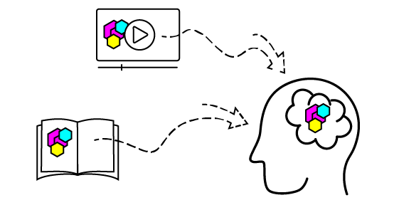
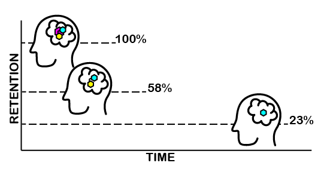
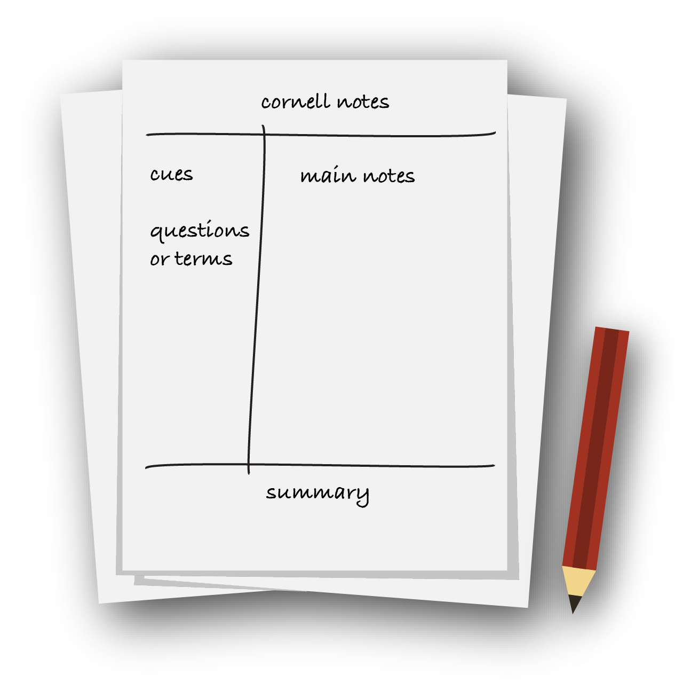
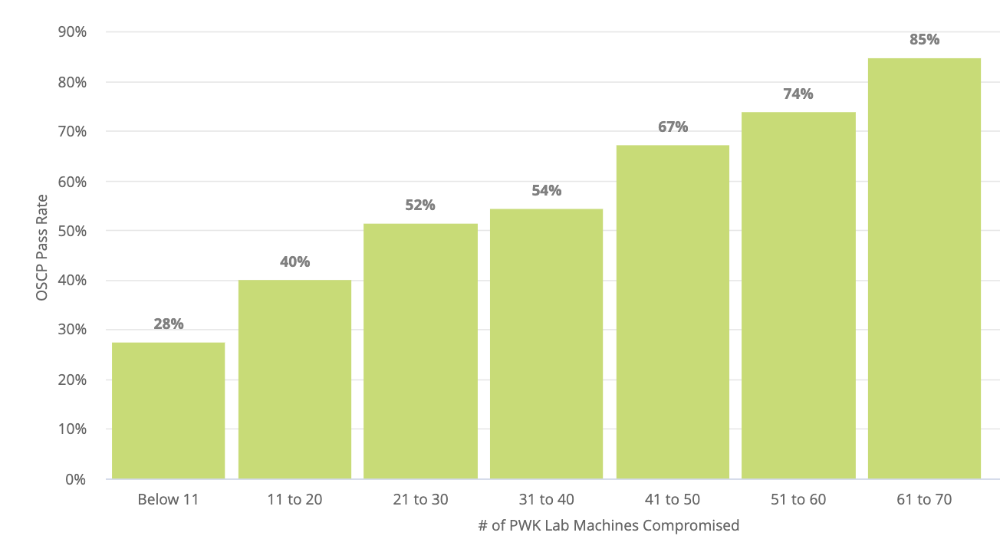

# 4. Effective Learning Strategies

Mô-đun học tập này nhằm mục đích cung cấp hiểu biết sâu sắc hơn về các chiến lược học tập cũng như xem trước về phong cách hướng dẫn OffSec và những gì mong đợi. Sau khi hoàn thành Mô-đun này, sẽ có thể lập kế hoạch hiệu quả về cách tiếp cận tốt nhất cho khóa học sắp tới.

Hãy cùng xem xét ngắn gọn lý do tại sao đây là một Mô-đun quan trọng. Thông tin được đề cập không chỉ giúp chuẩn bị để thành công trong khóa đào tạo sắp tới mà còn hữu ích cho các chuyên gia an ninh mạng trong thời gian dài. Vì cả công nghệ và bối cảnh an ninh đều không ngừng phát triển và thay đổi (sẽ khám phá thêm về điều này sau), nên các chuyên gia phải liên tục học hỏi và phát triển. Việc tìm kiếm thành công và sự hài lòng trong lĩnh vực này thường gắn liền với khả năng học hiệu quả và thoải mái.

Các Đơn vị học tập trong Mô-đun học tập này:

- Learning Theory

- Unique Challenges to Learning Technical Skills

- The OffSec Training Methodology

- A Case Study Regarding Executable Permission

- Common Methods and Strategies

- Advice and Suggestions on Exams

- Practical Steps

## 4.1. Learning Theory

Hãy bắt đầu bằng một cuộc thảo luận rất cơ bản về Lý thuyết học tập. Sẽ đưa ra một số quan sát chung về lĩnh vực nghiên cứu này và xem xét trạng thái hiện tại của sự hiểu biết (không ngừng phát triển) của chúng ta về cách người học học.

Nhìn chung, Đơn vị học tập này và đơn vị tiếp theo sẽ làm sáng tỏ một số vấn đề và khó khăn mà các cá nhân phải đối mặt khi học các môn học mới.

Đơn vị học tập này bao gồm các Mục tiêu học tập sau:

- Hiểu trạng thái chung về sự hiểu biết về giáo dục và lý thuyết giáo dục

- Hiểu những điều cơ bản về cơ chế bộ nhớ và mã hóa kép

- Nhận ra một số vấn đề gặp phải, bao gồm "Đường cong quên lãng" và tải nhận thức

### 4.1.1. What We Know and What We Don't

Mặc dù con người luôn dạy học, nhưng chỉ mới bắt đầu nghiên cứu lý thuyết học tập gần đây (trong vòng 100 năm qua).

Một số nghiên cứu này tập trung vào cấu trúc và mục đích của chính các trường học. Ví dụ, rất nhiều nghiên cứu cân nhắc về quy mô lớp học lý tưởng, liệu các hoạt động trong lớp thể dục có thể giúp ích trong lớp khoa học hay không, v.v. Mặc dù những nghiên cứu này thoạt đầu có vẻ không liên quan đến trọng tâm về an ninh mạng, nhưng một số khía cạnh chính của nghiên cứu này đáng được đề cập đến.

Đầu tiên, việc học không hoàn toàn phụ thuộc vào người học. Giáo viên, tài liệu, hình thức giáo dục và nhiều yếu tố khác ảnh hưởng đến thành công nhiều hơn là năng lực thô của người học. Thành tích trong quá khứ là yếu tố dự báo kém về thành công trong tương lai và các sự kiện và hoàn cảnh bên ngoài có thể ảnh hưởng đáng kể đến thành tích của người học.

Thứ hai, khi các nghiên cứu giáo dục mới liên tục được công bố, rõ ràng vẫn còn nhiều điều cần khám phá về cơ chế trí nhớ. Điều này bao gồm nghiên cứu cho thấy khái niệm về chế độ học tập (hoặc phong cách học tập) là một huyền thoại hơn so với suy nghĩ trước đây.

Hai bài viết tuyệt vời về chủ đề này là:

- American Psychological Association - Belief in Learning Styles Myth May Be Detrimental

- Scientific American - The Problem with "Learning Styles"

Với suy nghĩ này, OffSec thiết kế các khóa học dựa trên nghiên cứu học thuật hiện tại, đã được thiết lập liên quan đến lý thuyết học tập, hướng đến mục tiêu trở thành những người học liên tục. 

Mục tiêu cuối cùng là tạo ra một môi trường học tập hiệu quả cao, trang bị cho người học khả năng xuất sắc trong lĩnh vực bảo mật thông tin luôn thay đổi, bất kể kinh nghiệm hoặc thành tích trong lĩnh vực này.

Tuy nhiên, trước khi có thể thảo luận về các chiến lược thực tế hơn, hãy cùng khám phá một số nghiên cứu hiện tại trong lĩnh vực lý thuyết học tập để hiểu cách áp dụng tốt nhất.

### 4.1.2. Memory Mechanisms and Dual Coding

Có thể hơi choáng ngợp khi nghĩ về giáo dục nói chung, vì vậy trước tiên hãy cố gắng hiểu theo những thuật ngữ đơn giản hơn. Một trong những cách có thể chứng minh rằng đã "học" được điều gì đó là nếu có thể tạo và truy xuất một ký ức.

Ví dụ, có thể học một lệnh cụ thể để đổi tên tệp trong Linux, mv oldfilename.txt newfilename.txt. Sau đó, có thể thấy ở máy tính, cần đổi tên tệp. Hy vọng rằng trong tình huống đó, khi không có sách giáo khoa và bất kỳ tài liệu hướng dẫn nào, sẽ nhớ lệnh và cú pháp cụ thể này. Lý tưởng nhất là có thể nhập lệnh từ bộ nhớ và đổi tên tệp thành công.

Rất nhiều nghiên cứu đã được thực hiện về cách thức hoạt động của bộ nhớ và cách tạo ra những ký ức mạnh mẽ và học các kỹ năng mới. Đánh giá đầy đủ tất cả các chi tiết nằm ngoài phạm vi của Mô-đun này, nhưng tóm lại, có thể tóm tắt bằng cách nói rằng có thể cải thiện trí nhớ bằng cách thực hiện các bước sau:

1. Cải thiện chất lượng thông tin tiếp nhận
2. Cải thiện cách thức hoặc phương thức tiếp nhận thông tin
3. Cải thiện cách thức thực hành thu thập thông tin

Khám phá thêm tất cả những điều này, nhưng bây giờ, hãy cùng xem xét nhanh:

- Cải thiện chất lượng thông tin tiếp nhận: Ở cấp độ cơ bản, mong đợi tài liệu đào tạo phải chính xác. Có thể cần các đoạn giải thích (như đoạn này), được viết theo cách đơn giản, dễ hiểu. Trách nhiệm này thường thuộc về người hướng dẫn hoặc nhà cung cấp đào tạo.

- Cải thiện cách thức hoặc phương thức tiếp nhận thông tin: Điều này có thể bao gồm nhiều phương pháp tiếp cận. Thông tin có thể được ghi nhớ dễ dàng hơn nếu được trình bày ở nhiều định dạng, chẳng hạn như video hoặc hình ảnh. Điều này cũng có thể bao gồm một môi trường không có sự xao nhãng.

- Cải thiện cách thức thực hành thu thập thông tin: Thoạt đầu, điều này có vẻ chỉ là bài tập luyện thi, nhưng thực ra còn nhiều điều hơn thế nữa. Người học đọc một đoạn văn về cách tạo tệp và sau đó làm theo để tạo tệp một cách độc lập đang thực hiện quá trình truy xuất trí nhớ.

Càng nỗ lực cải thiện ba lĩnh vực này sẽ càng ghi nhớ và học tốt hơn. Biết rằng việc lặp lại thông tin trong khi thay đổi chế độ truyền đạt cũng có thể hữu ích.

Việc tiếp nhận cùng một thông tin thông qua một phương pháp thứ cấp, ví dụ, đọc lời giải thích rồi xem video về cùng một Mô-đun, được gọi là Mã hóa kép. Nguyên tắc cơ bản đằng sau Mã hóa kép là việc nghiên cứu lặp đi lặp lại cùng một thông tin thông qua các phương tiện khác nhau sẽ cải thiện khả năng ghi nhớ.



Hình ảnh hiển thị ở trên không chỉ là minh họa về Dual Coding; mà thực tế là một ví dụ về Dual Coding. Bằng cách kết hợp đoạn văn bản giải thích quá trình đọc về một khái niệm và kết hợp với các phương tiện trực quan giải thích, thông tin sẽ được in sâu hơn vào não.

Ngày càng có nhiều nghiên cứu, bao gồm các thí nghiệm có thể lặp lại và bằng chứng từ hình ảnh thần kinh, ủng hộ Dual Coding như một chiến lược học tập hiệu quả.

### 4.1.3. The Forgetting Curve and Cognitive Load

Trong một câu chuyện hư cấu của Jorge Luis Borges, một nhân vật tên là Funes the Memorious có thể nhớ lại chi tiết sống động mọi thứ mà anh ta chứng kiến. Thật không may, hầu hết không được ban tặng món quà này. Hai trong số những vấn đề phổ biến nhất gặp phải khi cố gắng học một điều gì đó (hoặc tạo ra một ký ức) là "quá lâu rồi" hoặc "quá nhiều thông tin cùng một lúc".

Hãy bắt đầu bằng cách xem xét vấn đề quên lãng. Năm 1885, nhà khoa học nghiên cứu về học tập Hermann Ebbinghaus đã bắt đầu ghi nhớ một vài tài liệu, sau đó tự kiểm tra bản thân nhiều lần về những gì nhớ được. Anh ta chỉ có thể nhớ tất cả các chi tiết nếu tự kiểm tra ngay sau khi ghi nhớ. Ebbinghaus phát hiện ra rằng anh ta chỉ nhớ được 100 phần trăm thông tin tại thời điểm tiếp nhận. Sau đó, anh ta bắt đầu quên thông tin rất nhanh. Khi anh ta đợi 20 phút, anh ta chỉ có thể nhớ được 58%. Một ngày sau, anh ta chỉ có thể nhớ được 23%. Ông gọi sự suy giảm này là Đường cong quên lãng.



Rất may là gần 150 năm sau, hầu hết đều có công cụ tìm kiếm và các công cụ khác mà Ebbinghaus không có. Ví dụ, nếu quên lệnh cụ thể để đổi tên tệp trong Linux, chẳng hạn như mv oldfilename.txt newfilename.txt, có thể nhanh chóng và dễ dàng tìm kiếm trên Google.

Đây là tin tuyệt vời vì điều đó có nghĩa là cách tiếp cận học tập không cần phải tập trung vào việc ghi nhớ các sự kiện. Thay vào đó, có thể chuyển trọng tâm sang học một phương pháp (trong trường hợp này, phương pháp có thể là tìm kiếm trên Google lệnh cần).

Vấn đề thứ hai, gọi là "quá nhiều thông tin cùng một lúc", thường được gọi là Tải nhận thức.

Để hiểu rõ hơn về tải nhận thức, có thể hữu ích khi tưởng tượng bộ não giống như một căn phòng, với các mẩu thông tin (chiếm không gian) di chuyển vào và ra. Đến một lúc nào đó, nếu ngày càng có nhiều thông tin tiếp tục tràn vào, thì đơn giản là không có đủ không gian để mọi thứ được sắp xếp ngăn nắp. Chẳng mấy chốc, căn phòng sẽ quá đầy và không đủ không gian để thêm thông tin đi vào qua cánh cửa.

Để khắc phục điều này, người hướng dẫn có thể thử giảm bớt cái gọi là "tải trọng không liên quan". Đây là những thông tin mới không quan trọng hoặc không cần thiết.

Quay lại ví dụ về đổi tên tệp. Hãy tưởng tượng rằng người hướng dẫn cũng giải thích rằng lệnh này giống hệt lệnh mà chúng ta có thể sử dụng nếu muốn thay đổi vị trí của tệp thành cùng một thư mục chính xác rồi đặt tên mới cho tệp. Mặc dù về mặt kỹ thuật là đúng, nhưng thông tin này sẽ không giúp hiểu rõ hơn về cách đổi tên tệp. Thay vào đó, việc cố gắng hiểu rằng "di chuyển thứ gì đó đến vị trí ban đầu" có thể chiếm thêm năng lực tinh thần, thực sự cản trở việc học.

Thật dễ dàng để hình dung ra cách tài liệu hướng dẫn lộn xộn có thể làm tăng tải trọng nhận thức, nhưng điều tương tự cũng đúng đối với lớp học hoặc môi trường nơi người học đang ở. Một quán cà phê ồn ào đầy mùi, cuộc trò chuyện, mọi người và chuyển động - tất cả những thứ mà não liên tục tiếp nhận. Trong trường hợp học trực tuyến, có thể cần giảm tải trọng không liên quan trong chính không gian học tập thực tế. Sẽ khám phá thêm về điều này sau.

Hãy dành thời gian dừng lại một chút và xem lại một số kiến ​​thức đã học cho đến nay bằng một loạt câu hỏi.

## 4.2. Unique Challenges to Learning Technical Skills

Tiếp theo, hãy xem xét một số thách thức độc đáo khác sẽ phải đối mặt khi cố gắng học các kỹ năng kỹ thuật.

Đơn vị học tập này bao gồm các Mục tiêu học tập sau:

- Nhận ra sự khác biệt và lợi thế của tài liệu học tập kỹ thuật số

- Hiểu được thách thức khi chuẩn bị cho các tình huống chưa biết

- Hiểu được những thách thức tiềm ẩn của việc học từ xa hoặc không đồng bộ

### 4.2.1. Digital vs. Print Materials

Hãy cùng xem xét sự khác biệt giữa việc học trên Cổng thông tin an ninh tấn công so với các trải nghiệm học tập truyền thống hơn như đọc sách. Các kỹ năng kỹ thuật như lập trình thường được dạy bằng cách sử dụng các tài liệu trên cùng một phương tiện nơi thực hiện công việc thực tế (màn hình). Đây là trường hợp của Thư viện OffSec.

Một số nghiên cứu đã được thực hiện về sự khác biệt giữa việc học trên màn hình hoặc từ sách (https://healthland.time.com/2012/03/14/do-e-books-impair-memory/) và các nhà nghiên cứu thậm chí đã khám phá xem kích thước của màn hình có quan trọng hay không. Điều thú vị là nghiên cứu cho thấy thông tin có liên quan.

Trong số các phát hiện là màn hình nhỏ hơn có thể khiến việc học trở nên khó khăn hơn và những người đọc sách có xu hướng hiểu thông tin đầy đủ hơn. Cả hai cách tiếp cận đều có lợi ích và hạn chế. Đôi khi, việc đọc màn hình có thể gây ra tình trạng mệt mỏi về thị giác hoặc giác quan. Người học học trong bối cảnh kỹ thuật số có thể dễ dàng truy cập vào một số công cụ, bao gồm khả năng tham khảo nhanh chóng và dễ dàng các tài liệu bổ sung (ví dụ: tra cứu định nghĩa của một từ vựng mới). Mặt khác, đôi khi hành động đọc sách đưa người ta vào một môi trường không bị sao nhãng, cho phép tập trung sâu hơn. (https://www.oxfordlearning.com/reading-online-vs-offline-whats-best-for-learning/)

Thứ hai, và có lẽ là điều quan trọng hơn cần lưu ý ở đây, liên quan đến một khái niệm được gọi là Học theo ngữ cảnh. (https://files.eric.ed.gov/fulltext/ED448304.pdf) Mặc dù chúng ta không thể khám phá tất cả các chi tiết của nó trong Mô-đun này, nhưng khái niệm này cho thấy rằng ngay cả ở cấp độ trực quan, biết rằng học cách xây nhà trên công trường xây dựng dễ hơn.

Nói cách khác, khi tài liệu đào tạo được trình bày trong cùng bối cảnh với kỹ năng mà đang cố gắng học, não phải làm ít công việc dịch thuật hơn và có thể chấp nhận thông tin mới dễ dàng hơn. Điều này không có nghĩa là sách về máy tính là vô giá trị - nó chỉ có nghĩa là não phải làm nhiều việc hơn để đồng hóa thông tin từ trang sách và suy nghĩ về thông tin đó trong bối cảnh của màn hình máy tính.

### 4.2.2. Expecting the Unexpected

Có một thách thức độc đáo khác sẽ phải đối mặt khi học về an ninh mạng. Lĩnh vực này luôn tập trung vào việc cố gắng chuẩn bị cho các tình huống mà không thể dự đoán được.

Hãy cùng xem xét một vài ví dụ đơn giản. Có thể tìm hiểu về Kiến trúc mạng doanh nghiệp, chuyên nghiên cứu cách một doanh nghiệp tổ chức máy chủ, máy trạm và thiết bị trên mạng. Thật không may, mặc dù Mô-đun đó có thể đi sâu như vậy, nhưng không có khả năng bao quát chính xác kiến ​​trúc mạng sẽ gặp phải trong một số tình huống trong tương lai. Trong một Mô-đun khác, có thể hiểu rõ và hoàn hảo một vectơ tấn công cụ thể và thậm chí có thể thực hiện nó trong môi trường lab, nhưng điều đó không có nghĩa là sẽ gặp phải vectơ chính xác đó trong mọi môi trường trong tương lai.

Cũng phải tính đến việc toàn bộ lĩnh vực an ninh mạng không ngừng phát triển. Các lỗ hổng mới liên tục được phát hiện. Một mạng an toàn ngày hôm nay có thể không còn an toàn trong sáu tháng nữa. Cần có khả năng vượt qua khóa đào tạo ban đầu để duy trì hiệu quả trong lĩnh vực này.

Theo cách này, việc học về an ninh mạng cũng giống như việc học các kỹ năng chuyển tiếp (https://ervet-journal.springeropen.com/articles/10.1186/s40461-020-00100-0) như lãnh đạo, giao tiếp và làm việc nhóm. Cũng giống như các kỹ năng này, không thể tập trung vào việc ghi nhớ một loạt các bước cần thực hiện. Không có quy trình vận hành chuẩn đơn giản, dễ hiểu nào để xây dựng tinh thần làm việc nhóm tốt hơn cũng như không có quy trình vận hành chuẩn đơn giản, dễ hiểu nào để phát triển khai thác. Thay vào đó, cần tập trung vào việc hiểu các phương pháp, kỹ thuật và mục đích đằng sau một số hành động nhất định.

Hãy quay lại ngắn gọn với ví dụ về việc học cách bảo mật mạng. Đã đề cập rằng "Một mạng an toàn ngày hôm nay có thể không an toàn trong sáu tháng nữa". Cách tiếp cận tốt nhất cho vấn đề này không phải là học một loạt các bước mà có thể thực hiện để bảo mật mạng đó ngay hôm nay, rồi sau đó học một loạt các bước mới trong sáu tháng. Giải pháp là học phương pháp luận và mục đích đằng sau mỗi bước bảo mật. Khi rủi ro mới phát sinh sẽ áp dụng cùng một phương pháp, thích ứng và phát triển cùng với bối cảnh mối đe dọa đang thay đổi.

Sau này trong Mô-đun này sẽ thảo luận về một số phương pháp tiếp cận tiềm năng có thể giúp thực hiện điều này.

### 4.2.3. The Challenges of Remote and Asynchronous Learning

Có một khía cạnh nữa của loại hình học tập đặc biệt này muốn cân nhắc - thực tế là đây là môi trường học tập từ xa. Trong đại dịch COVID-19 toàn cầu, nhiều trường học đã áp dụng hình thức học tập từ xa lần đầu tiên và người học ở mọi lứa tuổi phải đối mặt với những thách thức mới (https://careerwise.minnstate.edu/education/successonline.html) khi cố gắng học qua màn hình máy tính tại nhà.

Cũng phải cân nhắc rằng một số hình thức học trực tuyến là không đồng bộ, nghĩa là người hướng dẫn có thể không có mặt trong cuộc gọi Zoom hoặc lớp học để giảng bài, hướng dẫn hoặc trả lời câu hỏi. Thay vào đó, người học có thể tham gia lớp học vào bất kỳ giờ nào hoặc tốc độ nào phù hợp nhất với họ. Có một số ưu điểm và nhược điểm nhất định đối với loại hình học tập này.

người học trong môi trường học tập từ xa, không đồng bộ cần lưu ý hai điều:

1. Những lợi thế đến từ sự hỗ trợ của bạn bè, cộng đồng và tình đồng chí của những người học khác trong môi trường lớp học truyền thống không còn được đảm bảo nữa.
2. Tốc độ và thời gian của khóa học phần lớn là trách nhiệm của người học.

Sẽ sớm thảo luận một số giải pháp thực tế cho mục thứ hai, nhưng để kết nối với cộng đồng người học rộng hơn, người học Offensive Security có một cộng đồng những người học cùng trên Máy chủ Discord OffSec.(https://offs.ec/discord) Cũng có thể có các buổi gặp gỡ tại địa phương hoặc các cộng đồng khác dành cho người học. Việc tìm kiếm sự hỗ trợ và giúp đỡ (cũng như giúp đỡ và hỗ trợ người khác) cũng mang lại nhiều lợi ích vượt xa lớp học.

## 4.3. OffSec Training Methodology

Bây giờ đã xem xét một số thách thức sẽ phải đối mặt, hãy cùng khám phá cách cấu trúc và thiết kế của tài liệu đào tạo OffSec sẽ giúp như thế nào.

Sẽ không thể đi sâu vào mọi thứ tạo nên chương trình đào tạo có ý nghĩa và hữu ích. (https://eric.ed.gov/?id=EJ1092139) Thay vào đó, sẽ tập trung vào một số chiến lược dễ thấy, có thể tận dụng.

Đơn vị học tập này bao gồm các Mục tiêu học tập sau:

- Hiểu được ý nghĩa của Phương pháp trình bày

- Hiểu được thách thức khi chuẩn bị cho các tình huống chưa biết

- Hiểu được những thách thức tiềm ẩn của việc học từ xa hoặc không đồng bộ

### 4.3.1. The Demonstration Method

Như có thể suy ra từ tên gọi, sử dụng Phương pháp trình diễn có nghĩa là thể hiện (hoặc diễn xuất) những gì người ta hy vọng người học có thể hoàn thành. Để minh họa điều này, hãy quay lại ngắn gọn với ví dụ về việc học cách đổi tên tệp trong Linux.

Một cách để cung cấp thông tin này là rất trực tiếp.

```
Sử dụng lệnh "mv".
```

Mặc dù về mặt kỹ thuật thì đúng, nhưng người học vẫn có thể không hiểu đầy đủ cách sử dụng thông tin này. Người hướng dẫn sử dụng phương pháp trình diễn sẽ làm theo các bước chính xác mà người học nên làm theo, bao gồm cả kết quả đầu ra khi chạy lệnh. Thông tin liên quan có thể được trình bày tốt hơn bằng khối mã.

Trước khi hiển thị khối mã, trước tiên sẽ trình bày kế hoạch và nêu chi tiết bất kỳ lệnh mới hoặc thú vị nào mà đang có kế hoạch chạy. Ở đây, có thể thảo luận rằng sẽ sử dụng ls *.txt để liệt kê bất kỳ tệp .txt nào trong thư mục. Tiếp theo, sẽ chạy lệnh đổi tên, mv oldfilename.txt newfilename.txt. Cuối cùng, sẽ sử dụng ls *.txt để kiểm tra xem lệnh có hoạt động không.

```
kali@kali:~$ ls *.txt
oldfilename.txt

kali@kali:~$ mv oldfilename.txt newfilename.txt
 
kali@kali:~$ ls *.txt
newfilename.txt
```

Sau khi liệt kê mã, sẽ giải thích kết quả. Trong trường hợp này, đã liệt kê các tệp .txt và chỉ có một tệp có tên là oldfilename.txt. Sau đó chạy lệnh đổi tên và không nhận được kết quả nào, như mong đợi. Cuối cùng đã kiểm tra kết quả bằng cách chạy lại ls *.txt. Lần này, kết quả cho thấy tệp .txt duy nhất trong thư mục là newfilename.txt. Có thể thực hiện các bước tiếp theo để đảm bảo tệp này chứa cùng nội dung như trước đó và chỉ có tên tệp đã thay đổi.

Mặc dù có vẻ không cần thiết phải đưa vào các mục bổ sung này, nhưng loại trình diễn và mô tả này bắt đầu cho thấy quá trình suy nghĩ sẽ cần phải học. Đã xác minh công việc trong trường hợp này và kiểm tra xem lệnh có hoạt động không. Mặc dù điều đó không nhất thiết là một phần của việc đổi tên tệp, nhưng việc hình thành thói quen kiểm tra công việc là một thói quen tuyệt vời cần áp dụng.

### 4.3.2. Learning by Doing

Làm một việc gì đó giúp học được nó. Có rất nhiều nghiên cứu ủng hộ việc học bằng cách làm như một phương pháp giúp tăng khả năng ghi nhớ và cải thiện trải nghiệm giáo dục tổng thể. (http://pact.cs.cmu.edu/pubs/koedinger,%20Kim,%20Jia,%20McLaughlin,%20Bier%202015.pdf), (https://opentextbc.ca/teachinginadigitalage/chapter/4-4-models-for-teaching-by-doing/), (https://www.the-learning-agency-lab.com/the-learning-curve/learning-by-doing/), (https://www.centreforbrainhealth.ca/news/learning-doing-better-retention-learning-watching/)

Phương pháp này hiệu quả với người học và OffSec đã áp dụng theo nhiều cách.

1. Tài liệu đào tạo
2. Bài tập mô-đun
3. Challenge Labs
4. Proving Grounds

Bản thân tài liệu đào tạo luôn có xu hướng tập trung vào các tình huống có thể theo dõi. Có những lúc cần thảo luận một chút về lý thuyết để có đủ kiến ​​thức nền tảng để đi sâu hơn, nhưng nhìn chung, nếu tài liệu có thể chứng minh cách giải quyết vấn đề, thì kỳ vọng là người học sẽ có thể theo dõi. Thường thì một máy ảo (VM) được xây dựng riêng để đáp ứng điều này.

Bản thân Bài tập mô-đun thường cũng bao gồm việc làm việc với VM. Đây là cách tiếp cận thường xuyên nhất có thể, nhưng với một số Mô-đun (ví dụ như mô-đun này) mang tính lý thuyết hơn, các bài tập được trình bày theo định dạng câu hỏi và trả lời chuẩn hơn.

Thư viện OffSec cũng chứa Challenge Labs, đưa các bài tập tiến thêm một bước nữa. Về cơ bản, Challenge Labs là môi trường của các bài tập thực hành bổ sung được tạo ra riêng để giúp chuẩn bị cho kỳ thi (có lẽ cũng là kỳ thi thực hành). Nên tận dụng cơ hội bổ sung này.

Cuối cùng tận dụng các bài đánh giá và kỳ thi. Đây là các bài tập và môi trường lab được kết nối mạng dành riêng cho việc chứng minh các kỹ năng đã học. Vì môi trường thực tế sẽ không cung cấp chỉ dẫn rõ ràng về lỗ hổng nào có thể có trên hệ thống, nên không tạo liên kết 1:1 giữa Mô-đun khóa học và đánh giá (ví dụ: không quảng cáo liệu máy có dễ bị leo thang đặc quyền hay không).

Với suy nghĩ này, các kỹ năng và phương pháp sẽ học trong các khóa học có thể áp dụng trực tiếp vào môi trường đánh giá và thi cử.

### 4.3.3. Facing Difficulty

Có một câu nói phổ biến rằng "luyện tập tạo nên sự hoàn hảo". Điều đó có thể đúng, nhưng nó đặt ra câu hỏi, điều gì tạo nên sự luyện tập lý tưởng?

Hãy cùng xem xét thí nghiệm sau được thực hiện vào năm 1978. (https://pubmed.ncbi.nlm.nih.gov/662537/) Một nhóm trẻ em 8 tuổi được chia thành hai nhóm để thực hành một nhiệm vụ đơn giản: ném một túi đậu nhỏ vào một lỗ mục tiêu. Sau khi được giới thiệu về nhiệm vụ với mục tiêu ở khoảng cách ba feet (khoảng 90 cm), các nhóm đã dành ba tháng tiếp theo để thực hành. Một nhóm tiếp tục thực hành với mục tiêu ở cùng khoảng cách. Nhóm còn lại nhắm vào một cặp mục tiêu - thực hành với khoảng cách là hai feet (60 cm) và bốn feet (120 cm).

Trong bài kiểm tra cuối cùng, nhiệm vụ là ném túi đậu vào một mục tiêu cách xa ba feet. Nhóm đã dành toàn bộ thời gian luyện tập ở khoảng cách chính xác đó đã bị đánh bại bởi nhóm đã luyện tập ở khoảng cách hai và bốn feet.

Nghiên cứu này và các nghiên cứu khác chứng minh rằng sự đấu tranh không chỉ quan trọng đối với trải nghiệm học tập mà còn quan trọng hơn việc lặp lại đơn thuần để tạo ra các đường dẫn thần kinh giúp học các kỹ năng mới.

Sự cần thiết phải đấu tranh này có nghĩa là sẽ không lặp lại chính xác nhiều trong các tài liệu học tập OffSec. Vì việc học là tự định hướng, những người học muốn lặp lại nhiều hơn có thể quay lại các phần cụ thể của tài liệu nhiều lần tùy thích.

Thay vì kiểu lặp lại này, thường chọn đi theo con đường gián tiếp đến đích. Ví dụ, có thể thử những điều không hiệu quả để có thể trải nghiệm hành động tự đứng dậy và thử lại. Đây là phép ẩn dụ tương đương với việc di chuyển mục tiêu xung quanh một chút.

Nói một cách đơn giản, việc ghi nhớ cú pháp ít quan trọng hơn việc quen thuộc với các thách thức và thoải mái với một chút đấu tranh như một đặc điểm tính cách cần thiết đối với một người trong lĩnh vực an ninh thông tin.

Hãy lưu ý thêm một điều nữa khi đang nói về chủ đề này. Mong rằng hầu như mọi người học đều sẽ bị mắc kẹt tại một thời điểm nào đó trong hành trình học tập. Không coi đây là điều tiêu cực.

Bị mắc kẹt không phải là điều vui vẻ, nhưng tin rằng việc thoải mái trong tình huống mà có thể không có tất cả thông tin và giải quyết vấn đề là rất quan trọng để thành công trong lĩnh vực an ninh mạng. Để đạt được mục đích đó, đôi khi đi theo một con đường gián tiếp đến đích (để gặp phải "bị mắc kẹt") và cung cấp các bài tập kỹ thuật yêu cầu người học vượt ra ngoài việc chỉ lặp lại tài liệu đã học. Mục tiêu là giúp bạn thực hành bị mắc kẹt đủ để bạn trở nên khá thoải mái khi phục hồi.

### 4.3.4. Contextual Learning and Interleaving

Bất cứ khi nào có thể, tài liệu học tập của OffSec sẽ trình bày một kỹ năng mới như một phần của một kịch bản thực tế. Điều này có thể khó khăn với các kỹ năng cơ bản hơn, như lệnh được sử dụng để đổi tên tệp, nhưng khi đi sâu hơn và sâu hơn vào tài liệu sẽ thấy đang làm việc thông qua các tình huống thực hành đại diện cho thế giới thực nhất có thể.

Dạy theo cách này mất nhiều thời gian hơn; tuy nhiên, việc học các kỹ năng mới trong bối cảnh thực tế cải thiện đáng kể khả năng ghi nhớ và thành công. (https://www.timeshighereducation.com/campus/contextual-learning-linking-learning-real-world)

cũng có thể thấy rằng khi thông tin được trình bày trong bối cảnh, thực sự đang học nhiều thứ cùng một lúc. Ví dụ, nếu đang tìm hiểu về cách thức một phương pháp tấn công có thể được thực hiện và phát hiện cùng một lúc, não có thể tạo ra nhiều kết nối hơn để giúp học hiệu quả. Phương pháp này được gọi là xen kẽ. (https://academicaffairs.arizona.edu/l2l-strategy-interleaving)

## 4.4. Case Study: chmod -x chmod

Có thể khó hiểu một số ý tưởng này về việc dạy và học hoàn toàn tách biệt khỏi ngữ cảnh. Để quan sát một số ý tưởng này "trong thực tế", hãy dành chút thời gian để tìm hiểu về thứ gọi là quyền thực thi. (https://www.thegeekstuff.com/2013/02/sticky-bit/) Sẽ sử dụng điều này như một dạng nghiên cứu tình huống để hiểu rõ hơn về cách trình bày tài liệu đào tạo OffSec và cách có thể tiếp cận việc học.

Đối với phần tiếp theo này, hãy lưu ý rằng không sao nếu nội dung mang tính kỹ thuật hơn những gì cảm thấy đã sẵn sàng hoặc nếu không thể theo dõi. Ví dụ, sẽ bắt đầu bằng cách nói "Mỗi tệp trên máy Linux đều có một số thuộc tính liên quan đến nó". Không sao nếu, với tư cách là người đọc, chưa biết máy Linux là gì, "thuộc tính" là gì hoặc thậm chí tệp là gì.

Sẽ cố gắng giữ mọi thứ ở mức cơ bản trong một thời gian, sau đó sẽ đi sâu hơn một chút. Nếu có nhiều kinh nghiệm hơn về Linux, có thể thích câu đố mà giải quyết khi tiếp tục.

Một lần nữa, mục đích ở đây không thực sự là tìm hiểu về phần thực thi, mà là để có một ví dụ để có thể thảo luận về cách có thể tiếp cận việc giảng dạy một chủ đề như vậy.

Đơn vị học tập này bao gồm các Mục tiêu học tập sau:

- Xem lại một mẫu tài liệu học tập về quyền thực thi, mở rộng ra ngoài tập thông tin ban đầu và giải quyết một vấn đề

- Hiểu cách tiếp cận giảng dạy của OffSec được phản ánh trong tài liệu mẫu

### 4.4.1. What is Executable Permission?

Mỗi tệp trên máy Linux đều có một số thuộc tính bổ sung liên quan đến tệp đó. Những thuộc tính này bao gồm thời điểm tệp được tạo, người dùng nào đã tạo tệp đó, người dùng nào có quyền đọc tệp đó và thậm chí là tên của tệp đó.

Quyền đối với tệp đặc biệt quan trọng. Chúng cho biết có được phép đọc, ghi hoặc thực thi một tệp cụ thể hay không. Có thể nghĩ đến từ ghi trong ngữ cảnh này là khả năng thực hiện một số thay đổi nhất định đối với tệp. Ví dụ, điều này có thể được đặt thành không cho phép ghi vào tệp, điều này có thể giúp tệp đó không bị xóa vô tình. Quyền cũng có thể được đặt thành không cho phép đọc tệp có thông tin mà không được phép xem.

Những quyền này được gọi là quyền đối với tệp (https://www.studytonight.com/linux-guide/understanding-file-permissions-in-linux-unix) và liên quan đến một số loại người dùng khác nhau có thể sử dụng máy tính này: chủ sở hữu tệp, nhóm sở hữu người dùng và bất kỳ ai khác. Những lớp người dùng khác nhau này có thể được cấp (hoặc từ chối) quyền cho mỗi một trong ba hành động trên: đọc, ghi và thực thi. Vì lợi ích của Mô-đun này, sẽ chỉ tập trung vào chủ sở hữu của tệp, trong trường hợp này là chính chúng ta.

Hãy mở một terminal và xem xét cách thức hoạt động này trong thực tế. Touch (https://www.geeksforgeeks.org/touch-command-in-linux-with-examples/) một tệp (newfilename.txt), lệnh này sẽ tạo tệp đó và tự động biến chúng ta thành chủ sở hữu. Sau đó, chúng ta sẽ sử dụng lệnh liệt kê ls (https://www.geeksforgeeks.org/practical-applications-ls-command-linux/) để thu thập thông tin về tệp, cung cấp tham số -l sẽ tạo ra một danh sách dài bao gồm các quyền của tệp.

```
kali@kali:~$ touch newfilename.txt

kali@kali:~$ ls -l newfilename.txt
-rw-r--r-- 1 kali kali 0 Jun  6 12:31 newfilename.txt
```

```
Trong một số trường hợp, lệnh touch có thể không thành công do quyền thư mục. (https://www.linuxfoundation.org/blog/blog/classic-sysadmin-understanding-linux-file-permissions) Mặc dù điều này nằm ngoài phạm vi của phần giới thiệu này, nhưng hiện tại, nên biết rằng quyền thư mục áp dụng cho tất cả các tệp và thư mục trong một thư mục. Nếu quyền thư mục không cho phép tạo tệp ở vị trí này, lệnh touch rõ ràng sẽ không thành công.
```

Lệnh touch không tạo ra kết quả nào. Điều này là bình thường. Kết quả của lệnh ls bao gồm thông tin về các quyền được chỉ định bằng các chữ cái rwx, trong đó "r" là để đọc, "w" là để ghi và "x" là để thực thi. Dấu gạch ngang (-) cho biết lớp người dùng không có các quyền tương ứng. Trong trường hợp này, có quyền đọc và ghi vào tệp mới, nhưng không có ký tự "x" trong kết quả, nghĩa là không có lớp nào có quyền thực thi.

Là chủ sở hữu của một tệp cụ thể, được cấp quyền đọc và ghi theo mặc định khi tạo tệp đó, nhưng không được cấp quyền thực thi. Nói cách khác, nếu newfilename.txt là một chương trình, sẽ không thể thực thi tệp đó. Đây là một tính năng bảo mật nhỏ nhưng hữu ích giúp tránh vô tình chạy một thứ gì đó mà có thể không muốn.

Hãy tiếp tục. Trong trường hợp này, giả sử có một chương trình đơn giản sẽ cung cấp cho danh sách đầy đủ tên nhân viên. Chương trình này là một tập lệnh Python  đã tạo có tên là find_employee_names.py. Hãy thử chạy tập lệnh này.

```
kali@kali:~$ ./find_employee_names.py
zsh: permission denied: ./find_employee_names.py

kali@kali:~$ ls -l find_employee_names.py
-rw-r--r-- 1 kali kali 206 Jun  7 12:31 find_employee_names.py
```

Thử chạy tập lệnh bằng cách chỉ cần nhập tên tệp, find_employee_names.py, vào thiết bị đầu cuối. Phần ./ của lệnh chỉ hướng dẫn hệ thống tìm tệp ở đâu. Thao tác này sẽ hiệu quả, nhưng kết quả không như mong đợi. Thông báo lỗi "zsh: permission denied" cho biết vì lý do nào đó, không thể thực thi (hoặc chạy) tập lệnh.

Cũng chạy cùng lệnh ls như trước. Cũng giống như tệp mới tạo, không có ký tự "x" trong kết quả, nghĩa là không có quyền thực thi. Điều này giải thích cho kết quả "permission denied".

Hãy thay đổi quyền thực thi cho tệp này và cấp cho quyền thực thi tệp (nói cách khác, chạy tệp dưới dạng chương trình). Có thể sử dụng chmod +x để thêm quyền thực thi vào tệp tập lệnh. Hãy thực hiện như vậy và thử chạy lại tập lệnh.

```
kali@kali:~$ chmod +x find_employee_names.py

kali@kali:~$ ls -l find_employee_names.py
-rwxr-xr-x 1 kali kali 206 Jun  7 12:31 find_employee_names.py

kali@kali:~$  ./find_employee_names.py
R. Jones
R. Diggs
G. Grice
C. Smith
C. Woods
D. Coles
J. Hunter
L. Hawkins
E. Turner
D. Hill
```

Sau khi tự cấp quyền, đã kiểm tra nhanh bằng lệnh ls để xem đầu ra có thay đổi không. Có thay đổi! Lần này, đầu ra chứa ký tự "x", cho biết quyền thực thi được phép đối với cả ba lớp người dùng.

Tiếp theo, chạy lại tập lệnh của mình và may mắn thay, lần này đã nhận được đầu ra mong đợi. Tập lệnh cung cấp danh sách các nhân viên hiện tại.

Bây giờ, hãy thay đổi lại để không còn quyền thực thi tệp nữa. Để thêm quyền, đã sử dụng chmod +x, vì vậy lần này, sẽ sử dụng chmod -x.

```
kali@kali:~$ chmod -x find_employee_names.py

kali@kali:~$ ./find_employee_names.py
zsh: permission denied: ./find_employee_names.py
```

Quay lại điểm xuất phát với cùng thông báo lỗi như trước. Từ thử nghiệm nhỏ này, sẽ có hiểu biết rất cơ bản về bit quyền thực thi, công cụ chmod và các tùy chọn +x và -x.

### 4.4.2. Going Deeper: Encountering a Strange Problem

Hãy dành chút thời gian để nhắc nhở bản thân rằng không sao nếu không thực hiện tất cả các bước kỹ thuật đã đề cập. Một số ví dụ sau đây được đưa vào cụ thể để gây hứng thú cho những người học hiểu rõ hơn về Linux.

Hãy tiếp tục khám phá và thúc đẩy việc học hơn nữa.

Sẽ xem xét thực tế rằng lệnh chmod chỉ là một tệp. Nó tuân theo các quy tắc giống như các tệp khác trên hệ thống, bao gồm các quy tắc giống nhau về quyền. Nó nằm ở một vị trí hơi khác (trong thư mục /usr/bin/) so với tập lệnh của chúng ta, nhưng lý do duy nhất khiến có thể chạy lệnh chmod +x find_employee_names.py là vì tệp chmod đã được thiết lập quyền để cho phép chạy nó dưới dạng một chương trình.

Bây giờ, hãy tự hỏi mình một câu hỏi thú vị: vì chmod là công cụ cho phép thiết lập quyền, vậy sẽ làm gì nếu không có quyền thực thi nó?

Rất may là không dễ để vô tình xóa quyền thực thi của đối với tệp này. Mặc dù vậy, chúng ta đã làm như vậy trên hệ thống của mình.

Hãy cùng khám phá cách sửa lại tập lệnh. Sẽ bắt đầu với tập lệnh đã hoạt động trước đó.

```
kali@kali:~$ ./find_employee_names.py
zsh: permission denied: ./find_employee_names.py

kali@kali:~$ chmod +x find_employee_names.py
zsh: permission denied: chmod
```

Trong trường hợp ban đầu này, tập lệnh đơn giản sẽ không chạy. Đây là cùng một vấn đề đã gặp phải trước đó. Đã thử giải pháp đã hiệu quả trước đó, nhưng lần này nhận được một thông báo lỗi mới.

Có thể thử chạy chmod trên tệp chmod, nhưng sẽ gặp phải cùng một vấn đề. Hãy chạy nó trên /usr/bin/chmod, vì đây là vị trí cụ thể của tệp.

```
kali@kali:~$ chmod +x /usr/bin/chmod
zsh: permission denied: chmod
```

Một lần nữa quyền lại bị từ chối, nhưng vẫn chưa bị kẹt.

```
Một người học đặc biệt tinh ý có thể hỏi một cách hợp lý tại sao cần sử dụng "./" cho tập lệnh Python, nhưng không phải cho chmod. Câu trả lời, nằm ngoài phạm vi của Module này, liên quan đến biến môi trường PATH. Những người học quan tâm hoặc tò mò có thể tìm hiểu thêm về điều này thông qua nghiên cứu bên ngoài.
```

Phần lớn, đã kiểm tra quyền bằng cách chỉ cần cố gắng thực thi chương trình. Hãy nhớ lại phương pháp đã sử dụng trước đó để kiểm tra quyền này - sử dụng lệnh ls với tùy chọn -l. Nếu chạy ls -l mà không có bất kỳ thông tin nào ở cuối, sẽ có thể quan sát thông tin cho mọi tệp trong thư mục hiện tại. Vì chỉ quan tâm đến một tệp, chúng ta sẽ theo sau lệnh của mình bằng một tên tệp cụ thể.

Hãy chạy lệnh này cho hai tệp khác nhau.

```
kali@kali:~$ ls -l find_employee_names.py
-rw-r--r-- 1 kali kali 206 Jun  7 12:31 find_employee_names.py

kali@kali:~$ ls -l /usr/bin/ls
-rwxr-xr-x 1 root root 147176 Sep 24  2020 /usr/bin/ls
```

Trong ví dụ này, đã kiểm tra một số thông tin trên hai tệp khác nhau. Đã chạy lệnh này trên tập lệnh Python trước đây và kết quả đầu ra, thiếu ký tự "x", là điều mong đợi.

Lần thứ hai, chạy lệnh ls trên tệp ls. Lần này sẽ nhận thấy kết quả đầu ra bao gồm ký tự "x". Điều này giải thích tại sao không thể chạy find_employee_names.py, nhưng có thể chạy lệnh ls.

### 4.4.3. One Potential Solution

Có một số cách để khắc phục sự cố chmod. Các giải pháp đơn giản nhất bao gồm tìm phiên bản "sạch" của tệp chmod và thay thế nó. Các giải pháp phức tạp hơn bao gồm chạy một tệp nhị phân trong bối cảnh của tệp nhị phân khác có quyền chính xác. Hãy cùng khám phá một giải pháp đặc biệt thú vị.

Cần thực hiện những gì tệp chmod có thể thực hiện, nhưng cũng cần quyền để thực hiện. Nói cách khác, mục tiêu cuối cùng là một tệp có thể thực hiện những gì chmod có thể thực hiện, nhưng có quyền của tệp khác, chẳng hạn như ls.

Sẽ bắt đầu bằng cách tạo một bản sao của tệp đã biết có bộ quyền cần. Vì đã kiểm tra lệnh ls trước đó, hãy sao chép tệp đó vào một tệp mới có tên là chmodfix.

```
kali@kali:~$ cp /usr/bin/ls chmodfix

kali@kali:~$ ls -l chmodfix
-rwxr-xr-x 1 kali kali 147176 Jun  8 08:16 chmodfix
```

Tệp chmodfix mới có cùng quyền với tệp đã sao chép. Đây là một khởi đầu đầy hứa hẹn.

Tệp chmodfix mới là bản sao hoàn hảo của ls. Nó có thể chạy theo cùng cách như ls, có thể sử dụng cùng các tùy chọn, v.v. Nói cách khác, bất cứ nơi nào sử dụng ls, có thể sử dụng nó thay thế. Hãy thử chạy nó trên chính nó.

```
kali@kali:~$ ./chmodfix -l chmodfix
-rwxr-xr-x 1 kali kali 147176 Jun  8 08:16 chmodfix
```

Đầu ra vẫn giống như trước. Đây là tiến triển!

Vì thứ duy nhất có vẻ "bị hỏng" với tệp chmod là quyền (như đã biết, nội dung của chính tệp vẫn ổn), hãy thử sao chép chỉ nội dung của tệp chứ không phải quyền. Nói cách khác, chỉ cần nội dung của tệp - không phải toàn bộ tệp.

Vì biết rằng cp sẽ sao chép toàn bộ tệp, nên không thể sử dụng cách tiếp cận đó. Lệnh cat (https://linuxize.com/post/linux-cat-command/) thường được sử dụng để hiển thị nội dung của tệp, vì vậy sẽ sử dụng lệnh đó. Thay vì chỉ gửi nội dung của tệp để hiển thị trong cửa sổ thiết bị đầu cuối, có thể sử dụng ký tự ">" để gửi chúng vào tệp chmodfix.

Đầu tiên, sẽ chạy ls -l để có thể dễ dàng xác nhận xem nội dung tệp có thay đổi hay không.

```
kali@kali:~$ ls -l chmodfix
-rwxr-xr-x 1 kali kali 147176 Jun  8 08:20 chmodfix

kali@kali:~$ cat /usr/bin/chmod > chmodfix

kali@kali:~$ ls -l chmodfix
-rwxr-xr-x 1 kali kali 64448 Jun  8 08:21 chmodfix
```

Trước đó, đã kiểm tra phần -rwxr-xr-x của đầu ra. Cũng sẽ thấy một số, "147176" trong trường hợp lệnh đầu tiên, trong đầu ra. Số này cho biết kích thước của tệp. Sau khi chạy lệnh cat, sẽ thấy tên tệp và quyền vẫn giống như trước, nhưng kích thước tệp hiện là "64448". Đầu ra này cho biết nội dung của tệp đã thay đổi, nhưng quyền vẫn còn nguyên vẹn.

Hãy quay lại đầu và thử chạy chmodfix +x trên tập lệnh của chúng ta.

```
kali@kali:~$ ./chmodfix +x find_employee_names.py

kali@kali:~$ ./find_employee_names.py    
R. Jones
R. Diggs
G. Grice
C. Smith
C. Woods
D. Coles
J. Hunter
L. Hawkins
E. Turner
D. Hill
```

Tuyệt vời! Đã có thể khôi phục quyền thực thi tập lệnh và chạy nó. Thật nhẹ nhõm khi nhận lại được danh sách nhân viên.

Hãy tiến thêm một bước nữa và khôi phục hệ thống để không gặp phải vấn đề này nữa. Hãy thử chạy lệnh chmodfix trên tệp chmod gốc để sửa lỗi.

```
kali@kali:~$ ./chmodfix +x /usr/bin/chmod
./chmodfix: changing permissions of '/usr/bin/chmod': Operation not permitted
```

Lại gặp phải một trở ngại khác. Không có quyền sửa đổi /usr/bin/chmod.

Bất kỳ ai thiết lập hệ thống này đều đã làm cho người dùng trung bình không thể ngắt các tệp hệ thống trong /usr/bin/ (như chmod). Rõ ràng là được phép sao chép tệp hoặc nội dung của tệp, nhưng đang cố gắng ghi vào một tệp trong thư mục đó và không có quyền làm điều đó.

Hiện tại, đang cố gắng chạy lệnh này với tư cách là người dùng kali. Hãy thử chạy lại lệnh, nhưng lần này là Siêu người dùng. Để thực hiện việc này, sẽ sử dụng lệnh sudo, (https://www.baeldung.com/linux/sudo-command) theo sau là lệnh ban đầu. Hệ thống sẽ nhắc nhập mật khẩu.

```
kali@kali:~$ sudo ./chmodfix +x /usr/bin/chmod
[sudo] password for kali: 
```

Điều này hiệu quả.

Có thể còn quá sớm để gọi là "hacker". Tuy nhiên, tìm ra những cách độc đáo để có được quyền truy cập ngoài ý muốn của một hệ thống cụ thể là cốt lõi của an ninh mạng. Ví dụ nhanh này cung cấp một khởi đầu vững chắc.

### 4.4.4. Analyzing this Approach

Nếu chưa biết nhiều về ví dụ trước, xin chúc mừng! Đã vượt qua được phần đầu tiên của khóa đào tạo an ninh mạng. Hãy nhớ rằng, các giải pháp và lệnh thực tế không quan trọng bằng việc hiểu (hiện tại) cách thức giảng dạy tài liệu này.

Mặc dù đã đề cập đến một phần khá đơn giản trong khóa đào tạo bằng văn bản, nhưng hãy dành chút thời gian để xem xét cách giảng dạy tài liệu này. Sẽ nêu bật một số điều cụ thể:

1. Sử dụng phương pháp trình diễn
2. Học bằng cách thực hành
3. Kỹ năng, không phải công cụ
4. Xen kẽ
5. Dự đoán điều bất ngờ

Hãy nhanh chóng khám phá từng điều này.

Phương pháp trình diễn được sử dụng cụ thể trong giọng điệu và giọng nói của ví dụ được đề cập, nhưng cũng trong chuỗi hành động thực hiện. Không bỏ qua các bước, bao gồm cả việc xác minh xem các giải pháp có hiệu quả hay không.

Đáng chú ý là gặp phải một "vấn đề" (không thể thực thi tập lệnh) ngay lập tức, điều này thể hiện trải nghiệm thực tế, hàng ngày của người học sau khi khóa học kết thúc. Nghiên cứu cũng ủng hộ giải quyết vấn đề như một chiến lược học tập rất hiệu quả cho cả sự tham gia và duy trì. (https://files.eric.ed.gov/fulltext/EJ1069715.pdf)

Phương pháp giải quyết vấn đề này được sử dụng trong suốt các Mô-đun một cách rất có chủ đích. Một cách mà người học có thể tận dụng là cố gắng dự đoán kết quả. Ví dụ, có thể thử đoán bước tiếp theo sẽ là gì để giải quyết một vấn đề. Nếu ngạc nhiên khi tài liệu khóa học đi theo hướng khác và nếu tò mò, luôn có thể thử giải pháp của mình!

Đây là một cách tuyệt vời để theo dõi tài liệu, nhưng hãy xem xét một điều gì đó trực tiếp và thực tế hơn một chút. Học bằng cách làm là một lĩnh vực mà có thể tự mình học và đẩy nhanh quá trình phát triển. Cách tốt nhất để làm điều này là làm theo.

Có thể thừa nhận rằng trong trường hợp được trình bày trong Mô-đun này, sẽ rất khó để theo dõi thủ công. Thông thường, một Mô-đun sẽ bao gồm ít nhất một máy ảo được thiết lập cụ thể để cho phép người học theo dõi văn bản đi kèm. Trong trường hợp này, sẽ sử dụng máy Linux có tập lệnh find_employee_names.py.

Hãy thảo luận về nơi và cách theo dõi bằng cách tập trung vào mã được trình bày trong Mô-đun. Một người học nhiệt tình có thể nhận thấy rằng tất cả các đoạn mã đều sử dụng một kiểu định dạng tương tự. Hãy xem xét nhanh một đoạn:

```
kali@kali:~$ ls -l chmodfix
-rwxr-xr-x 1 kali kali 64448 Jun  8 08:21 chmodfix
```

"kali@kali:~$" là những gì sẽ hiển thị trên màn hình cho người dùng đang theo dõi. Mọi thứ xuất hiện bằng chữ in đậm (trong trường hợp này là "ls -l chmodfix") là lệnh có thể nhập vào terminal. Văn bản theo sau là đầu ra.

Điều quan trọng nữa là phải hiểu trọng tâm ở đâu, điều này đưa đến kỹ năng chứ không phải công cụ.

Nếu đã quen thuộc với chmod, có thể nhận thấy rằng đã chọn một trong nhiều phương pháp khác nhau để sử dụng công cụ này. Ví dụ, đã chọn không khám phá cách các quyền đối với tập lệnh (trước khi có thể thực thi) có thể được biểu diễn bằng biểu thức số 644, mà có thể sửa bằng cách chạy chmod 755.

Tất nhiên, gần như không thể nhớ mọi lệnh và cú pháp cụ thể, và việc tích tụ quá nhiều thông tin sẽ làm tăng tải nhận thức, khiến việc nhớ lại tài liệu sau này trở nên khó khăn hơn. Ngay cả những nhà nghiên cứu bảo mật giàu kinh nghiệm nhất cũng thỉnh thoảng phải tra cứu mọi thứ, vì vậy khuyến khích tập trung vào lý do tại sao một lệnh đang được chạy so với lệnh nào đang được chạy.

Đôi khi khi có ý tưởng mới được đưa ra hoặc khi có cơ hội tìm hiểu thêm bên ngoài văn bản, có thể đưa vào một chú thích. Làm quen với việc "rời khỏi" vấn đề trước mắt để đi nghiên cứu một chút cũng là một kỹ năng quan trọng. Đã có một số chú thích trong Mô-đun này và chúng xuất hiện dưới dạng chữ số mũ được đánh số trong văn bản.

Việc xen kẽ là điều không thể tránh khỏi với loại đào tạo thực hành này. Xin nhắc lại một chút, trong bối cảnh giáo dục, việc xen kẽ là sự pha trộn của nhiều chủ đề. Trong trường hợp này, đã xem xét các lệnh touch, cat và ls, mặc dù không liên quan trực tiếp đến những điều đang cố gắng nghiên cứu. Tất nhiên, liên quan đến khả năng sửa đổi chmod và tập lệnh tên nhân viên.

Một cách khác để suy nghĩ về điều này là tài liệu đào tạo OffSec được tổ chức xung quanh các khái niệm, không phải lệnh.

Cuối cùng, việc dạy người học cách mong đợi điều bất ngờ không phải lúc nào cũng dễ thực hiện. Tuy nhiên thường thực hiện điều này bằng cách đi theo một con đường gián tiếp đến mục tiêu của mình với mục đích nêu bật một cách thực tế các vấn đề mà bạn có thể gặp phải trong lĩnh vực này. Một lần nữa hy vọng sẽ truyền đạt được logic đằng sau các quyết định thay vì chỉ trình bày các lệnh và cú pháp.

Trong ví dụ này đã đề cập đến một cạm bẫy tiềm ẩn với quyền thư mục (trong thanh bên). Chúng tôi cũng biết rằng ./chmodfix +x /usr/bin/chmod sẽ không hoạt động, nhưng chúng tôi đã đưa nó vào và chạy nó. Thường sẽ đi qua các tình huống "bất ngờ" khi trình bày các Mô-đun mới và sẽ đưa các kết quả bất ngờ vào nhiều thử thách.

Là người học, điều bắt buộc là phải thoải mái khi ở trong những tình huống mà không hiểu hết và thử những điều có thể không hiệu quả. Cách duy nhất để thực sự chuẩn bị cho "điều bất ngờ" là trở nên thoải mái trong những tình huống mà không biết chính xác mọi thứ sẽ diễn ra như thế nào.

Không chỉ vậy, không thể tránh khỏi những tình huống mà có thể cảm thấy bế tắc. Trong an ninh mạng, rất hiếm khi cách tiếp cận đầu tiên mà thử lại có hiệu quả. Để thể hiện chính xác lĩnh vực này, phương pháp của OffSec là dạy tài liệu theo cách mà người học có thể trở nên kiên cường và nhanh nhẹn hơn, giải quyết một vấn đề cụ thể cho đến khi "thoát khỏi bế tắc".

Thường có nhiều cách để đạt được bất kỳ mục tiêu nào và khuyến khích thử những cách khác để đạt được các mục tiêu được trình bày. Một người học tò mò có thể hỏi liệu trong ví dụ được trình bày, có thể giải quyết vấn đề chỉ bằng cách chạy sudo chmod +x /usr/bin/chmod không. Đây chính xác là kiểu suy nghĩ được khuyến khích và lý do tại sao nhiều thách thức được trình bày trong môi trường ảo, nơi người học có thể thử nghiệm và thử nghiệm mọi thứ. Việc thử nghiệm một phương pháp không hiệu quả cũng là một trải nghiệm học tập có giá trị.

Tư duy thử nghiệm và thử nghiệm lại này là cốt lõi của những gì được tin rằng cần có để đạt được thành công cao trong lĩnh vực này và với nguy cơ bị trùng lặp, mục tiêu đào tạo là dạy phương pháp luận và tư duy.

## 4.5. Tactics and Common Methods

Tiếp theo, cần nghĩ về chiến lược và chiến thuật. Hãy xem xét trích dẫn sau đây của Tôn Tử:

```
Chiến lược không có chiến thuật là con đường chậm nhất dẫn đến chiến thắng. Chiến thuật
```

Theo nghĩa cơ bản nhất, có thể coi chiến lược là tầm nhìn dài hạn, trong khi chiến thuật là những hành động ngắn hạn, tức thời được thực hiện. Chiến lược là bản đồ, còn chiến thuật là các bước.

Đối với những người học trong một cấu trúc trường học chính thức, chiến lược và chiến thuật học tập thường được xây dựng trong chính cấu trúc trường học. Lịch trình và các Mô-đun học tập, thậm chí cách tiếp cận tài liệu học tập, đều do khu vực trường học hoặc người hướng dẫn quyết định.

Trong trường hợp không có cấu trúc trường học cứng nhắc đó, một sai lầm phổ biến là tiếp cận việc học một cách hời hợt, mà không nghĩ đến chiến thuật hoặc chiến lược. Ví dụ, có thể biết rằng "ghi chép" là quan trọng, nhưng chính xác thì nên viết gì? Và nên làm gì với những ghi chép đó?

Đơn vị học tập này sẽ trình bày một loạt các chiến thuật cụ thể để lựa chọn. Đơn vị học tập sau đây sẽ thảo luận về một số chiến lược có thể sử dụng để tiếp cận các nghiên cứu.

Các chiến thuật sau đây không nhằm mục đích là một danh sách đầy đủ hoặc mang tính quy định. Những gì hiệu quả với một người học có thể không hiệu quả với những người khác. Nên tiếp thu ý tưởng và tự xác định những gì có thể hiệu quả.

Đơn vị học tập này bao gồm các Mục tiêu học tập sau:

- Hiểu một phương pháp ghi chú tiềm năng được gọi là Cornell Notes

- Tìm hiểu về Thực hành truy xuất

- Hiểu về Thực hành cách quãng

- Khám phá Phương pháp SQ3R và PQ4R

- Kiểm tra Kỹ thuật Feynman

- Hiểu Hệ thống Leitner

Vì Đơn vị học tập này được coi là danh sách tham khảo về các chiến thuật, sẽ không cung cấp các câu hỏi bài tập ở cuối như đã làm với các Đơn vị học tập khác trong Mô-đun này.

### 4.5.1. Cornell Notes

Có nhiều hệ thống ghi chú khác nhau. Hãy cùng xem xét sơ qua một hệ thống có tên là Cornell Notes (https://lsc.cornell.edu/how-to-study/taking-notes/cornell-note-taking-system/), được một Giáo sư của Đại học Cornell tên là Walter Pauk phát triển vào những năm 1950. Phương pháp này bao gồm việc sử dụng bút và giấy, giúp mã hóa kép.

Bước đầu tiên là chia trang thành ba phần. Đây là phần gợi ý (ở phía bên trái của trang), phần ghi chú (phần lớn ở phía bên phải của trang) và phần tóm tắt (nhiều dòng cách nhau ở cuối trang).



Gợi ý có thể là những câu hỏi có về văn bản hoặc từ khóa hoặc cụm từ. Để minh họa một ví dụ, hãy thảo luận về một Mô-đun như băm mật khẩu. Mô-đun này có thể có các thuật ngữ chính để tìm hiểu như mã hóa một chiều, salting và bẻ khóa mật khẩu. Cũng có thể có một câu hỏi, ví dụ, "Một số phương pháp băm có tốt hơn những phương pháp khác không?"

Phần ghi chú cho trang đó phải liên quan trực tiếp đến các mục trong phần gợi ý. Ví dụ, gần nơi đã viết mã hóa một chiều, có thể viết một định nghĩa dạng dài về ý nghĩa của thuật ngữ này.

Cuối cùng, sẽ hoàn thành phần tóm tắt khi xem lại các ghi chú. Để tiếp tục ví dụ, có thể viết "băm mật khẩu = bảo vệ bổ sung. Quan tâm đến việc bẻ khóa". Nội dung ở đây không nhất thiết phải liên quan trực tiếp đến tài liệu

- đây là cơ hội để suy ngẫm về sở thích, kiến ​​thức và bản thân trải nghiệm học tập. Sau này trong Mô-đun này, sẽ khám phá cách tự phản ánh có thể hữu ích như thế nào.

### 4.5.2. Retrieval Practice

Thực hành truy xuất, đúng như tên gọi, là quá trình xác định xem thông tin có thể được nhớ lại hay không. (https://psychology.ucsd.edu/undergraduate-program/undergraduate-resources/academic-writing-resources/effective-studying/retrieval-practice.html), (https://www.learningscientists.org/blog/2016/6/23-1) Có thể coi đây đơn giản là việc tự kiểm tra.

Quá trình thực hành này có thể diễn ra dưới nhiều hình thức, bao gồm việc che vở ghi chép và cố gắng nhớ lại những gì đã viết, hoặc tạo thử thách hoặc thẻ ghi nhớ.

Trước tiên, hãy thảo luận về thẻ ghi nhớ. Hệ thống Leitner (https://www.mindedge.com/learning-science/the-leitner-system-how-does-it-work/) được đặt theo tên của nhà khoa học người Đức Sebastian Leitner và liên quan đến việc tạo thẻ ghi nhớ như một phương pháp để ôn tập và lặp lại kiến ​​thức đã học. Cả hành động tạo và sau đó thực hành với thẻ ghi nhớ đều có thể cực kỳ hữu ích. Thẻ ghi nhớ là một tấm thẻ giấy nhỏ có một câu hỏi hoặc thuật ngữ ở một mặt và câu trả lời hoặc định nghĩa ở mặt còn lại. Thực hành bao gồm việc đọc câu hỏi và đoán câu trả lời.

Có rất nhiều ứng dụng có thể giúp tạo thẻ ghi nhớ, nhưng hãy cân nhắc đến lợi ích của việc sử dụng các thẻ chỉ mục nhỏ và bút hoặc bút chì để tạo thẻ. Hành động viết thông tin và tạo thẻ ghi nhớ là mã hóa kép tốt nhất.

Phương pháp này có thể được sử dụng theo nhiều cách khác nhau, nhưng thường tận dụng tối đa Thực hành theo khoảng cách cũng như xáo trộn các thẻ và xem lại các thẻ khác nhau vào những ngày khác nhau. Hệ thống Leitner không thực sự hữu ích cho việc học các phương pháp luận và kỹ năng giải quyết vấn đề, nhưng có thể hữu ích khi cố gắng ghi nhớ mọi thứ, chẳng hạn như cú pháp của một công cụ cụ thể.

Việc tạo ra các thử thách thực tế có thể khó khăn. Có một số lựa chọn ở đây. Rõ ràng nhất là hoàn thành các thử thách được đưa vào cho mọi Mô-đun. Bất cứ khi nào có thể, những thử thách này không chỉ lặp lại thông tin hoặc các phương pháp có trong Mô-đun mà còn yêu cầu tiến thêm một bước nữa. Một lựa chọn khác là quay lại bài tập thực hành đã hoàn thành và lặp lại. Cuối cùng, một số khóa học bao gồm phòng thí nghiệm thử thách, là máy ảo cho phép thực hành tìm kiếm thực hành nhiều hơn hoặc tự kiểm tra.

### 4.5.3. Spaced Practice

Nhiều người học đã từng trải qua tình trạng "nhồi nhét", hoặc thức khuya để học và cố gắng ghi nhớ nhiều thông tin vào đêm trước kỳ thi lớn. Bất kỳ người học nào đã thử phương pháp này đều có thể chứng thực rằng nó không hiệu quả như thế nào, đặc biệt là chỉ vài ngày sau khi kỳ thi kết thúc. Thực hành giãn cách (https://www.learningscientists.org/blog/2016/7/21-1) là phương pháp ngược lại với phong cách học này.

Thực hành giãn cách liên quan đến thời gian và thời lượng học. Nên chia nhỏ thời gian học thành nhiều ngày và nhiều tuần thay vì học tất cả cùng một lúc. Các buổi học dài theo kiểu "nhồi nhét" thực sự tốn nhiều thời gian hơn, thường gây ảnh hưởng đến giấc ngủ và (vì chúng làm quá tải khối lượng nhận thức) kém hiệu quả hơn đáng kể.

Thời lượng và khoảng cách chính xác giữa các buổi học sẽ khác nhau. Nghỉ giải lao và rời khỏi màn hình máy tính trong năm hoặc mười phút có thể rất hữu ích. Hãy ngủ trưa hoặc ngủ một giấc. Hãy làm một hoạt động không liên quan gì đến việc học để có thời gian thực hành.

### 4.5.4. The SQ3R Method

(https://ucc.vt.edu/academic_support/study_skills_information/sq3r_reading-study_system.html) yêu cầu tuân theo một mô hình các hoạt động học tập - khảo sát, đặt câu hỏi, đọc, đọc thuộc lòng, xem lại. Sẽ trình bày chi tiết về phương pháp SQ3R tại đây, nhưng rất giống với phương pháp PQ4R (https://www.verywellfamily.com/strategy-improves-reading-comprehension-2162266), phương pháp này hữu ích cho việc hiểu bài đọc. Những người học thấy chiến thuật sau đây hữu ích có thể muốn xem xét phương pháp PQ4R.

Bắt đầu bằng cách khảo sát Mô-đun hoặc xem lại dàn ý cấp cao, lướt qua tài liệu có thể được học trong buổi học. Đặc biệt, điều quan trọng là phải xem lại bất kỳ văn bản, sơ đồ và tiêu đề nào được tô sáng.

Hãy đưa ra một ví dụ. Trong trường hợp của Mô-đun hiện tại, có thể gặp phải nhiều tiêu đề và tiêu đề phụ khác nhau: Lý thuyết học tập, Những thách thức độc đáo đối với việc học các kỹ năng kỹ thuật, Phương pháp đào tạo Offsec, v.v. Sau đó, có thể xem lại các tiêu đề phụ.

Tiếp theo, sẽ tạo, tốt nhất là bằng văn bản, một danh sách các câu hỏi mà hy vọng sẽ được trả lời thông qua tài liệu. Điều này có thể hoặc không thể phản ánh nội dung tài liệu thực sự sẽ đề cập, nhưng phần lớn phải dựa trên khảo sát. Đây là một bước rất quan trọng, vì sẽ quay lại các câu hỏi nhiều lần.

Tiếp theo, đọc tài liệu theo từng phần một. Nếu có video hoặc hoạt động khác cho phần này, cũng có thể hoàn thành các video hoặc hoạt động đó.

Tiếp theo, quay lại danh sách các câu hỏi cho phần nhỏ hơn đó. Nên cố gắng đọc lại các câu hỏi theo trí nhớ và xác định xem bây giờ có thể trả lời chúng hay không.

Cuối cùng, trong phần đánh giá, quay lại tất cả các phần nhỏ hơn từ một Mô-đun hoặc chương lớn hơn để kiểm tra xem các câu hỏi đã được trả lời hay chưa và có thể nhớ lại câu trả lời hay không.

Đối với những người học được dạy rằng ghi chép chỉ đơn giản là "viết ra những điều có vẻ quan trọng", phương pháp SQ3R là một giải pháp thay thế hiệu quả hơn nhiều.

### 4.5.5. The Feynman Technique

Kỹ thuật Feynman (https://fs.blog/feynman-technique/) lấy tên từ Richard Feynman, một nhà vật lý đoạt giải Nobel với tài năng đặc biệt trong việc giải thích các Mô-đun phức tạp theo cách hiểu thông thường. Kỹ thuật mang tên ông có bốn bước đơn giản:

1. Học một Mô-đun
2. Giải thích cho người mới bắt đầu
3. Xác định khoảng trống
4. Quay lại nghiên cứu

Điểm làm cho phương pháp nghiên cứu này trở nên độc đáo là Bước 2. Nhiều mô tả về kỹ thuật này sử dụng ví dụ về việc giải thích Mô-đun cho một đứa trẻ chưa quen với nó. Nếu không thể tiếp cận một đứa trẻ (hoặc một đứa trẻ sẵn sàng lắng nghe lời giải thích về, ví dụ, tập lệnh mạng), thì kỹ thuật này vẫn có thể hữu ích.

Trong quá trình giải thích mọi thứ cho trẻ em, phải thay đổi ngôn ngữ để làm cho mọi thứ trở nên đơn giản hơn. Ví dụ, khi thảo luận về Tấn công Brute Force (https://en.wikipedia.org/wiki/Brute-force_attack) với một chuyên gia khác, có thể nhanh chóng chuyển sang thảo luận về sức mạnh tính toán khổng lồ cần thiết để bẻ khóa một khóa nhất định. Khi giải thích cho trẻ, có thể chỉ cần nói "đó là cách để tiếp tục đoán thật nhiều mật khẩu cho đến khi, hy vọng là, một trong số chúng có thể giải quyết được".

Bản thân lời giải thích không quan trọng bằng công việc mà não phải làm để vật lộn với các khái niệm và làm cho chúng dễ hiểu ngoài thuật ngữ chuyên ngành. Tương tự như vậy, khi rất khó để phân tích một điều gì đó theo cách này, thì đó có thể là dấu hiệu cho thấy chưa hiểu rõ về nó. Tất cả những công việc này giúp tăng cường sự hiểu biết.

## 4.6. Advice and Suggestions on Exams

Dành một chút thời gian để thảo luận về các kỳ thi và đánh giá, vì trải nghiệm và cách tiếp cận để làm bài kiểm tra rất khác so với phần còn lại của trải nghiệm học tập.

Đầu tiên, một vài lời về sự khác biệt giữa hai điều này. Một số Lộ trình học tập OffSec kết thúc bằng một bài đánh giá tùy chọn, thường là một loạt các bài tập thực hành có tính thời gian. Có rất nhiều quyền tự do trong việc lên lịch và làm lại bài đánh giá, và có thể hoàn thành các bài tập này và nộp câu trả lời.

Trong những trường hợp khác, các khóa học OffSec kết thúc bằng một kỳ thi có giám sát, trong đó có một khoảng thời gian nhất định để hoàn thành một loạt các thử thách thực hành cụ thể. Một kỳ thi thành công sẽ dẫn đến Chứng chỉ OffSec.

Nội dung của phần này tập trung cụ thể vào các kỳ thi, vì biết rằng chúng là những điểm gây lo lắng cho một số người học. Tuy nhiên, nhiều gợi ý được đưa ra cũng sẽ hữu ích cho những cá nhân tham gia đánh giá.

Đơn vị học tập này bao gồm các Mục tiêu học tập sau:

- Phát triển các chiến lược để đối phó với căng thẳng liên quan đến kỳ thi

- Nhận ra khi nào bạn có thể sẵn sàng tham gia kỳ thi

- Hiểu cách tiếp cận thực tế đối với các kỳ thi

Phần này có mục đích là tài liệu tham khảo dành riêng cho những cá nhân có ý định tham gia kỳ thi. Phần lớn tài liệu ở đây sẽ hữu ích cho các kỳ thi và đánh giá ngoài bối cảnh đào tạo OffSec. Không có câu hỏi bài tập nào được đưa vào cuối phần này.

### 4.6.1. Dealing with Stress

Chứng chỉ OffSec là chứng chỉ earned chứ không phải given. Cố ý sử dụng ngôn ngữ này. Có được chứng chỉ từ OffSec là một thành tựu quan trọng. Không thể gian lận để đến đích hoặc đoán cách để đạt điểm đậu.

Đối với một số cá nhân, điều này có nghĩa là kỳ thi và những tuần, tháng trước kỳ thi có thể trở thành khoảng thời gian rất căng thẳng. Muốn dành một chút thời gian để cố gắng giải quyết trải nghiệm đó ngay bây giờ.

Đã có rất nhiều bài viết về cách đối phó với căng thẳng nói chung, nhưng sẽ tập trung cụ thể vào căng thẳng trong kỳ thi có mức độ rủi ro cao. Có một số nguồn tài liệu tuyệt vời liên quan đến việc tham gia Kỳ thi Luật sư, một yêu cầu bắt buộc tại Hoa Kỳ đối với tất cả luật sư. Mỗi tiểu bang có các yêu cầu riêng, nhưng ví dụ, kỳ thi luật sư của California có năm giờ dành riêng cho các câu hỏi luận, Bài kiểm tra năng lực kéo dài thêm một giờ 30 phút và một phần bổ sung của kỳ thi thường bao gồm khoảng 200 câu hỏi trắc nghiệm. Ngoài ra còn có các chứng chỉ bổ sung được yêu cầu chỉ để đủ điều kiện tham gia kỳ thi.

Vì kỳ thi này cực kỳ nổi tiếng và gây căng thẳng, nên có một số nguồn thông tin tuyệt vời về cách quản lý trải nghiệm này. Hãy cùng xem xét một số chủ đề phổ biến. (https://www.kaptest.com/study/bar/getting-mentally-prepared-for-the-bar/), (https://ms-jd.org/blog/article/dealing-with-bar-exam-stress-and-anxiety), (https://www.americanbar.org/groups/gpsolo/publications/gp_solo/2022/september-october/healthy-lifestyle-tips-lawyers-maintain-wellness-well-being/)

1. Chăm sóc bản thân
2. Lên lịch và lập kế hoạch học tập
3. Có tư duy phát triển

Trước hết, không thể mong đợi có thể làm tốt nếu cảm thấy quá đói, mệt mỏi hoặc ốm yếu để tiếp tục. Việc quản lý căng thẳng có thể bắt đầu bằng việc chỉ cần nhận thức được những gì đang xảy ra với cơ thể sinh lý. Thiếu ngủ và chế độ ăn uống kém có thể khiến gặp bất lợi ngay cả trước khi bắt đầu.

Sự tích cực và lạc quan cũng là những yếu tố quan trọng. Đảm bảo rằng có những điều để mong đợi - cho dù đó là thời gian nghỉ học hay thời gian dành cho bạn bè - thực sự có thể giúp tiếp thêm năng lượng khi cảm thấy chán nản với việc học. Phần thưởng có thể đơn giản như một chuyến đi bộ thư giãn trong thiên nhiên hoặc ngồi xuống xem một chương trình truyền hình yêu thích.

Thứ hai, việc lập kế hoạch cho bản thân là rất quan trọng. Sẽ mô tả chi tiết hơn về điều này ngay sau đây.

Thứ ba, tư duy phát triển (https://www.edweek.org/leadership/opinion-carol-dweck-revisits-the-growth-mindset/2015/09) có thể cực kỳ mạnh mẽ. Về cơ bản, tư duy phát triển liên quan đến niềm tin vào tiềm năng. Nếu tin rằng có tiềm năng để chinh phục một thử thách, sẽ có một khởi đầu thuận lợi. Ngược lại, cho rằng sẽ thất bại, thì khả năng vô tình thành công là rất thấp.

Trước đây, đã đề cập đến tư duy Cố gắng hơn để mô tả khả năng phục hồi và tính kiên trì. Tư duy phát triển có thể được mô tả tốt hơn là "Tư duy chưa hoàn thành". Một người học gặp phải một số tài liệu đặc biệt khó trong quá trình chuẩn bị cho một kỳ thi khó khăn, căng thẳng có thể cảm thấy như thể không thể làm bài tập hoặc không thể hiểu các khái niệm. Nếu kết thúc ở đó, tác động về mặt cảm xúc của loại nhận thức bản thân này có thể rất tàn khốc. Mặt khác, hãy xem xét cùng một người học với Tư duy chưa hoàn thành, người nghĩ rằng, ví dụ, "Tôi không thể làm bài tập" hoặc "Tôi không thể hiểu các khái niệm".

Người học thứ hai trong ví dụ này vẫn trung thực về sự hiểu biết, nhưng giờ đây đang mở ra cánh cửa để thành công trong tương lai. Một từ nhỏ này có thể cực kỳ mạnh mẽ.

### 4.6.2. Knowing When You're Ready

Một trong những câu hỏi phổ biến nhất nhận được liên quan đến kỳ thi là "Làm sao biết khi nào đã sẵn sàng?" Đôi khi câu hỏi này có nhiều dạng khác nhau, chẳng hạn như "Có cần phải làm hết tất cả các bài tập để chuẩn bị cho kỳ thi không?" hoặc "Có thể chuẩn bị cho kỳ thi bằng cách hoàn thành một bộ hoặc một số máy nhất định trên VulnHub không?"

Thật khó để trả lời câu hỏi này vì mỗi người học là khác nhau. Một người học có thể có hàng chục năm kinh nghiệm chuyên môn và chỉ cần ôn lại nhanh một hoặc hai Mô-đun để hoàn thành kỳ thi. Một người khác có thể tham gia Mô-đun mà không có nhiều kinh nghiệm chuyên môn và sẽ cần phải học chăm chỉ hơn một chút.

Câu trả lời nhanh nhất cho câu hỏi này là "tùy thuộc vào từng cá nhân". Tuy nhiên, thay vì dừng lại ở đó, hãy xem xét kỹ hơn một dữ liệu cụ thể cho thấy một nhóm người học nhất định có lợi thế rõ ràng trong kỳ thi.

Biểu đồ sau đây tập trung vào chứng chỉ OSCP. Biểu đồ cho thấy mối tương quan trực tiếp giữa sự chuẩn bị (làm việc trên nhiều máy thí nghiệm PEN-200 hơn) và việc thành công trong kỳ thi.



Có lẽ không có gì đáng ngạc nhiên, càng dành nhiều thời gian chuẩn bị cho kỳ thi, càng có nhiều khả năng thành công. Thật không may, không có lối tắt nào ở đây. Như câu nói, "chuẩn bị tạo nên sự thành công".

### 4.6.3. Practical Advice for Exam Takers

Nhìn chung, nên áp dụng hai chiến thuật sau:

1. Chuẩn bị cho kỳ thi
2. Hiểu kỳ thi

Mục đầu tiên, chuẩn bị cho kỳ thi, gắn liền với mọi thứ đã đề cập ở những nơi khác trong Mô-đun này. Mỗi kỳ thi đều bao gồm nội dung của khóa học, do đó, việc đọc tài liệu khóa học, xem bất kỳ video nào và làm bài tập đều vô cùng hữu ích. Sử dụng các chiến lược học tập hiệu quả cũng sẽ mang lại lợi thế.

Thứ hai, nên hiểu kỳ thi. Trang trợ giúp OffSec cung cấp mô tả chi tiết về từng kỳ thi, bao gồm những gì người dự thi có thể mong đợi và các mẹo hữu ích về cách tiếp cận các nhiệm vụ liệt kê hoặc gửi bằng chứng chứng minh rằng bạn có thể thực hiện các nhiệm vụ bắt buộc. Các mô tả về kỳ thi này có sẵn cùng với các mục trợ giúp cụ thể khác của khóa học. (https://help.offsec.com/hc/en-us/categories/6965809783316-Course-Specific-Resources-for-Offsec-learners)

Ngoài tài nguyên cụ thể này, còn có các hội thảo trên web (https://www.youtube.com/watch?v=griDEeIcXQc), các bài đăng trên blog có thể tìm kiếm và các video trên YouTube của những người học trước đây đang xem lại kinh nghiệm thi. Việc bước vào kỳ thi với sự hiểu biết rõ ràng về những gì chính xác đòi hỏi sẽ không chỉ giảm căng thẳng mà còn cải thiện hiệu suất.

## 4.7. Practical Steps

Đã đề cập đến rất nhiều về các chiến thuật và chiến lược trừu tượng. Bây giờ đã sẵn sàng để suy nghĩ thực tế và lập kế hoạch tiếp cận khóa học.

Đơn vị học tập này bao gồm các Mục tiêu học tập sau:

- Tạo chiến lược dài hạn

- Hiểu cách sử dụng chiến lược phân bổ thời gian

- Tìm hiểu cách và thời điểm thu hẹp trọng tâm

- Hiểu tầm quan trọng của một nhóm người cùng học và tìm kiếm một cộng đồng

- Khám phá cách tốt nhất để chú ý và tận dụng các chiến lược học tập thành công

### 4.7.1. Creating a Long Term Strategy

Chọn một trọng tâm, Khóa học hoặc Lộ trình học tập cụ thể là bước đầu tiên quan trọng để tạo ra một chiến lược dài hạn. Có các mục tiêu cụ thể sẽ giúp định hướng các quyết định về mức độ, thời điểm và các Mô-đun chọn học.

Hoàn toàn có thể sau vài tuần thực hiện kế hoạch này, sẽ cần điều chỉnh hoặc thay đổi nó, và điều đó không sao cả. Trên thực tế, các kế hoạch tốt nhất thường cần được điều chỉnh theo thời gian. Giải pháp thay thế - không có kế hoạch nào cả - có nghĩa là học theo cách tùy hứng, lấy (và đặt xuống) tài liệu bất cứ khi nào thuận tiện.

Lên kế hoạch cũng có thể giảm đáng kể mức độ căng thẳng. (https://healthland.time.com/2011/05/31/study-25-of-happiness-depends-on-stress-management/) Về bản chất, lập kế hoạch giúp hình thành ý tưởng về những gì sẽ xảy ra thay vì để chúng xảy ra với mình. Điều này giúp cảm thấy kiểm soát được tình hình hơn và giảm bớt lo lắng.

Thật không may, câu nói "không lập kế hoạch là đang lập kế hoạch thất bại" thường đúng, và đôi khi có thể tự đặt mình vào tình thế thất bại rất căng thẳng và mệt mỏi về mặt cảm xúc.

Hãy dành thêm một chút thời gian để tìm hiểu xem kế hoạch đó thực sự trông như thế nào.

### 4.7.2. Use Time Allotment Strategies

Chiến lược này, được gọi là Thực hành giãn cách (https://psychology.ucsd.edu/undergraduate-program/undergraduate-resources/academic-writing-resources/effective-studying/spaced-practice.html) đòi hỏi phải xem lịch, tìm khoảng thời gian hợp lý và tuân thủ lịch trình. Ngoài việc tránh các buổi học "kéo dài" bất cứ khi nào có thể, có một số điều cần cân nhắc khi chọn thời điểm học tốt nhất.

Trước khi khám phá sâu hơn về điều này, cần thừa nhận rằng nhiều người học có công việc, gia đình và các sự kiện khác đang diễn ra trong cuộc sống cá nhân. Khi đề xuất (sẽ sớm đề cập) học vào buổi tối, không muốn cho rằng mọi người học đều có thể thực hiện được điều này. Đây chỉ là điều cần cân nhắc khi lập kế hoạch.

Một số nghiên cứu (https://www.medicalnewstoday.com/articles/321161) cho rằng trước khi ngủ có thể là thời điểm tuyệt vời để học. Nguy cơ ở đây là dễ dàng đẩy lùi giờ đi ngủ để tiếp tục học. Theo trực giác, có thể nghĩ rằng mình sẽ làm việc hiệu quả hơn khi thức khuya hơn và học nhiều hơn, nhưng việc thiếu ngủ (https://www.sciencedaily.com/releases/2019/10/191001083956.htm) có thể ảnh hưởng tiêu cực đến khả năng lưu giữ thông tin của não. Lên kế hoạch cho thời gian học cũng có nghĩa là lên kế hoạch kết thúc việc học.

Nếu giấc ngủ quan trọng đối với việc học, người học có thể cho rằng tập thể dục cũng quan trọng. (https://www.webmd.com/diet/news/20061103/exercise-fights-fatigue-boosts-energy) Hoạt động thể chất cường độ cao làm tăng lưu lượng máu đến não và kích thích các tế bào thần kinh ở hồi hải mã (trung tâm trí nhớ). Ngoài việc cải thiện sức khỏe não bộ nói chung, tập thể dục trước hoặc sau khi học có thể rất có lợi cho việc cải thiện trí nhớ và khả năng nhớ lại.(https://www.scientificamerican.com/article/hit-the-gym-after-studying-to-boost-recall/)

### 4.7.3. Narrowing our Focus

Bây giờ đã biết cách lên lịch thời gian học trên lịch, hãy cùng xem xét cách sắp xếp không gian vật lý. Trong một thời gian khá dài, các nhà khoa học giáo dục đã cố gắng xác định không gian học tập lý tưởng. Một trong những lý do không có sự đồng thuận là vì nghiên cứu (https://link.springer.com/content/pdf/10.3758/BF03197465.pdf) dường như cho thấy rằng việc thay đổi môi trường thỉnh thoảng là tốt.

Có thể không gian học tập là ở bàn ăn một tuần và một chiếc bàn ở góc yên tĩnh của thư viện vào tuần tiếp theo. Việc di chuyển một chút là bình thường, nhưng có một số thứ sẽ cần từ không gian này, bất kể nó ở đâu và quay lại đó thường xuyên như thế nào.

Để đạt được mục đích đó, cần giải quyết một vấn đề quan trọng: đa nhiệm. Nhiều nghiên cứu đã chỉ ra tác động tiêu cực của đa nhiệm đối với việc học, hiệu suất công việc và thậm chí là sức khỏe não bộ nói chung. Đôi khi cảm thấy có thể hoàn thành nhiều việc hơn bằng cách làm nhiều việc cùng một lúc, nhưng điều này hoàn toàn không đúng. (https://www.sciencedirect.com/science/article/abs/pii/S036013151100340X), (https://www.forbes.com/sites/travisbradberry/2014/10/08/multitasking-damages-your-brain-and-career-new-studies-suggest/?sh=3cdbceba56ee), (https://hbr.org/2010/12/you-cant-multi-task-so-stop-tr), (https://www.discovermagazine.com/mind/why-multitasking-does-more-harm-than-good)

Tạo ra một không gian học tập hiệu quả không chỉ là làm một việc tại một thời điểm, mà còn là giảm thiểu tiếng ồn không cần thiết. Mặc dù nghe nhạc có vẻ không phải là một sự xao nhãng lớn vào thời điểm đó, nhưng việc xử lý tiếng ồn nền này vẫn chiếm một lượng không gian hữu hạn trong tâm trí. Các nghiên cứu cho thấy rằng nhìn chung, nghe nhạc - đặc biệt là nhạc nhanh có lời - trong khi học sẽ cản trở việc học. (https://www.theguardian.com/teacher-network/2018/mar/14/sound-how-listening-music-hinders-learning-lessons-research) Tuy nhiên, có một số nghiên cứu bổ sung cho thấy một số loại nhạc nhất định (nhạc chậm, nhạc không lời, nói riêng) thực sự có thể hữu ích với một số người. (https://www.utm.utoronto.ca/~w3psygs/ThompsonEtAl2012.pdf)

Trong những trường hợp thực sự hữu ích, hoàn toàn có thể là âm nhạc đang chặn các âm thanh khác, thậm chí còn gây mất tập trung hơn (ví dụ, một người học trong quán cà phê có thể thấy dễ tập trung hơn khi đeo tai nghe loại bỏ các cuộc trò chuyện xung quanh). Cũng hợp lý khi làm những gì có thể để biến không gian học tập thành nơi cảm thấy thoải mái và thích dành thời gian ở đó.

Quan trọng hơn, sự gián đoạn do cảnh báo điện thoại, tin nhắn văn bản, email và những cá nhân có thể cần sự chú ý là một hình thức đa nhiệm khác. Những thói quen nhỏ, như đặt điện thoại ở chế độ máy bay hoặc chọn một nơi tương đối biệt lập để học, có thể giúp tăng cường sự tập trung.

### 4.7.4. Pick a Strategy

Hãy quay lại danh sách các chiến lược được trình bày trong Mô-đun này, bao gồm phương pháp SQ3R, Kỹ thuật Feynman và Thực hành truy xuất.

Cũng giống như khi chọn thời gian và địa điểm, có thể thay đổi chiến lược giữa chừng. Cũng có thể đưa ra và cải thiện theo từng bước một mô hình có hiệu quả riêng lẻ. Trong trường hợp tài liệu OffSec, một số người học có thể muốn đọc trước, sau đó xem video hoặc ngược lại. Một số người học có thể muốn xem trước các bài tập thử thách trước khi đọc tài liệu. Những người khác có thể muốn theo dõi văn bản trên máy cục bộ hoặc máy ảo, di chuyển từng lệnh một. Danh sách các phương pháp học tập được đưa ra trước đó không bao gồm tất cả.

Bất kể chọn chiến lược nào, điều quan trọng là phải có kế hoạch và chủ động suy nghĩ về nó. Rất khó để đánh giá một chiến lược có thành công hay không nếu không nhận ra chiến lược đó thực sự là gì.

### 4.7.5. Find a Community of Co-Learners

Hãy dành một chút thời gian để nói về và thừa nhận sức mạnh tích cực của cộng đồng.

Có rất nhiều lợi ích khi học tập như một phần của cộng đồng người học (https://ctl.wustl.edu/resources/benefits-of-group-work/), trong đó không thể không kể đến cơ hội phát triển một bộ kỹ năng mềm hoàn toàn mới. Làm việc nhóm thường được các nhà giáo dục sử dụng như một cách để khuyến khích người học học các kỹ năng xã hội cần thiết trong môi trường hợp tác. Ngay cả khi một người hy vọng làm việc như một chủ sở hữu duy nhất và không có bất kỳ đồng nghiệp nào, các công cụ học được khi làm việc theo nhóm có thể vô cùng hữu ích cho sự nghiệp chuyên môn của một người.

Ngoài các kỹ năng xã hội, còn có một lợi ích lớn khi chịu trách nhiệm giải thích các ý tưởng cho những người học cùng đang gặp khó khăn. Đây chính là cốt lõi của Kỹ thuật Feynman đã xem xét trước đó.

Cuối cùng, có một điều cần nói về tình đồng chí và niềm vui thực sự khi trở thành một phần của một nhóm người học cùng, cùng chia sẻ những thăng trầm của một khóa học. Một câu tục ngữ Đức, "Geteiltes Leid ist halbes Leid", tạm dịch là "Một vấn đề được chia sẻ là một nửa của vấn đề". Trong trường hợp của chúng tôi, việc chia sẻ khó khăn của một khóa học, Mô-đun, Đơn vị học tập cụ thể hoặc thậm chí là một bài tập với một người học khác có thể giúp cuộc đấu tranh đó trở nên lớn hơn một nửa so với khi đơn độc.

Người học OffSec có thể muốn liên hệ với các nhóm an ninh thông tin địa phương hoặc đồng nghiệp để tạo nhóm học tập của riêng họ. Máy chủ Discord OffSec cũng cung cấp một cách để cộng tác và học cùng với những người học khác trên toàn cầu. Những người tham gia Discord cũng có quyền truy cập vào cựu sinh viên khóa học, Cố vấn học tập OffSec và nhân viên.

### 4.7.6. Study Your Own Studies

Hãy kết thúc Mô-đun này bằng cách xem xét trách nhiệm không chỉ đối với việc học mà còn đối với việc đánh giá chiến lược đó. Vì nhiều chi tiết về cách xây dựng "lớp học" tùy thuộc vào bạn (người học), nên cũng có trách nhiệm đánh giá và cải thiện chiến lược đó.

Mặc dù điều này có vẻ như rất nhiều, nhưng hãy xem xét một cách tiếp cận dễ dàng và hiệu quả: vào cuối buổi học, hãy dành 10 giây để suy nghĩ về việc buổi học diễn ra tốt như thế nào. Đây là một điều rất nhỏ, nhưng nó có thể tạo ra sự khác biệt rất lớn. Để hiểu cách thực hiện, sẽ xem xét hai kết quả rõ ràng và cực đoan nhất của buổi học.

Nếu buổi học đặc biệt khó khăn, khoảnh khắc tự phản ánh này có thể khiến nghĩ về một số nội dung khiến buổi học trở nên khó khăn. Nói chung, muốn hỏi tại sao lại khó khăn. Câu trả lời dễ dàng ở đây có thể là "SQL Injection chỉ khó thôi!" nhưng độ khó của tài liệu ít nhất cũng nằm ngoài tầm kiểm soát (mặc dù điều này có thể cho thấy cần phải dành buổi học tiếp theo để xem lại một số tài liệu cơ bản hơn).

Đặc biệt quan tâm đến những thứ mà có thể kiểm soát được. Sau đây là danh sách các câu hỏi tiềm năng để hỏi về buổi học:

1. Bắt đầu buổi học lúc mấy giờ?
2. Buổi học kéo dài bao lâu?
3. Có bị ngắt quãng không (nếu có, điều đó xảy ra như thế nào)?
4. Đã làm gì ngay trước khi bắt đầu học?
5. Đã ăn hoặc uống gì trước khi bắt đầu học?
6. Địa điểm học như thế nào? Yên tĩnh hay đông đúc?
7. Đã làm gì cụ thể trong buổi học?

Đây không phải là danh sách đầy đủ các câu hỏi có thể có.

Câu trả lời cho từng câu hỏi này có thể dẫn đến một điểm gây thất vọng cụ thể hơn. Ví dụ, nếu phát hiện ra rằng một bữa ăn thịnh soạn ngay trước buổi học khiến cảm thấy kém hiệu quả và chậm chạp, thì có thể điều chỉnh thời gian học hoặc lượng thức ăn trước đó.

Hãy xem xét tình huống ngược lại. Giả sử kết thúc một buổi học và cảm thấy tuyệt vời về cách buổi học diễn ra. Một lần nữa, có thể dễ dàng nói rằng "Mọi việc diễn ra thực sự tốt vì bị SQL Injection làm cho mê mẩn", nhưng nên suy nghĩ vượt ra ngoài bản thân nội dung.

Trong trường hợp này, câu trả lời cho những câu hỏi này có thể tiết lộ chìa khóa cho các buổi học thành công trong tương lai.

Giả sử học trong một giờ vào buổi sáng sau bữa sáng nhẹ tại bàn ăn với một tách cà phê, sử dụng phiên bản Kỹ thuật Feynman. Nếu điều đó dẫn đến một buổi học thành công, thì nên ghi chú lại điều này và sau đó lên kế hoạch cho buổi học tiếp theo để tái tạo càng nhiều tình huống càng tốt.

Cuối cùng, như một lưu ý kết thúc, muốn thừa nhận rằng không thể bao quát mọi chiến lược hiệu quả hoặc đưa ra bức tranh đầy đủ về tất cả những điều liên quan đến việc học một bộ kỹ năng mới. Hy vọng rằng các mục được trình bày trong Mô-đun này hữu ích và hữu ích theo một cách nào đó.

Nếu là người học mới bắt đầu tham gia khóa đào tạo của OffSec, chúc may mắn trên hành trình.