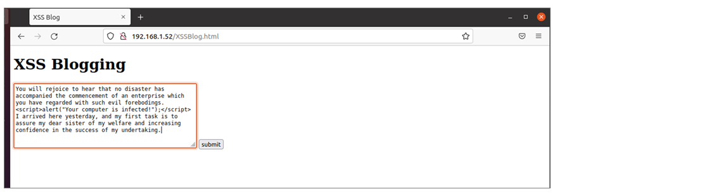
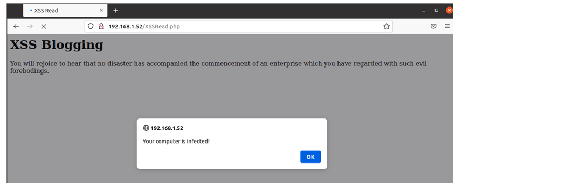
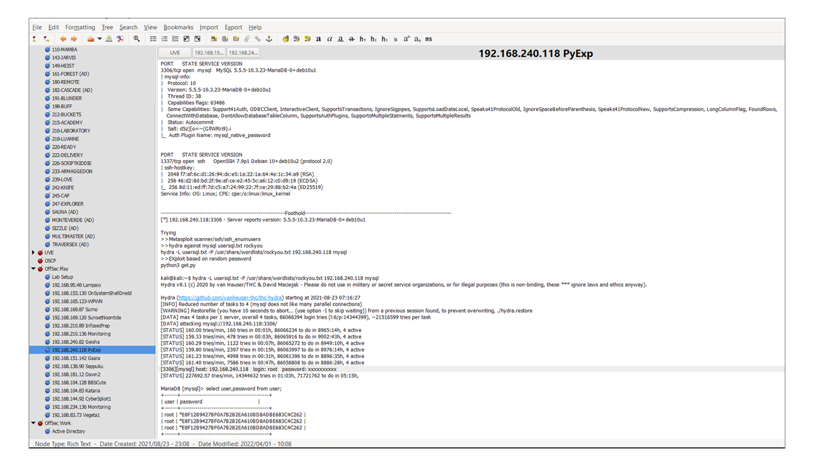
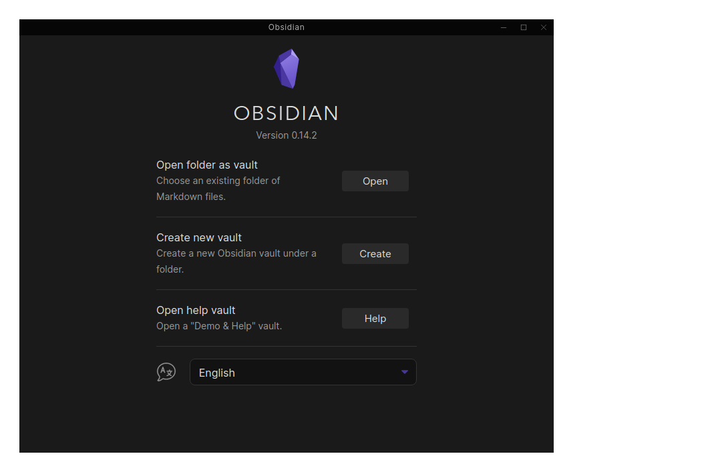
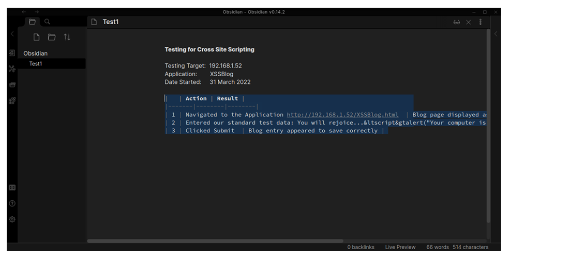
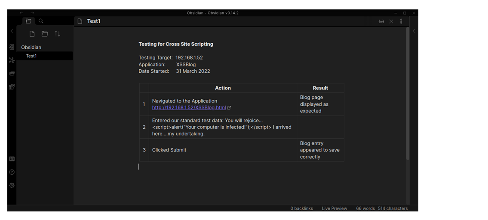
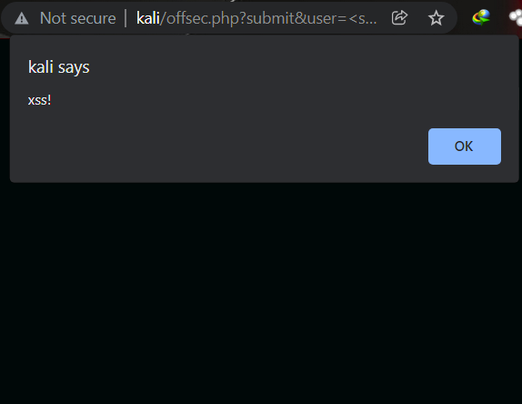
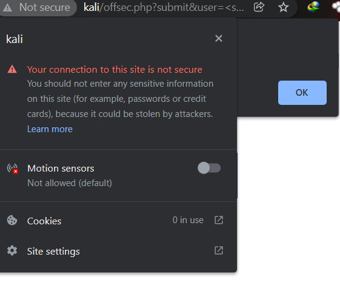
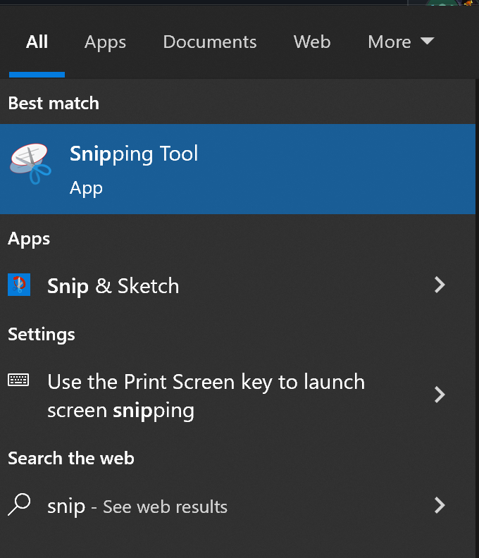

# 5. Report Writing for Penetration Testers

Các Đơn vị học tập trong Mô-đun học tập này:

- Hiểu về Ghi chú

- Viết Báo cáo Kiểm tra thâm nhập kỹ thuật hiệu quả

Mô-đun này được thiết kế để giúp hiểu cách cung cấp báo cáo hiệu quả cho khách hàng.

## 5.1. Understanding Note-Taking

Trong Đơn vị học tập này sẽ đề cập đến các Mục tiêu học tập sau:

- Xem lại các mục tiêu cung cấp cho các hoạt động kiểm thử thâm nhập

- Hiểu được tầm quan trọng tính di động của ghi chú

- Xác định cấu trúc chung của tài liệu kiểm thử thâm nhập

- Chọn đúng công cụ ghi chú

- Hiểu được tầm quan trọng của việc chụp màn hình

- Sử dụng các công cụ để chụp màn hình

### 5.1.1. Penetration Testing Deliverables

Bài kiểm tra thâm nhập hoặc bài tập red team rất khó để lập kịch bản trước. Điều này là do  không thể dự đoán chính xác loại máy hoặc mạng nào mà khách hàng muốn được kiểm tra.

```
Mặc dù kết quả đánh giá thường không thể đoán trước, nhưng khuyến nghị nên xác định phạm vi chi tiết trong các cuộc họp sơ bộ với khách hàng. Quy trình này đặc biệt hữu ích khi ưu tiên các mục tiêu quan trọng của doanh nghiệp trong các mạng lớn.
```

Trong khi kế hoạch thực hiện chung cho một cuộc kiểm tra thâm nhập thường tuân theo một mô hình cụ thể, thì hầu hết các cuộc kiểm tra thâm nhập có xu hướng tuân theo câu châm ngôn "không có kế hoạch nào tồn tại sau lần tiếp xúc đầu tiên với kẻ thù". Điều này có nghĩa là bất kỳ hoạt động cụ thể nào có thể mong đợi thực hiện trong quá trình giao tranh có thể không thực sự xảy ra, vì thực tế của môi trường thử nghiệm gần như chắc chắn khác với những ý tưởng và giả thuyết ban đầu. Do đó, rất khó để báo cáo về các cuộc kiểm tra thâm nhập bằng các biểu mẫu được điền sẵn. Điều này đặc biệt đúng khi thử nghiệm được thực hiện mà không có nhiều thảo luận trước với khách hàng, ví dụ, nếu khách hàng muốn gây bất ngờ cho nhóm phòng thủ của họ theo một cách nào đó.

Do đó, thay vì chuẩn bị báo cáo trước, cuộc kiểm tra thâm nhập được thực hiện và ghi chú trong quá trình tiến hành để đảm bảo có hồ sơ chi tiết về những gì đã thực hiện. Điều này đảm bảo rằng:

- có thể lặp lại cuộc kiểm tra thâm nhập nếu cần thiết để chứng minh rằng sự cố là có thật.

- có thể lặp lại cuộc kiểm tra thâm nhập sau khi khắc phục để xác nhận rằng sự cố đã được khắc phục.

- nếu có lỗi hệ thống trong thời gian thử nghiệm thâm nhập, khách hàng và người thử nghiệm có thể xác định xem thử nghiệm có phải là nguyên nhân gây ra lỗi hay không.

Trong quá trình thử nghiệm thâm nhập, một số hoạt động có thể không được phép. Phải rất rõ ràng về Quy tắc giao chiến (RoE) mà theo đó thử nghiệm được thực hiện. Khi tiến hành thử nghiệm red team, một người thường được giao vai trò "trọng tài" để đảm bảo rằng các quy tắc giao chiến được tuân thủ. Có thể có những hạn chế được áp dụng đối với thử nghiệm như không thực hiện các cuộc tấn công từ chối dịch vụ hoặc không sử dụng social engineering. Hơn nữa, công việc thử nghiệm có thể là để đáp ứng các yêu cầu tuân thủ quy định của khách hàng và có thể cần tuân theo một phương pháp cụ thể như Tiêu chuẩn thực hiện thử nghiệm thâm nhập OWASP. Bất kỳ hạn chế nào như vậy đều cần phải rất rõ ràng ngay từ đầu.

### 5.1.2. Note Portability

Tính di động của ghi chú kiểm tra thâm nhập có nghĩa là có thể chuyển những ghi chú đó cho người khác. Viết ghi chú ngắn gọn và mạch lạc là một phần không thể thiếu của việc ghi chú thành công và cho phép mọi người có thể sử dụng ghi chú. Ngoài ra, ghi chú ngắn gọn có thể nhanh chóng được điều chỉnh để báo cáo kỹ thuật.

Nhu cầu về tính di động đặc biệt được nhấn mạnh khi một người kiểm tra thâm nhập phải rời khỏi một nhiệm vụ vì bị ốm, bệnh tật hoặc các vấn đề khác. Việc có sự hiểu biết chung về cách ghi chú đặc biệt quan trọng đối với các nhóm kiểm tra thâm nhập lớn, nơi các cá nhân cần có khả năng hiểu chi tiết về các nhiệm vụ của các thành viên khác trong nhóm theo ý muốn.

### 5.1.3. The General Structure of Penetration Testing Notes

Cần áp dụng phương pháp ghi chép có cấu trúc vừa ngắn gọn vừa chính xác. Có vô số cách để có thể sắp xếp ghi chú và sẽ vô ích nếu cố gắng đưa ra một bộ khuyến nghị phù hợp với tất cả mọi người. Tuy nhiên, sau đây là một số nguyên tắc thường hữu ích để cân nhắc:

- Thay vì ghi chép chung chung với giả định rằng có thể nhớ cách thực hiện một số hành động nhất định vào lần tới, nên ghi lại chính xác những gì đã làm.

- Điều này có nghĩa là mọi lệnh được nhập, mọi dòng mã được sửa đổi và thậm chí bất kỳ nơi nào được click vào trong GUI đều phải được ghi lại để có thể tái tạo các hành động.

- Ngay cả khi đã ghi chép nhiều ghi chú, nếu việc xem lại chúng sau đó không giúp nhớ chính xác những gì đã xảy ra trong quá trình đánh giá, thì chúng sẽ không thực sự hữu ích.

- Các ghi chú cần được cấu trúc và đủ chi tiết để loại bỏ mọi sự mơ hồ.

- Để viết một báo cáo kỹ thuật thuyết phục và có căn cứ sau này, cần cung cấp đủ thông tin chi tiết kỹ thuật trong các ghi chú.

- Nếu các ghi chú không được viết một cách mạch lạc, người khác sẽ khó có thể làm lại bài kiểm tra và đạt được kết quả tương tự.

Cấu trúc được đề xuất ở đây để ghi chú đủ trừu tượng để cho phép sở thích cá nhân. Theo nguyên tắc chung, nên viết ghi chú nhắc nhở về những gì đã xảy ra và cho phép sao chép các vấn đề đã xác định. Cấu trúc ghi chú bắt đầu rộng và đi sâu vào từng phần là phương pháp ghi chú dễ dàng và có thể mở rộng. Phương pháp tiếp cận từ trên xuống hướng dẫn bắt đầu với hoạt động rộng nhất, sau đó thu hẹp trọng tâm và mở rộng mức độ chi tiết cho đến khi có mọi thứ cần thiết để sao chép chính xác những gì đã xảy ra.

Bây giờ hãy xem một ví dụ về các ghi chú được ghi cho lỗ hổng web được phát hiện ra:

Hãy đi sâu hơn và xem xét ví dụ về việc kiểm tra lỗ hổng Cross-Site Scripting (XSS). Mục tiêu được kiểm tra có một trang web có tên là XSSBlog.html. Khi điều hướng đến trang web đó, có thể nhập một mục nhập blog.



Khi đọc lại bài đăng trên blog, nhận được alert sau:



Trong quá trình thực hiện những yêu cầu này, sẽ ghi lại các hành động như được hiển thị bên dưới.

```
Testing for Cross-Site Scripting 

Testing Target: 192.168.1.52 
Application:    XSSBlog
Date Started:   31 March 2022

1.  Navigated to the application
    http://192.168.1.52/XSSBlog.html
    Result: Blog page displayed as expected
    
2.  Entered our standard XSS test data: 
    You will rejoice to hear that no disaster has accompanied the
    commencement of an enterprise which you have regarded with such
    evil forebodings.<script>alert("Your computer is infected!");</script> 
    I arrived here yesterday, and my first task is to assure my dear
    sister of my welfare and increasing confidence in the success of
    my undertaking. 

3.  Clicked Submit to post the blog entry.
    Result: Blog entry appeared to save correctly.

4.  Navigated to read the blog post
    http://192.168.1.52/XSSRead.php
    Result: The blog started to display and then the expected alert popped up.

5.  Test indicated the site is vulnerable to XSS.

PoC payload: <script>alert(‘Your computer is infected!')</script>
```

Bây giờ có một cách đơn giản, nhanh chóng và có thể mở rộng để ghi chú mạch lạc và toàn diện mà một người kiểm tra khác có thể làm theo. Cần nhắc lại rằng các ghi chú không phải là bản báo cáo sẽ gửi cho khách hàng, nhưng chúng sẽ vô cùng có giá trị khi cố gắng tổng hợp báo cáo sau này.

### 5.1.4. Choosing the Right Note-Taking Tool

Hiện nay có rất nhiều công cụ ghi chú miễn phí và trả phí. Để quyết định công cụ phù hợp cho một hoạt động cụ thể, điều quan trọng là phải hiểu một số yêu cầu. Trong nhiều trường hợp, muốn giữ mọi thông tin cục bộ trên máy tính thay vì tải lên bất kỳ nơi nào khác, vì vậy một số công cụ nhất định không được sử dụng. Tương tự như vậy, nếu hoạt động có nhiều mã nguồn thì một công cụ không cho phép chèn khối mã sẽ không phù hợp.

Mặc dù không thể liệt kê hết danh sách đầy đủ các thuộc tính mong muốn cần ghi nhớ, nhưng một số mục quan trọng hơn cần nhớ là:

- Ảnh chụp màn hình: Nếu cần nhiều ảnh chụp màn hình, hãy cân nhắc đến một công cụ cho phép chèn ảnh chụp màn hình trực tuyến.

- Khối mã: Khối mã cần được định dạng để có thể hiểu đúng và nhanh chóng.

- Tính di động: Một thứ gì đó có thể sử dụng trên nhiều hệ điều hành hoặc dễ dàng chuyển sang nơi khác nên được ưu tiên hàng đầu.

- Cấu trúc thư mục: Trong hoạt động có nhiều miền hoặc ứng dụng, việc duy trì cấu trúc mạch lạc là điều cần thiết. Trong khi việc thiết lập cấu trúc theo cách thủ công là được phép, một công cụ có thể thực hiện việc này tự động sẽ giúp mọi việc trở nên dễ dàng hơn.

Bây giờ đã có cơ sở tốt về các yêu cầu, hãy xem xét việc sử dụng một số công cụ ghi chú cụ thể.

Sublime là một trình soạn thảo văn bản khá chuẩn, bổ sung nhiều tính năng và chức năng hữu ích. Một trong những tính năng quan trọng nhất mà nó cung cấp là tô sáng cú pháp linh hoạt. Tô sáng cú pháp cho phép đặt các khối mã vào một tệp và các khối mã đó sẽ được tô sáng theo các quy tắc cú pháp cụ thể của ngôn ngữ lập trình. Tuy nhiên, điều này thường đi kèm với những hạn chế. Không thể tô sáng hai ngôn ngữ bằng một tệp. Trong quá trình tương tác với một loại mã duy nhất, đây không phải là vấn đề, nhưng đối với những người khác, có thể thích sử dụng các tùy chọn khác nhau. Ngoài ra, hiện tại không thể nhúng ảnh chụp màn hình vào dòng tại thời điểm viết bài.

Một công cụ khác mà chúng ta có thể cân nhắc là CherryTree. Công cụ này là công cụ tiêu chuẩn trong Kali. Nó chứa nhiều tính năng cần thiết để ghi chú. Nó sử dụng cơ sở dữ liệu SQLite để lưu trữ các ghi chú được ghi lại và những ghi chú này có thể được xuất dưới dạng HTML, PDF, văn bản thuần túy hoặc dưới dạng tài liệu CherryTree. CherryTree đi kèm với nhiều định dạng tích hợp sẵn và cung cấp cấu trúc cây để lưu trữ tài liệu, được gọi là "nút" và "nút phụ".

Dưới đây là ví dụ về CherryTree được sử dụng để lưu trữ ghi chú kiểm tra thâm nhập bằng cấu trúc cây khá đơn giản.



Công cụ cuối cùng sẽ xem xét là trình chỉnh sửa markdown Obsidian, chứa tất cả các tính năng cần để ghi chú. Có thể cài đặt Obsidian dưới dạng ứng dụng snap hoặc trong biểu mẫu ứng dụng Flatpak của nó. Nó cũng có dạng AppImage, nghĩa là tất cả những gì cần làm là sao chép nó vào hệ thống, đánh dấu nó là có thể thực thi và chạy nó.

```
kali@kali:~$ wget https://github.com/obsidianmd/obsidian-releases/releases/download/v0.14.2/Obsidian-0.14.2.AppImage
....
2022-03-31 15:38:53 (1.28 MB/s) - 'Obsidian-0.14.2.AppImage' saved [113102744/113102744]
kali@kali:~$ chmod +x Obsidian-0.14.2.AppImage
kali@kali:~$ ./Obsidian-0.14.2.AppImage
```

Khi thực thi AppImage, sẽ nhận được màn hình chào mừng cho phép mở kho lưu trữ Obsidian hoặc tạo kho lưu trữ mới.



Obsidian lưu trữ thông tin trong Vault, là một thư mục trên hệ thống. Có thể tạo cả tệp và thư mục markdown trong Vault. Các tính năng của Obsidian bao gồm bản xem trước trực tiếp văn bản markdown, vị trí hình ảnh trong dòng, khối mã và nhiều tiện ích bổ sung như tiện ích mở rộng CSS do cộng đồng xây dựng.

Ví dụ về cách nhập trực tiếp ghi chú trong markdown được hiển thị bên dưới:



Sau đó, nó có thể được xem trước trực tiếp bởi Obsidian.



Có thể di chuyển kho lưu trữ Obsidian sang máy tính khác và mở từ menu Welcome. Các tệp Markdown có thể dễ dàng được thả vào thư mục Vault, Obsidian sẽ tự động nhận dạng các tệp này.

Việc sử dụng Markdown có nghĩa là có thể cung cấp cú pháp và định dạng dễ dàng sao chép vào hầu hết các công cụ tạo báo cáo và có thể tạo PDF trực tiếp từ chính Obsidian.

Việc lựa chọn công cụ là sở thích cá nhân và tùy theo tình huống. Một số công cụ tốt hơn trong một số trường hợp nhất định so với những công cụ khác, nhưng không có công cụ hoàn hảo. Nên dành thời gian và dùng thử các công cụ đã đề cập, đọc tài liệu, làm quen với chúng và sau đó quyết định công cụ nào phù hợp. Một số công cụ bổ sung có thể được tìm thấy trong phần tham chiếu trên trang web của nil0x42.

### 5.1.5. Taking Screenshots

Ảnh chụp màn hình là một phần quan trọng của việc ghi chú và báo cáo kỹ thuật. Một ảnh chụp màn hình tốt có thể giải thích vấn đề đang được thảo luận một cách nhanh chóng và chi tiết hơn so với mô tả bằng văn bản. Ảnh chụp màn hình đặc biệt hữu ích để giúp trình bày phần phức tạp về mặt kỹ thuật hoặc nhiều chi tiết của báo cáo. Như câu nói, một hình ảnh có giá trị bằng 1000 từ. Ngược lại, một ảnh chụp màn hình tệ có thể làm lu mờ và khiến sự chú ý không chú ý đến vấn đề.

Ảnh chụp màn hình là một cách quan trọng để truyền đạt tác động trực quan của một phát hiện và có thể hiệu quả hơn nhiều so với văn bản đơn thuần. Ví dụ, việc hiển thị ảnh chụp màn hình hộp cảnh báo bật lên từ payload XSS hiệu quả hơn là mô tả bằng lời. Tuy nhiên, việc sử dụng ảnh chụp màn hình để mô tả chính xác những gì đang xảy ra khi sử dụng thứ gì đó như payload buffer overflow sẽ khó khăn hơn. Giống như muốn sử dụng đúng công cụ để thực hiện một số cuộc tấn công nhất định, cũng muốn sử dụng đúng công cụ để hiển thị một số kết quả nhất định (chẳng hạn như văn bản so với hình ảnh).

Có thể sử dụng ảnh chụp màn hình để bổ sung cho ghi chú hoặc đưa chúng vào báo cáo để minh họa các bước đã thực hiện, điều này sẽ giúp người kiểm tra khác tái tạo các sự cố. Tuy nhiên, cần phải lưu ý đến đối tượng. Trong khi người kiểm tra thâm nhập có thể coi cửa sổ cảnh báo là minh họa XSS hoàn toàn tự giải thích, thì các nhà phát triển không quen thuộc với lỗ hổng này có thể không hiểu nguyên nhân hoặc tác động thực sự của nó. Thực hành tốt là luôn hỗ trợ ảnh chụp màn hình bằng văn bản.

Ảnh chụp màn hình có một mục tiêu cụ thể, đó là truyền đạt thông tin cần nhiều câu để mô tả hoặc tạo ra tác động. Với điều này, ảnh chụp màn hình phải chứa đủ thông tin chính xác để biện minh cho việc không sử dụng văn bản, nhưng không nên có quá nhiều thông tin khiến ảnh chụp màn hình trở nên khó hiểu.

Quay lại ví dụ nêu trên trong phần ghi chú, đã tìm thấy XSS phản ánh trong trường tên người dùng của thông tin đăng nhập ứng dụng. Sẽ giải thích rõ ràng về tác động của XSS trong báo cáo thực tế. Tuy nhiên, tác động của XSS dễ thể hiện hơn nhiều so với việc giải thích mà không có tài liệu tham khảo trực quan làm cơ sở. Phải đưa vào bằng chứng về việc thực thi JavaScript tùy ý, cũng như các thành phần trực quan của trang web (tức là URL trong cửa sổ trình duyệt). Nếu cần, các bước thứ cấp hoặc dẫn đến cũng có thể được chụp lại.

Ảnh chụp màn hình được xây dựng tốt sẽ dễ phân tích trực quan. Người đọc có thể hiểu trực quan hình ảnh và chú thích mà không có bất kỳ câu hỏi nào. Nếu cần nhiều ngữ cảnh xung quanh hơn, có thể thêm vào đoạn văn ở trên hoặc dưới hình ảnh, nhưng bản thân hình ảnh phải được hiểu.

Một lần nữa, sử dụng ví dụ về XSS trong biểu mẫu đăng nhập, sẽ đưa các thành phần sau vào ảnh chụp màn hình, thay đổi kích thước cửa sổ nếu cần. Lý tưởng nhất là sẽ đưa vào URL cũng như một số thương hiệu và logo cụ thể của công ty trên biểu mẫu. Điều này cho phép họ biết trang web chính xác và liên kết lỗ hổng với hình ảnh công ty của họ.

Cửa sổ bật lên thực tế được thực hiện trong bằng chứng khái niệm cũng cần thiết, thay thế cho bất kỳ payload nâng cao nào khi bằng chứng khái niệm được đưa ra dần dần. Cuối cùng, muốn đảm bảo rằng tất cả đều dễ đọc. Ảnh chụp màn hình cần phải phóng to để xem đúng cách sẽ làm gián đoạn dòng chảy của người đọc. Ảnh chụp màn hình tốt sẽ dễ đọc ngay lập tức, như minh họa bên dưới.



Có một số lỗi sai nên tránh khi sử dụng ảnh chụp màn hình. Đã thảo luận về việc đảm bảo ảnh chụp màn hình dễ đọc. Cũng phải đảm bảo không có nhiều hơn một khái niệm được minh họa trong mỗi ảnh chụp màn hình. Một ảnh chụp màn hình chứa hai thông tin có liên quan không giúp dễ hiểu ngay khi nhìn thoáng qua. Cũng phải đảm bảo tác động được đóng khung đúng cách trong ảnh chụp màn hình. Việc đặt mục tiêu của ảnh chụp màn hình lệch tâm ở bên cạnh cũng làm lu mờ ý định. Cuối cùng, chú thích cho ảnh chụp màn hình không nên quá dài.



Ảnh chụp màn hình ở trên che thông tin quan trọng bằng một phần thông tin không liên quan, khiến người đọc không hiểu được toàn bộ tác động của ảnh chụp màn hình.

Tóm lại, một ảnh chụp màn hình tốt có các đặc điểm sau:

- có thể đọc được

- có một số dấu hiệu trực quan cho thấy nó áp dụng cho khách hàng

- có chứa tài liệu đang được mô tả

- hỗ trợ mô tả về tài liệu

- đóng khung đúng tài liệu đang được mô tả

Mặt khác, một ảnh chụp màn hình tệ là ảnh:

- không thể đọc được

- chung chung hơn là dành riêng cho khách hàng

- có chứa thông tin bị che khuất hoặc không liên quan

- đóng khung không đúng cách

Bên dưới ảnh chụp màn hình, đưa vào chú thích. Chú thích không nhằm mục đích cung cấp thêm ngữ cảnh cho hình ảnh. Chú thích có mục đích mô tả hình ảnh trong một vài từ. Bất kỳ ngữ cảnh bổ sung nào cần thiết đều có thể được cung cấp trong một đoạn văn riêng. Trong hầu hết các trường hợp, tám đến mười từ là mức tối đa phù hợp cho một chú thích.

### 5.1.6. Tools to Take Screenshots

Có thể chụp ảnh màn hình bằng các chức năng của hệ điều hành gốc. Windows, Linux và macOS đều cung cấp các công cụ để chụp ảnh màn hình. Cũng có thể sử dụng các công cụ chuyên dụng.

Đối với Windows, phím PrintScreen cho phép chụp một bản sao toàn màn hình và Alt/PrtSc chụp ảnh màn hình của cửa sổ đang hoạt động. Sau đó, có thể dán ảnh này vào tài liệu Paint, Word hoặc PowerPoint và chỉnh sửa theo yêu cầu. Thường muốn cắt ảnh để loại bỏ bất kỳ phần không mong muốn nào và có thể thực hiện điều đó trong các ứng dụng này.

Cũng có thể gọi Windows Snipping Tool bằng cách nhấn phím Windows cùng với Shift/S.



Công cụ Snipping cho phép đánh dấu và chụp ảnh màn hình bất kỳ vùng nào trên màn hình được chọn.

MacOS cung cấp khả năng chụp ảnh màn hình bằng cách sử dụng tổ hợp phím Shift/Command với các phím số 3, 4 hoặc 5. Để chọn và lưu toàn bộ màn hình, có thể sử dụng F+B+3. Để đánh dấu và chọn một vùng cụ thể trên màn hình, chỉ cần sử dụng F+B+4 hoặc F+B+5.

Có thể chụp ảnh màn hình trong Linux bằng phím PrintScreen. Phím này sẽ chụp và lưu toàn bộ màn hình vào thư mục Images/ của người dùng. B+PrintScreen sẽ cho phép đánh dấu và chọn vùng. Trong Kali Linux, cũng có thể sử dụng công cụ Screenshot được cài đặt theo mặc định và đi kèm với nhiều tùy chọn như chọn cửa sổ đang hoạt động, chọn vùng, thêm độ trễ trước khi chụp ảnh màn hình thực tế, v.v.

Flameshot là một công cụ chụp màn hình mã nguồn mở, không phụ thuộc vào hệ điều hành, có nhiều tính năng. Phần mềm này có cả giao diện dòng lệnh và GUI và tích hợp các công cụ vẽ để thêm điểm nhấn, điểm ảnh, văn bản và các sửa đổi khác vào hình ảnh đã chụp.

## 5.2. Writing Effective Technical Penetration Testing Reports

Trong Đơn vị học tập này, sẽ đề cập đến các Mục tiêu học tập sau:

- Xác định mục đích của báo cáo kỹ thuật

- Hiểu cách điều chỉnh nội dung cụ thể

- Xây dựng Tóm tắt tổng kết

- Giải trình cho các cân nhắc cụ thể về môi trường thử nghiệm

- Tạo tóm tắt kỹ thuật

- Mô tả các phát hiện và khuyến nghị kỹ thuật

- Nhận biết khi nào nên sử dụng phụ lục, tài nguyên và tài liệu tham khảo

### 5.2.1. Purpose of a Technical Report

Là nhà cung cấp dịch vụ kiểm tra thâm nhập sẽ muốn cung cấp cho khách hàng nhiều giá trị nhất có thể. Báo cáo là cơ chế cung cấp giá trị và là hiện vật chính cho phép khách hàng thực hiện hành động tiếp theo. Khả năng tìm ra hai mươi lỗ hổng trong ứng dụng web sẽ không tạo ra tác động kinh doanh nếu không thể cung cấp bản trình bày về cả lỗ hổng và các khuyến nghị về biện pháp khắc phục tiềm năng. Nếu không có định hướng rõ ràng, khách hàng sẽ không nhận được giá trị đầy đủ cho thời gian và tiền bạc của họ.

Để chuẩn bị báo cáo đúng cách cho khách hàng, phải hiểu hai điều:

- Mục đích của báo cáo.

- Làm thế nào chúng tôi có thể cung cấp thông tin đã thu thập theo cách mà đối tượng có thể hiểu được.

Khi khách hàng trả tiền cho một hợp đồng thử nghiệm xâm nhập, người ta thường (hiểu nhầm) rằng họ "chỉ" trả tiền cho một hacker đạo đức để tấn công hợp pháp vào cơ sở hạ tầng của họ nhằm tìm và khai thác điểm yếu. Mặc dù về mặt kỹ thuật, điều đó có thể cần thiết để mang lại kết quả mong muốn, nhưng đó không phải là mục đích cơ bản của hợp đồng. Thậm chí có một số trường hợp khách hàng không muốn cơ sở hạ tầng của họ bị tấn công!

Vậy, mục đích của một công ty thuê một chuyên gia thử nghiệm xâm nhập là gì? Mục tiêu cuối cùng là để khách hàng được trình bày một lộ trình tiến về phía trước, phác thảo và nêu bật tất cả các lỗi hiện có trong hệ thống của họ trong phạm vi hợp đồng, cách khắc phục các lỗi đó ngay lập tức và các mục tiêu chiến lược sẽ ngăn chặn các lỗ hổng đó xuất hiện trong tương lai. Đầu ra này thường được cung cấp dưới dạng báo cáo thử nghiệm xâm nhập. Đối với khách hàng, báo cáo (thường) là sản phẩm duy nhất thực sự quan trọng của hợp đồng.

Có thể tự hỏi làm thế nào báo cáo về các phần hợp đồng mà chưa tìm thấy bất kỳ lỗ hổng nào. Trong nhiều trường hợp không tìm thấy lỗ hổng, nên tránh đưa quá nhiều chi tiết kỹ thuật về những gì đã làm vào báo cáo. Một tuyên bố đơn giản rằng không tìm thấy lỗ hổng nào thường là đủ. Nên đảm bảo rằng không làm khách hàng nhầm lẫn với các chi tiết kỹ thuật về những nỗ lực, vì điều này sẽ làm giảm giá trị của các vấn đề thực sự tìm thấy. Nhiệm vụ của người kiểm tra là trình bày thông tin đó theo cách dễ hiểu và dễ hành động. Tuy nhiên, một số khách hàng có thể thích các báo cáo kỹ thuật dài dòng và sâu sắc ngay cả về những vấn đề không phải là vấn đề, điều này dẫn đến một cân nhắc khác: đối tượng.

Khách hàng nhận được báo cáo là một chuyên gia trong ngành cụ thể của họ. Họ thường (mặc dù không phải lúc nào cũng vậy) nhận thức được các mối quan ngại về bảo mật của ngành đó. Trên thực tế, điều này có nghĩa là phải hiểu sâu sắc những gì sẽ gây lo ngại cho khách hàng trong trường hợp bị tấn công. Nói cách khác, hiểu các mục tiêu và mục đích kinh doanh chính của họ. Đây là một lý do khác tại sao việc làm rõ các Quy tắc giao chiến lại quan trọng đến vậy, vì nó giúp hiểu được những mối quan tâm cốt lõi của khách hàng.

Tất cả các vấn đề phát hiện được trong quá trình thử nghiệm đều phải được ghi lại nhưng muốn nêu bật bất kỳ vấn đề nào tìm thấy có thể ảnh hưởng đến các lĩnh vực chính này. Ví dụ về các lĩnh vực quan tâm chính cụ thể của khách hàng có thể bao gồm HIPAA, đây là khuôn khổ quản lý dữ liệu y tế tại Hoa Kỳ và PCI, đây là khuôn khổ quản lý thẻ tín dụng và xử lý thanh toán.

Hãy xem xét tình huống sau. Giả sử rằng Khách hàng A là một bệnh viện và Khách hàng B là một ngân hàng và được ký hợp đồng để thực hiện thử nghiệm trên từng cơ sở hạ tầng nội bộ của họ. Có thể đưa ra kết quả tương tự cho cả hai và mặc dù chúng có thể có cùng mức độ nghiêm trọng về mặt kỹ thuật, nhưng không nhất thiết phải ghi lại các phát hiện với cùng mức độ rủi ro và mức độ ưu tiên để khắc phục.

Vì Khách hàng A là một bệnh viện có các thiết bị y tế được kết nối với mạng của họ, nên các bác sĩ và bệnh nhân cần hành động nhanh chóng để phản hồi các cảnh báo giám sát rất có thể sẽ lo lắng về thời gian hoạt động của mạng và tính sẵn sàng của máy. Các thiết bị y tế được kết nối với mạng thường chạy trên các máy cũ có phiên bản phần mềm nhúng lỗi thời. Nhu cầu hoạt động liên tục có thể khiến các thiết bị này không được nâng cấp và vá lỗi. Trong khi báo cáo, cần làm nổi bật các lỗ hổng được tìm thấy, sau đó có thể đưa ra đề xuất cô lập các máy trên mạng con logic của riêng chúng vì không thể áp dụng bản nâng cấp hoặc bản vá kịp thời.

Mặt khác, chính kịch bản này trên mạng của Khách hàng B có thể gây ra thảm họa. Nếu máy chủ hoặc thiết bị trong ngân hàng bị thiếu bản vá, thì đó có thể là một chỗ đứng vững chắc trong mạng. Vì các hệ thống sẽ cần giao tiếp với các hệ thống khác trên mạng nên việc phân đoạn hoàn toàn có thể không khả thi. Do đó, việc thiếu bản vá là mối quan tâm lớn hơn nhiều và có thể cần được báo cáo là một vấn đề nghiêm trọng.

Khi bắt đầu ghi lại các phát hiện, cần ghi nhớ tình huống mà lỗ hổng có thể bị khai thác và tác động tiềm ẩn của nó. Đăng nhập HTTP dạng văn bản rõ trên internet được coi là cực kỳ không an toàn. Trên mạng nội bộ, mặc dù vẫn không an toàn, nhưng ít đáng lo ngại hơn vì phải thực hiện nhiều bước hơn để khai thác đúng cách. Tương tự như vậy, một bệnh viện có thể không quan tâm đến việc cổng đăng nhập hướng ra Internet của họ chấp nhận mã hóa TLS 1.0. Một trang web thương mại điện tử có thể sẽ quan tâm nhiều hơn, vì vi phạm PCI mà việc chấp nhận TLS 1.0 tạo ra.

Là người viết báo cáo, phải trình bày thông tin hữu ích, chính xác và có thể hành động cho khách hàng mà không đưa ra ý kiến cá nhân.

### 5.2.2. Tailor the Content

Phải cung cấp nội dung phù hợp với kỹ năng cho tất cả người đọc báo cáo. Nội dung này có thể được đọc bởi các giám đốc điều hành, người đứng đầu bộ phận an ninh và các thành viên kỹ thuật của nhóm an ninh. Điều này không chỉ muốn cung cấp tổng quan đơn giản về các vấn đề cho các giám đốc điều hành mà còn muốn cung cấp đủ thông tin chi tiết về kỹ thuật cho những người đọc có nhiều hiểu biết hơn về kỹ thuật.

Có thể thực hiện điều này bằng cách chia nội dung thành cấu trúc phù hợp gồm các phần và tiểu phần. Số lượng đối tượng có cho một cam kết cụ thể phụ thuộc rất nhiều vào mối quan hệ với khách hàng, quy mô, ngân sách và mức độ trưởng thành của họ. Đối với Mô-đun này, sẽ xem xét một cam kết chỉ có hai đối tượng mục tiêu. Đối tượng đầu tiên và có thể nói là quan trọng hơn, là cấp quản lý. Đây thường là cấp mà nhiều hợp đồng cam kết bên ngoài được ký kết và là nơi cần nhấn mạnh giá trị của việc đầu tư vào thử nghiệm. Tùy thuộc vào doanh nghiệp, đây có thể là các chức năng cấp C (CISO, CSO, CFO, v.v.) hoặc trưởng phòng CNTT hoặc an ninh.

Tuy nhiên, hầu hết các giám đốc điều hành và giám đốc cấp cao không nhất thiết phải có khả năng kỹ thuật để tuân theo một giải thích kỹ thuật chi tiết. Nên cung cấp cho họ một phần nêu bật kết quả và tác động của hoạt động theo cách báo cáo chính xác về các lỗ hổng được tìm thấy mà không bị quá tải với các chi tiết kỹ thuật.

Đối tượng thứ hai sẽ xem xét bao gồm các nhân viên kỹ thuật có kiến ​​thức kỹ thuật để hiểu báo cáo và triển khai các biện pháp khắc phục được nêu cho các lỗ hổng đã được xác định. Đối tượng này phải được cung cấp đủ thông tin chi tiết kỹ thuật để họ có thể hiểu được lỗi, tác động của từng phát hiện và cách khắc phục. Ngoài ra, đối tượng này sẽ được hưởng lợi rất nhiều khi được cung cấp lời khuyên về cách ngăn ngừa các loại sự cố tương tự xảy ra trong tương lai.

### 5.2.3. Executive Summary

Phần đầu tiên của báo cáo phải là Tóm tắt điều hành. Phần này cho phép ban quản lý cấp cao hiểu được phạm vi và kết quả của thử nghiệm ở mức đủ để hiểu được giá trị của thử nghiệm và phê duyệt biện pháp khắc phục. Bắt đầu bằng các thông tin ngắn gọn cung cấp bức tranh toàn cảnh và tiếp theo là Tóm tắt điều hành đầy đủ.

Tóm tắt điều hành phải bắt đầu bằng cách phác thảo phạm vi của hoạt động. Việc thống nhất phạm vi rõ ràng trước khi thử nghiệm sẽ xác định ranh giới của những gì sẽ được đề cập. Sau đó, muốn nêu rõ chính xác những gì đã được thử nghiệm và liệu có bất kỳ điều gì bị loại khỏi phạm vi hay không. Các vấn đề về thời gian, chẳng hạn như thời gian thử nghiệm không đủ do phát hiện quá nhiều lỗ hổng để báo cáo đầy đủ, phải được đưa vào để đảm bảo rằng tuyên bố phạm vi cho bất kỳ thử nghiệm tiếp theo nào là phù hợp. Việc đưa tuyên bố phạm vi vào báo cáo sẽ bảo vệ người kiểm tra xâm nhập khỏi mọi gợi ý về việc không hoàn thành thử nghiệm bắt buộc. Nó cũng cung cấp cho khách hàng một mô hình chính xác hơn về những gì thực tế với ngân sách và hạn chế về thời gian đã được thiết lập ban đầu.

Thứ hai, đưa vào khung thời gian của thử nghiệm. Điều này bao gồm thời gian dành cho việc thử nghiệm, ngày tháng và có khả năng là cả giờ thử nghiệm nữa.

Thứ ba, nên tham khảo Quy tắc giao chiến và tham khảo báo cáo trọng tài nếu trọng tài là thành viên của nhóm thử nghiệm. Nếu thử nghiệm từ chối dịch vụ được phép hoặc kỹ thuật xã hội được khuyến khích, thì điều đó cần được ghi chú ở đây. Nếu tuân theo một phương pháp thử nghiệm cụ thể, thì cũng nên chỉ ra điều đó ở đây.

Cuối cùng, có thể bao gồm cơ sở hạ tầng và tài khoản hỗ trợ. Sử dụng ví dụ về ứng dụng web, nếu được khách hàng cung cấp tài khoản người dùng, hãy bao gồm chúng ở đây cùng với địa chỉ IP mà các cuộc tấn công xuất phát từ đó (tức là máy thử nghiệm). Cũng nên ghi chú bất kỳ tài khoản nào đã tạo để khách hàng có thể xác nhận rằng chúng đã bị xóa. Sau đây là một ví dụ về cấu trúc cấp cao này:

```
Executive Summary:

- Scope: https://kali.org/login.php
- Timeframe: Jan 3 - 5, 2022
- OWASP/PCI Testing methodology was used
- Social engineering and DoS testing were not in scope
- No testing accounts were given; testing was black box from an external IP address
- All tests were run from 192.168.1.2
```

Tiếp theo, sẽ chuẩn bị Tóm tắt điều hành dạng dài. Đây là bản tóm tắt bằng văn bản về thử nghiệm cung cấp tổng quan cấp cao về từng bước của quá trình tương tác và thiết lập mức độ nghiêm trọng, bối cảnh và "kịch bản xấu nhất" cho những phát hiện chính từ thử nghiệm. Điều quan trọng là không được hạ thấp hoặc hạ thấp các lỗ hổng. Muốn mô hình tinh thần của khách hàng về thế trận bảo mật của họ phải chính xác. Ví dụ: nếu phát hiện ra một lỗi SQL injection cho phép đánh cắp thông tin thẻ tín dụng, thì điều đó thể hiện mức độ nghiêm trọng rất khác so với khi phát hiện ra lỗi bỏ qua xác thực trên hệ thống lưu trữ dữ liệu công khai. Chắc chắn sẽ nhấn mạnh vào điều trước trong Tóm tắt điều hành, nhưng có thể không nêu bật điều sau trong phần này.

Nên ghi chú bất kỳ xu hướng nào được quan sát thấy trong quá trình thử nghiệm để đưa ra lời khuyên mang tính chiến lược. Giám đốc điều hành không cần được cung cấp đầy đủ thông tin chi tiết kỹ thuật trong phần này và nhân viên kỹ thuật sẽ có thể tìm thấy chúng vì mỗi lỗ hổng sẽ được mở rộng trong các phần sau của báo cáo. Tuy nhiên, có thể mô tả các xu hướng đã xác định và xác thực mối quan tâm bằng bản tóm tắt của một hoặc hai phát hiện quan trọng hơn có liên quan.

Để làm nổi bật các xu hướng, nhóm các phát hiện có lỗ hổng tương tự. Nhiều lỗ hổng cùng loại thường cho thấy lỗi trong lĩnh vực cụ thể đó. Ví dụ: nếu tìm thấy XSS được lưu trữ và reflected, cùng với các lỗ hổng SQLi và upload file, thì đầu vào của người dùng rõ ràng không được sanitized đúng cách trên toàn bộ hệ thống. Điều này phải được khắc phục ở cấp độ hệ thống. Phần này là nơi thích hợp để thông báo cho khách hàng về lỗi hệ thống và có thể đề xuất các thay đổi quy trình cần thiết để khắc phục. Trong ví dụ này, có thể khuyến khích khách hàng cung cấp đào tạo bảo mật phù hợp cho các nhà phát triển của họ.

Việc đề cập đến những điều mà khách hàng đã làm tốt là rất hữu ích. Điều này đặc biệt đúng vì trong khi ban quản lý có thể trả tiền cho sự tham gia, thì mối quan hệ làm việc thường là với các nhóm bảo mật kỹ thuật. Đảm bảo rằng họ không bị coi thường. Ngay cả những cuộc kiểm tra thâm nhập tìm thấy các lỗ hổng nghiêm trọng cũng có khả năng xác định một hoặc hai lĩnh vực đã được củng cố. Bao gồm những khu vực đó sẽ làm giảm tác động lên mọi người và khiến khách hàng chấp nhận báo cáo tổng thể hơn.

Tóm tắt điều hành thường có thể được chia nhỏ như sau:

Đầu tiên, bao gồm một vài câu mô tả về sự tham gia:

```
- "The Client hired OffSec to conduct a penetration test of
their kali.org web application in October of 2025. The test was conducted
from a remote IP between the hours of 9 AM and 5 PM, with no users
provided by the Client."
```

Tiếp theo, thêm một số câu nói về một số quá trình củng cố hiệu quả đã quan sát được:

```
- "The application had many forms of hardening in place. First, OffSec was unable to upload malicious files due to the strong filtering
in place. OffSec was also unable to brute force user accounts
because of the robust lockout policy in place. Finally, the strong
password policy made trivial password attacks unlikely to succeed.
This points to a commendable culture of user account protections."
```

Lưu ý ngôn ngữ ở đây. Không nói điều gì đó như "Không thể tải lên các tệp độc hại", vì không thể đưa ra tuyên bố tuyệt đối mà không có bằng chứng tuyệt đối. Được cấp một ngân sách thời gian và nguồn lực hạn chế để thực hiện cam kết và bản thân cũng có thể mắc sai lầm. Phải cẩn thận để đảm bảo ngôn ngữ, không loại trừ khả năng chỉ đơn giản là không thể tìm ra một lỗi thực sự tồn tại và vẫn chưa bị phát hiện.

Tiếp theo, giới thiệu một cuộc thảo luận về các lỗ hổng đã phát hiện:

```
- "However, there were still areas of concern within the application.
OffSec was able to inject arbitrary JavaScript into the browser of
an unwitting victim that would then be run in the context of that
victim. In conjunction with the username enumeration on the login
field, there seems to be a trend of unsanitized user input compounded
by verbose error messages being returned to the user. This can lead
to some impactful issues, such as password or session stealing. It is
recommended that all input and error messages that are returned to the
user be sanitized and made generic to prevent this class of issue from
cropping up."
```

Có thể cần một số đoạn văn thuộc loại này, tùy thuộc vào số lượng và loại lỗ hổng được tìm thấy. Sử dụng nhiều đoạn văn nhất có thể để minh họa các xu hướng, nhưng cố gắng không tạo ra các xu hướng không tồn tại.

Cuối cùng, Tóm tắt điều hành nên kết thúc bằng một bản tóm tắt về sự tham gia:

```
"These vulnerabilities and their remediations are described in more
detail below. Should any questions arise, OffSec is happy
to provide further advice and remediation help."
```

```
Xin đề cập ở đây rằng không phải tất cả các kiểm thử viên thâm nhập đều sẽ đưa ra lời khuyên khắc phục và không phải tất cả khách hàng đều mong đợi điều đó. Tuy nhiên đa số mối quan hệ hiệu quả nhất là mối quan hệ giữa khách hàng và nhà cung cấp cùng làm việc ở cấp độ đó.
```

### 5.2.4. Testing Environment Considerations

Phần đầu tiên của báo cáo đầy đủ phải nêu chi tiết mọi vấn đề ảnh hưởng đến quá trình thử nghiệm. Đây thường là một phần khá nhỏ. Đôi khi, có những sai sót hoặc tình tiết giảm nhẹ xảy ra trong quá trình thực hiện. Mặc dù những người trực tiếp tham gia đã biết về chúng, nên ghi lại chúng trong báo cáo để chứng minh tính minh bạch.

Nhiệm vụ là thông báo cho khách hàng về mọi tình huống và hạn chế ảnh hưởng đến quá trình thực hiện. Điều này được thực hiện để họ có thể cải thiện lần thử nghiệm tiếp theo và nhận được giá trị cao nhất cho số tiền họ bỏ ra. Điều quan trọng cần lưu ý là không phải mọi vấn đề đều cần được nêu bật và bất kể tình huống thử nghiệm như thế nào, cần đảm bảo báo cáo mang tính chuyên nghiệp.

Xem xét ba trạng thái tiềm ẩn liên quan đến tình tiết giảm nhẹ:

- Kết quả tích cực: "Không có hạn chế hoặc tình tiết giảm nhẹ nào trong quá trình tham gia. Thời gian được phân bổ là đủ để kiểm tra kỹ lưỡng môi trường."

- Kết quả trung lập: "Không có thông tin xác thực nào được phân bổ cho người kiểm tra trong hai ngày đầu tiên của quá trình kiểm tra. Tuy nhiên, bề mặt tấn công nhỏ hơn nhiều so với dự kiến. Do đó, điều này không ảnh hưởng đến toàn bộ quá trình kiểm tra. OffSec khuyến nghị rằng việc thông báo thông tin xác thực diễn ra ngay trước khi bắt đầu tham gia đối với các hợp đồng trong tương lai, để có thể cung cấp nhiều thử nghiệm nhất có thể trong thời gian được phân bổ."

- Kết quả tiêu cực: "Không có đủ thời gian được phân bổ cho quá trình tham gia này để tiến hành đánh giá kỹ lưỡng ứng dụng và phạm vi trở nên lớn hơn nhiều so với dự kiến. Nên phân bổ nhiều thời gian hơn cho các quá trình tham gia trong tương lai để cung cấp phạm vi bao phủ toàn diện hơn."

Những cân nhắc nêu ra trong phần này sẽ cho phép học hỏi từ những sai lầm hoặc thành công trong bài kiểm tra này và áp dụng chúng vào những lần thực hiện sau.

### 5.2.5. Technical Summary

Phần tiếp theo sẽ là danh sách tất cả các phát hiện chính trong báo cáo, được viết ra kèm theo bản tóm tắt và khuyến nghị cho một người có chuyên môn, như kiến ​​trúc sư bảo mật, để biết ngay những gì cần phải làm.

Phần này sẽ nhóm các phát hiện thành các lĩnh vực chung. Ví dụ: tất cả các sự cố mật khẩu tài khoản yếu đã được xác định sẽ được nhóm lại, bất kể mốc thời gian thử nghiệm. Một ví dụ về cấu trúc của phần này có thể là:

- Quản lý người dùng và đặc quyền

- Kiến trúc

- Ủy quyền

- Quản lý bản vá

- Tính toàn vẹn và chữ ký

- Xác thực

- Kiểm soát truy cập

- Kiểm toán, quản lý nhật ký và giám sát

- Mã hóa lưu lượng và dữ liệu

- Cấu hình bảo mật không đúng

Ví dụ về bản tóm tắt kỹ thuật cho Quản lý bản vá như sau:

```
4. Patch Management

Windows and Ubuntu operating systems that are not up to date were
identified. These are shown to be vulnerable to publicly-available
exploits and could result in malicious execution of code, theft
of sensitive information, or cause denial of services which may
impact the infrastructure. Using outdated applications increases the
possibility of an intruder gaining unauthorized access by exploiting
known vulnerabilities. Patch management ought to be improved and
updates should be applied in conjunction with change management.
```

Phần này nên kết thúc bằng một bản đồ nhiệt rủi ro dựa trên mức độ nghiêm trọng của lỗ hổng được điều chỉnh cho phù hợp với bối cảnh của khách hàng và theo thỏa thuận với đại diện rủi ro bảo mật của khách hàng nếu có thể.

### 5.2.6. Technical Findings and Recommendation

Phần Phát hiện kỹ thuật và khắc phục là nơi đưa vào các chi tiết kỹ thuật đầy đủ liên quan đến bài kiểm tra thâm nhập và những gì được coi là các bước thích hợp cần thiết để giải quyết các phát hiện. Mặc dù đây là phần kỹ thuật, nhưng không nên cho rằng đối tượng là những người kiểm tra thâm nhập.

Không phải ai, ngay cả những người làm việc trong các công nghệ đang được thử nghiệm, cũng sẽ hiểu đầy đủ các sắc thái của lỗ hổng. Mặc dù không phải lúc nào cũng cần phải tìm hiểu sâu về nguyên nhân gốc rễ của một cuộc khai thác, nhưng thường nên cung cấp tổng quan chung về cách thức diễn ra của cuộc khai thác. Tốt hơn là nên cho rằng đối tượng có ít kiến ​​thức nền tảng hơn và cung cấp quá nhiều thông tin, thay vì ngược lại.

Phần này thường được trình bày dưới dạng bảng và cung cấp đầy đủ thông tin chi tiết về các phát hiện. Một phát hiện có thể bao gồm một lỗ hổng đã được xác định hoặc có thể bao gồm nhiều lỗ hổng cùng loại.

Điều quan trọng cần lưu ý là có thể cần có phần tường thuật về cuộc tấn công. Phần tường thuật này mô tả, theo định dạng câu chuyện, chính xác những gì đã xảy ra trong quá trình thử nghiệm. Điều này thường được thực hiện cho một cuộc giao tranh đe dọa được mô phỏng, nhưng đôi khi cũng hữu ích để mô tả các bước khai thác phức tạp hơn cần thiết cho một cuộc kiểm tra thâm nhập thông thường. Nếu cần thiết, thì việc viết ra lộ trình tấn công từng bước, với ảnh chụp màn hình phù hợp, thường là đủ. Một bản tường thuật mở rộng có thể được đưa vào Phụ lục và tham chiếu từ bảng phát hiện.

### 5.2.7. Appendices, Further Information, and References

Phần cuối cùng của báo cáo là phần Phụ lục. Những nội dung nằm ở đây thường không phù hợp với bất kỳ phần nào khác trong báo cáo hoặc quá dài hoặc quá chi tiết để đưa vào trực tuyến. Nội dung này bao gồm danh sách dài những người dùng bị xâm phạm hoặc các khu vực bị ảnh hưởng, các khối mã bằng chứng khái niệm lớn, phương pháp luận mở rộng hoặc bài viết kỹ thuật, v.v. Một nguyên tắc tốt cần tuân theo là nếu cần thiết cho báo cáo nhưng sẽ làm gián đoạn luồng của trang, hãy đưa nội dung đó vào phần phụ lục.

Có thể muốn đưa vào phần Thông tin bổ sung. Trong phần này sẽ đưa vào những nội dung có thể không cần thiết cho bài viết chính nhưng có thể mang lại giá trị hợp lý cho khách hàng. Ví dụ bao gồm các bài viết mô tả chi tiết hơn về lỗ hổng, các tiêu chuẩn khuyến nghị khắc phục mà khách hàng cần tuân theo và các phương pháp khai thác khác. Nếu không có nội dung nào có thể mang lại đủ giá trị, thì không nhất thiết phải đưa phần này vào.

Tài liệu tham khảo có thể là một cách hữu ích để cung cấp thêm thông tin chi tiết cho khách hàng trong các lĩnh vực không liên quan trực tiếp đến thử nghiệm đã thực hiện. Khi cung cấp tài liệu tham khảo, cần đảm bảo chỉ sử dụng các nguồn có thẩm quyền nhất và cũng phải đảm bảo trích dẫn đúng cách.

Trong Mô-đun này đã thảo luận về nhiều công cụ và phương pháp hữu ích khi viết báo cáo kiểm tra thâm nhập. Tuy nhiên, cũng giống như trong lĩnh vực kiểm tra thâm nhập, không có "một công cụ nào có thể thống trị tất cả" để viết báo cáo. Với số lượng lớn các công cụ báo cáo và ghi chú, nên thử nghiệm chúng để tìm ra công cụ phù hợp. Về lâu dài, điều này sẽ giúp việc viết báo cáo thoải mái và hiệu quả hơn.

Có nhiều khía cạnh cần ghi nhớ trong quá trình kiểm tra thâm nhập và ghi chú có thể được coi là một trong những khía cạnh quan trọng nhất. Có thể phải làm việc với hàng nghìn máy tính, người dùng, ứng dụng, v.v. và việc ghi nhớ mọi thứ khi tiến hành mà không có tài liệu là điều gần như không thể. Dành thời gian ghi chép lại từng bước một cách kỹ lưỡng sẽ giúp viết báo cáo tốt hơn vào cuối cùng. Điều này cũng sẽ giúp bài kiểm tra thâm nhập hiệu quả hơn, cho phép xem tài liệu trong quá trình thực hiện để xem những gì đã làm thay vì lặp lại các bước.

Cuối cùng, cần ghi nhớ ai sẽ đọc báo cáo. Mục tiêu là làm cho báo cáo hữu ích cho tất cả các đối tượng tiềm năng trong một tổ chức, cả kỹ thuật và không kỹ thuật. Có thể làm điều này bằng cách chia báo cáo thành nhiều phần khác nhau, sử dụng các cấp độ ngôn ngữ kỹ thuật khác nhau trong mỗi phần. Điều này sẽ đảm bảo rằng mọi người đều có ý tưởng về kết quả thực sự của bài kiểm tra thâm nhập.