# 6. Information Gathering

Mục tiêu của thử nghiệm thâm nhập (hay pentest) là phát hiện các lỗ hổng bảo mật để cải thiện khả năng phòng thủ của công ty đang được thử nghiệm. Vì mạng, thiết bị và phần mềm trong môi trường của công ty thay đổi theo thời gian nên thử nghiệm thâm nhập là một hoạt động theo chu kỳ. Bề mặt tấn công của công ty thay đổi theo định kỳ do các lỗ hổng phần mềm mới được phát hiện, lỗi cấu hình từ các hoạt động nội bộ hoặc tái cấu trúc CNTT có thể làm lộ ra các phân khúc mới để nhắm mục tiêu.

Trong Mô-đun học tập này sẽ tìm hiểu cách lập bản đồ có phương pháp cho bề mặt tấn công như vậy bằng cả phương tiện thụ động và chủ động, đồng thời hiểu cách tận dụng thông tin này trong toàn bộ vòng đời thử nghiệm thâm nhập.

## 6.1. The Penetration Testing Lifecycle

Đơn vị học tập này bao gồm các Mục tiêu học tập sau:

- Hiểu các giai đoạn của Kiểm tra thâm nhập

- Hiểu vai trò của Thu thập thông tin trong từng giai đoạn

- Hiểu sự khác biệt giữa Thu thập thông tin chủ động và thụ động

Để duy trì thế trận bảo mật của công ty được kiểm soát chặt chẽ nhất có thể, nên tiến hành kiểm tra thâm nhập theo nhịp độ thường xuyên và sau mỗi lần có sự thay đổi đáng kể trong kiến ​​trúc CNTT của mục tiêu.

Một cuộc kiểm tra thâm nhập thông thường bao gồm các giai đoạn sau:

- Xác định phạm vi

- Thu thập thông tin

- Phát hiện lỗ hổng

- Bắt đầu nắm giữ

- Tăng đặc quyền

- Chuyển động ngang

- Báo cáo/Phân tích

- Bài học kinh nghiệm/Khắc phục

Trong Mô-đun này sẽ đề cập ngắn gọn về phạm vi trước khi chuyển trọng tâm sang mục tiêu chính, Thu thập thông tin. Sẽ tìm hiểu thêm về các giai đoạn khác trong phần còn lại của khóa học.

Phạm vi của hoạt động kiểm tra thâm nhập xác định phạm vi IP, máy chủ và ứng dụng nào sẽ là đối tượng thử nghiệm trong quá trình thực hiện, so với các mục nằm ngoài phạm vi không nên thử nghiệm.

Sau khi đã thống nhất với khách hàng về phạm vi và khung thời gian của hoạt động, có thể tiến hành bước thứ hai, thu thập thông tin. Trong bước này, đặt mục tiêu thu thập càng nhiều dữ liệu về mục tiêu càng tốt.

Để bắt đầu thu thập thông tin, thường thực hiện trinh sát để thu thập thông tin chi tiết về cơ sở hạ tầng, tài sản và nhân sự của tổ chức mục tiêu. Có thể thực hiện theo cách thụ động hoặc chủ động. Trong khi kỹ thuật trước nhằm thu thập thông tin của mục tiêu mà hầu như không có tương tác trực tiếp, thì kỹ thuật sau thăm dò trực tiếp cơ sở hạ tầng. Thu thập thông tin chủ động tiết lộ dấu vết lớn hơn, vì vậy, người ta thường thích tránh bị lộ bằng cách thu thập thông tin thụ động.

Điều quan trọng cần lưu ý là việc thu thập thông tin (còn được gọi là liệt kê) không kết thúc sau khi trinh sát ban đầu. Sẽ cần tiếp tục thu thập dữ liệu khi quá trình kiểm tra xâm nhập diễn ra, xây dựng kiến ​​thức về bề mặt tấn công của mục tiêu khi phát hiện ra thông tin mới bằng cách chiếm được chỗ đứng hoặc di chuyển ngang.

Trong Mô-đun này, trước tiên sẽ tìm hiểu về trinh sát thụ động, sau đó khám phá cách tương tác chủ động với mục tiêu cho mục đích liệt kê.

## 6.2. Passive Information Gathering

Đơn vị học tập này bao gồm các Mục tiêu học tập sau:

- Hiểu hai cách tiếp cận Thu thập thông tin thụ động khác nhau

- Tìm hiểu về Tình báo nguồn mở (OSINT)

- Hiểu về thu thập thông tin thụ động của Máy chủ web và DNS

Thu thập thông tin thụ động, còn được gọi là Tình báo nguồn mở (OSINT), là quá trình thu thập thông tin công khai về mục tiêu, thường không có bất kỳ tương tác trực tiếp nào với mục tiêu đó.

Trước khi bắt đầu, cần xem xét hai trường phái tư tưởng khác nhau về những gì cấu thành nên "thụ động" trong bối cảnh này.

Theo cách hiểu chặt chẽ nhất, không bao giờ giao tiếp trực tiếp với mục tiêu. Ví dụ, có thể dựa vào bên thứ ba để biết thông tin, nhưng sẽ không truy cập vào bất kỳ hệ thống hoặc máy chủ nào của mục tiêu. Sử dụng cách tiếp cận này duy trì mức độ bí mật cao về hành động và ý định, nhưng cũng có thể cồng kềnh và có thể hạn chế kết quả.

Theo cách hiểu rộng hơn, có thể tương tác với mục tiêu, nhưng chỉ như một người dùng internet bình thường. Ví dụ, nếu trang web của mục tiêu cho phép đăng ký tài khoản, có thể làm như vậy. Tuy nhiên, sẽ không kiểm tra lỗ hổng bảo mật của trang web trong giai đoạn này.

Cả hai cách tiếp cận đều có thể hữu ích, tùy thuộc vào mục tiêu của bài kiểm tra đang tiến hành. Vì lý do này, cần xem xét phạm vi và quy tắc tham gia cho bài kiểm tra thâm nhập trước khi quyết định sử dụng cách nào.

Trong Mô-đun này, sẽ áp dụng cách giải thích sau này, ít cứng nhắc hơn cho cách tiếp cận.

Có nhiều nguồn lực và công cụ có thể sử dụng để thu thập thông tin và quy trình này mang tính tuần hoàn chứ không phải tuyến tính. Nói cách khác, "bước tiếp theo" của bất kỳ giai đoạn nào của quy trình đều phụ thuộc vào những gì tìm thấy trong các bước trước đó, tạo ra "chu kỳ" của các quy trình. Vì mỗi công cụ hoặc nguồn lực có thể tạo ra bất kỳ số lượng kết quả khác nhau nào, nên có thể khó xác định một quy trình chuẩn hóa. Mục tiêu cuối cùng của việc thu thập thông tin thụ động là thu thập thông tin làm rõ hoặc mở rộng bề mặt tấn công, giúp tiến hành chiến dịch lừa đảo thành công hoặc bổ sung cho các bước kiểm tra thâm nhập khác như đoán mật khẩu, điều này cuối cùng có thể dẫn đến xâm phạm tài khoản.

Thay vì trình bày các tình huống liên kết, sẽ chỉ đề cập đến nhiều tài nguyên và công cụ khác nhau, giải thích cách chúng hoạt động và trang bị cho bạn các kỹ thuật cơ bản cần thiết để xây dựng chiến dịch thu thập thông tin thụ động.

Trước khi bắt đầu thảo luận về tài nguyên và công cụ, hãy chia sẻ một ví dụ cá nhân về một cuộc thử nghiệm thâm nhập liên quan đến các yếu tố thành công của một chiến dịch thu thập thông tin thụ động.

Ghi chú từ tác giả

Vài năm trước, nhóm tại OffSec được giao nhiệm vụ thực hiện một cuộc thử nghiệm thâm nhập cho một công ty nhỏ. Công ty này hầu như không có sự hiện diện trên internet và rất ít dịch vụ được tiếp xúc bên ngoài, tất cả đều được chứng minh là an toàn. Thực tế là không có bề mặt tấn công nào được tìm thấy. Sau một chiến dịch thu thập thông tin thụ động tập trung tận dụng nhiều nhà điều hành tìm kiếm của Google, kết nối các bit thông tin "được chuyển" vào các công cụ trực tuyến khác và một chút suy nghĩ sáng tạo và logic, chúng tôi đã tìm thấy một bài đăng trên diễn đàn do một trong những nhân viên của mục tiêu thực hiện trong một diễn đàn sưu tập tem:

```
Hi!
I'm looking for rare stamps from the 1950's - for sale or trade.
Please contact me at david@company-address.com
Cell: 999-999-9999
```

Sử dụng thông tin này để khởi chạy một cuộc tấn công phía máy khách bán tinh vi. Nhanh chóng đăng ký một tên miền liên quan đến tem và thiết kế một trang đích hiển thị nhiều loại tem hiếm từ những năm 1950 được tìm thấy bằng Google Images. Tên miền và thiết kế của trang web chắc chắn đã làm tăng độ tin cậy được nhận thức của trang web giao dịch tem.

Tiếp theo, nhúng một số mã khai thác tấn công phía máy khách khó chịu vào các trang web của trang web và gọi cho "David" trong giờ làm việc. Trong cuộc gọi, đóng vai một nhà sưu tập tem đã thừa hưởng bộ sưu tập tem khổng lồ của Ông nội.

David vô cùng vui mừng khi nhận được cuộc gọi và đã truy cập trang web độc hại để xem xét "bộ sưu tập tem" mà không do dự. Trong khi duyệt trang web, mã khai thác đã thực thi trên máy cục bộ của anh ấy và gửi một reverse shell.

Đây là một ví dụ điển hình về cách một số thông tin thụ động vô hại được thu thập, chẳng hạn như một nhân viên tham gia vào công việc cá nhân bằng email công ty của mình, có thể dẫn đến chỗ đứng trong quá trình kiểm tra thâm nhập. Đôi khi, những chi tiết nhỏ nhất có thể là quan trọng nhất.

```
Mặc dù "David" không tuân thủ các biện pháp thực hành tốt nhất, nhưng chính sách của công ty và việc thiếu chương trình nâng cao nhận thức về bảo mật đã tạo tiền đề cho vụ vi phạm này. Vì lý do này, tránh đổ lỗi cho một cá nhân trong báo cáo bằng văn bản. Mục tiêu là cải thiện tính bảo mật của các nguồn lực của khách hàng, chứ không phải nhắm vào một nhân viên nào. Việc chỉ xóa "David" sẽ không giải quyết được vấn đề.
```

Hãy cùng xem xét một số công cụ và kỹ thuật phổ biến nhất có thể giúp thực hiện chiến dịch thu thập thông tin thành công. Sử dụng MegaCorp One, một công ty hư cấu do OffSec tạo ra, làm chủ đề cho chiến dịch.

### 6.2.1. Whois Enumeration

Whois là một dịch vụ TCP, công cụ và loại cơ sở dữ liệu có thể cung cấp thông tin về tên miền, chẳng hạn như máy chủ tên miền và đơn vị đăng ký. Thông tin này thường là công khai, vì đơn vị đăng ký tính phí đăng ký riêng.

Có thể thu thập thông tin cơ bản về tên miền bằng cách thực hiện tìm kiếm chuyển tiếp tiêu chuẩn và chuyển tên miền, megacorpone.com, vào whois, cung cấp địa chỉ IP của máy chủ Ubuntu WHOIS làm đối số của tham số máy chủ (-h).

```
kali@kali:~$ whois megacorpone.com -h 192.168.50.251
   Domain Name: MEGACORPONE.COM
   Registry Domain ID: 1775445745_DOMAIN_COM-VRSN
   Registrar WHOIS Server: whois.gandi.net
   Registrar URL: http://www.gandi.net
   Updated Date: 2019-01-01T09:45:03Z
   Creation Date: 2013-01-22T23:01:00Z
   Registry Expiry Date: 2023-01-22T23:01:00Z
...
Registry Registrant ID: 
Registrant Name: Alan Grofield
Registrant Organization: MegaCorpOne
Registrant Street: 2 Old Mill St
Registrant City: Rachel
Registrant State/Province: Nevada
Registrant Postal Code: 89001
Registrant Country: US
Registrant Phone: +1.9038836342
...
Registry Admin ID: 
Admin Name: Alan Grofield
Admin Organization: MegaCorpOne
Admin Street: 2 Old Mill St
Admin City: Rachel
Admin State/Province: Nevada
Admin Postal Code: 89001
Admin Country: US
Admin Phone: +1.9038836342
...
Registry Tech ID: 
Tech Name: Alan Grofield
Tech Organization: MegaCorpOne
Tech Street: 2 Old Mill St
Tech City: Rachel
Tech State/Province: Nevada
Tech Postal Code: 89001
Tech Country: US
Tech Phone: +1.9038836342
...
Name Server: NS1.MEGACORPONE.COM
Name Server: NS2.MEGACORPONE.COM
Name Server: NS3.MEGACORPONE.COM
...
```

Không phải tất cả dữ liệu này đều hữu ích, nhưng đã khám phá ra một số thông tin có giá trị. Đầu tiên, kết quả cho thấy Alan Grofield đã đăng ký tên miền. Theo trang Liên hệ của Megacorp One, Alan là "Giám đốc CNTT và Bảo mật".

Cũng tìm thấy máy chủ tên cho MegaCorp One. Máy chủ tên là một thành phần của DNS sẽ không kiểm tra ngay bây giờ, nhưng vẫn nên thêm các máy chủ này vào ghi chú.

Giả sử có địa chỉ IP, cũng có thể sử dụng máy khách whois để thực hiện tra cứu ngược và thu thập thêm thông tin.

```
kali@kali:~$ whois 38.100.193.70 -h 192.168.50.251
...
NetRange:       38.0.0.0 - 38.255.255.255
CIDR:           38.0.0.0/8
NetName:        COGENT-A
...
OrgName:        PSINet, Inc.
OrgId:          PSI
Address:        2450 N Street NW
City:           Washington
StateProv:      DC
PostalCode:     20037
Country:        US
RegDate:        
Updated:        2015-06-04
...
```

Kết quả tra cứu ngược cung cấp thông tin về người đang lưu trữ địa chỉ IP. Thông tin này có thể hữu ích sau này và như với tất cả thông tin thu thập được, sẽ thêm thông tin này vào ghi chú.

### 6.2.2. Google Hacking

Thuật ngữ "Google Hacking" được Johnny Long phổ biến vào năm 2001. Thông qua một số cuộc nói chuyện và một cuốn sách cực kỳ phổ biến (Google Hacking for Penetration Testers), ông đã phác thảo cách các công cụ tìm kiếm như Google có thể được sử dụng để phát hiện thông tin quan trọng, lỗ hổng và các trang web được định cấu hình sai.

Điểm cốt lõi của kỹ thuật này là sử dụng các chuỗi tìm kiếm và toán tử thông minh để tinh chỉnh sáng tạo các truy vấn tìm kiếm, hầu hết trong số đó hoạt động với nhiều công cụ tìm kiếm khác nhau. Quá trình này là lặp đi lặp lại, bắt đầu bằng tìm kiếm rộng, sau đó thu hẹp bằng cách sử dụng các toán tử để sàng lọc các kết quả không liên quan hoặc không thú vị.

Sẽ bắt đầu bằng cách giới thiệu một số toán tử này để tìm hiểu cách sử dụng chúng.

Toán tử trang web giới hạn tìm kiếm trong một tên miền duy nhất. Có thể sử dụng toán tử này để thu thập ý tưởng sơ bộ về sự hiện diện trên web của một tổ chức.


Hình ảnh trên cho thấy cách toán tử site giới hạn tìm kiếm trong miền megacorpone.com đã chỉ định.

Sau đó, có thể sử dụng thêm các toán tử để thu hẹp các kết quả này. Ví dụ, toán tử filetype (hoặc ext) giới hạn kết quả tìm kiếm trong loại tệp đã chỉ định.

Trong ví dụ bên dưới, kết hợp các toán tử để định vị các tệp TXT (filetype:txt) trên www.megacorpone.com (site:megacorpone.com):

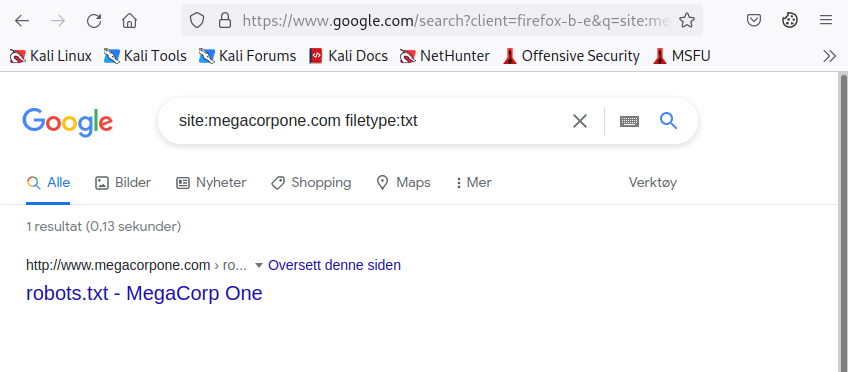

Nhận được một kết quả thú vị. Truy vấn tìm thấy tệp robots.txt, chứa nội dung sau.

```
User-agent: *
Allow: /
Allow: /nanites.php
```

Tệp robots.txt hướng dẫn các trình thu thập dữ liệu web, chẳng hạn như trình thu thập dữ liệu của công cụ tìm kiếm Google, cho phép hoặc không cho phép các tài nguyên cụ thể. Trong trường hợp này, nó tiết lộ một trang PHP cụ thể (/nanities.php) vốn bị ẩn khỏi tìm kiếm thông thường, mặc dù được liệt kê là được phép theo chính sách.

Toán tử ext cũng có thể hữu ích để phân biệt ngôn ngữ lập trình nào có thể được sử dụng trên một trang web. Các tìm kiếm như ext:php, ext:xml và ext:py sẽ tìm thấy các Trang PHP được lập chỉ mục, các trang XML và Python tương ứng.

Cũng có thể sửa đổi toán tử bằng cách sử dụng - để loại trừ các mục cụ thể khỏi tìm kiếm, thu hẹp kết quả.

Ví dụ: để tìm các trang không phải HTML thú vị, có thể sử dụng site:megacorpone.com để giới hạn tìm kiếm ở megacorpone.com và các tên miền phụ, theo sau là -filetype:html để loại trừ các trang HTML khỏi kết quả.

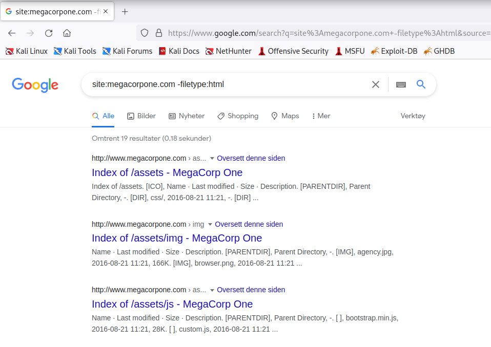

Trong trường hợp này, đã tìm thấy một số trang thú vị, bao gồm các chỉ mục thư mục web.

Trong một ví dụ khác, có thể sử dụng tìm kiếm intitle:"index of" "parent directory" để tìm các trang có chứa "index of" trong tiêu đề và các từ "parent directory" trên trang.

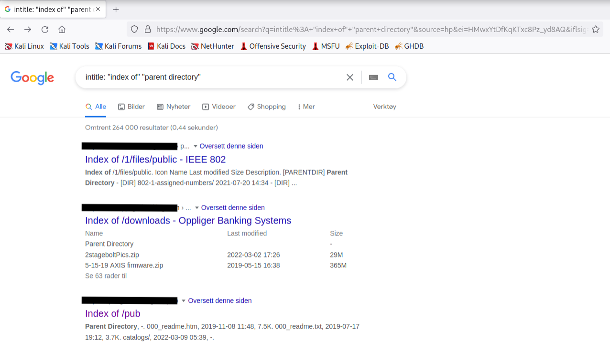

Đầu ra đề cập đến các trang danh sách thư mục liệt kê nội dung tệp của các thư mục mà không có trang chỉ mục. Các cấu hình sai như thế này có thể tiết lộ các tệp thú vị và thông tin nhạy cảm.

Những ví dụ cơ bản này chỉ là bề nổi của những gì có thể làm với các toán tử tìm kiếm. Cơ sở dữ liệu Google Hacking (GHDB) chứa nhiều tìm kiếm sáng tạo chứng minh sức mạnh của việc tận dụng các toán tử kết hợp.

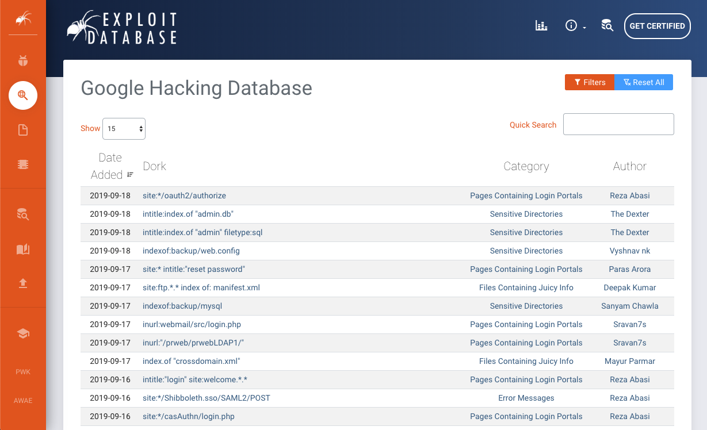

Một cách khác để thử nghiệm Google Dorks là thông qua cổng thông tin DorkSearch, cung cấp một tập hợp con các truy vấn được xây dựng sẵn và một công cụ xây dựng để tạo điều kiện thuận lợi cho việc tìm kiếm.

Việc thành thạo các toán tử này, kết hợp với khả năng suy luận nhạy bén, là những kỹ năng chính để "hack" công cụ tìm kiếm hiệu quả.

### 6.2.3. Netcraft

Netcraft là một công ty dịch vụ internet có trụ sở tại Anh, cung cấp một cổng thông tin web miễn phí thực hiện nhiều chức năng thu thập thông tin khác nhau như phát hiện công nghệ nào đang chạy trên một trang web nhất định và tìm ra những máy chủ nào khác chia sẻ cùng một netblock IP.

Sử dụng các dịch vụ như Netcraft được coi là một kỹ thuật thụ động, vì không bao giờ tương tác trực tiếp với mục tiêu.

Hãy cùng xem xét một số khả năng của Netcraft. Ví dụ, có thể sử dụng trang tìm kiếm DNS của Netcraft để thu thập thông tin về tên miền megacorpone.com:

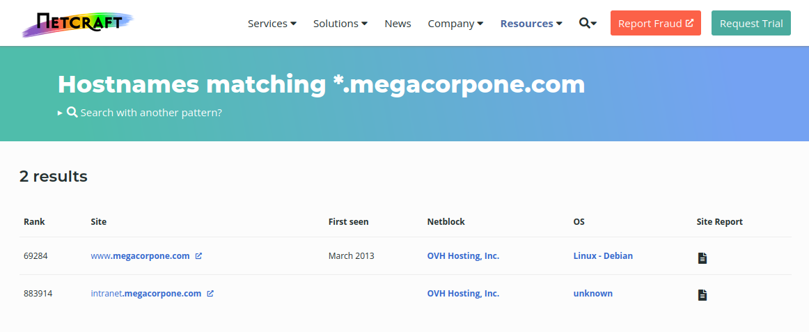

Đối với mỗi máy chủ được tìm thấy, có thể xem "báo cáo trang web" cung cấp thông tin bổ sung và lịch sử về máy chủ bằng cách nhấp vào biểu tượng file bên cạnh mỗi URL trang web.

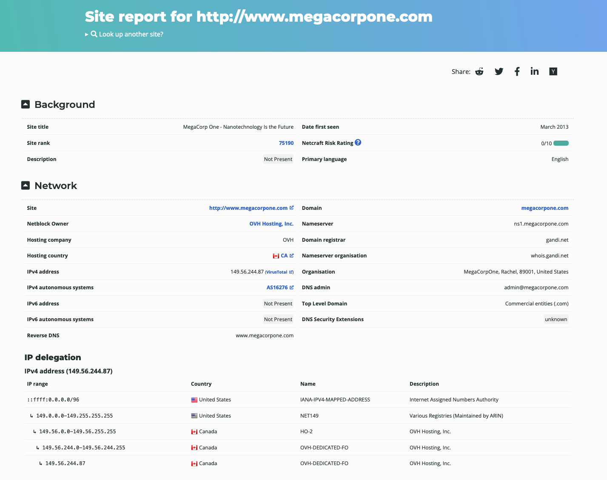

Phần đầu của báo cáo bao gồm thông tin đăng ký. Tuy nhiên, nếu cuộn xuống, sẽ khám phá ra nhiều mục "công nghệ trang web".

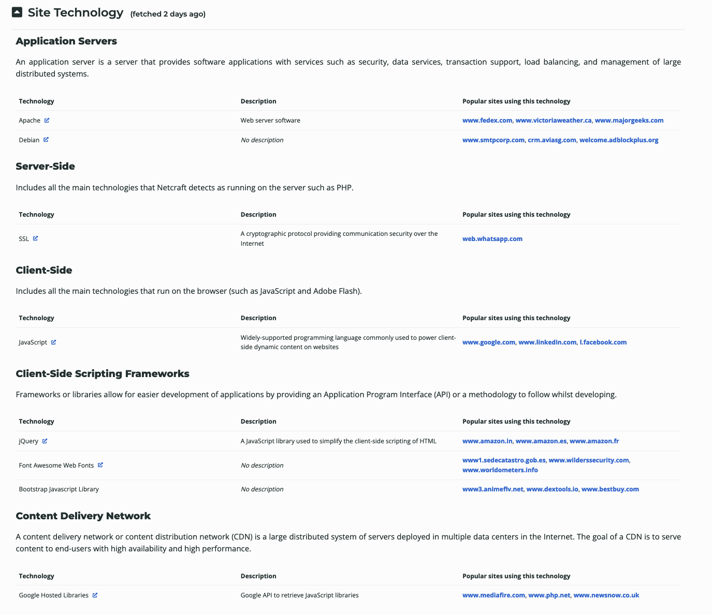

Danh sách các miền phụ và công nghệ này sẽ hữu ích khi chuyển sang thu thập và khai thác thông tin tích cực. Hiện tại, sẽ thêm nó vào ghi chú.

### 6.2.4. Open-Source Code

Trong các phần sau, sẽ khám phá nhiều công cụ và tài nguyên trực tuyến khác nhau có thể sử dụng để thu thập thông tin thụ động. Bao gồm các dự án nguồn mở và kho lưu trữ mã trực tuyến như:

- GitHub

- GitHub Gist

- GitLab

- SourceForge

Mã được lưu trữ trực tuyến có thể cung cấp cái nhìn thoáng qua về ngôn ngữ lập trình và khuôn khổ được một tổ chức sử dụng. Trong một số trường hợp hiếm hoi, các nhà phát triển thậm chí còn vô tình commit dữ liệu nhạy cảm và thông tin đăng nhập vào các kho lưu trữ công khai.

Các công cụ tìm kiếm cho một số nền tảng này sẽ hỗ trợ các toán tử tìm kiếm của Google đã thảo luận trước đó trong Mô-đun này.

Ví dụ, tìm kiếm của GitHub rất linh hoạt. Có thể sử dụng GitHub để tìm kiếm kho lưu trữ của người dùng hoặc tổ chức; tuy nhiên, cần có tài khoản nếu muốn tìm kiếm trên tất cả các kho lưu trữ công khai.

Để thực hiện bất kỳ tìm kiếm nào trên Github, trước tiên cần đăng ký một tài khoản cơ bản, miễn phí cho các cá nhân và tổ chức.

Sau khi đăng nhập vào tài khoản Github, có thể thực hiện nhiều tìm kiếm dựa trên từ khóa bằng cách nhập vào trường tìm kiếm ở trên cùng bên phải.

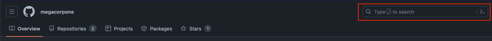

Hãy tìm kiếm thông tin thú vị trong kho lưu trữ của MegaCorp One. Có thể sử dụng path:users để tìm kiếm bất kỳ tệp nào có từ "users" trong tên tệp và nhấn ENTER.


Tìm kiếm chỉ tìm thấy một tệp - xampp.users. Tuy nhiên, điều này vẫn thú vị vì XAMPP là một môi trường phát triển ứng dụng web. Hãy kiểm tra nội dung của tệp.

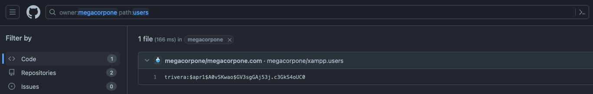

Tệp này có vẻ chứa hàm băm tên người dùng và mật khẩu, có thể rất hữu ích khi bắt đầu giai đoạn tấn công chủ động. Hãy thêm nó vào ghi chú.

Cách tiếp cận thủ công này sẽ hiệu quả nhất trên các kho lưu trữ nhỏ. Đối với các kho lưu trữ lớn hơn, có thể sử dụng một số công cụ để giúp tự động hóa một số tìm kiếm, chẳng hạn như Gitrob và Gitleaks.. Hầu hết các công cụ này yêu cầu mã thông báo truy cập để sử dụng API của nhà cung cấp lưu trữ mã nguồn.

Ảnh chụp màn hình sau đây cho thấy ví dụ về Gitleaks tìm thấy ID khóa truy cập AWS trong một tệp.

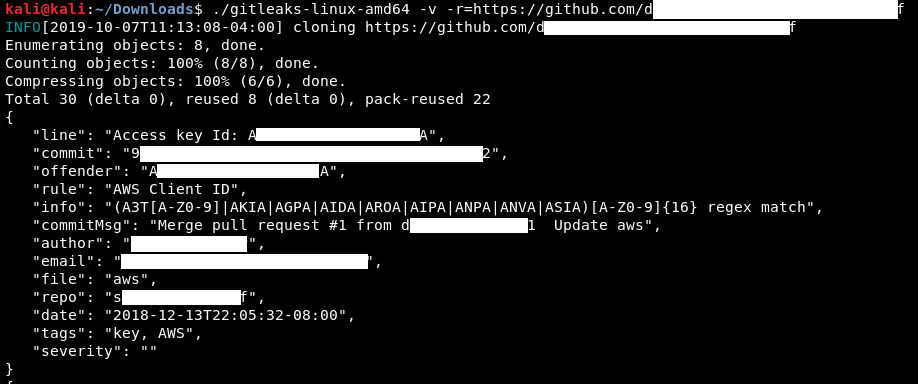

Việc có được những thông tin xác thực này cho phép truy cập không giới hạn vào cùng một tài khoản AWS và có thể dẫn đến xâm phạm bất kỳ dịch vụ đám mây nào được quản lý bởi danh tính này.

```
Các công cụ tìm kiếm bí mật trong mã nguồn, như Gitrob hoặc Gitleaks, thường dựa vào các biểu thức chính quy hoặc phát hiện dựa trên entropy để xác định thông tin có thể hữu ích. Phát hiện dựa trên entropy cố gắng tìm các chuỗi được tạo ngẫu nhiên. Ý tưởng là một chuỗi dài các ký tự và số ngẫu nhiên có thể là mật khẩu. Bất kể công cụ tìm kiếm bí mật như thế nào, không có công cụ nào là hoàn hảo và chúng sẽ bỏ sót những thứ mà kiểm tra thủ công có thể tìm thấy.
```

### 6.2.5. Shodan

Khi thu thập thông tin về mục tiêu, điều quan trọng cần nhớ là các trang web truyền thống chỉ là một phần của internet.

Shodan là một công cụ tìm kiếm thu thập thông tin các thiết bị được kết nối với internet, bao gồm các máy chủ chạy trang web, nhưng cũng bao gồm các thiết bị như bộ định tuyến và thiết bị IoT.

Nói cách khác, Google và các công cụ tìm kiếm khác tìm kiếm nội dung máy chủ web, trong khi Shodan tìm kiếm các thiết bị được kết nối internet, tương tác với chúng và hiển thị thông tin về chúng.

Mặc dù Shodan không bắt buộc phải hoàn thành bất kỳ tài liệu nào trong Mô-đun này hoặc các phòng thí nghiệm, nhưng vẫn đáng để khám phá một chút. Trước khi sử dụng Shodan, phải đăng ký một tài khoản miễn phí, tài khoản này cung cấp quyền truy cập hạn chế.

Hãy bắt đầu bằng cách sử dụng Shodan để tìm kiếm tên máy chủ:megacorpone.com.

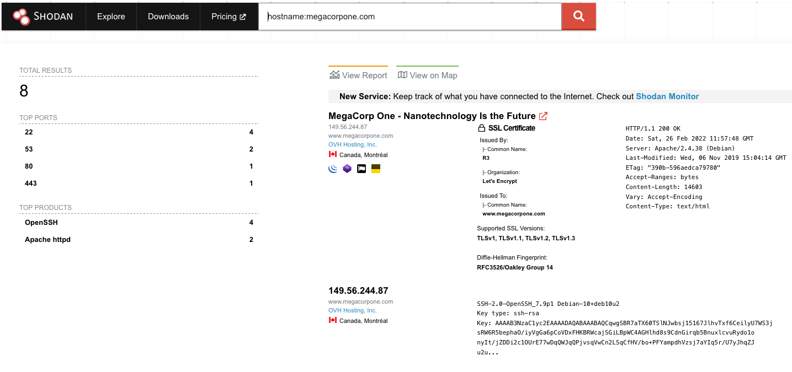

Trong trường hợp này, Shodan liệt kê các IP, dịch vụ và thông tin biểu ngữ. Tất cả những thông tin này được thu thập một cách thụ động, tránh tương tác với trang web của khách hàng.

Thông tin này cung cấp ảnh chụp nhanh về dấu vết internet của mục tiêu. Ví dụ, có bốn máy chủ đang chạy SSH. Có thể phân tích sâu hơn để tinh chỉnh kết quả bằng cách nhấp vào SSH trong Top Ports ở ngăn bên trái.

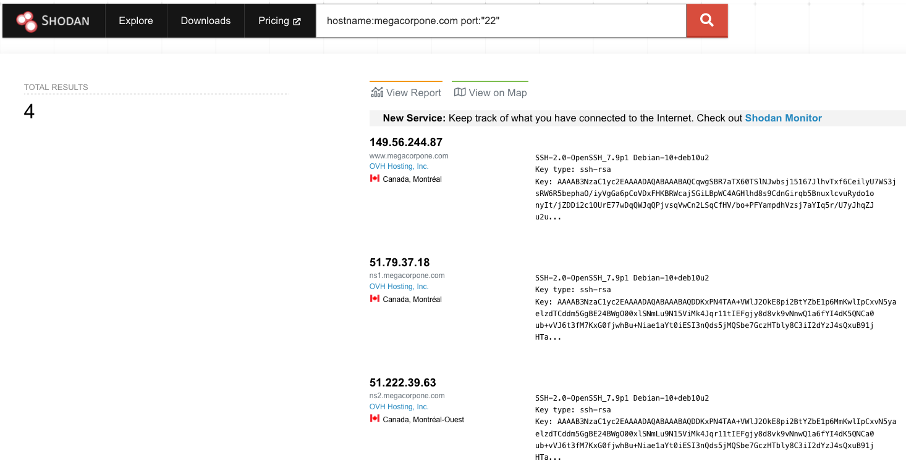

Dựa trên kết quả của Shodan, biết chính xác phiên bản OpenSSH nào đang chạy trên mỗi máy chủ. Nếu nhấp vào một địa chỉ IP, có thể lấy tóm tắt về máy chủ.

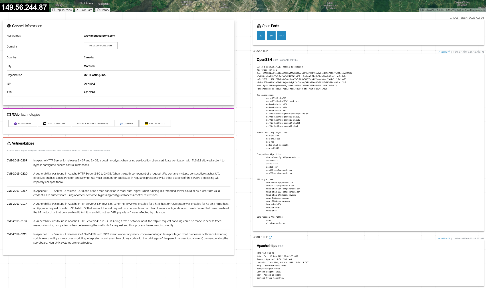

Có thể xem xét các cổng, dịch vụ và công nghệ được máy chủ sử dụng trên trang này. Shodan cũng sẽ tiết lộ nếu có bất kỳ lỗ hổng nào được công bố cho bất kỳ dịch vụ hoặc công nghệ nào được xác định đang chạy trên cùng một máy chủ. Thông tin này vô cùng có giá trị khi xác định nơi bắt đầu khi chuyển sang thử nghiệm tích cực.

### 6.2.6. Security Headers and SSL/TLS

Có một số trang web chuyên biệt khác có thể sử dụng để thu thập thông tin về tình trạng bảo mật của một trang web hoặc tên miền. Một số trang web này làm mờ ranh giới giữa việc thu thập thông tin thụ động và chủ động, nhưng điểm chính đối là bên thứ ba đang khởi tạo bất kỳ lần quét hoặc kiểm tra nào.

Một trong những trang web như vậy, Security Headers, sẽ phân tích các tiêu đề phản hồi HTTP và cung cấp phân tích cơ bản về tình trạng bảo mật của trang web mục tiêu. Có thể sử dụng điều này để có ý tưởng về mã hóa và các hoạt động bảo mật của một tổ chức dựa trên kết quả.

Hãy quét www.megacorpone.com và kiểm tra kết quả.

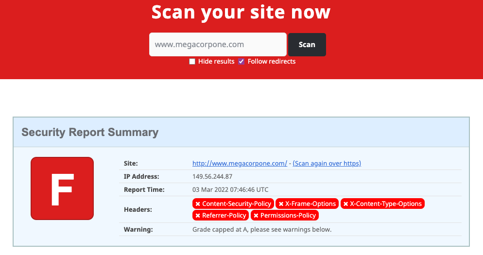

Trang web thiếu một số tiêu đề phòng thủ, chẳng hạn như Content-Security-Policy và X-Frame-Options. Những tiêu đề bị thiếu này không nhất thiết là lỗ hổng bảo mật, nhưng chúng có thể chỉ ra các nhà phát triển web hoặc quản trị viên máy chủ không quen với việc tăng cường bảo mật máy chủ.

```
Server hardening là quá trình bảo mật máy chủ tổng thể thông qua cấu hình. Quá trình này bao gồm các quy trình như vô hiệu hóa các dịch vụ không cần thiết, xóa các dịch vụ hoặc tài khoản người dùng không sử dụng, thay đổi mật khẩu mặc định, thiết lập tiêu đề máy chủ phù hợp, v.v. Không cần biết tất cả các chi tiết về cấu hình mọi loại máy chủ, nhưng hiểu các khái niệm và những gì cần tìm kiếm có thể giúp xác định cách tốt nhất để tiếp cận mục tiêu tiềm năng.
```

Một công cụ quét khác có thể sử dụng là SSL Server Test từ Qualys SSL Labs. Công cụ này phân tích cấu hình SSL/TLS của máy chủ và so sánh với các thông lệ tốt nhất hiện tại. Nó cũng sẽ xác định một số lỗ hổng liên quan đến SSL/TLS, chẳng hạn như Poodle hoặc Heartbleed. Hãy quét www.megacorpone.com và kiểm tra kết quả.

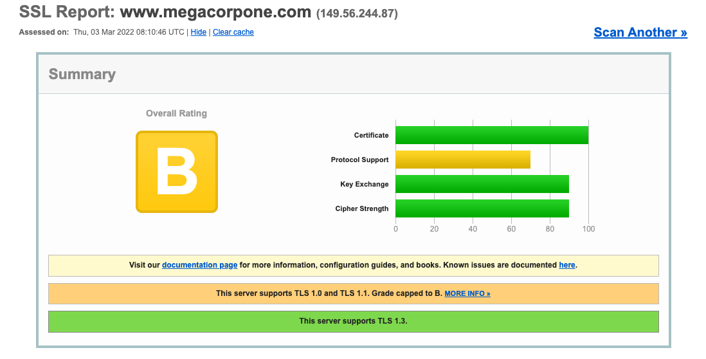

Kết quả có vẻ tốt hơn so với kiểm tra Security Headers. Tuy nhiên, điều này cho thấy máy chủ hỗ trợ các phiên bản TLS như 1.0 và 1.1, được coi là cũ vì chúng triển khai [bộ mã hóa] không an toàn (<https://www.ssllabs.com/ssltest/>) - điều này cuối cùng cho thấy mục tiêu không áp dụng các biện pháp thực hành tốt nhất hiện tại để tăng cường bảo mật SSL/TLS. Việc vô hiệu hóa bộ TLS_DHE_RSA_WITH_AES_256_CBC_SHA đã được khuyến nghị trong nhiều năm, chẳng hạn, do nhiều lỗ hổng bảo mật ở cả chế độ AES Cipher Block Chaining và thuật toán SHA1. Có thể sử dụng những phát hiện này để có được thông tin chi tiết về các biện pháp thực hành bảo mật hoặc thiếu sót trong tổ chức mục tiêu.

## 6.3. Active Information Gathering

Đơn vị học tập này bao gồm các Mục tiêu học tập sau:

- Học cách thực hiện quét cổng Netcat và Nmap

- Thực hiện liệt kê DNS, SMB, SMTP và SNMP

- Hiểu các kỹ thuật Living off the Land

Trong Đơn vị học tập này, sẽ vượt ra ngoài việc thu thập thông tin thụ động và khám phá các kỹ thuật liên quan đến tương tác trực tiếp với các dịch vụ mục tiêu. Nên nhớ rằng vô số dịch vụ có thể được nhắm mục tiêu trong lĩnh vực này, ví dụ như Active Directory, sẽ đề cập chi tiết hơn trong một Mô-đun riêng. Tuy nhiên, sẽ xem xét một số kỹ thuật thu thập thông tin chủ động phổ biến hơn trong Mô-đun này bao gồm quét cổng và liệt kê DNS, SMB, SMTP và SNMP.

Chủ yếu sẽ giới thiệu các kỹ thuật thu thập thông tin chủ động mà có thể thực hiện bằng các công cụ được cài đặt sẵn trên máy Kali cục bộ. Tuy nhiên, trong một số trường hợp trong quá trình kiểm tra thâm nhập, sẽ không có đủ điều kiện để chạy công cụ Kali Linux yêu thích. Trong một kịch bản vi phạm giả định như thế này, thường được khách hàng cung cấp một máy trạm chạy Windows và phải sử dụng những gì có sẵn trên Windows.

Khi "Living off the Land", có thể tận dụng một số tệp nhị phân Windows được cài đặt sẵn và đáng tin cậy để thực hiện phân tích sau khi xâm phạm. Các tệp nhị phân này được viết tắt là LOLBins hoặc gần đây hơn là LOLBAS để bao gồm Binaries, Scripts và Libraries.

```
Nói một cách chính xác, các tệp nhị phân LOLBAS thường được sử dụng theo cách khác ngoài thiết kế. Trong trường hợp này, sẽ nới lỏng định nghĩa để bao gồm việc sử dụng các tệp nhị phân Windows chuẩn "nguyên trạng" để thực hiện thu thập thông tin.
```

Trong các phần tiếp theo, sẽ giới thiệu các kỹ thuật LOLBAS phổ biến nhất cùng với các công cụ Kali thông dụng được sử dụng để thu thập thông tin chủ động.

### 6.3.1. DNS Enumeration

Hệ thống tên miền (DNS) là cơ sở dữ liệu phân tán chịu trách nhiệm dịch tên miền thân thiện với người dùng thành địa chỉ IP. Đây là một trong những hệ thống quan trọng nhất trên Internet. Điều này được tạo điều kiện thuận lợi bởi cấu trúc phân cấp được chia thành nhiều vùng, bắt đầu từ vùng gốc cấp cao nhất.

Mỗi miền có thể sử dụng các loại bản ghi DNS khác nhau. Một số loại bản ghi DNS phổ biến nhất bao gồm:

- NS: Bản ghi máy chủ tên chứa tên của các máy chủ có thẩm quyền lưu trữ bản ghi DNS cho một miền.

- A: Còn được gọi là bản ghi máy chủ, "bản ghi a" chứa địa chỉ IPv4 của tên máy chủ (chẳng hạn như www.megacorpone.com).

- AAAA: Còn được gọi là bản ghi máy chủ quad A, "bản ghi aaaa" chứa địa chỉ IPv6 của tên máy chủ (chẳng hạn như www.megacorpone.com).

- MX: Bản ghi trao đổi thư chứa tên của các máy chủ chịu trách nhiệm xử lý email cho miền. Một miền có thể chứa nhiều bản ghi MX.

- PTR: Bản ghi con trỏ được sử dụng trong các vùng tra cứu ngược và có thể tìm thấy các bản ghi được liên kết với một địa chỉ IP.

- CNAME: Bản ghi tên chuẩn được sử dụng để tạo bí danh cho các bản ghi máy chủ khác.

- TXT: Bản ghi văn bản có thể chứa bất kỳ dữ liệu tùy ý nào và được sử dụng cho nhiều mục đích khác nhau, chẳng hạn như xác minh quyền sở hữu tên miền.

Do lượng thông tin phong phú chứa trong DNS, nó thường là mục tiêu béo bở để thu thập thông tin tích cực.

Hãy chứng minh điều này bằng cách sử dụng lệnh host để tìm địa chỉ IP của www.megacorpone.com.

```
kali@kali:~$ host www.megacorpone.com
www.megacorpone.com has address 149.56.244.87
```

Theo mặc định, lệnh host sẽ tìm kiếm bản ghi A, nhưng cũng có thể truy vấn các trường khác, chẳng hạn như bản ghi MX hoặc TXT, bằng cách chỉ định loại bản ghi trong truy vấn bằng tùy chọn -t.

```
kali@kali:~$ host -t mx megacorpone.com
megacorpone.com mail is handled by 10 fb.mail.gandi.net.
megacorpone.com mail is handled by 20 spool.mail.gandi.net.
megacorpone.com mail is handled by 50 mail.megacorpone.com.
megacorpone.com mail is handled by 60 mail2.megacorpone.com.
```

Trong trường hợp này, trước tiên chạy lệnh host để chỉ lấy các bản ghi MX megacorpone.com, trả về bốn bản ghi máy chủ thư khác nhau. Mỗi máy chủ có mức ưu tiên khác nhau (10, 20, 50, 60) và máy chủ có số ưu tiên thấp nhất sẽ được sử dụng trước để chuyển tiếp thư được gửi đến miền megacorpone.com (fb.mail.gandi.net).

Sau đó, chạy lại lệnh host để chỉ lấy các bản ghi TXT megacorpone.com, trả về hai mục.

```
kali@kali:~$ host -t txt megacorpone.com
megacorpone.com descriptive text "Try Harder"
megacorpone.com descriptive text "google-site-verification=U7B_b0HNeBtY4qYGQZNsEYXfCJ32hMNV3GtC0wWq5pA"
```

Bây giờ đã thu thập được một số dữ liệu ban đầu từ miền megacorpone.com, có thể tiếp tục sử dụng các truy vấn DNS bổ sung để khám phá thêm tên máy chủ và địa chỉ IP thuộc cùng một miền. Ví dụ, biết rằng miền có một máy chủ web có tên máy chủ là "www.megacorpone.com".

Hãy chạy host với tên máy chủ này.

```
kali@kali:~$ host www.megacorpone.com
www.megacorpone.com has address 149.56.244.87 
```

Bây giờ, hãy xác định xem megacorpone.com có ​​máy chủ với tên máy chủ là "idontexist" hay không. Sẽ quan sát sự khác biệt giữa các kết quả truy vấn.

```
kali@kali:~$ host idontexist.megacorpone.com
Host idontexist.megacorpone.com not found: 3(NXDOMAIN)
```

Chúng tôi đã truy vấn một tên máy chủ hợp lệ và nhận được phản hồi giải quyết IP. Ngược lại, trả về lỗi (NXDOMAIN) cho biết bản ghi DNS công khai không tồn tại cho tên máy chủ đó. Vì giờ đã hiểu cách tìm kiếm tên máy chủ hợp lệ, nên có thể tự động hóa các nỗ lực.

Sau khi học được những điều cơ bản về liệt kê DNS, có thể phát triển các kỹ thuật tấn công DNS để tăng tốc quá trình nghiên cứu.

Tấn công là một kỹ thuật thử và sai nhằm tìm thông tin hợp lệ như thư mục trên máy chủ web, kết hợp tên người dùng và mật khẩu hoặc trong trường hợp này là các bản ghi DNS hợp lệ. Bằng cách sử dụng danh sách từ chứa các tên máy chủ chung, có thể thử đoán các bản ghi DNS và kiểm tra phản hồi để tìm tên máy chủ hợp lệ.

Trong các ví dụ cho đến nay, đã sử dụng tra cứu chuyển tiếp, yêu cầu địa chỉ IP của tên máy chủ để truy vấn cả tên máy chủ hợp lệ và không hợp lệ. Nếu máy chủ giải quyết thành công tên thành IP, thì đây có thể là dấu hiệu của một máy chủ đang hoạt động.

Có thể tự động hóa việc tra cứu DNS chuyển tiếp của các tên máy chủ phổ biến bằng lệnh host trong một dòng lệnh Bash.

Đầu tiên, hãy xây dựng danh sách các tên máy chủ có thể.

```
kali@kali:~$ cat list.txt
www
ftp
mail
owa
proxy
router
```

Tiếp theo, có thể sử dụng lệnh Bash để cố gắng giải quyết từng tên máy chủ.

```
kali@kali:~$ for ip in $(cat list.txt); do host $ip.megacorpone.com; done
www.megacorpone.com has address 149.56.244.87
Host ftp.megacorpone.com not found: 3(NXDOMAIN)
mail.megacorpone.com has address 51.222.169.212
Host owa.megacorpone.com not found: 3(NXDOMAIN)
Host proxy.megacorpone.com not found: 3(NXDOMAIN)
router.megacorpone.com has address 51.222.169.214
```

Sử dụng danh sách từ đơn giản này, đã phát hiện ra các mục nhập cho "www", "mail" và "router". Tuy nhiên, không tìm thấy tên máy chủ "ftp", "owa" và "proxy". Các danh sách từ toàn diện hơn nhiều có sẵn như một phần của dự án SecLists. Các danh sách từ này có thể được cài đặt vào thư mục /usr/share/seclists bằng lệnh sudo apt install seclists.

Ngoại trừ bản ghi www, phép liệt kê tấn công brute force DNS-forward đã tiết lộ một tập hợp các địa chỉ IP nằm rải rác trong cùng một phạm vi gần đúng (51.222.169.X). Nếu quản trị viên DNS của megacorpone.com đã định cấu hình các bản ghi PTR cho tên miền, có thể quét phạm vi gần đúng bằng cách tra cứu ngược để yêu cầu tên máy chủ cho từng IP.

Hãy sử dụng vòng lặp để quét các địa chỉ IP từ 51.222.169.200 đến 51.222.169.254. Sẽ lọc ra những kết quả không hợp lệ (sử dụng grep -v) bằng cách chỉ hiển thị những mục không chứa "not found".

```
kali@kali:~$ for ip in $(seq 200 254); do host 51.222.169.$ip; done | grep -v "not found"
...
208.169.222.51.in-addr.arpa domain name pointer admin.megacorpone.com.
209.169.222.51.in-addr.arpa domain name pointer beta.megacorpone.com.
210.169.222.51.in-addr.arpa domain name pointer fs1.megacorpone.com.
211.169.222.51.in-addr.arpa domain name pointer intranet.megacorpone.com.
212.169.222.51.in-addr.arpa domain name pointer mail.megacorpone.com.
213.169.222.51.in-addr.arpa domain name pointer mail2.megacorpone.com.
214.169.222.51.in-addr.arpa domain name pointer router.megacorpone.com.
215.169.222.51.in-addr.arpa domain name pointer siem.megacorpone.com.
216.169.222.51.in-addr.arpa domain name pointer snmp.megacorpone.com.
217.169.222.51.in-addr.arpa domain name pointer syslog.megacorpone.com.
218.169.222.51.in-addr.arpa domain name pointer support.megacorpone.com.
219.169.222.51.in-addr.arpa domain name pointer test.megacorpone.com.
220.169.222.51.in-addr.arpa domain name pointer vpn.megacorpone.com.
...
```

Đã thành công trong việc giải quyết một số địa chỉ IP thành máy chủ hợp lệ bằng cách sử dụng tra cứu DNS ngược. Nếu đang thực hiện đánh giá, có thể suy rộng thêm các kết quả này và có thể quét "mail2", "router", v.v. và kết quả tra cứu ngược dương tính. Các loại quét này thường theo chu kỳ; mở rộng tìm kiếm dựa trên bất kỳ thông tin nào nhận được ở mỗi vòng.

Bây giờ đã phát triển các kỹ năng liệt kê DNS cơ bản, hãy cùng khám phá cách có thể tự động hóa quy trình bằng một số ứng dụng.

Có một số công cụ trong Kali Linux có thể tự động hóa việc liệt kê DNS. Hai ví dụ đáng chú ý là DNSRecon và DNSenum; hãy cùng khám phá khả năng của chúng.

DNSRecon là một tập lệnh liệt kê DNS nâng cao được viết bằng Python. Hãy chạy dnsrecon trên megacorpone.com, sử dụng tùy chọn -d để chỉ định tên miền và -t để chỉ định loại liệt kê cần thực hiện (trong trường hợp này là quét tiêu chuẩn).

```
kali@kali:~$ dnsrecon -d megacorpone.com -t std
[*] std: Performing General Enumeration against: megacorpone.com...
[-] DNSSEC is not configured for megacorpone.com
[*] 	 SOA ns1.megacorpone.com 51.79.37.18
[*] 	 NS ns1.megacorpone.com 51.79.37.18
[*] 	 NS ns3.megacorpone.com 66.70.207.180
[*] 	 NS ns2.megacorpone.com 51.222.39.63
[*] 	 MX mail.megacorpone.com 51.222.169.212
[*] 	 MX spool.mail.gandi.net 217.70.178.1
[*] 	 MX fb.mail.gandi.net 217.70.178.217
[*] 	 MX fb.mail.gandi.net 217.70.178.216
[*] 	 MX fb.mail.gandi.net 217.70.178.215
[*] 	 MX mail2.megacorpone.com 51.222.169.213
[*] 	 TXT megacorpone.com Try Harder
[*] 	 TXT megacorpone.com google-site-verification=U7B_b0HNeBtY4qYGQZNsEYXfCJ32hMNV3GtC0wWq5pA
[*] Enumerating SRV Records
[+] 0 Records Found
```

Dựa trên kết quả đầu ra ở trên, đã thực hiện thành công quét DNS trên các loại bản ghi chính đối với tên miền megacorpone.com.

Hãy thử dùng brute force để tấn công thêm các tên máy chủ bằng tệp list.txt đã tạo trước đó để tra cứu chuyển tiếp.

```
kali@kali:~$ cat list.txt 
www
ftp
mail
owa
proxy
router
```

Để thực hiện thử nghiệm tấn công brute-force, sẽ sử dụng tùy chọn -d để chỉ định tên miền, -D để chỉ định tên tệp chứa các chuỗi miền phụ tiềm năng và -t để chỉ định loại liệt kê cần thực hiện, trong trường hợp này là brt cho thử nghiệm tấn công brute-force.

```
kali@kali:~$ dnsrecon -d megacorpone.com -D ~/list.txt -t brt
[*] Using the dictionary file: /home/kali/list.txt (provided by user)
[*] brt: Performing host and subdomain brute force against megacorpone.com...
[+] 	 A www.megacorpone.com 149.56.244.87
[+] 	 A mail.megacorpone.com 51.222.169.212
[+] 	 A router.megacorpone.com 51.222.169.214
[+] 3 Records Found
```

Nỗ lực tấn công bằng vũ lực đã kết thúc và đã giải quyết được một số tên máy chủ.

DNSEnum là một công cụ liệt kê DNS phổ biến khác có thể được sử dụng để tự động hóa thêm việc liệt kê DNS của miền megacorpone.com. Có thể truyền cho công cụ một số tùy chọn, nhưng vì mục đích của ví dụ này, sẽ chỉ truyền tham số miền mục tiêu:

```
kali@kali:~$ dnsenum megacorpone.com
...
dnsenum VERSION:1.2.6

-----   megacorpone.com   -----

...

Brute forcing with /usr/share/dnsenum/dns.txt:
_______________________________________________

admin.megacorpone.com.                   5        IN    A        51.222.169.208
beta.megacorpone.com.                    5        IN    A        51.222.169.209
fs1.megacorpone.com.                     5        IN    A        51.222.169.210
intranet.megacorpone.com.                5        IN    A        51.222.169.211
mail.megacorpone.com.                    5        IN    A        51.222.169.212
mail2.megacorpone.com.                   5        IN    A        51.222.169.213
ns1.megacorpone.com.                     5        IN    A        51.79.37.18
ns2.megacorpone.com.                     5        IN    A        51.222.39.63
ns3.megacorpone.com.                     5        IN    A        66.70.207.180
router.megacorpone.com.                  5        IN    A        51.222.169.214
siem.megacorpone.com.                    5        IN    A        51.222.169.215
snmp.megacorpone.com.                    5        IN    A        51.222.169.216
syslog.megacorpone.com.                  5        IN    A        51.222.169.217
test.megacorpone.com.                    5        IN    A        51.222.169.219
vpn.megacorpone.com.                     5        IN    A        51.222.169.220
www.megacorpone.com.                     5        IN    A        149.56.244.87
www2.megacorpone.com.                    5        IN    A        149.56.244.87


megacorpone.com class C netranges:
___________________________________

 51.79.37.0/24
 51.222.39.0/24
 51.222.169.0/24
 66.70.207.0/24
 149.56.244.0/24


Performing reverse lookup on 1280 ip addresses:
________________________________________________

18.37.79.51.in-addr.arpa.                86400    IN    PTR      ns1.megacorpone.com.
...
```

Đã phát hiện ra một số máy chủ chưa từng biết đến trước đây nhờ vào quá trình liệt kê DNS mở rộng. Như đã đề cập ở phần đầu của Mô-đun này, việc thu thập thông tin có mô hình tuần hoàn, vì vậy sẽ cần thực hiện tất cả các tác vụ liệt kê thụ động và chủ động khác trên tập hợp con máy chủ mới này để tiết lộ bất kỳ chi tiết tiềm năng mới nào.

Các công cụ liệt kê được đề cập đều thiết thực và dễ hiểu, và nên làm quen với từng công cụ trước khi tiếp tục.

Sau khi đã đề cập đến các công cụ Kali, hãy cùng khám phá loại liệt kê DNS nào có thể thực hiện theo góc nhìn của Windows.

Mặc dù không có trong danh sách LOLBAS, nslookup là một tiện ích tuyệt vời khác để liệt kê DNS của Windows và vẫn được sử dụng trong các tình huống 'Sống ngoài vùng đất'.

```
Các ứng dụng có thể cung cấp thực thi mã không mong muốn thường được liệt kê trong dự án LOLBAS
```

Bây giờ hãy kết nối với máy khách Windows 11. Đối với điều này, có thể sử dụng lệnh xfreerdp. Cú pháp là /u: và tên người dùng, /p: và mật khẩu, và /v: và địa chỉ IP.

```
kali@kali:~$ xfreerdp /u:student /p:lab /v:192.168.50.152
```

Sau khi kết nối trên máy khách Windows 11, có thể mở cửa sổ command prompt và chạy truy vấn đơn giản để giải quyết bản ghi A cho máy chủ mail.megacorptwo.com.

```
C:\Users\student>nslookup mail.megacorptwo.com
DNS request timed out.
    timeout was 2 seconds.
Server:  UnKnown
Address:  192.168.50.151

Name:    mail.megacorptwo.com
Address:  192.168.50.154
```

Trong kết quả đầu ra ở trên, đã truy vấn máy chủ DNS mặc định (192.168.50.151) để giải quyết địa chỉ IP của mail.megacorptwo.com, sau đó máy chủ DNS trả lời bằng "192.168.50.154".

Tương tự như lệnh máy chủ Linux, nslookup có thể thực hiện các truy vấn chi tiết hơn. Ví dụ, có thể truy vấn một DNS nhất định về bản ghi TXT thuộc về một máy chủ cụ thể.

```
C:\Users\student>nslookup -type=TXT info.megacorptwo.com 192.168.50.151
Server:  UnKnown
Address:  192.168.50.151

info.megacorptwo.com    text =

        "greetings from the TXT record body"
```

Trong ví dụ này, đang truy vấn cụ thể máy chủ DNS 192.168.50.151 cho bất kỳ bản ghi TXT nào liên quan đến máy chủ info.megacorptwo.com.

Tiện ích nslookup linh hoạt như lệnh máy chủ Linux và các truy vấn cũng có thể được tự động hóa thêm thông qua PowerShell hoặc tập lệnh Batch.

### 6.3.2. TCP/UDP Port Scanning Theory

Quét cổng là quá trình kiểm tra các cổng TCP hoặc UDP trên máy từ xa với mục đích phát hiện những dịch vụ nào đang chạy trên máy mục tiêu và những hướng tấn công tiềm ẩn nào có thể tồn tại.

```
Xin lưu ý rằng quét cổng không đại diện cho hoạt động của người dùng truyền thống và có thể bị coi là bất hợp pháp ở một số khu vực pháp lý. Do đó, không nên thực hiện bên ngoài phòng thí nghiệm mà không có sự cho phép trực tiếp bằng văn bản từ chủ sở hữu mạng mục tiêu.
```

Điều cần thiết là phải hiểu được ý nghĩa của việc quét cổng cũng như tác động mà các lần quét cổng cụ thể có thể gây ra. Do lượng lưu lượng mà một số lần quét có thể tạo ra, cùng với bản chất xâm nhập của chúng, việc chạy quét cổng một cách mù quáng có thể gây ra những tác động tiêu cực đến các hệ thống mục tiêu hoặc mạng máy khách như quá tải máy chủ và liên kết mạng hoặc kích hoạt IDS/IPS. Chạy quét sai có thể dẫn đến thời gian chết cho khách hàng.

Sử dụng phương pháp quét cổng phù hợp có thể cải thiện đáng kể hiệu quả đồng thời hạn chế nhiều rủi ro. Tùy thuộc vào phạm vi tương tác, thay vì chạy quét toàn bộ cổng trên mạng mục tiêu, có thể bắt đầu bằng cách chỉ quét các cổng 80 và 443. Với danh sách các máy chủ web có thể, có thể chạy quét toàn bộ cổng trên các máy chủ này ở chế độ nền trong khi thực hiện các phép liệt kê khác. Sau khi quét toàn bộ cổng hoàn tất, có thể thu hẹp thêm các lần quét để thăm dò ngày càng nhiều thông tin hơn với mỗi lần quét tiếp theo. Quét cổng nên được hiểu là một quy trình động, riêng biệt cho mỗi lần tương tác. Kết quả của một lần quét sẽ xác định loại và phạm vi của lần quét tiếp theo.

Sẽ bắt đầu khám phá quét cổng bằng cách quét cổng TCP và UDP đơn giản bằng Netcat. Cần lưu ý rằng Netcat không phải là trình quét cổng, nhưng có thể sử dụng nó theo cách cơ bản để giới thiệu cách hoạt động của trình quét cổng thông thường.

Vì Netcat đã có trên nhiều hệ thống, có thể sử dụng lại một số chức năng của nó để mô phỏng quét cổng cơ bản khi không cần trình quét cổng đầy đủ tính năng. Cũng sẽ khám phá chi tiết các công cụ tốt hơn dành riêng cho quét cổng.

Hãy bắt đầu bằng cách tìm hiểu các kỹ thuật quét TCP, tập trung vào UDP sau. Kỹ thuật quét cổng TCP đơn giản nhất, thường được gọi là quét CONNECT, dựa trên cơ chế bắt tay TCP ba chiều. Cơ chế này được thiết kế để hai máy chủ cố gắng giao tiếp có thể thương lượng các tham số của kết nối ổ cắm TCP mạng trước khi truyền bất kỳ dữ liệu nào.

Về cơ bản, máy chủ gửi một gói TCP SYN đến máy chủ trên cổng đích. Nếu cổng đích mở, máy chủ sẽ phản hồi bằng gói SYN-ACK và máy chủ máy khách sẽ gửi một gói ACK để hoàn tất quá trình bắt tay. Nếu quá trình bắt tay hoàn tất thành công, cổng được coi là mở.

Có thể chứng minh điều này bằng cách chạy quét cổng TCP Netcat trên các cổng 3388-3390. Sẽ sử dụng tùy chọn -w để chỉ định thời gian chờ kết nối tính bằng giây, cũng như -z để chỉ định chế độ zero-I/O, được sử dụng để quét và không gửi dữ liệu.

```
kali@kali:~$ nc -nvv -w 1 -z 192.168.50.152 3388-3390
(UNKNOWN) [192.168.50.152] 3390 (?) : Connection refused
(UNKNOWN) [192.168.50.152] 3389 (ms-wbt-server) open
(UNKNOWN) [192.168.50.152] 3388 (?) : Connection refused
 sent 0, rcvd 0
```

Dựa trên kết quả này, biết rằng cổng 3389 đang mở, trong khi các kết nối trên cổng 3388 và 3390 đã bị từ chối. Ảnh chụp màn hình bên dưới cho thấy Wireshark đã chụp quét này.

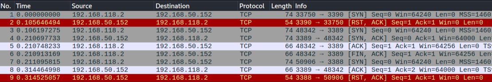

Netcat đã gửi một số gói TCP SYN đến các cổng 3390, 3389 và 3388 trên các gói 1, 3 và 7 tương ứng. Do nhiều yếu tố, bao gồm cả vấn đề về thời gian, các gói có thể xuất hiện không theo thứ tự trong Wireshark. Quan sát thấy máy chủ đã gửi một gói TCP SYN-ACK từ cổng 3389 trên gói 4, cho biết cổng đang mở. Các cổng khác không trả lời bằng một gói SYN-ACK tương tự và chủ động từ chối nỗ lực kết nối thông qua một gói RST-ACK. Cuối cùng, trên gói 6, Netcat đã đóng kết nối này bằng cách gửi một gói FIN-ACK.

Bây giờ đã hiểu rõ về bắt tay TCP và đã xem xét cách quét TCP hoạt động đằng sau hậu trường, hãy cùng tìm hiểu về quét UDP. Vì UDP không có trạng thái và không liên quan đến bắt tay ba chiều, nên cơ chế đằng sau quét cổng UDP khác với TCP.

Hãy chạy quét cổng UDP Netcat trên các cổng 120-123 trên một mục tiêu khác. Sẽ sử dụng tùy chọn nc duy nhất mà chúng ta chưa đề cập đến, -u, cho biết quét UDP.

```
kali@kali:~$ nc -nv -u -z -w 1 192.168.50.149 120-123
(UNKNOWN) [192.168.50.149] 123 (ntp) open
```

Từ bản ghi Wireshark, nhận thấy rằng quét UDP sử dụng cơ chế khác với quét TCP.

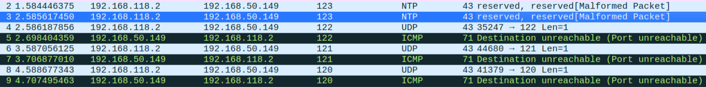

Như thể hiện trong hình, một gói UDP trống được gửi đến một cổng cụ thể (gói 2, 3, 4, 6 và 8). Nếu cổng UDP đích mở, gói sẽ được chuyển đến lớp ứng dụng. Phản hồi nhận được sẽ phụ thuộc vào cách ứng dụng được lập trình để phản hồi các gói trống. Trong ví dụ này, ứng dụng không gửi phản hồi nào. Tuy nhiên, nếu cổng UDP đích đóng, mục tiêu sẽ phản hồi bằng cổng ICMP không thể truy cập (như thể hiện trong các gói 5, 7 và 9), được gửi bởi ngăn xếp UDP/IP của máy mục tiêu.

Hầu hết các máy quét UDP có xu hướng sử dụng thông báo "cổng ICMP không thể truy cập" tiêu chuẩn để suy ra trạng thái của cổng mục tiêu. Tuy nhiên, phương pháp này có thể hoàn toàn không đáng tin cậy khi cổng mục tiêu bị tường lửa lọc. Trên thực tế, trong những trường hợp này, máy quét sẽ báo cáo cổng mục tiêu là mở do không có thông báo ICMP.

Bây giờ đã tìm hiểu cả kỹ thuật quét TCP và UDP, hãy cùng xem xét một số cạm bẫy phổ biến có thể xảy ra khi thực hiện các lần quét như vậy.

Quét UDP có thể gây ra vấn đề vì một số lý do. Đầu tiên, quét UDP thường không đáng tin cậy vì tường lửa và bộ định tuyến có thể loại bỏ các gói ICMP. Điều này có thể dẫn đến kết quả dương tính giả và các cổng hiển thị là mở khi thực tế chúng đã đóng. Thứ hai, nhiều trình quét cổng không quét tất cả các cổng khả dụng và thường có danh sách "các cổng thú vị" được quét trước. Điều này có nghĩa là các cổng UDP mở có thể không được chú ý. Sử dụng trình quét cổng UDP dành riêng cho giao thức có thể giúp có được kết quả chính xác hơn. Cuối cùng, người kiểm tra thâm nhập thường quên quét các cổng UDP mở, thay vào đó tập trung vào các cổng TCP "thú vị hơn". Mặc dù quét UDP có thể không đáng tin cậy, nhưng có rất nhiều vectơ tấn công ẩn sau các cổng UDP mở. Quét TCP cũng tạo ra nhiều lưu lượng hơn nhiều so với quét UDP do chi phí phát sinh và truyền lại gói tin.

### 6.3.3. Port Scanning with Nmap

Sau khi đã hiểu rõ về các nguyên tắc cơ bản của quét cổng, giờ hãy tìm hiểu về Nmap, công cụ thực tế để quét cổng.

Nmap (do Gordon Lyon, hay còn gọi là Fyodor, viết) là một trong những trình quét cổng phổ biến, linh hoạt và mạnh mẽ nhất hiện có. Nó đã được phát triển tích cực trong hơn hai thập kỷ và cung cấp nhiều tính năng ngoài quét cổng.

Một số bản quét ví dụ của Nmap sẽ đề cập trong Mô-đun này được chạy bằng sudo. Điều này là do khá nhiều tùy chọn quét Nmap yêu cầu quyền truy cập vào các socket thô, do đó yêu cầu quyền root. Các socket thô cho phép thao tác phẫu thuật các gói TCP và UDP. Nếu không có quyền truy cập vào các socket thô, Nmap sẽ bị giới hạn vì nó sẽ quay lại chế tạo các gói tin bằng cách sử dụng [Berkeley socket API] (https://networkprogrammingnotes.blogspot.com/p/berkeley-sockets.html_.) chuẩn.

Trước khi khám phá một số ví dụ về quét cổng, nên hiểu dấu vết mà mỗi lần quét Nmap để lại trên dây và các máy chủ được quét.

Quét TCP Nmap mặc định sẽ quét 1000 cổng phổ biến nhất trên một máy nhất định. Trước khi bắt đầu chạy quét một cách mù quáng, hãy xem xét lượng lưu lượng được gửi bởi loại quét này. Quét một trong các máy lab trong khi theo dõi lượng lưu lượng được gửi đến máy chủ đích bằng iptables.

Sử dụng một số tùy chọn iptables. Đầu tiên, hãy sử dụng tùy chọn -I để chèn một quy tắc mới vào một chuỗi nhất định, trong trường hợp này bao gồm cả chuỗi INPUT (Inbound) và OUTPUT (Outbound), theo sau là số quy tắc. Có thể sử dụng -s để chỉ định địa chỉ IP nguồn, -d để chỉ định địa chỉ IP đích, và -j để CHẤP NHẬN lưu lượng. Cuối cùng, sử dụng tùy chọn -Z để đưa bộ đếm gói tin và byte về 0 trong tất cả các chuỗi.

```
kali@kali:~$ sudo iptables -I INPUT 1 -s 192.168.50.149 -j ACCEPT

kali@kali:~$ sudo iptables -I OUTPUT 1 -d 192.168.50.149 -j ACCEPT

kali@kali:~$ sudo iptables -Z
```

Tiếp theo, hãy tạo một số lưu lượng truy cập bằng nmap:

```
kali@kali:~$ nmap 192.168.50.149
Starting Nmap 7.92 ( https://nmap.org ) at 2022-03-09 05:12 EST
Nmap scan report for 192.168.50.149
Host is up (0.10s latency).
Not shown: 989 closed tcp ports (conn-refused)
PORT     STATE SERVICE
53/tcp   open  domain
88/tcp   open  kerberos-sec
135/tcp  open  msrpc
139/tcp  open  netbios-ssn
389/tcp  open  ldap
445/tcp  open  microsoft-ds
464/tcp  open  kpasswd5
593/tcp  open  http-rpc-epmap
636/tcp  open  ldapssl
3268/tcp open  globalcatLDAP
3269/tcp open  globalcatLDAPssl

Nmap done: 1 IP address (1 host up) scanned in 10.95 seconds
```

Quá trình quét đã hoàn tất và phát hiện ra một số cổng mở.

Bây giờ hãy xem lại một số số liệu thống kê của iptables để có ý tưởng rõ ràng hơn về lượng lưu lượng mà quá trình quét tạo ra. Có thể sử dụng tùy chọn -v để thêm một số chi tiết vào đầu ra, -n để bật đầu ra số và -L để liệt kê các quy tắc có trong tất cả các chuỗi.

```
kali@kali:~$ sudo iptables -vn -L
Chain INPUT (policy ACCEPT 1270 packets, 115K bytes)
 pkts bytes target     prot opt in     out     source               destination
 1196 47972 ACCEPT     all  --  *      *       192.168.50.149      0.0.0.0/0

Chain FORWARD (policy ACCEPT 0 packets, 0 bytes)
 pkts bytes target     prot opt in     out     source               destination

Chain OUTPUT (policy ACCEPT 1264 packets, 143K bytes)
 pkts bytes target     prot opt in     out     source               destination
 1218 72640 ACCEPT     all  --  *      *       0.0.0.0/0            192.168.50.149
```

Theo kết quả đầu ra, quét 1000 cổng mặc định này tạo ra khoảng 72 KB lưu lượng.

Hãy sử dụng iptables -Z để đưa bộ đếm gói tin và byte về 0 trong tất cả các chuỗi một lần nữa và chạy một lần quét nmap khác, lần này sử dụng -p để chỉ định tất cả các cổng TCP.

```
kali@kali:~$ sudo iptables -Z

kali@kali:~$ nmap -p 1-65535 192.168.50.149
Starting Nmap 7.92 ( https://nmap.org ) at 2022-03-09 05:23 EST
Nmap scan report for 192.168.50.149
Host is up (0.11s latency).
Not shown: 65510 closed tcp ports (conn-refused)
PORT      STATE SERVICE
53/tcp    open  domain
88/tcp    open  kerberos-sec
135/tcp   open  msrpc
139/tcp   open  netbios-ssn
389/tcp   open  ldap
445/tcp   open  microsoft-ds
464/tcp   open  kpasswd5
593/tcp   open  http-rpc-epmap
636/tcp   open  ldapssl
3268/tcp  open  globalcatLDAP
3269/tcp  open  globalcatLDAPssl
5985/tcp  open  wsman
9389/tcp  open  adws
47001/tcp open  winrm
49664/tcp open  unknown
...

Nmap done: 1 IP address (1 host up) scanned in 2141.22 seconds

kali@kali:~$ sudo iptables -vn -L
Chain INPUT (policy ACCEPT 67996 packets, 6253K bytes)
 pkts bytes target     prot opt in     out     source               destination
68724 2749K ACCEPT     all  --  *      *       192.168.50.149      0.0.0.0/0

Chain FORWARD (policy ACCEPT 0 packets, 0 bytes)
 pkts bytes target     prot opt in     out     source               destination

Chain OUTPUT (policy ACCEPT 67923 packets, 7606K bytes)
 pkts bytes target     prot opt in     out     source               destination
68807 4127K ACCEPT     all  --  *      *       0.0.0.0/0            192.168.50.149
```

Một lần quét cổng cục bộ tương tự thăm dò rõ ràng tất cả 65535 cổng đã tạo ra khoảng 4 MB lưu lượng truy cập - một lượng cao hơn đáng kể. Tuy nhiên, lần quét cổng đầy đủ này đã phát hiện ra nhiều cổng hơn so với lần quét TCP mặc định được tìm thấy.

Kết quả ngụ ý rằng một lần quét Nmap đầy đủ của một mạng loại C (254 máy chủ) sẽ dẫn đến việc gửi hơn 1000 MB lưu lượng truy cập đến mạng. Lý tưởng nhất là một lần quét cổng TCP và UDP đầy đủ của mọi máy mục tiêu sẽ cung cấp thông tin chính xác nhất về các dịch vụ mạng bị lộ. Tuy nhiên, rõ ràng là cần cân bằng mọi hạn chế lưu lượng truy cập (chẳng hạn như đường truyền chậm) với việc phát hiện thêm các cổng và dịch vụ mở thông qua một lần quét toàn diện hơn. Điều này đặc biệt đúng đối với các mạng lớn hơn, chẳng hạn như đánh giá mạng loại A hoặc B.

```
Có những trình quét cổng hiện đại như MASSCAN và RustScan, mặc dù nhanh hơn Nmap, nhưng lại tạo ra một lượng lớn lưu lượng đồng thời. Mặt khác, Nmap áp đặt một số giới hạn tốc độ lưu lượng dẫn đến ít tắc nghẽn băng thông hơn và hành vi bí mật hơn.
```

Sau khi tìm hiểu về cách sử dụng cơ bản của Nmap, giờ chúng ta sẽ khám phá một số kỹ thuật quét khác nhau của Nmap, bắt đầu với Quét ẩn/Syn.

Kỹ thuật quét Nmap phổ biến nhất là SYN hay quét "ẩn". Có nhiều lợi ích khi sử dụng quét SYN và do đó, đây là tùy chọn quét mặc định được sử dụng khi không có tùy chọn quét nào được chỉ định trong lệnh nmap và người dùng có các đặc quyền ổ cắm thô cần thiết.

Quét SYN là phương pháp quét cổng TCP liên quan đến việc gửi các gói SYN đến nhiều cổng khác nhau trên máy đích mà không hoàn tất bắt tay TCP. Nếu cổng TCP mở, máy đích sẽ gửi lại SYN-ACK, thông báo rằng cổng đó đang mở. Tại thời điểm này, trình quét cổng không bận tâm đến việc gửi ACK cuối cùng để hoàn tất bắt tay ba chiều.

```
kali@kali:~$ sudo nmap -sS 192.168.50.149
Starting Nmap 7.92 ( https://nmap.org ) at 2022-03-09 06:31 EST
Nmap scan report for 192.168.50.149
Host is up (0.11s latency).
Not shown: 989 closed tcp ports (reset)
PORT     STATE SERVICE
53/tcp   open  domain
88/tcp   open  kerberos-sec
135/tcp  open  msrpc
139/tcp  open  netbios-ssn
389/tcp  open  ldap
445/tcp  open  microsoft-ds
464/tcp  open  kpasswd5
593/tcp  open  http-rpc-epmap
636/tcp  open  ldapssl
3268/tcp open  globalcatLDAP
3269/tcp open  globalcatLDAPssl
...
```

Vì bắt tay ba chiều không bao giờ hoàn tất nên thông tin không được chuyển đến lớp ứng dụng và do đó, sẽ không xuất hiện trong bất kỳ nhật ký ứng dụng nào. Quét SYN cũng nhanh hơn và hiệu quả hơn vì ít gói tin được gửi và nhận hơn.

```
Xin lưu ý rằng thuật ngữ "stealth" ám chỉ thực tế là, trong quá khứ, tường lửa sẽ không ghi lại được các kết nối TCP chưa hoàn chỉnh. Điều này không còn đúng với tường lửa hiện đại nữa và mặc dù biệt danh stealth vẫn tồn tại, nhưng nó có thể gây hiểu lầm.
```

Phương pháp quét Nmap tiếp theo sẽ khám phá có tên là TCP Connect Scanning, đúng như tên gọi, thực hiện kết nối TCP đầy đủ.

Khi người dùng chạy nmap không có đặc quyền socket thô, Nmap sẽ mặc định sử dụng kỹ thuật quét kết nối TCP. Vì quét kết nối TCP Nmap sử dụng API socket Berkeley để thực hiện bắt tay ba chiều nên không yêu cầu đặc quyền nâng cao. Tuy nhiên, vì Nmap phải đợi kết nối hoàn tất trước khi API trả về trạng thái của kết nối nên quét kết nối TCP mất nhiều thời gian hơn để hoàn tất so với quét SYN.

Thỉnh thoảng, có thể cần thực hiện quét kết nối bằng nmap, chẳng hạn như khi quét qua một số loại proxy nhất định. Có thể sử dụng tùy chọn -sT để bắt đầu quét kết nối.

```
kali@kali:~$ nmap -sT 192.168.50.149
Starting Nmap 7.92 ( https://nmap.org ) at 2022-03-09 06:44 EST
Nmap scan report for 192.168.50.149
Host is up (0.11s latency).
Not shown: 989 closed tcp ports (conn-refused)
PORT     STATE SERVICE
53/tcp   open  domain
88/tcp   open  kerberos-sec
135/tcp  open  msrpc
139/tcp  open  netbios-ssn
389/tcp  open  ldap
445/tcp  open  microsoft-ds
464/tcp  open  kpasswd5
593/tcp  open  http-rpc-epmap
636/tcp  open  ldapssl
3268/tcp open  globalcatLDAP
3269/tcp open  globalcatLDAPssl
...
```

Đầu ra cho thấy quá trình quét kết nối dẫn đến một số dịch vụ mở chỉ hoạt động trên máy chủ chạy Windows, đặc biệt là Bộ điều khiển miền, sẽ đề cập ngay sau đây. Một điểm chính cần lưu ý, ngay cả từ quá trình quét đơn giản này, là có thể suy ra hệ điều hành cơ bản và vai trò của máy chủ đích.

Sau khi xem xét các kỹ thuật quét TCP phổ biến nhất của Nmap, hãy tìm hiểu về Quét UDP.

Khi thực hiện quét UDP, Nmap sẽ sử dụng kết hợp hai phương pháp khác nhau để xác định xem một cổng đang mở hay đóng. Đối với hầu hết các cổng, nó sẽ sử dụng phương pháp "ICMP port unreachable" tiêu chuẩn được mô tả trước đó bằng cách gửi một gói tin trống đến một cổng nhất định. Tuy nhiên, đối với các cổng phổ biến, chẳng hạn như cổng 161, được SNMP sử dụng, nó sẽ gửi một gói tin SNMP dành riêng cho giao thức để cố gắng nhận được phản hồi từ ứng dụng được liên kết với cổng đó. Để thực hiện quét UDP, sử dụng tùy chọn -sU, với sudo là bắt buộc để truy cập vào các socket thô.

```
kali@kali:~$ sudo nmap -sU 192.168.50.149
Starting Nmap 7.70 ( https://nmap.org ) at 2019-03-04 11:46 EST
Nmap scan report for 192.168.131.149
Host is up (0.11s latency).
Not shown: 977 closed udp ports (port-unreach)
PORT      STATE         SERVICE
123/udp   open          ntp
389/udp   open          ldap
...
Nmap done: 1 IP address (1 host up) scanned in 22.49 seconds
```

Quét UDP (-sU) cũng có thể được sử dụng kết hợp với quét TCP SYN (-sS) để xây dựng bức tranh hoàn thiện hơn về mục tiêu.

```
kali@kali:~$ sudo nmap -sU -sS 192.168.50.149
Starting Nmap 7.92 ( https://nmap.org ) at 2022-03-09 08:16 EST
Nmap scan report for 192.168.50.149
Host is up (0.10s latency).
Not shown: 989 closed tcp ports (reset), 977 closed udp ports (port-unreach)
PORT      STATE         SERVICE
53/tcp    open          domain
88/tcp    open          kerberos-sec
135/tcp   open          msrpc
139/tcp   open          netbios-ssn
389/tcp   open          ldap
445/tcp   open          microsoft-ds
464/tcp   open          kpasswd5
593/tcp   open          http-rpc-epmap
636/tcp   open          ldapssl
3268/tcp  open          globalcatLDAP
3269/tcp  open          globalcatLDAPssl
53/udp    open          domain
123/udp   open          ntp
389/udp   open          ldap
...
```

Quét TCP và UDP chung đã phát hiện thêm các cổng UDP mở, tiết lộ thêm các dịch vụ đang chạy trên máy chủ đích.

Bây giờ có thể mở rộng những gì đã học được từ một máy chủ duy nhất và áp dụng cho toàn bộ phạm vi mạng thông qua Quét mạng.

Để xử lý khối lượng lớn máy chủ hoặc để cố gắng bảo toàn lưu lượng mạng, có thể thử thăm dò các mục tiêu bằng các kỹ thuật Quét mạng trong đó bắt đầu bằng các lần quét rộng, sau đó sử dụng các lần quét cụ thể hơn đối với các máy chủ quan tâm.

Khi thực hiện quét mạng bằng Nmap bằng tùy chọn -sn, quy trình khám phá máy chủ bao gồm nhiều việc hơn là chỉ gửi yêu cầu phản hồi ICMP. Nmap cũng gửi một gói TCP SYN đến cổng 443, một gói TCP ACK đến cổng 80 và một yêu cầu dấu thời gian ICMP để xác minh xem máy chủ có khả dụng hay không.

```
kali@kali:~$ nmap -sn 192.168.50.1-253
Starting Nmap 7.92 ( https://nmap.org ) at 2022-03-10 03:19 EST
Nmap scan report for 192.168.50.6
Host is up (0.12s latency).
Nmap scan report for 192.168.50.8
Host is up (0.12s latency).
...
Nmap done: 254 IP addresses (13 hosts up) scanned in 3.74 seconds
```

Tìm kiếm máy trực tiếp bằng lệnh grep trên đầu ra nmap chuẩn có thể rất phức tạp. Thay vào đó, hãy sử dụng tham số đầu ra "greppable" của Nmap, -oG, để lưu các kết quả này ở định dạng dễ quản lý hơn.

```
kali@kali:~$ nmap -v -sn 192.168.50.1-253 -oG ping-sweep.txt
Starting Nmap 7.92 ( https://nmap.org ) at 2022-03-10 03:21 EST
Initiating Ping Scan at 03:21
...
Read data files from: /usr/bin/../share/nmap
Nmap done: 254 IP addresses (13 hosts up) scanned in 3.74 seconds
...

kali@kali:~$ grep Up ping-sweep.txt | cut -d " " -f 2
192.168.50.6
192.168.50.8
192.168.50.9
...
```

Cũng có thể quét các cổng TCP hoặc UDP cụ thể trên toàn mạng, thăm dò các dịch vụ và cổng chung để cố gắng xác định các hệ thống có thể hữu ích hoặc có lỗ hổng đã biết. Quét này có xu hướng chính xác hơn quét ping.

```
kali@kali:~$ nmap -p 80 192.168.50.1-253 -oG web-sweep.txt
Starting Nmap 7.92 ( https://nmap.org ) at 2022-03-10 03:50 EST
Nmap scan report for 192.168.50.6
Host is up (0.11s latency).

PORT   STATE SERVICE
80/tcp open  http

Nmap scan report for 192.168.50.8
Host is up (0.11s latency).

PORT   STATE  SERVICE
80/tcp closed http
...

kali@kali:~$ grep open web-sweep.txt | cut -d" " -f2
192.168.50.6
192.168.50.20
192.168.50.21
```

Để tiết kiệm thời gian và tài nguyên mạng, cũng có thể quét nhiều IP, thăm dò danh sách ngắn các cổng phổ biến. Ví dụ, hãy tiến hành quét kết nối TCP cho 20 cổng TCP hàng đầu với tùy chọn --top-ports và bật phát hiện phiên bản hệ điều hành, quét tập lệnh và theo dõi tuyến đường với -A.

```
kali@kali:~$ nmap -sT -A --top-ports=20 192.168.50.1-253 -oG top-port-sweep.txt
Starting Nmap 7.92 ( https://nmap.org ) at 2022-03-10 04:04 EST
Nmap scan report for 192.168.50.6
Host is up (0.12s latency).

PORT     STATE  SERVICE       VERSION
21/tcp   closed ftp
22/tcp   open   ssh           OpenSSH 8.2p1 Ubuntu 4ubuntu0.3 (Ubuntu Linux; protocol 2.0)
| ssh-hostkey:
|   3072 56:57:11:b5:dc:f1:13:d3:50:88:b8:ab:a9:83:e2:29 (RSA)
|   256 4f:1d:f2:55:cb:40:e0:76:b4:36:90:19:a2:ba:f0:44 (ECDSA)
|_  256 67:46:b3:97:26:a9:e3:a8:4d:eb:20:b3:9b:8d:7a:32 (ED25519)
23/tcp   closed telnet
25/tcp   closed smtp
53/tcp   closed domain
80/tcp   open   http          Apache httpd 2.4.41 ((Ubuntu))
|_http-server-header: Apache/2.4.41 (Ubuntu)
|_http-title: Under Construction
110/tcp  closed pop3
111/tcp  closed rpcbind
...
```

20 cổng nmap hàng đầu được xác định bằng cách sử dụng tệp /usr/share/nmap/nmap-services, sử dụng định dạng đơn giản gồm ba cột được phân cách bằng khoảng trắng. Cột đầu tiên là tên của dịch vụ, cột thứ hai chứa số cổng và giao thức, và cột thứ ba là "tần suất cổng". Mọi thứ sau cột thứ ba đều bị bỏ qua, nhưng thường được sử dụng cho các bình luận như được hiển thị bằng cách sử dụng dấu thăng (#). Tần suất cổng dựa trên tần suất cổng được tìm thấy mở trong quá trình quét nghiên cứu định kỳ trên internet.

```
kali@kali:~$ cat /usr/share/nmap/nmap-services 
...
finger    79/udp    0.000956
http    80/sctp    0.000000    # www-http | www | World Wide Web HTTP
http    80/tcp    0.484143    # World Wide Web HTTP
http    80/udp    0.035767    # World Wide Web HTTP
hosts2-ns    81/tcp    0.012056    # HOSTS2 Name Server
hosts2-ns    81/udp    0.001005    # HOSTS2 Name Server
...
```

Tại thời điểm này, có thể tiến hành quét toàn diện hơn đối với từng máy có nhiều dịch vụ hoặc thú vị.

Có nhiều cách khác nhau để sáng tạo với quá trình quét để tiết kiệm băng thông hoặc hạ thấp hồ sơ, cũng như các kỹ thuật khám phá máy chủ thú vị đáng để nghiên cứu thêm.

Hiện tại, đã quét các máy chủ tiết lộ một số dịch vụ, vì vậy có thể đoán bản chất của hệ điều hành mục tiêu. May mắn thay, Nmap đã được cung cấp tùy chọn Dấu vân tay hệ điều hành.

Dấu vân tay hệ điều hành có thể được bật bằng tùy chọn -O. Tính năng này cố gắng đoán hệ điều hành của mục tiêu bằng cách kiểm tra các gói tin được trả về. Tính năng này hoạt động vì các hệ điều hành thường sử dụng các triển khai ngăn xếp TCP/IP hơi khác nhau (chẳng hạn như thay đổi các giá trị TTL mặc định và kích thước cửa sổ TCP) và những sai lệch nhỏ này tạo ra dấu vân tay mà Nmap thường có thể xác định được.

Nmap sẽ kiểm tra lưu lượng truy cập nhận được từ máy mục tiêu và cố gắng khớp dấu vân tay với danh sách đã biết. Theo mặc định, Nmap sẽ chỉ hiển thị hệ điều hành được phát hiện nếu dấu vân tay được lấy rất chính xác. Vì muốn có ý tưởng sơ bộ về hệ điều hành mục tiêu, bao gồm tùy chọn --osscan-guess để buộc Nmap in kết quả đã đoán ngay cả khi không hoàn toàn chính xác.

Ví dụ, hãy xem xét quét dấu vân tay hệ điều hành nmap đơn giản này.

```
kali@kali:~$ sudo nmap -O 192.168.50.14 --osscan-guess
...
Running (JUST GUESSING): Microsoft Windows 2008|2012|2016|7|Vista (88%)
OS CPE: cpe:/o:microsoft:windows_server_2008::sp1 cpe:/o:microsoft:windows_server_2008:r2 cpe:/o:microsoft:windows_server_2012:r2 cpe:/o:microsoft:windows_server_2016 cpe:/o:microsoft:windows_7 cpe:/o:microsoft:windows_vista::sp1:home_premium
Aggressive OS guesses: Microsoft Windows Server 2008 SP1 or Windows Server 2008 R2 (88%), Microsoft Windows Server 2012 or Windows Server 2012 R2 (88%), Microsoft Windows Server 2012 R2 (88%), Microsoft Windows Server 2012 (87%), Microsoft Windows Server 2016 (87%), Microsoft Windows 7 (86%), Microsoft Windows Vista Home Premium SP1 (85%), Microsoft Windows 7 Professional (85%)
No exact OS matches for host (If you know what OS is running on it, see https://nmap.org/submit/ ).
...
```

Câu trả lời cho thấy hệ điều hành cơ bản của mục tiêu này là Windows 2008 R2, 2012, 2016, Vista hoặc Windows 7.

```
Lưu ý rằng Fingerprinting hệ điều hành không phải lúc nào cũng chính xác 100%, thường là do các thiết bị mạng như tường lửa hoặc proxy ghi lại tiêu đề gói tin trong quá trình giao tiếp.
```

Khi đã nhận dạng được hệ điều hành cơ bản, có thể tiến xa hơn và xác định các dịch vụ đang chạy trên các cổng cụ thể bằng cách kiểm tra biểu ngữ dịch vụ với tham số -A, tham số này cũng chạy nhiều hệ điều hành và tập lệnh liệt kê dịch vụ khác nhau trên mục tiêu.

```
kali@kali:~$ nmap -sT -A 192.168.50.14
Nmap scan report for 192.168.50.14
Host is up (0.12s latency).
Not shown: 996 closed tcp ports (conn-refused)
PORT    STATE SERVICE       VERSION
21/tcp  open  ftp?
| fingerprint-strings:
|   DNSStatusRequestTCP, DNSVersionBindReqTCP, GenericLines, NULL, RPCCheck, SSLSessionReq, TLSSessionReq, TerminalServerCookie:
|     220-FileZilla Server 1.2.0
|     Please visit https://filezilla-project.org/
|   GetRequest:
|     220-FileZilla Server 1.2.0
|     Please visit https://filezilla-project.org/
|     What are you trying to do? Go away.
|   HTTPOptions, RTSPRequest:
|     220-FileZilla Server 1.2.0
|     Please visit https://filezilla-project.org/
|     Wrong command.
|   Help:
|     220-FileZilla Server 1.2.0
|     Please visit https://filezilla-project.org/
|     214-The following commands are recognized.
|     USER TYPE SYST SIZE RNTO RNFR RMD REST QUIT
|     HELP XMKD MLST MKD EPSV XCWD NOOP AUTH OPTS DELE
|     CDUP APPE STOR ALLO RETR PWD FEAT CLNT MFMT
|     MODE XRMD PROT ADAT ABOR XPWD MDTM LIST MLSD PBSZ
|     NLST EPRT PASS STRU PASV STAT PORT
|_    Help ok.
| ftp-syst:
|_  SYST: UNIX emulated by FileZilla.
| ssl-cert: Subject: commonName=filezilla-server self signed certificate
| Not valid before: 2022-01-06T15:37:24
|_Not valid after:  2023-01-07T15:42:24
|_ssl-date: TLS randomness does not represent time
135/tcp open  msrpc         Microsoft Windows RPC
139/tcp open  netbios-ssn   Microsoft Windows netbios-ssn
445/tcp open  microsoft-ds?
Nmap done: 1 IP address (1 host up) scanned in 55.67 seconds
```

Trong ví dụ trên, đã sử dụng tham số -A để chạy quét dịch vụ với các tùy chọn bổ sung. Nếu muốn chạy quét nmap dịch vụ đơn giản, có thể thực hiện bằng cách chỉ cung cấp tham số -sV.

Banner grabbing ảnh hưởng đáng kể đến lượng lưu lượng được sử dụng cũng như tốc độ quét. Luôn phải lưu ý đến các tùy chọn sử dụng với nmap và cách chúng ảnh hưởng đến quá trình quét.

```
Người quản trị hệ thống có thể sửa đổi biểu ngữ và cố tình đặt tên dịch vụ giả để đánh lừa những kẻ tấn công tiềm năng.
```

Bây giờ đã tìm hiểu các tính năng chính của Nmap, sẽ tập trung vào các tập lệnh Nmap cụ thể được bao gồm trong Nmap Scripting Engine (NSE).

Có thể sử dụng NSE để khởi chạy các tập lệnh do người dùng tạo ra nhằm tự động hóa nhiều tác vụ quét khác nhau. Các tập lệnh này thực hiện nhiều chức năng bao gồm liệt kê DNS, tấn công brute force và thậm chí là xác định lỗ hổng. Các tập lệnh NSE nằm trong thư mục /usr/share/nmap/scripts.

Ví dụ, tập lệnh http-headers cố gắng kết nối với dịch vụ HTTP trên hệ thống mục tiêu và xác định các tiêu đề được hỗ trợ.

```
kali@kali:~$ nmap --script http-headers 192.168.50.6
Starting Nmap 7.92 ( https://nmap.org ) at 2022-03-10 13:53 EST
Nmap scan report for 192.168.50.6
Host is up (0.14s latency).
Not shown: 998 closed tcp ports (conn-refused)
PORT   STATE SERVICE
22/tcp open  ssh
80/tcp open  http
| http-headers:
|   Date: Thu, 10 Mar 2022 18:53:29 GMT
|   Server: Apache/2.4.41 (Ubuntu)
|   Last-Modified: Thu, 10 Mar 2022 18:51:54 GMT
|   ETag: "d1-5d9e1b5371420"
|   Accept-Ranges: bytes
|   Content-Length: 209
|   Vary: Accept-Encoding
|   Connection: close
|   Content-Type: text/html
|
|_  (Request type: HEAD)

Nmap done: 1 IP address (1 host up) scanned in 5.11 seconds
```

Để xem thêm thông tin về một tập lệnh, có thể sử dụng tùy chọn --script-help, tùy chọn này sẽ hiển thị mô tả về tập lệnh và URL, nơi có thể tìm thấy thông tin chuyên sâu hơn, chẳng hạn như đối số của tập lệnh và ví dụ sử dụng.

```
kali@kali:~$ nmap --script-help http-headers
Starting Nmap 7.92 ( https://nmap.org ) at 2022-03-10 13:54 EST

http-headers
Categories: discovery safe
https://nmap.org/nsedoc/scripts/http-headers.html
  Performs a HEAD request for the root folder ("/") of a web server and displays the HTTP headers returned.
...
```

Khi không có kết nối internet, nhiều thông tin này cũng có thể được tìm thấy trong chính tệp tập lệnh NSE.

Nên dành thời gian để khám phá các tập lệnh NSE khác nhau, vì nhiều tập lệnh trong số đó hữu ích và tiết kiệm thời gian.

Sau khi học cách thực hiện quét cổng từ Kali, hãy cùng khám phá cách áp dụng các khái niệm tương tự từ máy chủ Windows.

Nếu đang tiến hành liệt kê mạng ban đầu từ máy tính xách tay Windows không có kết nối internet, sẽ không thể cài đặt bất kỳ công cụ bổ sung nào, chẳng hạn như phiên bản Windows Nmap. Trong một kịch bản hạn chế như vậy, buộc phải theo đuổi chiến lược 'sống nhờ đất đai' đã thảo luận trước đó. May mắn thay, có một số hàm PowerShell tích hợp hữu ích có thể sử dụng.

Hàm Test-NetConnection kiểm tra xem IP có phản hồi ICMP hay không và cổng TCP được chỉ định trên máy chủ đích có mở hay không.

Ví dụ, từ máy khách Windows 11, có thể xác minh xem cổng SMB 445 có mở trên bộ điều khiển miền hay không như sau.

```
PS C:\Users\student> Test-NetConnection -Port 445 192.168.50.151

ComputerName     : 192.168.50.151
RemoteAddress    : 192.168.50.151
RemotePort       : 445
InterfaceAlias   : Ethernet0
SourceAddress    : 192.168.50.152
TcpTestSucceeded : True
```

Giá trị trả về trong tham số TcpTestSucceeded cho biết cổng 445 đang mở.

Có thể tiếp tục viết kịch bản cho toàn bộ quá trình để quét 1024 cổng đầu tiên trên Bộ điều khiển miền bằng lệnh PowerShell một dòng được hiển thị bên dưới. Để thực hiện như vậy, cần khởi tạo đối tượng TcpClient Socket khi Test-NetConnection gửi thêm lưu lượng không cần thiết cho mục đích.

```
PS C:\Users\student> 1..1024 | % {echo ((New-Object Net.Sockets.TcpClient).Connect("192.168.50.151", $_)) "TCP port $_ is open"} 2>$null
TCP port 88 is open
...
```

Bắt đầu bằng cách đưa số nguyên đầu tiên 1024 vào vòng lặp for để gán giá trị số nguyên gia tăng cho biến $_. Sau đó, tạo đối tượng Net.Sockets.TcpClient và thực hiện kết nối TCP với IP mục tiêu trên cổng cụ thể đó và nếu kết nối thành công, nó sẽ nhắc nhở một thông báo nhật ký bao gồm cổng TCP mở.

Chỉ đề cập đến điểm khởi đầu của các khả năng của PowerShell, có thể được mở rộng hơn nữa để phù hợp với các tính năng Nmap truyền thống.

### 6.3.4. SMB Enumeration

Security track record của giao thức Server Message Block (SMB) đã kém trong nhiều năm do triển khai phức tạp và bản chất mở của nó. Từ các phiên SMB null không xác thực trong Windows 2000 và XP, cho đến vô số lỗi và lỗ hổng SMB trong nhiều năm, SMB đã có nhiều hành động.

Ghi nhớ điều này, giao thức SMB cũng đã được cập nhật và cải thiện song song với các bản phát hành Windows.

Dịch vụ NetBIOS lắng nghe trên cổng TCP 139, cũng như một số cổng UDP. Cần lưu ý rằng SMB (cổng TCP 445) và NetBIOS là hai giao thức riêng biệt. NetBIOS là một giao thức và dịch vụ lớp phiên độc lập cho phép các máy tính trên mạng cục bộ giao tiếp với nhau. Trong khi các triển khai SMB hiện đại có thể hoạt động mà không cần NetBIOS, NetBIOS qua TCP (NBT) là bắt buộc để tương thích ngược và chúng thường được bật cùng nhau. Điều này cũng có nghĩa là việc liệt kê hai dịch vụ này thường đi đôi với nhau. Các dịch vụ này có thể được quét bằng các công cụ như `nmap`, sử dụng cú pháp tương tự như sau:

```
kali@kali:~$ nmap -v -p 139,445 -oG smb.txt 192.168.50.1-254

kali@kali:~$ cat smb.txt
# Nmap 7.92 scan initiated Thu Mar 17 06:03:12 2022 as: nmap -v -p 139,445 -oG smb.txt 192.168.50.1-254
# Ports scanned: TCP(2;139,445) UDP(0;) SCTP(0;) PROTOCOLS(0;)
Host: 192.168.50.1 ()	Status: Down
...
Host: 192.168.50.21 ()	Status: Up
Host: 192.168.50.21 ()	Ports: 139/closed/tcp//netbios-ssn///, 445/closed/tcp//microsoft-ds///
...
Host: 192.168.50.217 ()	Status: Up
Host: 192.168.50.217 ()	Ports: 139/closed/tcp//netbios-ssn///, 445/closed/tcp//microsoft-ds///
# Nmap done at Thu Mar 17 06:03:18 2022 -- 254 IP addresses (15 hosts up) scanned in 6.17 seconds
```

Lưu kết quả quét vào một tệp văn bản, tệp này sẽ hiển thị các máy chủ có cổng 139 và 445 mở.

Có những công cụ khác chuyên biệt hơn để xác định cụ thể thông tin NetBIOS, chẳng hạn như `nbtscan`. Có thể sử dụng công cụ này để truy vấn dịch vụ tên NetBIOS để tìm tên NetBIOS hợp lệ, chỉ định cổng UDP gốc là 137 với tùy chọn `-r`.

```
kali@kali:~$ sudo nbtscan -r 192.168.50.0/24
Doing NBT name scan for addresses from 192.168.50.0/24

IP address       NetBIOS Name     Server    User             MAC address
------------------------------------------------------------------------------
192.168.50.124   SAMBA            <server>  SAMBA            00:00:00:00:00:00
192.168.50.134   SAMBAWEB         <server>  SAMBAWEB         00:00:00:00:00:00
...
```

Quá trình quét đã tiết lộ hai tên NetBIOS thuộc về hai máy chủ. Loại thông tin này có thể được sử dụng để cải thiện thêm ngữ cảnh của các máy chủ được quét, vì tên NetBIOS thường mô tả rất rõ về vai trò của máy chủ trong tổ chức. Dữ liệu này có thể cung cấp thông tin cho chu trình thu thập thông tin bằng cách dẫn đến các tiết lộ tiếp theo.

Nmap cũng cung cấp nhiều tập lệnh NSE hữu ích có thể sử dụng để khám phá và liệt kê các dịch vụ SMB. Tìm thấy các tập lệnh này trong thư mục `/usr/share/nmap/scripts`.

```
kali@kali:~$ ls -1 /usr/share/nmap/scripts/smb*
/usr/share/nmap/scripts/smb2-capabilities.nse
/usr/share/nmap/scripts/smb2-security-mode.nse
/usr/share/nmap/scripts/smb2-time.nse
/usr/share/nmap/scripts/smb2-vuln-uptime.nse
/usr/share/nmap/scripts/smb-brute.nse
/usr/share/nmap/scripts/smb-double-pulsar-backdoor.nse
/usr/share/nmap/scripts/smb-enum-domains.nse
/usr/share/nmap/scripts/smb-enum-groups.nse
/usr/share/nmap/scripts/smb-enum-processes.nse
/usr/share/nmap/scripts/smb-enum-sessions.nse
/usr/share/nmap/scripts/smb-enum-shares.nse
/usr/share/nmap/scripts/smb-enum-users.nse
/usr/share/nmap/scripts/smb-os-discovery.nse
...
```

Tìm thấy một số tập lệnh Nmap SMB NSE thú vị thực hiện nhiều tác vụ khác nhau như khám phá và liệt kê hệ điều hành thông qua SMB.

```
Tập lệnh khám phá SMB chỉ hoạt động nếu SMBv1 được bật trên mục tiêu, đây không phải là trường hợp mặc định trên các phiên bản Windows hiện đại. Tuy nhiên, nhiều hệ thống cũ vẫn đang chạy SMBv1 và bật phiên bản cụ thể này trên máy chủ Windows để mô phỏng tình huống như vậy.
```

Thử mô-đun `smb-os-discovery` trên Windows 11 client.

```
kali@kali:~$ nmap -v -p 139,445 --script smb-os-discovery 192.168.50.152
...
PORT    STATE SERVICE      REASON
139/tcp open  netbios-ssn  syn-ack
445/tcp open  microsoft-ds syn-ack

Host script results:
| smb-os-discovery:
|   OS: Windows 10 Pro 22000 (Windows 10 Pro 6.3)
|   OS CPE: cpe:/o:microsoft:windows_10::-
|   Computer name: client01
|   NetBIOS computer name: CLIENT01\x00
|   Domain name: megacorptwo.com
|   Forest name: megacorptwo.com
|   FQDN: client01.megacorptwo.com
|_  System time: 2022-03-17T11:54:20-07:00
...
```

Tập lệnh cụ thể này đã xác định được sự trùng khớp tiềm năng với hệ điều hành máy chủ; tuy nhiên, biết điều này không chính xác vì máy chủ đích đang chạy Windows 11 thay vì Windows 10 như đã báo cáo.

```
Như đã đề cập trước đó, bất kỳ dịch vụ Nmap và kết quả liệt kê hệ điều hành nào cũng nên được xem xét thận trọng vì không có thuật toán nào là hoàn hảo.
```

Không giống như các tùy chọn fingerprinting hệ điều hành của Nmap đã khám phá trước đó, liệt kê hệ điều hành thông qua tập lệnh NSE cung cấp thông tin bổ sung, chẳng hạn như tên miền và các chi tiết khác liên quan đến Active Directory Domain Services. Cách tiếp cận này cũng có thể không được chú ý, vì nó tạo ra ít lưu lượng truy cập hơn, có thể hòa nhập vào hoạt động mạng doanh nghiệp thông thường.

Sau khi thảo luận về liệt kê SMB thông qua Kali, tìm hiểu cách liệt kê nó từ Windows client.

Một công cụ hữu ích để liệt kê các chia sẻ SMB trong môi trường Windows là `net view`. Công cụ này liệt kê các tên miền, tài nguyên và máy tính thuộc về một máy chủ nhất định. Ví dụ, được kết nối với máy ảo client01, có thể liệt kê tất cả các share đang chạy trên dc01.

```
C:\Users\student>net view \\dc01 /all
Shared resources at \\dc01

Share name  Type  Used as  Comment

-------------------------------------------------------------------------------
ADMIN$      Disk           Remote Admin
C$          Disk           Default share
IPC$        IPC            Remote IPC
NETLOGON    Disk           Logon server share
SYSVOL      Disk           Logon server share
The command completed successfully.
```

Bằng cách cung cấp từ khóa /all, có thể liệt kê các administrative share kết thúc bằng dấu đô la.

### 6.3.5. SMTP Enumeration

Cũng có thể thu thập thông tin về máy chủ hoặc mạng từ các mail server dễ bị tấn công. Simple Mail Transport Protocol (SMTP) hỗ trợ một số lệnh thú vị, chẳng hạn như `VRFY` và `EXPN`. Yêu cầu VRFY yêu cầu máy chủ xác minh địa chỉ email, trong khi EXPN yêu cầu máy chủ về tư cách thành viên của danh sách gửi thư. Những lệnh này thường có thể bị lạm dụng để xác minh người dùng hiện có trên máy chủ thư, đây là thông tin hữu ích trong quá trình kiểm tra thâm nhập. Hãy xem xét ví dụ sau:

```
kali@kali:~$ nc -nv 192.168.50.8 25
(UNKNOWN) [192.168.50.8] 25 (smtp) open
220 mail ESMTP Postfix (Ubuntu)
VRFY root
252 2.0.0 root
VRFY idontexist
550 5.1.1 <idontexist>: Recipient address rejected: User unknown in local recipient table
^C
```

Quan sát cách các thông báo thành công và lỗi khác nhau như thế nào. Máy chủ SMTP dễ dàng xác minh rằng người dùng tồn tại. Quy trình này có thể được sử dụng để giúp đoán tên người dùng hợp lệ theo cách tự động. Tiếp theo, hãy xem xét tập lệnh Python sau, mở một socket TCP, kết nối với máy chủ SMTP và phát lệnh VRFY cho một tên người dùng nhất định:

```
#!/usr/bin/python

import socket
import sys

if len(sys.argv) != 3:
        print("Usage: vrfy.py <username> <target_ip>")
        sys.exit(0)

# Create a Socket
s = socket.socket(socket.AF_INET, socket.SOCK_STREAM)

# Connect to the Server
ip = sys.argv[2]
connect = s.connect((ip,25))

# Receive the banner
banner = s.recv(1024)

print(banner)

# VRFY a user
user = (sys.argv[1]).encode()
s.send(b'VRFY ' + user + b'\r\n')
result = s.recv(1024)

print(result)

# Close the socket
s.close()
```

Chạy tập lệnh bằng cách cung cấp tên người dùng cần kiểm tra làm đối số đầu tiên và IP mục tiêu làm đối số thứ hai.

```
kali@kali:~/Desktop$ python3 smtp.py root 192.168.50.8
b'220 mail ESMTP Postfix (Ubuntu)\r\n'
b'252 2.0.0 root\r\n'


kali@kali:~/Desktop$ python3 smtp.py johndoe 192.168.50.8
b'220 mail ESMTP Postfix (Ubuntu)\r\n'
b'550 5.1.1 <johndoe>: Recipient address rejected: User unknown in local recipient table\r\n'
```

Tương tự như vậy, có thể lấy thông tin SMTP về mục tiêu từ Windows 11 client, như đã làm trước đây:

```
PS C:\Users\student> Test-NetConnection -Port 25 192.168.50.8

ComputerName     : 192.168.50.8
RemoteAddress    : 192.168.50.8
RemotePort       : 25
InterfaceAlias   : Ethernet0
SourceAddress    : 192.168.50.152
TcpTestSucceeded : True
```

Thật không may, với Test-NetConnection, không thể tương tác hoàn toàn với dịch vụ SMTP. Tuy nhiên, nếu chưa được bật, có thể cài đặt phiên bản Microsoft của Telnet client, như minh họa:

```
PS C:\Windows\system32> dism /online /Enable-Feature /FeatureName:TelnetClient  
...
```

Lưu ý rằng việc cài đặt Telnet yêu cầu quyền quản trị, điều này có thể gây ra thách thức nếu đang chạy với tư cách là người dùng có quyền thấp. Tuy nhiên, có thể lấy tệp nhị phân Telnet nằm trên một máy phát triển khác tại c:\windows\system32\telnet.exe và chuyển nó đến máy Windows đang thử nghiệm.

Sau khi bật Telnet trên máy thử nghiệm, có thể kết nối đến máy đích và thực hiện phép liệt kê như đã làm từ Kali.

```
C:\Windows\system32>telnet 192.168.50.8 25
220 mail ESMTP Postfix (Ubuntu)
VRFY goofy
550 5.1.1 <goofy>: Recipient address rejected: User unknown in local recipient table
VRFY root
252 2.0.0 root
```

Đầu ra ở trên mô tả một ví dụ khác về việc liệt kê có thể thực hiện từ máy chủ Windows bị xâm phạm khi Kali không khả dụng.

### 6.3.6. SNMP Enumeration

Trong nhiều năm qua, thường thấy rằng Giao thức quản lý mạng đơn giản (SNMP) không được nhiều quản trị viên mạng hiểu rõ. Điều này thường dẫn đến việc cấu hình sai SNMP, có thể dẫn đến rò rỉ thông tin đáng kể.

SNMP dựa trên UDP, một giao thức đơn giản, không trạng thái và do đó dễ bị tấn công giả mạo IP và phát lại. Ngoài ra, các giao thức SNMP 1, 2 và 2c thường được sử dụng không cung cấp mã hóa lưu lượng, nghĩa là thông tin và thông tin xác thực SNMP có thể dễ dàng bị chặn qua mạng cục bộ. Các giao thức SNMP truyền thống cũng có các lược đồ xác thực yếu và thường được cấu hình với các chuỗi cộng đồng công khai và riêng tư mặc định.

```
Cho đến gần đây, SNMPv3, cung cấp xác thực và mã hóa, đã được chuyển đến chỉ hỗ trợ DES-56, được chứng minh là một lược đồ mã hóa yếu có thể dễ dàng bị tấn công bằng cách dùng vũ lực. Một triển khai SNMPv3 gần đây hơn hỗ trợ lược đồ mã hóa AES-256.
```

Vì tất cả những điều trên đều áp dụng cho một giao thức, theo định nghĩa, có nghĩa là "Quản lý mạng", SNMP là một trong những giao thức liệt kê ưa thích.

```
Vài năm trước, OffSec đã thực hiện một cuộc kiểm tra thâm nhập nội bộ vào một công ty cung cấp dịch vụ tích hợp mạng cho một số lượng lớn khách hàng doanh nghiệp, ngân hàng và các tổ chức tương tự khác. Sau nhiều giờ rà soát hệ thống, phát hiện ra một mạng lớp B lớn với hàng nghìn bộ định tuyến Cisco được kết nối. Được giải thích rằng mỗi bộ định tuyến này là một cổng vào một trong những client của họ, được sử dụng cho mục đích quản lý và cấu hình.

Quét nhanh thông tin xác thực telnet cisco/cisco mặc định đã phát hiện ra một bộ định tuyến Cisco ADSL cấp thấp. Khi đào sâu hơn một chút, phát hiện ra một tập hợp các chuỗi cộng đồng công khai và riêng tư SNMP phức tạp trong tệp cấu hình bộ định tuyến. Hóa ra, những chuỗi cộng đồng công khai và riêng tư này đã được sử dụng trên mọi thiết bị mạng, cho toàn bộ phạm vi lớp B và hơn thế nữa - quản lý đơn giản, phải không?

Một điều thú vị về phần cứng định tuyến doanh nghiệp là các thiết bị này thường hỗ trợ đọc và ghi tệp cấu hình thông qua quyền truy cập chuỗi cộng đồng SNMP riêng tư. Vì chuỗi cộng đồng riêng tư cho tất cả các bộ định tuyến cổng hiện đã được chúng tôi biết, nên bằng cách viết một tập lệnh đơn giản để sao chép tất cả cấu hình bộ định tuyến trên mạng đó bằng giao thức SNMP và TFTP, không chỉ xâm phạm cơ sở hạ tầng của toàn bộ công ty tích hợp mạng mà còn xâm phạm cơ sở hạ tầng của khách hàng của họ nữa.
```

Bây giờ đã có được hiểu biết cơ bản về SNMP, có thể khám phá một trong những tính năng chính của nó, SNMP MIB Tree.

SNMP Management Information Base (MIB) là một cơ sở dữ liệu chứa thông tin thường liên quan đến quản lý mạng. Cơ sở dữ liệu được tổ chức giống như một cái cây, với các nhánh đại diện cho các tổ chức hoặc chức năng mạng khác nhau. Các lá của cây (hoặc điểm cuối cuối cùng) tương ứng với các giá trị biến cụ thể sau đó có thể được người dùng bên ngoài truy cập và thăm dò. IBM Knowledge Center chứa rất nhiều thông tin về cây MIB.

Để quét các cổng SNMP mở, có thể chạy `nmap`, sử dụng tùy chọn `-sU` để thực hiện quét UDP và tùy chọn --open để giới hạn đầu ra và chỉ hiển thị các cổng mở.

```
kali@kali:~$ sudo nmap -sU --open -p 161 192.168.50.1-254 -oG open-snmp.txt
Starting Nmap 7.92 ( https://nmap.org ) at 2022-03-14 06:02 EDT
Nmap scan report for 192.168.50.151
Host is up (0.10s latency).

PORT    STATE SERVICE
161/udp open  snmp

Nmap done: 1 IP address (1 host up) scanned in 0.49 seconds
...
```

Ngoài ra, có thể sử dụng một công cụ như onesixtyone, công cụ này sẽ thử tấn công brute force vào danh sách các địa chỉ IP. Đầu tiên, phải xây dựng các tệp văn bản chứa chuỗi cộng đồng và các địa chỉ IP muốn quét.

```
kali@kali:~$ echo public > community
kali@kali:~$ echo private >> community
kali@kali:~$ echo manager >> community

kali@kali:~$ for ip in $(seq 1 254); do echo 192.168.50.$ip; done > ips

kali@kali:~$ onesixtyone -c community -i ips
Scanning 254 hosts, 3 communities
192.168.50.151 [public] Hardware: Intel64 Family 6 Model 79 Stepping 1 AT/AT COMPATIBLE - Software: Windows Version 6.3 (Build 17763 Multiprocessor Free)
...
```

Khi tìm thấy dịch vụ SNMP, có thể bắt đầu truy vấn chúng để tìm dữ liệu MIB cụ thể có thể thú vị.

Có thể thăm dò và truy vấn các giá trị SNMP bằng một công cụ như snmpwalk, miễn là biết chuỗi cộng đồng chỉ đọc SNMP, trong hầu hết các trường hợp là "public".

Sử dụng một số giá trị MIB được cung cấp trong Bảng 1, có thể thử liệt kê các giá trị tương ứng của chúng. Hãy thử ví dụ sau với một máy đã biết trong phòng thí nghiệm, có cổng SNMP Windows được hiển thị với chuỗi cộng đồng "public". Lệnh này liệt kê toàn bộ cây MIB bằng tùy chọn -c để chỉ định chuỗi cộng đồng và -v để chỉ định số phiên bản SNMP cũng như tùy chọn -t 10 để tăng thời gian chờ lên 10 giây:

```
kali@kali:~$ snmpwalk -c public -v1 -t 10 192.168.50.151
iso.3.6.1.2.1.1.1.0 = STRING: "Hardware: Intel64 Family 6 Model 79 Stepping 1 AT/AT COMPATIBLE - Software: Windows Version 6.3 (Build 17763 Multiprocessor Free)"
iso.3.6.1.2.1.1.2.0 = OID: iso.3.6.1.4.1.311.1.1.3.1.3
iso.3.6.1.2.1.1.3.0 = Timeticks: (78235) 0:13:02.35
iso.3.6.1.2.1.1.4.0 = STRING: "admin@megacorptwo.com"
iso.3.6.1.2.1.1.5.0 = STRING: "dc01.megacorptwo.com"
iso.3.6.1.2.1.1.6.0 = ""
iso.3.6.1.2.1.1.7.0 = INTEGER: 79
iso.3.6.1.2.1.2.1.0 = INTEGER: 24
...
```

Tiết lộ theo một cách khác, có thể sử dụng kết quả đầu ra ở trên để lấy địa chỉ email mục tiêu. Thông tin này có thể được sử dụng để tạo ra một cuộc tấn công kỹ thuật xã hội chống lại các liên hệ mới được phát hiện.

Để thực hành thêm những gì đã học, hãy cùng khám phá một số kỹ thuật liệt kê SNMP chống lại mục tiêu Windows. Sử dụng lệnh snmpwalk, có thể phân tích một nhánh cụ thể của Cây MIB được gọi là OID.

Ví dụ sau liệt kê người dùng Windows trên máy dc01.

```
kali@kali:~$ snmpwalk -c public -v1 192.168.50.151 1.3.6.1.4.1.77.1.2.25
iso.3.6.1.4.1.77.1.2.25.1.1.5.71.117.101.115.116 = STRING: "Guest"
iso.3.6.1.4.1.77.1.2.25.1.1.6.107.114.98.116.103.116 = STRING: "krbtgt"
iso.3.6.1.4.1.77.1.2.25.1.1.7.115.116.117.100.101.110.116 = STRING: "student"
iso.3.6.1.4.1.77.1.2.25.1.1.13.65.100.109.105.110.105.115.116.114.97.116.111.114 = STRING: "Administrator"
```

Lệnh đã truy vấn một cây con MIB cụ thể được ánh xạ tới tất cả các tên tài khoản người dùng cục bộ.

Một ví dụ khác, có thể liệt kê tất cả các quy trình đang chạy:

```
kali@kali:~$ snmpwalk -c public -v1 192.168.50.151 1.3.6.1.2.1.25.4.2.1.2
iso.3.6.1.2.1.25.4.2.1.2.1 = STRING: "System Idle Process"
iso.3.6.1.2.1.25.4.2.1.2.4 = STRING: "System"
iso.3.6.1.2.1.25.4.2.1.2.88 = STRING: "Registry"
iso.3.6.1.2.1.25.4.2.1.2.260 = STRING: "smss.exe"
iso.3.6.1.2.1.25.4.2.1.2.316 = STRING: "svchost.exe"
iso.3.6.1.2.1.25.4.2.1.2.372 = STRING: "csrss.exe"
iso.3.6.1.2.1.25.4.2.1.2.472 = STRING: "svchost.exe"
iso.3.6.1.2.1.25.4.2.1.2.476 = STRING: "wininit.exe"
iso.3.6.1.2.1.25.4.2.1.2.484 = STRING: "csrss.exe"
iso.3.6.1.2.1.25.4.2.1.2.540 = STRING: "winlogon.exe"
iso.3.6.1.2.1.25.4.2.1.2.616 = STRING: "services.exe"
iso.3.6.1.2.1.25.4.2.1.2.632 = STRING: "lsass.exe"
iso.3.6.1.2.1.25.4.2.1.2.680 = STRING: "svchost.exe"
...
```

Lệnh trả về một mảng chuỗi, mỗi chuỗi chứa tên của quy trình đang chạy. Thông tin này có thể có giá trị vì nó có thể tiết lộ các ứng dụng dễ bị tấn công hoặc thậm chí chỉ ra loại phần mềm diệt vi-rút nào đang chạy trên mục tiêu.

Tương tự như vậy, có thể truy vấn tất cả phần mềm được cài đặt trên máy:

```
kali@kali:~$ snmpwalk -c public -v1 192.168.50.151 1.3.6.1.2.1.25.6.3.1.2
iso.3.6.1.2.1.25.6.3.1.2.1 = STRING: "Microsoft Visual C++ 2019 X64 Minimum Runtime - 14.27.29016"
iso.3.6.1.2.1.25.6.3.1.2.2 = STRING: "VMware Tools"
iso.3.6.1.2.1.25.6.3.1.2.3 = STRING: "Microsoft Visual C++ 2019 X64 Additional Runtime - 14.27.29016"
iso.3.6.1.2.1.25.6.3.1.2.4 = STRING: "Microsoft Visual C++ 2015-2019 Redistributable (x86) - 14.27.290"
iso.3.6.1.2.1.25.6.3.1.2.5 = STRING: "Microsoft Visual C++ 2015-2019 Redistributable (x64) - 14.27.290"
iso.3.6.1.2.1.25.6.3.1.2.6 = STRING: "Microsoft Visual C++ 2019 X86 Additional Runtime - 14.27.29016"
iso.3.6.1.2.1.25.6.3.1.2.7 = STRING: "Microsoft Visual C++ 2019 X86 Minimum Runtime - 14.27.29016"
...
```

Khi kết hợp với danh sách quy trình đang chạy đã thu thập trước đó, thông tin này có thể trở nên cực kỳ có giá trị để kiểm tra chéo phiên bản phần mềm chính xác mà một quy trình đang chạy trên máy chủ đích.

Một kỹ thuật liệt kê SNMP khác là liệt kê tất cả các cổng lắng nghe TCP hiện tại:

```
kali@kali:~$ snmpwalk -c public -v1 192.168.50.151 1.3.6.1.2.1.6.13.1.3
iso.3.6.1.2.1.6.13.1.3.0.0.0.0.88.0.0.0.0.0 = INTEGER: 88
iso.3.6.1.2.1.6.13.1.3.0.0.0.0.135.0.0.0.0.0 = INTEGER: 135
iso.3.6.1.2.1.6.13.1.3.0.0.0.0.389.0.0.0.0.0 = INTEGER: 389
iso.3.6.1.2.1.6.13.1.3.0.0.0.0.445.0.0.0.0.0 = INTEGER: 445
iso.3.6.1.2.1.6.13.1.3.0.0.0.0.464.0.0.0.0.0 = INTEGER: 464
iso.3.6.1.2.1.6.13.1.3.0.0.0.0.593.0.0.0.0.0 = INTEGER: 593
iso.3.6.1.2.1.6.13.1.3.0.0.0.0.636.0.0.0.0.0 = INTEGER: 636
iso.3.6.1.2.1.6.13.1.3.0.0.0.0.3268.0.0.0.0.0 = INTEGER: 3268
iso.3.6.1.2.1.6.13.1.3.0.0.0.0.3269.0.0.0.0.0 = INTEGER: 3269
iso.3.6.1.2.1.6.13.1.3.0.0.0.0.5357.0.0.0.0.0 = INTEGER: 5357
iso.3.6.1.2.1.6.13.1.3.0.0.0.0.5985.0.0.0.0.0 = INTEGER: 5985
...
```

Giá trị số nguyên từ đầu ra ở trên biểu diễn các cổng TCP đang lắng nghe hiện tại trên mục tiêu. Thông tin này có thể cực kỳ hữu ích vì nó có thể tiết lộ các cổng chỉ lắng nghe cục bộ và do đó tiết lộ một dịch vụ mới mà trước đó chưa được biết đến.

## 6.4. Wrapping Up

Trong Mô-đun này, đã khám phá các khía cạnh cơ bản của quá trình lặp lại của cả thu thập thông tin thụ động và chủ động. Đầu tiên, đã đề cập đến nhiều kỹ thuật và công cụ khác nhau để tìm thông tin về các công ty và nhân viên của họ. Thông tin này thường có thể chứng minh là vô giá trong các giai đoạn sau của quá trình tương tác. Sau đó, tập trung vào cách chủ động quét và liệt kê các dịch vụ thường bị lộ. Đã học cách thực hiện các bước liệt kê này từ cả Kali Linux và Windows client.

Không bao giờ có một công cụ "tốt nhất" cho bất kỳ tình huống nào, đặc biệt là vì nhiều công cụ trong Kali Linux có chức năng chồng chéo. Luôn tốt nhất là làm quen với càng nhiều công cụ càng tốt, tìm hiểu các sắc thái của chúng và bất cứ khi nào có thể, hãy đo lường kết quả để hiểu những gì đang diễn ra đằng sau hậu trường. Trong một số trường hợp, công cụ "tốt nhất" là công cụ do người kiểm tra thâm nhập nắm giữ, người quen thuộc nhất với.